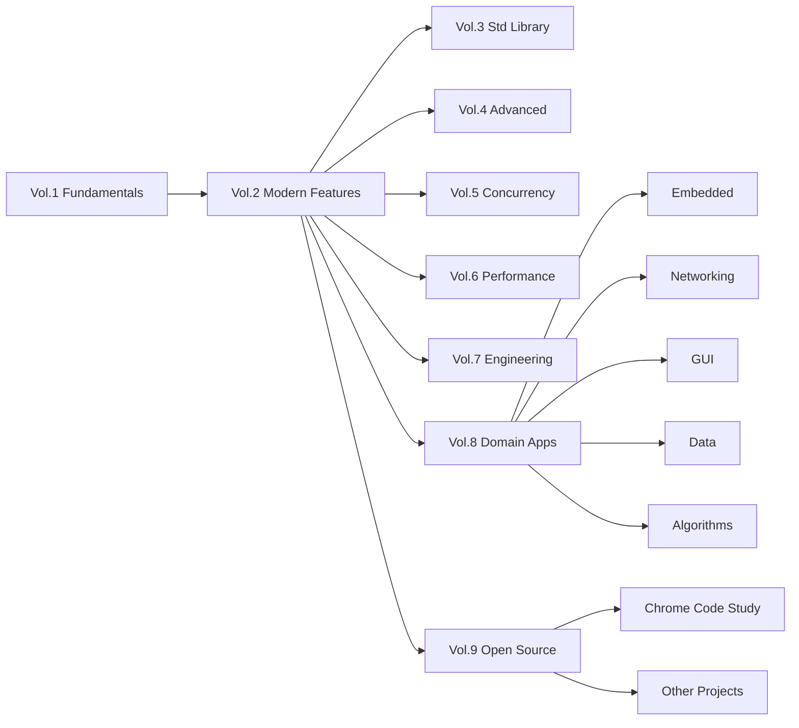
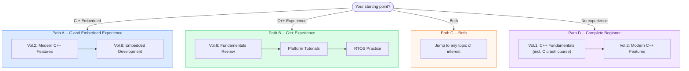

# Tutorial_AwesomeModernCPP

[中文](README.md) | English

> A systematic modern C++ tutorial -- from foundational syntax to embedded practice, with compilable code examples for every concept

<p align="center">
  <a href="https://awesome-embedded-learning-studio.github.io/Tutorial_AwesomeModernCPP/">
    
  </a>
</p>


---

## Highlights

- **9-Volume System** -- From C crash course to embedded practice, forming a complete learning loop
- **Compilable Examples** -- Every concept comes with a CMake project, not isolated code snippets
- **Embedded Practice** -- STM32 multi-platform real hardware projects
- **Tag Navigation** -- Browse articles by topic, C++ standard, difficulty, and platform
- **Online Reading** -- Full-featured documentation site with search, navigation, and dark mode

---

## Content Architecture



<details>
<summary>Volume details and progress</summary>

| Volume | Topic | Articles | Difficulty | Status |
|:--:|------|:------:|:----:|:----:|
| 1 | [C++ Fundamentals](documents/vol1-fundamentals/) -- types, control flow, functions, pointers, classes, template basics | 49 | beginner | Completed |
| 2 | [Modern C++ Features](documents/vol2-modern-features/) -- move semantics, smart pointers, constexpr, Lambda | 44 | intermediate | Completed |
| 3 | [Standard Library In Depth](documents/vol3-standard-library/) -- containers, iterators, algorithms, strings, allocators | 40-50 | intermediate | Planned |
| 4 | [Advanced Topics](documents/vol4-advanced/) -- Concepts, Ranges, coroutines, modules, template metaprogramming | 50-60 | advanced | Planned |
| 5 | [Concurrent Programming](documents/vol5-concurrency/) -- thread primitives, atomic operations, lock-free programming, async I/O | 25-30 | advanced | Planned |
| 6 | [Performance Optimization](documents/vol6-performance/) -- CPU cache, SIMD, reading assembly, benchmarking | 18-22 | advanced | Planned |
| 7 | [Software Engineering Practices](documents/vol7-engineering/) -- CMake, testing, static analysis, DevOps | 30-35 | intermediate | Planned |
| 8 | [Domain Applications](documents/vol8-domains/) -- embedded / networking / GUI / data storage / algorithms | 80-100 | intermediate | In Progress |
| 9 | [Open Source Project Study](documents/vol9-open-source-project-learn/) -- reading and analyzing open source codebases | 13+ | intermediate | In Progress |
| - | [Compilation & Linking In Depth](documents/compilation/) -- preprocessing, assembly, linking, debug symbols | 10+ | intermediate | Completed |
| - | [Capstone Projects](documents/projects/) -- hand-rolled STL, mini HTTP server, embedded OS | - | advanced | Planned |

</details>

---

## Learning Paths



---

## Quick Start

```bash
git clone https://github.com/Awesome-Embedded-Learning-Studio/Tutorial_AwesomeModernCPP.git
cd Tutorial_AwesomeModernCPP
pnpm install              # Install dependencies

# Build and preview (closer to production behavior)
# Set BUILD_CONCURRENCY to your nproc output for faster parallel builds
BUILD_CONCURRENCY=16 pnpm build && pnpm preview
# Visit http://localhost:5173/Tutorial_AwesomeModernCPP/

# Or: start the dev server (with hot-reload) for debugging
pnpm dev
# Visit http://localhost:5173/Tutorial_AwesomeModernCPP/
```

<details>
<summary>More commands and developer tools</summary>

| Command / Script | Purpose |
|-------------|------|
| `pnpm dev` | Start VitePress dev server (hot reload) |
| `pnpm build` | Production build (parallel per-volume build + search index merge) |
| `pnpm build:single` | Single build (no volume splitting) |
| `pnpm preview` | Preview production build |
| `scripts/setup_precommit.sh` | Install pre-commit hooks |
| `scripts/validate_frontmatter.py` | Validate article frontmatter |
| `scripts/check_links.py` | Check internal link validity |
| `scripts/analyze_frontmatter.py` | Analyze tutorial statistics |
| `scripts/build_examples.py` | Compile all CMake example projects |
| `scripts/check_quality.py` | Content quality checks |

</details>

---

<details>
<summary>Version history / Branches / Directory structure</summary>

**Version History**

| Version | Date | Notes |
|------|------|------|
| [v0.1.0](changelogs/v0.1.0.md) | 2026-04-29 | Initial public release -- Vol 1/2, compilation, and embedded tutorials |

See [changelogs/](changelogs/) for full release history.

**Branch Overview**

| Branch | Purpose | Status |
|------|------|------|
| `main` | Primary development branch | Active |
| `archive/legacy_20260415` | Pre-restructuring archive | Read-only |
| `gh-pages` | Auto-deployed documentation site | Auto-generated |

**Project Directory Structure**

```text
Tutorial_AwesomeModernCPP/
├── documents/                  # Tutorial Markdown files
│   ├── vol1-fundamentals/      # Volume 1: C++ Fundamentals (ch00-ch12 + C crash course)
│   ├── vol2-modern-features/   # Volume 2: Modern C++ Features
│   ├── vol3-standard-library/  # Volume 3: Standard Library In Depth
│   ├── vol4-advanced/          # Volume 4: Advanced Topics
│   ├── vol5-concurrency/       # Volume 5: Concurrent Programming
│   ├── vol6-performance/       # Volume 6: Performance Optimization
│   ├── vol7-engineering/       # Volume 7: Software Engineering Practices
│   ├── vol8-domains/           # Volume 8: Domain Applications
│   │   ├── embedded/           #   Embedded Development
│   │   ├── networking/         #   Network Programming
│   │   ├── gui-graphics/       #   GUI and Graphics
│   │   ├── data-storage/       #   Data Storage
│   │   └── algorithms/         #   Algorithms and Data Structures
│   ├── vol9-open-source-project-learn/  # Volume 9: Open Source Project Study
│   ├── compilation/            # Compilation & Linking In Depth
│   ├── projects/               # Capstone Projects
│   └── index.md                # Tutorial home page
├── code/                       # Example code
│   ├── volumn_codes/vol1/      #   Volume 1 code and exercises
│   └── examples/               #   Legacy code examples
├── site/                       # VitePress site configuration
│   └── .vitepress/             #   Config, theme, plugins
├── scripts/                    # Developer tool scripts
├── todo/                       # Content planning and progress tracking
└── package.json                # Node.js dependencies and build scripts
```

</details>

---

## Contributing

We welcome contributions of all kinds! Please read [CONTRIBUTING.md](./CONTRIBUTING.md) for details.

Quick workflow: Fork --> Feature branch --> Commit --> Push --> Pull Request

If you have questions, feel free to open an issue at [GitHub Issues](https://github.com/Awesome-Embedded-Learning-Studio/Tutorial_AwesomeModernCPP/issues).

---

## Acknowledgements

This project references the following excellent resources:

- [modern-cpp-tutorial](https://github.com/changkun/modern-cpp-tutorial)
- [CPlusPlusThings](https://github.com/Light-City/CPlusPlusThings)
- [CppCon](https://www.youtube.com/user/CppCon)
- [C++ Reference](https://en.cppreference.com/)

---

## License & Contact

- **License**: [MIT License](./LICENSE)
- **Issues**: [Submit an issue](https://github.com/Awesome-Embedded-Learning-Studio/Tutorial_AwesomeModernCPP/issues)
- **Email**: <725610365@qq.com>
- **Organization**: [Awesome-Embedded-Learning-Studio](https://github.com/Awesome-Embedded-Learning-Studio)
