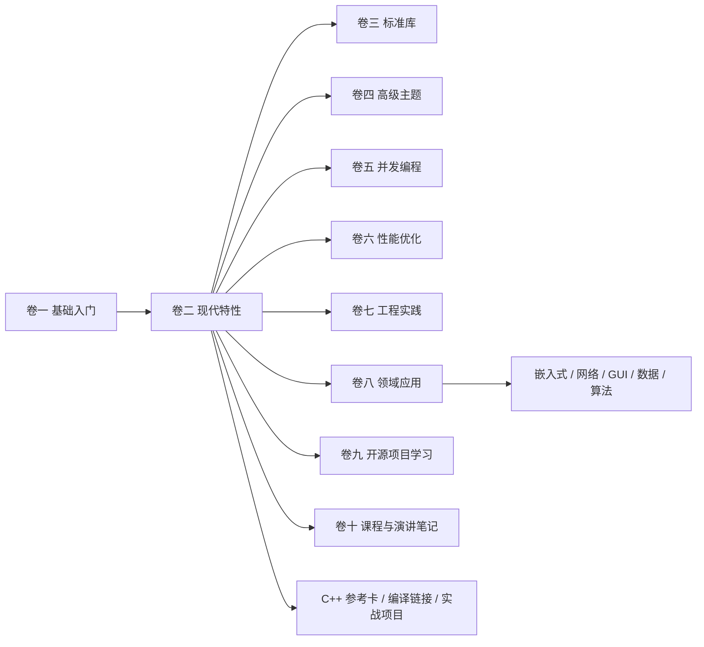
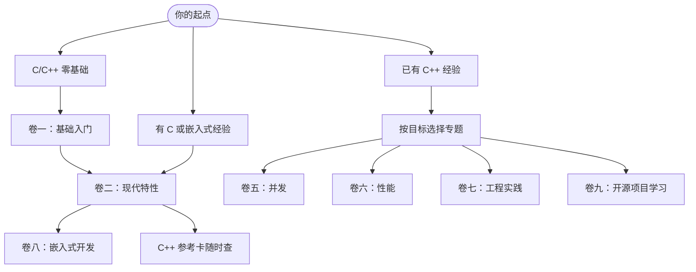

# Tutorial_AwesomeModernCPP

[English](README.en.md) | 中文

> 一套面向工程实践的现代 C++ 系统教程：从 C/C++ 基础、现代语言特性，到并发、性能、工程化、嵌入式实战与开源项目研读。

<p align="center">
  <a href="https://awesome-embedded-learning-studio.github.io/Tutorial_AwesomeModernCPP/">
    
  </a>
</p>


---

<!-- COVERAGE_START -->
 420/423 docs translated
<!-- COVERAGE_END -->

## 这是什么项目

`Tutorial_AwesomeModernCPP` 是一个持续更新的现代 C++ 学习项目。它不是零散的语法速查，而是把语言基础、标准库、现代特性、工程实践和领域应用放在同一条学习路径里，并为关键概念配套可编译的 CMake 示例。

适合这些读者：

- 正在系统学习 C/C++，希望少走碎片化资料弯路。
- 有 C 或嵌入式经验，想把现代 C++ 用到真实工程里。
- 已经会写 C++，但希望补齐并发、性能、构建、调试、源码研读等工程能力。

## 特色亮点

- **10 卷体系**：基础、现代特性、标准库、高级主题、并发、性能、工程、领域应用、开源项目、课程笔记逐层展开。
- **可编译示例**：示例代码以 CMake 工程组织，可在 CI 中构建验证，不只是文章里的孤立片段。
- **嵌入式方向**：包含 STM32F1 实战工程、资源约束、外设抽象、交叉编译与链接脚本等内容。
- **工程化文档站**：基于 VitePress，支持搜索、导航、暗色模式、本地预览与 GitHub Pages 自动部署。
- **双语与参考卡**：中文主线内容已完成英文翻译覆盖，并提供 C++98 到 C++23 特性参考索引。
- **社区文章入口**：支持社区来稿初刊、审阅收录和后续主线整合，降低文章投稿门槛。

## 马上开始

最快的方式是直接阅读在线文档：

- [在线文档站](https://awesome-embedded-learning-studio.github.io/Tutorial_AwesomeModernCPP/)
- [C++ 特性参考卡](https://awesome-embedded-learning-studio.github.io/Tutorial_AwesomeModernCPP/cpp-reference/)
- [嵌入式开发专题](https://awesome-embedded-learning-studio.github.io/Tutorial_AwesomeModernCPP/vol8-domains/embedded/)
- [社区文章](https://awesome-embedded-learning-studio.github.io/Tutorial_AwesomeModernCPP/community/)

本地预览文档站：

```bash
git clone https://github.com/Awesome-Embedded-Learning-Studio/Tutorial_AwesomeModernCPP.git
cd Tutorial_AwesomeModernCPP

pnpm install
pnpm dev
# 访问 http://localhost:5173/Tutorial_AwesomeModernCPP/
```

生产构建与预览：

```bash
BUILD_CONCURRENCY=8 pnpm build
pnpm preview
# 访问 http://localhost:4173/Tutorial_AwesomeModernCPP/
```

## 内容地图



<details>
<summary>各卷内容与进度</summary>

| 模块 | 内容 | 状态 |
|------|------|------|
| [卷一：C++ 基础入门](https://awesome-embedded-learning-studio.github.io/Tutorial_AwesomeModernCPP/vol1-fundamentals/) | C 语言速通、类型、控制流、函数、指针、类、模板初步、内存与异常 | 已完成 |
| [卷二：现代 C++ 特性](https://awesome-embedded-learning-studio.github.io/Tutorial_AwesomeModernCPP/vol2-modern-features/) | 移动语义、智能指针、constexpr、Lambda、结构化绑定、错误处理、filesystem | 已完成 |
| [卷三：标准库深入](https://awesome-embedded-learning-studio.github.io/Tutorial_AwesomeModernCPP/vol3-standard-library/) | array、span、环形缓冲区、侵入式容器、自定义分配器、类型安全寄存器访问 | 部分内容已有，待重写 |
| [卷四：高级主题](https://awesome-embedded-learning-studio.github.io/Tutorial_AwesomeModernCPP/vol4-advanced/) | 模板、CRTP、协程、if constexpr、三路比较、Modules、C++20/23/26 特性 | 部分内容已有，待重写 |
| [卷五：并发编程](https://awesome-embedded-learning-studio.github.io/Tutorial_AwesomeModernCPP/vol5-concurrency/) | 线程生命周期、互斥量、条件变量、atomic、无锁结构、线程池、协程 I/O、Actor/Channel | 编写中 |
| [卷六：性能优化](https://awesome-embedded-learning-studio.github.io/Tutorial_AwesomeModernCPP/vol6-performance/) | 编译器优化、性能与代码大小评估、AVX/AVX2、汇编阅读与基准测试 | 部分内容已有，待重写 |
| [卷七：软件工程实践](https://awesome-embedded-learning-studio.github.io/Tutorial_AwesomeModernCPP/vol7-engineering/) | CMake、交叉编译、编译器选项、链接脚本、文件 I/O、WSL、MSVC 调试 | 部分内容已有，待重写 |
| [卷八：领域应用](https://awesome-embedded-learning-studio.github.io/Tutorial_AwesomeModernCPP/vol8-domains/) | 嵌入式、网络编程、GUI 与图形、数据存储、算法与数据结构 | 规划中，嵌入式内容已展开 |
| [卷九：开源项目学习](https://awesome-embedded-learning-studio.github.io/Tutorial_AwesomeModernCPP/vol9-open-source-project-learn/) | Chromium OnceCallback 等真实开源项目源码研读 | 编写中 |
| [卷十：课程与演讲笔记](https://awesome-embedded-learning-studio.github.io/Tutorial_AwesomeModernCPP/vol10-open-lecture-notes/) | CppCon 等课程、会议演讲与学习素材的阅读笔记和二次创作 | 编写中 |
| [C++ 特性参考卡](https://awesome-embedded-learning-studio.github.io/Tutorial_AwesomeModernCPP/cpp-reference/) | C++98 到 C++23 核心语言、容器、内存、并发、模板特性速查 | 编写中 |
| [编译与链接深入](https://awesome-embedded-learning-studio.github.io/Tutorial_AwesomeModernCPP/compilation/) | 预处理、汇编、静态库、动态库、符号可见性、运行时加载 | 已完成 |
| [贯穿式实战项目](https://awesome-embedded-learning-studio.github.io/Tutorial_AwesomeModernCPP/projects/) | 手写 STL、迷你 HTTP 服务器、GUI 框架、嵌入式 OS 等综合项目 | 规划中 |
| [社区文章](https://awesome-embedded-learning-studio.github.io/Tutorial_AwesomeModernCPP/community/) | 社区来稿初刊、审阅收录文章与后续主线整合入口 | 建设中 |

</details>

## 学习路径



## 本地开发与质量检查

<details>
<summary>常用命令</summary>

| 命令 / 脚本 | 功能 |
|-------------|------|
| `pnpm dev` | 启动 VitePress 开发服务器，支持热更新 |
| `pnpm build` | 生产构建，按分卷并行构建并合并搜索索引 |
| `pnpm build:single` | 使用 VitePress 单体构建 |
| `pnpm check:links` | 检查 Markdown 与组件内部链接有效性 |
| `pnpm preview` | 预览生产构建结果 |
| `pnpm hooks:install` / `scripts/setup_precommit.sh` | 安装 pre-commit 提交前检查 |
| `pnpm coverage` | 查看英文翻译覆盖率 |
| `pnpm coverage:update` | 更新 `README.md` 中的英文翻译覆盖率徽章 |
| `python3 scripts/validate_frontmatter.py` | 验证文章 frontmatter |
| `python3 scripts/check_links.py` | 检查 Markdown 与组件内部链接有效性 |
| `python3 scripts/check_quality.py documents/` | 内容质量检查 |
| `python3 scripts/build_examples.py --host` | 编译主机侧 CMake 示例 |
| `python3 scripts/build_examples.py --stm32` | 编译 STM32 示例工程 |

</details>

<details>
<summary>项目结构、版本与分支</summary>

**项目结构**

```text
Tutorial_AwesomeModernCPP/
├── documents/                  # 教程 Markdown 文件与中英文内容
│   ├── vol1-fundamentals/      # 卷一：C++ 基础入门
│   ├── vol2-modern-features/   # 卷二：现代 C++ 特性
│   ├── vol3-standard-library/  # 卷三：标准库深入
│   ├── vol4-advanced/          # 卷四：高级主题
│   ├── vol5-concurrency/       # 卷五：并发编程
│   ├── vol6-performance/       # 卷六：性能优化
│   ├── vol7-engineering/       # 卷七：软件工程实践
│   ├── vol8-domains/           # 卷八：领域应用
│   ├── vol9-open-source-project-learn/  # 卷九：开源项目学习
│   ├── vol10-open-lecture-notes/        # 卷十：课程与演讲笔记
│   ├── community/             # 社区来稿、初刊文章与已审阅收录内容
│   ├── cpp-reference/          # C++ 特性参考卡
│   ├── compilation/            # 编译与链接深入
│   └── projects/               # 贯穿式实战项目
├── code/                       # 示例代码、STM32F1 工程与可复用模板
├── site/                       # VitePress 站点配置、主题与插件
├── scripts/                    # 构建、检查、覆盖率与内容工具
├── todo/                       # 内容规划与任务记录
└── package.json                # Node.js 依赖与脚本入口
```

**版本历史**

| 版本 | 日期 | 说明 |
|------|------|------|
| [v0.3.0](changelogs/v0.3.0.md) | 2026-05-20 | 卷五并发编程全面重写（47 篇）、卷十课程笔记上线、贡献者体系建立 |
| [v0.2.0](changelogs/v0.2.0.md) | 2026-05-04 | 卷九开源项目学习初始内容、ccache 与 GCC 14 构建 |
| [v0.1.0](changelogs/v0.1.0.md) | 2026-04-29 | 首个公开版本，包含卷一、卷二、编译与链接、嵌入式教程等内容 |

完整变更记录见 [changelogs/](changelogs/)。

**分支说明**

| 分支 | 用途 | 状态 |
|------|------|------|
| `main` | 主开发分支 | Active |
| `archive/legacy_20260415` | 重构前存档 | Read-only |
| `gh-pages` | 自动部署的文档站 | Auto-generated |

</details>

## 贡献

欢迎修正文档、改进示例、补充章节、校对翻译、提交问题、提出内容建议，或向 [社区文章](https://awesome-embedded-learning-studio.github.io/Tutorial_AwesomeModernCPP/community/) 投稿。请先阅读 [CONTRIBUTING.md](./CONTRIBUTING.md)。

快速流程：Fork --> 特性分支 --> 提交 --> Push --> Pull Request

如有问题，欢迎在 [GitHub Issues](https://github.com/Awesome-Embedded-Learning-Studio/Tutorial_AwesomeModernCPP/issues) 中提交。

## 贡献者

感谢所有为本项目做出贡献的人！详见 [CONTRIBUTORS.md](./CONTRIBUTORS.md)。

<!-- ALL_CONTRIBUTORS_START -->
| 贡献者 | 贡献类型 |
|--------|---------|
| [Charliechen](https://github.com/Charliechen114514) | 📝 内容 · 🔍 审阅 · 💡 示例 |
| [Doll-Attire](https://github.com/Doll-Attire) | 🎨 界面设计 · 📝 体验改进 |
| [YukunJ](https://github.com/YukunJ) | 🐛 问题反馈 · 💡 内容修复 |
<!-- ALL_CONTRIBUTORS_END -->

> 贡献方式不限于代码，包括界面设计、插画、问题反馈、内容建议等。详见 [CONTRIBUTING.md](./CONTRIBUTING.md)。

## 致谢

本项目参考了以下优秀资源：

- [modern-cpp-tutorial](https://github.com/changkun/modern-cpp-tutorial)
- [CPlusPlusThings](https://github.com/Light-City/CPlusPlusThings)
- [CppCon](https://www.youtube.com/user/CppCon)
- [C++ Reference](https://en.cppreference.com/)

## 许可证与联系方式

- **许可证**：[MIT License](./LICENSE)
- **Issues**：[提交问题](https://github.com/Awesome-Embedded-Learning-Studio/Tutorial_AwesomeModernCPP/issues)
- **Email**：<725610365@qq.com>
- **组织**：[Awesome-Embedded-Learning-Studio](https://github.com/Awesome-Embedded-Learning-Studio)
