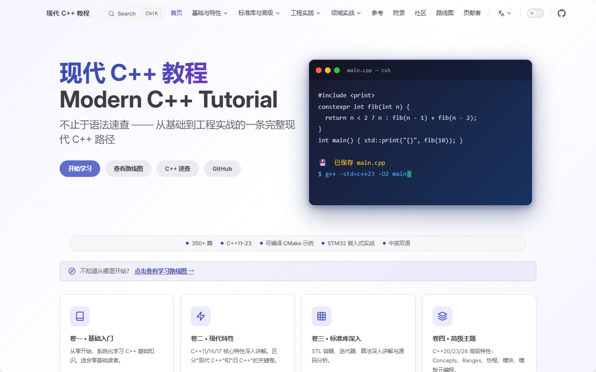

# Tutorial_AwesomeModernCPP

[English](README.en.md) | 中文

> 一套面向工程实践的现代 C++ 系统教程：从 C/C++ 基础、现代语言特性，到并发、性能、工程化、嵌入式实战与开源项目研读。
> 试一试点一下下面的图片？
<p align="center">
  <a href="https://awesome-embedded-learning-studio.github.io/Tutorial_AwesomeModernCPP/">
    
  </a>
</p>


---

<!-- COVERAGE_START -->
 439/439 docs translated
<!-- COVERAGE_END -->

## 这是什么项目

<p align="center"><em>一套系统化的现代 C++ 教程——从语法到芯片，把现代 C++ 写进桌面、STM32 嵌入式与工业级开源项目。</em></p>

10 卷、350+ 篇，从 C/C++ 基础一路讲到并发、性能、工程与领域实战；每个关键概念都配可在 CI 中编译验证的 CMake 示例，不是文章里跑不起来的孤立片段。

<p align="center">
  
  
  
  
</p>

**适合谁？** 正在系统学 C/C++ · 有 C 或嵌入式经验 · 已会 C++ 想补齐工程能力

## 特色亮点

<table>
  <tr>
    <td width="50%" align="center"><h4>🔧 从语法到芯片</h4>深入 STM32F1 嵌入式——寄存器访问、中断安全、零开销抽象、交叉编译与链接脚本，打通裸机。</td>
    <td width="50%" align="center"><h4>⚡ 克隆即跑的真示例</h4>代码以 CMake 工程组织、CI 构建验证，不是文章里跑不起来的伪代码片段。</td>
  </tr>
  <tr>
    <td align="center"><h4>📚 一条完整路径</h4>10 卷 350+ 篇，基础→现代特性→标准库→高级→并发→性能→工程→领域，层层递进、不碎片。</td>
    <td align="center"><h4>🚀 紧跟 C++23</h4>讲解并实践 concepts、协程、ranges 等新特性，不停在 C++11。</td>
  </tr>
  <tr>
    <td align="center"><h4>🔍 读真源码 · 读真会议</h4>卷九研读 Chromium（如 OnceCallback），卷十是 CppCon 等会议演讲的读书笔记。</td>
    <td align="center"><h4>🌐 工程化 + 双语</h4>VitePress（搜索 / 暗色 / GitHub Pages 自动部署）+ 中文主线 + 英文翻译 + C++98→23 特性参考卡。</td>
  </tr>
</table>

## 马上开始

最快的方式是直接阅读在线文档：

- [在线文档站](https://awesome-embedded-learning-studio.github.io/Tutorial_AwesomeModernCPP/)
- [C++ 特性参考卡](https://awesome-embedded-learning-studio.github.io/Tutorial_AwesomeModernCPP/cpp-reference/)
- [嵌入式开发专题](https://awesome-embedded-learning-studio.github.io/Tutorial_AwesomeModernCPP/vol8-domains/embedded/)
- [社区文章](https://awesome-embedded-learning-studio.github.io/Tutorial_AwesomeModernCPP/community/)

本地预览文档站：

```bash
git clone https://github.com/Awesome-Embedded-Learning-Studio/Tutorial_AwesomeModernCPP.git
cd Tutorial_AwesomeModernCPP

pnpm install
pnpm dev
# 访问 http://localhost:5173/Tutorial_AwesomeModernCPP/
```

生产构建与预览：

```bash
BUILD_CONCURRENCY=8 pnpm build
pnpm preview
# 访问 http://localhost:4173/Tutorial_AwesomeModernCPP/
```

每个示例都是独立 CMake 工程、CI 编译验证过——不是文章里跑不起来的伪代码。任选一个目录即可构建：

```bash
cmake -S code/examples/chapter05/06_array_vs_stdarray -B build && cmake --build build -j${nproc}
```

## 内容导览

可视化路线图（十卷内容地图 + 按背景选择学习路径）已整合进在线文档站首页的「项目路线图」区：

→ [在线查看可视化路线图](https://awesome-embedded-learning-studio.github.io/Tutorial_AwesomeModernCPP/#roadmap)

### 各卷一览

主线卷已成型，进阶卷持续补充——不藏进度（篇数为快照，随更新变化）：

| 卷 | 主题 | 篇数 | 成熟度 |
|----|------|:----:|--------|
| 卷一 | 基础入门（含 C 速通） | 87 | ✅ 成型 |
| 卷二 | 现代特性（RAII / 智能指针 / 移动 / lambda） | 44 | ✅ 成型 |
| 卷三 | 标准库深入 | 8 | 🔨 在建 |
| 卷四 | 高级主题（concepts / 协程 / 模板） | 8 | 🔨 在建 |
| 卷五 | 并发编程 | 44 | ✅ 成型 |
| 卷六 | 性能优化 | 3 | 🔨 在建 |
| 卷七 | 工程实践（CMake / 工具链 / 调试） | 8 | 🔨 在建 |
| 卷八 | 领域应用（嵌入式 / 网络 / GUI / 存储） | 63 | ✅ 成型 |
| 卷九 | 开源项目研读（Chromium 等） | 16 | 📚 持续更新 |
| 卷十 | 课程与演讲笔记（CppCon 等） | 17 | 📚 持续更新 |

> 另含「编译与链接」11 篇、C++ 特性参考卡 46 张。主线已成型的卷占多数，其余在持续补充。

> 📋 各卷内容与进度见 [项目总路线图](todo/000-project-roadmap.md)，版本变更见 [changelogs/](changelogs/)。

## 本地开发与质量检查

<details>
<summary>常用命令</summary>

| 命令 / 脚本 | 功能 |
|-------------|------|
| `pnpm dev` | 启动 VitePress 开发服务器，支持热更新 |
| `pnpm build` | 生产构建，按分卷并行构建并合并搜索索引 |
| `pnpm build:single` | 使用 VitePress 单体构建 |
| `pnpm check:links` | 检查 Markdown 与组件内部链接有效性 |
| `pnpm preview` | 预览生产构建结果 |
| `pnpm hooks:install` / `scripts/setup_precommit.sh` | 安装 pre-commit 提交前检查 |
| `pnpm coverage` | 查看英文翻译覆盖率 |
| `pnpm coverage:update` | 更新 `README.md` 中的英文翻译覆盖率徽章 |
| `.venv/bin/python scripts/validate_frontmatter.py` | 验证文章 frontmatter |
| `.venv/bin/python scripts/check_quality.py documents/` | 内容质量检查 |
| `.venv/bin/python scripts/build_examples.py --host` | 编译主机侧 CMake 示例 |
| `.venv/bin/python scripts/build_examples.py --stm32` | 编译 STM32 示例工程 |

</details>

<details>
<summary>项目结构、版本与分支</summary>

**项目结构**

- `documents/` — 10 卷教程内容（中英双语），含 community / cpp-reference / compilation / projects 等区
- `code/` — 示例代码、STM32F1 工程与可复用模板
- `site/` — VitePress 站点配置、主题与插件
- `scripts/` — 构建、检查、覆盖率与内容工具
- `todo/`、`changelogs/` — 内容路线图与版本变更记录

> 完整目录与站点导航见[在线文档站](https://awesome-embedded-learning-studio.github.io/Tutorial_AwesomeModernCPP/)侧边栏。

**版本历史**

完整变更记录见 [changelogs/](changelogs/)。

**分支说明**

| 分支 | 用途 | 状态 |
|------|------|------|
| `main` | 主开发分支 | Active |
| `archive/legacy_20260415` | 重构前存档 | Read-only |
| `gh-pages` | 自动部署的文档站 | Auto-generated |

</details>

## 贡献

欢迎修正文档、改进示例、补充章节、校对翻译、提交问题、提出内容建议，或向 [社区文章](https://awesome-embedded-learning-studio.github.io/Tutorial_AwesomeModernCPP/community/) 投稿。请先阅读 [CONTRIBUTING.md](./CONTRIBUTING.md)。

快速流程：Fork --> 特性分支 --> 提交 --> Push --> Pull Request

如有问题，欢迎在 [GitHub Issues](https://github.com/Awesome-Embedded-Learning-Studio/Tutorial_AwesomeModernCPP/issues) 中提交。

## 贡献者

感谢所有为本项目做出贡献的人！详见 [CONTRIBUTORS.md](./CONTRIBUTORS.md)。

> 贡献方式不限于代码，包括界面设计、插画、问题反馈、内容建议等。详见 [CONTRIBUTING.md](./CONTRIBUTING.md)。

## 致谢

本项目参考了以下优秀资源：

- [modern-cpp-tutorial](https://github.com/changkun/modern-cpp-tutorial)
- [CPlusPlusThings](https://github.com/Light-City/CPlusPlusThings)
- [CppCon](https://www.youtube.com/user/CppCon)
- [C++ Reference](https://en.cppreference.com/)

## 许可证与联系方式

- **许可证**：[MIT License](./LICENSE)
- **Issues**：[提交问题](https://github.com/Awesome-Embedded-Learning-Studio/Tutorial_AwesomeModernCPP/issues)
- **Email**：<725610365@qq.com>
- **组织**：[Awesome-Embedded-Learning-Studio](https://github.com/Awesome-Embedded-Learning-Studio)
