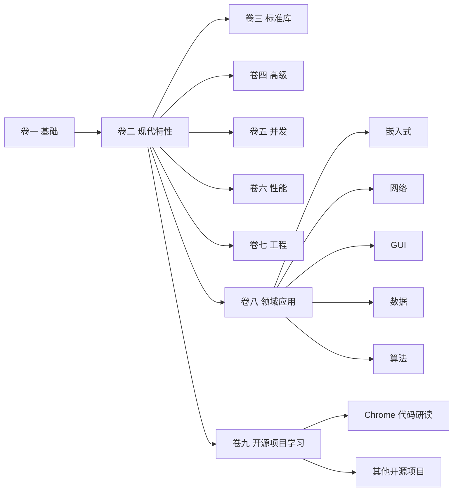
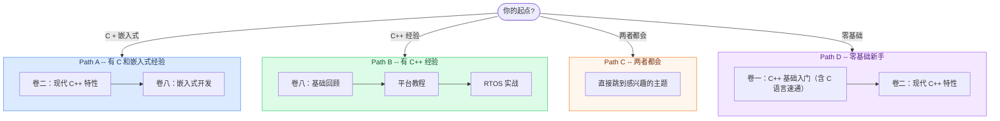

# Tutorial_AwesomeModernCPP

[English](README.en.md) | 中文

> 一套系统化的现代 C++ 教程 -- 从基础语法到嵌入式实战，每个概念配有可编译的代码示例

<p align="center">
  <a href="https://awesome-embedded-learning-studio.github.io/Tutorial_AwesomeModernCPP/">
    
  </a>
</p>


---

<!-- COVERAGE_START -->
 337/337 docs translated
<!-- COVERAGE_END -->

## 特色亮点

- **9 卷体系** -- 从 C 语言速通到嵌入式实战，形成完整学习闭环
- **可编译示例** -- 每个概念配 CMake 工程，不是孤立的代码片段
- **嵌入式实战** -- STM32 多平台真机项目
- **标签导航** -- 按主题、C++ 标准、难度、平台多维检索
- **在线阅读** -- 搜索、导航、暗色模式一应俱全的文档站

---

## 内容架构



<details>
<summary>各卷详细内容与进度</summary>

| 卷 | 主题 | 文章数 | 难度 | 状态 |
|:--:|------|:------:|:----:|:----:|
| 一 | [C++ 基础入门](documents/vol1-fundamentals/) -- 类型、控制流、函数、指针、类、模板初步 | 49 | beginner | 已完成 |
| 二 | [现代 C++ 特性](documents/vol2-modern-features/) -- 移动语义、智能指针、constexpr、Lambda | 44 | intermediate | 已完成 |
| 三 | [标准库深入](documents/vol3-standard-library/) -- 容器、迭代器、算法、字符串、分配器 | 40-50 | intermediate | 规划中 |
| 四 | [高级主题](documents/vol4-advanced/) -- Concepts、Ranges、协程、模块、模板元编程 | 50-60 | advanced | 规划中 |
| 五 | [并发编程](documents/vol5-concurrency/) -- 线程原语、原子操作、无锁编程、异步 I/O | 25-30 | advanced | 规划中 |
| 六 | [性能优化](documents/vol6-performance/) -- CPU 缓存、SIMD、汇编阅读、基准测试 | 18-22 | advanced | 规划中 |
| 七 | [软件工程实践](documents/vol7-engineering/) -- CMake、测试、静态分析、DevOps | 30-35 | intermediate | 规划中 |
| 八 | [领域应用](documents/vol8-domains/) -- 嵌入式 / 网络 / GUI / 数据存储 / 算法 | 80-100 | intermediate | 编写中 |
| 九 | [开源项目学习](documents/vol9-open-source-project-learn/) -- 开源项目代码研读 | 13+ | intermediate | 编写中 |
| - | [编译与链接深入](documents/compilation/) -- 预处理、汇编、链接、调试符号 | 10+ | intermediate | 已完成 |
| - | [贯穿式实战项目](documents/projects/) -- 手写 STL、迷你 HTTP 服务器、嵌入式 OS | - | advanced | 规划中 |

</details>

---

## 学习路径



---

## 快速开始

```bash
git clone https://github.com/Awesome-Embedded-Learning-Studio/Tutorial_AwesomeModernCPP.git
cd Tutorial_AwesomeModernCPP
pnpm install              # 安装依赖

# 构建后预览（更接近生产环境效果）
# 并发构建加速，建议值填写您的 nproc 输出结果
BUILD_CONCURRENCY=16 pnpm build && pnpm preview
# 访问 http://localhost:5173/Tutorial_AwesomeModernCPP/

# 或者：启动开发服务器（支持热更新），调试构建用这个
pnpm dev
# 访问 http://localhost:5173/Tutorial_AwesomeModernCPP/
```

<details>
<summary>更多命令与开发工具</summary>

| 命令 / 脚本 | 功能 |
|-------------|------|
| `pnpm dev` | 启动 VitePress 开发服务器（热更新） |
| `pnpm build` | 生产模式构建（分卷并行构建 + 搜索索引合并） |
| `pnpm build:single` | 单体构建（不分卷） |
| `pnpm preview` | 预览生产构建结果 |
| `scripts/setup_precommit.sh` | 安装 pre-commit hooks |
| `scripts/validate_frontmatter.py` | 验证文章 frontmatter |
| `scripts/check_links.py` | 检查内部链接有效性 |
| `scripts/analyze_frontmatter.py` | 分析教程统计信息 |
| `scripts/build_examples.py` | 编译所有 CMake 示例项目 |
| `scripts/check_quality.py` | 内容质量检查 |

</details>

---

<details>
<summary>版本历史 / 分支 / 目录结构</summary>

**版本历史**

| 版本 | 日期 | 说明 |
|------|------|------|
| [v0.1.0](changelogs/v0.1.0.md) | 2026-04-29 | 首个公开版本，卷一/卷二/编译卷/嵌入式教程 |

完整变更记录见 [changelogs/](changelogs/) 目录。

**分支说明**

| 分支 | 用途 | 状态 |
|------|------|------|
| `main` | 主开发分支 | Active |
| `archive/legacy_20260415` | 重构前存档 | Read-only |
| `gh-pages` | 自动部署的文档站 | Auto-generated |

**项目目录结构**

```text
Tutorial_AwesomeModernCPP/
├── documents/                  # 教程 Markdown 文件
│   ├── vol1-fundamentals/      # 卷一：C++ 基础入门（ch00-ch12 + C 语言速通）
│   ├── vol2-modern-features/   # 卷二：现代 C++ 特性
│   ├── vol3-standard-library/  # 卷三：标准库深入
│   ├── vol4-advanced/          # 卷四：高级主题
│   ├── vol5-concurrency/       # 卷五：并发编程
│   ├── vol6-performance/       # 卷六：性能优化
│   ├── vol7-engineering/       # 卷七：软件工程实践
│   ├── vol8-domains/           # 卷八：领域应用
│   │   ├── embedded/           #   嵌入式开发
│   │   ├── networking/         #   网络编程
│   │   ├── gui-graphics/       #   GUI 与图形
│   │   ├── data-storage/       #   数据存储
│   │   └── algorithms/         #   算法与数据结构
│   ├── vol9-open-source-project-learn/  # 卷九：开源项目学习
│   ├── compilation/            # 编译与链接深入
│   ├── projects/               # 贯穿式实战项目
│   └── index.md                # 教程首页
├── code/                       # 示例代码
│   ├── volumn_codes/vol1/      #   卷一代码与练习
│   └── examples/               #   历史代码示例
├── site/                       # VitePress 站点配置
│   └── .vitepress/             #   配置、主题、插件
├── scripts/                    # 开发工具脚本
├── todo/                       # 内容规划与进度追踪
└── package.json                # Node.js 依赖与构建脚本
```

</details>

---

## 贡献

我们欢迎任何形式的贡献！请阅读 [CONTRIBUTING.md](./CONTRIBUTING.md) 了解详情。

快速流程：Fork --> 特性分支 --> 提交 --> Push --> Pull Request

如有问题，欢迎在 [GitHub Issues](https://github.com/Awesome-Embedded-Learning-Studio/Tutorial_AwesomeModernCPP/issues) 中提交。

---

## 致谢

本项目参考了以下优秀资源：

- [modern-cpp-tutorial](https://github.com/changkun/modern-cpp-tutorial)
- [CPlusPlusThings](https://github.com/Light-City/CPlusPlusThings)
- [CppCon](https://www.youtube.com/user/CppCon)
- [C++ Reference](https://en.cppreference.com/)

---

## 许可证与联系方式

- **许可证**：[MIT License](./LICENSE)
- **Issues**：[提交问题](https://github.com/Awesome-Embedded-Learning-Studio/Tutorial_AwesomeModernCPP/issues)
- **Email**：<725610365@qq.com>
- **组织**：[Awesome-Embedded-Learning-Studio](https://github.com/Awesome-Embedded-Learning-Studio)
