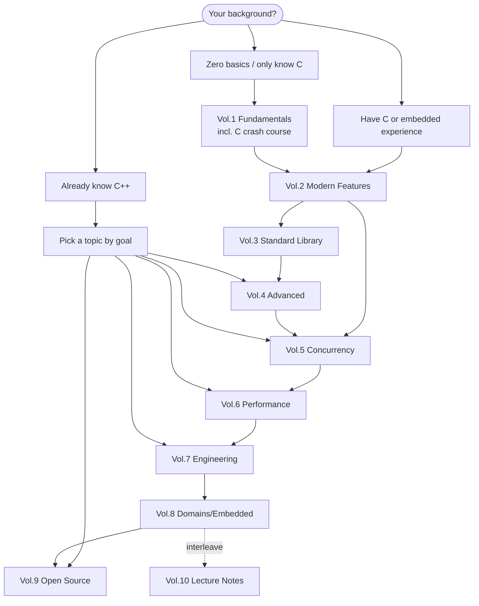

# Learning Roadmap

This tutorial is a systematic modern C++ learning resource — **ten volumes taking you from first principles all the way to embedded practice**. This roadmap answers three questions: how to learn it, where to start, and what each volume teaches.

Whether you're starting from zero, already have a C / embedded background, or already know C++ and want to fill in your engineering skills, the sections below first help you pick a starting point by background, then walk through each volume.

> This is the **learning roadmap** (how readers learn). The project's own development progress and plans are a separate matter — see [Content Maturity and Project Roadmap](#content-maturity-and-project-roadmap) at the end.

## How to use this roadmap

The whole tutorial is organized along one progressive spine:

```
Fundamentals → Modern Features → Standard Library → Advanced → Concurrency → Performance → Engineering → Domain Practice
```

A few things to know up front:

- **It's not a syntax cheat sheet.** Every key concept ships with a compilable CMake example you can run, modify, and verify.
- **Volumes depend on each other.** Later volumes assume you've grasped the core of earlier ones, and **Vol.1 → Vol.2 is the key watershed** — once you're through Vol.2, you've truly entered "modern C++".
- **You can skip around.** Readers with relevant background don't need to start on page one of Vol.1; just pick a starting point via the "three paths" below.
- **Companion resources are always at hand.** [C++ feature reference cards](/en/cpp-reference/) (lookup by standard version + feature category), [hands-on projects](/en/projects/), [lecture notes](/en/vol10-open-lecture-notes/).

## Three learning paths (pick a starting point by background)



**Path A · Zero basics / only know C** — start at [Vol.1](/en/vol1-fundamentals/) (includes a complete C crash course). Walk the spine volume by volume — the most solid route, and the longest. Skip strategy: if you already have programming experience, skim the C crash course and focus on value categories, OOP, and template basics.

**Path B · Have C or embedded experience** — your syntax foundation is enough; go straight into [Vol.2](/en/vol2-modern-features/) to pick up "modern C++ style", then dive into [Vol.8 embedded](/en/vol8-domains/) for practice. Fill in concurrency (Vol.5), performance (Vol.6), and engineering (Vol.7) as needed.

**Path C · Already know C++** — go straight to a topic by goal: for concurrency/async read [Vol.5](/en/vol5-concurrency/), for performance read [Vol.6](/en/vol6-performance/), for engineering read [Vol.7](/en/vol7-engineering/), to read large source code go to [Vol.9](/en/vol9-open-source-project-learn/), to chase the frontier read [Vol.4](/en/vol4-advanced/).

## Volume-by-volume breakdown

### Vol.1 · Fundamentals

- **Role**: Build a complete C++ knowledge system from zero — the foundation and starting point of the whole tutorial; includes a complete C crash course (with embedded-relevant advanced C).
- **Key topics**: environment setup · type system & value categories · control flow & functions · pointers & references · arrays & strings · classes & OOP · operator overloading · inheritance & polymorphism · template basics · exceptions · first look at the STL · memory model basics; the C crash course covers pointer essentials, structs & alignment, C pitfalls, and embedded C patterns.
- **Level · Prerequisites**: beginner → intermediate / none.
- **Suggested pacing**: read it all if you're starting fresh; if you have a foundation, skip the C crash course and focus on value categories, OOP, and template basics — these determine how smooth the rest feels. This volume is being rewritten (quick-start → full-stack intro), so chapters may shift, but the core topics are stable.

### Vol.2 · Modern Features

- **Role**: Systematically master the core C++11/14/17 features — the watershed between "can write C++" and "can write modern C++".
- **Key topics**: move semantics & rvalue references · smart pointers & RAII · `constexpr` compile-time computation · lambdas & functional style · type safety (`enum class` / `variant` / `optional`) · structured bindings · `auto` / `decltype` · attributes · `string_view` · `filesystem` · modern error handling (`optional` / `expected`) · user-defined literals.
- **Level · Prerequisites**: intermediate / Vol.1.
- **Suggested pacing**: a pivotal volume — read it carefully; it determines how smooth every later volume feels.

### Vol.3 · Standard Library

- **Role**: Implementation details, performance, and memory internals of STL containers and strings.
- **Key topics**: `vector` three-pointer representation / growth / iterator invalidation · `string` memory model & small-string optimization · `char8_t` & UTF-8 · `array` · `span` · object size & trivial types · custom allocators.
- **Level · Prerequisites**: intermediate / Vol.1, Vol.2.
- **Suggested pacing**: small but deep — read on demand, especially when doing performance-sensitive or embedded work. The `vector` / `string` / `char8_t` articles are the most stable; read those first; the rest are being rewritten.

### Vol.4 · Advanced Topics

- **Role**: C++20/23 frontier features and metaprogramming — essential for anyone writing libraries or high-performance generic code.
- **Key topics**: coroutines (basics + scheduler implementation) · Ranges (views + pipeline practice) · three-way comparison `<=>` · empty base optimization · C++ Modules (MSVC) · designated initializers.
- **Level · Prerequisites**: advanced / Vol.2, Vol.3.
- **Suggested pacing**: read coroutines, Ranges, and three-way comparison first; the template system (C++11→23 metaprogramming) and more are still planned — pick them up as needed.

### Vol.5 · Concurrency

- **Role**: From thread primitives to coroutine-based async — build complete concurrency judgment: correct before fast, locks before lock-free, synchronous before task-based.
- **Key topics**: thread lifecycle & RAII · mutexes & sync primitives (incl. `latch` / `barrier` / `semaphore`) · `atomic` & the six memory orders · lock-free data structures (SPSC/MPMC queues) · `future` & thread pools · coroutines & event loops (Echo server) · Actor/Channel.
- **Level · Prerequisites**: intermediate-advanced / Vol.1–Vol.4.
- **Suggested pacing**: the heaviest investment and most hands-on volume of the whole tutorial, with Lab 0–5 + a Capstone (Mini Concurrent Runtime). Strongly recommended: do the Labs by hand — don't just read.

### Vol.6 · Performance

- **Role**: Core C++ performance topics — compiler optimization, code-size evaluation, SIMD.
- **Key topics**: inlining & compiler optimization (debunking the "`inline` = performance switch" myth) · performance & code-size evaluation · AVX/AVX2.
- **Level · Prerequisites**: intermediate-advanced / Vol.5.
- **Suggested pacing**: content is still being expanded; first build intuition for cache hierarchy and SIMD, then go deeper by topic.

### Vol.7 · Engineering

- **Role**: C++ software engineering in practice — building, cross-compilation, linking, debugging, platform development.
- **Key topics**: CMake & cross-compilation · compiler options · linker & linker scripts · WSL development · MSVC debugging internals · C++ Modules (VS2026) · file I/O (a file-copier project).
- **Level · Prerequisites**: intermediate / recommend reading "Compilation & Linking" first.
- **Suggested pacing**: study it alongside [Compilation & Linking](/en/compilation/); pick by your current toolchain.

### Compilation & Linking

- **Role**: The low-level mechanics of C/C++ compilation, linking, static/dynamic libraries, and symbol visibility — the foundation of engineering practice.
- **Key topics**: compilation & linking overview · reuse & the concept of libraries · static libraries · dynamic libraries (design principles / symbol visibility / runtime loading / library search logic / dynamic libs as executables).
- **Level · Prerequisites**: intermediate / C++ basics.
- **Suggested pacing**: as a prerequisite to Vol.7; a must-read before doing embedded/cross-compilation work. This volume is complete and stable.

### Vol.8 · Domain Applications

- **Role**: Modern C++ in action across vertical domains — **the main line is embedded**.
- **Key topics**: STM32 (**STM32F1 only, e.g. Blue Pill; no F4 yet**) environment setup · end-to-end LED / button / UART flows (rebuilt from C all the way to C++23 template wrappers) · zero-overhead abstraction · type-safe register access · embedded patterns like circular buffers / object pools / intrusive containers · interrupt safety; plus a C++ deep-dive (pointer-semantics series). Networking / GUI / data storage / algorithms sub-domains are still planned.
- **Level · Prerequisites**: intermediate / Vol.1–Vol.7.
- **Suggested pacing**: embedded is currently the most complete domain line — progress peripheral by peripheral; if you have an STM32F1 board on hand, follow along hands-on.

### Vol.9 · Open Source Projects

- **Role**: Tear down industrial-grade open-source source code to learn real-world C++ design and implementation.
- **Key topics**: currently focused on Chromium's `OnceCallback` callback component — from motivation, API design, and core skeleton to `bind_once`, with interleaved prerequisites on C++23 `deducing this`, `move_only_function`, and more. More projects are planned.
- **Level · Prerequisites**: intermediate-advanced / Vol.1–Vol.7 (especially Vol.4, Vol.5).
- **Suggested pacing**: source-reading oriented; recommend mastering Vol.4's advanced features first before reading industrial implementations.

### Vol.10 · Courses & Talks

- **Role**: Reading notes and secondary creations from technical conference talks like CppCon.
- **Key topics**: currently four CppCon 2025 talks — Bjarne Stroustrup's *Concept-based Generic Programming*, Matt Godbolt's *Some Assembly Required* (reading assembly / Compiler Explorer), Mike Shah's *Back to Basics: Ranges*, and Ben Saks's *Back to Basics: Move Semantics*.
- **Level · Prerequisites**: intermediate / Vol.1–Vol.5.
- **Suggested pacing**: use it to "go deeper" — after finishing the related volume, read the corresponding talk notes to reinforce understanding; interleave it with the main line.

## Pacing & advice

- **Time expectation**: walking the whole spine from zero is a long-term project — don't expect a shortcut; set milestones per volume and type out the examples by hand.
- **Recommended order**: following the strict dependency Vol.1 → Vol.2 → Vol.3 → Vol.4 → Vol.5 → Vol.6 → Vol.7 → Vol.8 is the most solid; if you have background, cut in via the "three paths".
- **Skip strategy**: in Vol.1 you can skip the C crash course; Vol.3 and Vol.6 are small or still expanding — read on demand; Vol.9 currently focuses on a single project, so wait until you've built enough foundation; interleave Vol.10 after the related volumes as review.
- **Tie it together with practice**: after finishing each area, find a matching project in [hands-on projects](/en/projects/) to practice (coroutine server, concurrent runtime, embedded, etc.) and turn scattered knowledge into complete capability.

## Companion resources

- [C++ feature reference cards](/en/cpp-reference/): C++98 → C++23 lookup, organized by both standard version and feature category, each card annotated with embedded applicability.
- [End-to-end hands-on projects](/en/projects/): a project index page that ties together the hands-on work scattered across volumes (coroutine Echo server, Mini Concurrent Runtime, Chromium OnceCallback study, etc.); planned additions include a hand-written STL, a mini HTTP server, a mini GUI, and a mini embedded OS.
- [Community articles](/en/community/): community submissions and reviewed content — contributions welcome.
- [Vol.10 lecture notes](/en/vol10-open-lecture-notes/): secondary creations of top talks like CppCon, for going deeper.

## Content Maturity and Project Roadmap

The current status of each volume, to help you judge which parts are most solid (qualitative judgment only — not chasing exact article counts):

- ✓ **Stable**: Vol.2 Modern Features, Vol.5 Concurrency, Compilation & Linking.
- ✦ **In progress**: Vol.1 Fundamentals (being rewritten as a full-stack intro), Vol.7 Engineering, Vol.8 Domains (embedded main line complete), Vol.9 Open Source, Vol.10 Courses & Talks.
- ◇ **Expanding / rewriting**: Vol.3 Standard Library (half being rewritten), Vol.4 Advanced (template system etc. still planned), Vol.6 Performance (expanding).

To see **the project's own development plans** (what's being done, release cadence, TODO priorities), that's a separate document:

- 📋 [Project development roadmap (`community/dev/`)](/en/community/dev/) — maintenance cadence, release governance, site evolution.
- 📦 [Changelogs (`changelogs/`)](https://github.com/Awesome-Embedded-Learning-Studio/Tutorial_AwesomeModernCPP/tree/main/changelogs) — what changed in each released version.

> In short: the **learning roadmap** (this page) answers "how should I learn"; the **project roadmap** answers "what is this project doing".
