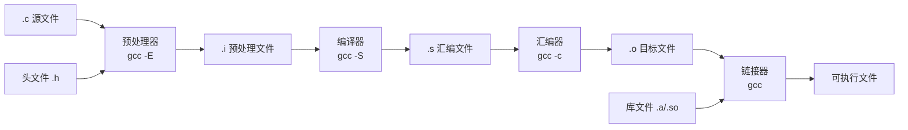

# Program Structure and Compilation Basics

If you have written some C code before, chances are you just clicked "Run" in an IDE and called it a day — you might never have cared about the intermediate process of turning a source file into a runnable binary. But honestly, understanding the compilation model becomes absolutely critical when learning C++ later on: template instantiation, header file strategies, and the one definition rule (ODR) — if you don't grasp the basic compilation workflow, you're essentially operating in the dark. So let's clear this up right from the start.

> **Learning Objectives**
>
> - After completing this chapter, you will be able to:
> - [ ] Understand the basic structure of a C program (`main` function, header file inclusion)
> - [ ] Master the principles and manual execution of the four compilation stages
> - [ ] Understand the header file search mechanism and the difference between `< >` vs `" "`
> - [ ] Become proficient with common `printf`/`scanf` format specifiers
> - [ ] Independently compile and link a multi-file program

## Environment Setup

All commands and code in this article have been verified under the following environment:

- **Operating System**: Linux (Ubuntu 22.04+) / WSL2 / macOS
- **Compiler**: GCC 11+ (confirm the version via `gcc --version`)
- **Compiler flags**: `-Wall -Wextra -std=c11` (enable warnings, specify C11 standard)
- **Auxiliary tools**: `objdump`, `nm` (bundled with GCC, used to inspect object files)

If you use Windows without WSL, MinGW-w64 or MSVC can also compile and run the code, but the output format of some tool commands (like `objdump`, `nm`) will differ.

## Step One — Understanding the Skeleton of a C Program

The entry point of a C program is always the `main` function — this isn't just a convention; it's mandated by the C standard. The C standard defines two legal `main` signatures:

```c
int main(void);
int main(int argc, char *argv[]);
```

The return type of `main` must be `int` — on some older compilers, writing `void main()` might work, but that is non-standard behavior. A return value of `0` indicates normal exit, while a non-zero value indicates an anomaly. The shell retrieves this value via `$?` to determine whether the program executed successfully.

> ⚠️ **Pitfall Warning**: Do not use `void main()`. Although some older compilers accept it, the C standard only recognizes `int main()`. On Linux, shell scripts and CI/CD pipelines frequently obtain a program's return value via `$?` — if your `main` doesn't return a meaningful value, the upstream logic might fail.

`argc` and `argv` allow the program to receive external parameters at startup. For example, if you run `./program hello world`, then `argc` is 3, `argv[0]` is `"./program"`, `argv[1]` is `"hello"`, and `argv[2]` is `"world"`.

A minimal, complete C program:

```c
#include <stdio.h>

int main(void) {
    printf("Hello, World!\n");
    return 0;
}
```

Output:

```text
Hello, World!
```

The first line, `#include <stdio.h>`, is a preprocessor directive that inserts the contents of the standard I/O library header file verbatim at the current location. If you don't include this header, the compiler won't know what `printf` is and will issue a warning or an error.

## Step Two — Breaking Down the Four Stages of Compilation

Now let's break down how a `.c` file is transformed into an executable. The entire process is divided into four stages: preprocessing → compilation → assembly → linking. We can use GCC options to manually trigger each stage and observe the intermediate artifacts.

### Stage One: Preprocessing

The preprocessor handles all directives starting with `#` — expanding macros, inserting header file contents, and processing conditional compilation:

```bash
gcc -E hello.c -o hello.i
```

The preprocessed `.i` file will be quite large — a single `#include <stdio.h>` expands the entire standard I/O header along with all indirectly included headers. If you open `hello.i`, the first few lines are comments, followed by hundreds or thousands of lines of header content, with your own code appearing only at the very end.

What the preprocessor does sounds simple — pure text replacement — but this mechanism is a crucial source of C's flexibility and forms the foundation for understanding C++ templates and header file organization.

### Stage Two: Compilation

The compiler translates the preprocessed C code into assembly code, going through lexical analysis, syntax analysis, semantic analysis, intermediate code generation, and optimization:

```bash
gcc -S hello.i -o hello.s
```

Opening `hello.s`, you will see x86-64 assembly similar to this (output varies by platform):

```asm
    .file   "hello.c"
    .text
    .section    .rodata
.LC0:
    .long   14
    .string "Hello, World!\n"
    .text
    .globl  main
    .type   main, @function
main:
    pushq   %rbp
    movq    %rsp, %rbp
    leaq    .LC0(%rip), %rdi
    movl    $0, %eax
    call    puts@PLT
    movl    $0, %eax
    popq    %rbp
    .ret
    .size   main, .-main
    .ident  "GCC: (Ubuntu 11.4.0-1ubuntu1~22.04) 11.4.0"
```

Here's an interesting detail: our `printf` call was optimized by the compiler into a `puts` call — because the format string contains only a single string ending with `\n` and has no format placeholders, the compiler knows `puts` is more efficient and substitutes it directly.

### Stage Three: Assembly

The assembler translates assembly code into machine code, generating an object file:

```bash
gcc -c hello.s -o hello.o
```

The `.o` file is in a binary format (ELF on Linux) containing machine instructions, a symbol table, and relocation information. You can use `objdump -d` to view the disassembly and `nm` to view the symbol table:

```bash
objdump -d hello.o
nm hello.o
```

Function calls within the object file (like the call to `puts`) still have empty addresses at this point, waiting for the linking stage to fill them in.

### Stage Four: Linking

The linker combines one or more object files along with required library files into the final executable, resolving all external symbol references:

```bash
gcc hello.o -o hello
```

This stage is key to understanding multi-file programming. Each `.c` file is first compiled independently into an `.o` file, and then the linker assembles them together. This separate compilation model is a core design of C/C++ — it allows us to recompile only the modified files without rebuilding the entire project.

### Compilation Pipeline Summary



## Step Three — Figuring Out How Header Files Work

`#include` has two syntactic forms with different search paths:

```c
#include <stdio.h>   // 搜索系统头文件目录
#include "myheader.h" // 先搜索当前目录，再搜索系统目录
```

The logic is intuitive — angle brackets are for "system-provided stuff," and quotes are for "stuff you wrote yourself." The compiler has a set of default search paths (which you can view with `gcc -xc++ -E -v -`), and the `-I` option can add extra search paths.

Header files typically contain function declarations (prototypes), type definitions (`struct`/`typedef`), macro definitions, and external variable declarations (`extern`). A header file is the "contract" for communication between modules — it tells the caller "what this module provides" without exposing implementation details. In C++, this idea is more elegantly implemented through the `public`/`private` mechanism of classes.

Every header file should have an include guard to prevent multiple inclusion:

```c
#ifndef MATH_OPS_H
#define MATH_OPS_H

// 头文件内容

#endif /* MATH_OPS_H */
```

Or use `#pragma once`:

```c
#pragma once

// 头文件内容
```

> ⚠️ **Pitfall Warning**: Although `#pragma once` is concise, it may have compatibility issues in certain edge cases (symbolic linked files, network path mappings). Just pick one approach and keep it consistent across your project — if you're unsure, go with the traditional `#ifndef` approach, as it is guaranteed by the standard.

## Step Four — Getting Hands-On with Basic I/O

### Formatted Output with printf

`printf` is the most commonly used output function in the C standard library, and its format string supports a rich set of format specifiers:

```c
#include <stdio.h>

int main(void) {
    int age = 25;
    double height = 175.5;
    char grade = 'A';
    char name[] = "Alice";

    printf("Name: %s\n", name);
    printf("Age: %d\n", age);
    printf("Height: %.1f cm\n", height);
    printf("Grade: %c\n", grade);
    printf("Hex: 0x%x\n", age);
    printf("Pointer: %p\n", (void *)&age);

    return 0;
}
```

Output:

```text
Name: Alice
Age: 25
Height: 175.5 cm
Grade: A
Hex: 0x19
Pointer: 0x7ffd12345678
```

An often-overlooked detail: the return value of `printf` is the number of characters successfully output, with a negative value indicating an error. In embedded development, using the return value for simple error checking can sometimes be useful.

### Reading User Input with scanf

`scanf` reads data from standard input. Its format specifiers are similar to `printf`'s but have some subtle differences:

```c
#include <stdio.h>

int main(void) {
    int num;
    char name[32];

    printf("Enter a number: ");
    scanf("%d", &num);

    printf("Enter your name: ");
    scanf("%31s", name);  // 限制最大读取长度，防止溢出

    printf("You entered: %d, %s\n", num, name);
    return 0;
}
```

> ⚠️ **Pitfall Warning**: `scanf`'s `%s` stops when it encounters whitespace and does not check buffer sizes. If the input exceeds the buffer length, it directly causes a buffer overflow. The safe approach is to specify a maximum length (like `%31s`), or use the `fgets` + `sscanf` combination instead. In real-world projects, `scanf` is rarely used, but understanding its mechanism is still important during the learning phase.

## Step Five — Building a Multi-File Project

Let's build a simple multi-file project to experience the benefits of separate compilation. The project structure is as follows:

```text
project/
├── math_ops.h
├── math_ops.c
└── main.c
```

**math_ops.h** — The header file, the module's "public interface":

```c
#ifndef MATH_OPS_H
#define MATH_OPS_H

int add(int a, int b);
int multiply(int a, int b);

#endif /* MATH_OPS_H */
```

**math_ops.c** — The implementation file:

```c
#include "math_ops.h"

int add(int a, int b) {
    return a + b;
}

int multiply(int a, int b) {
    return a * b;
}
```

**main.c** — The main program:

```c
#include <stdio.h>
#include "math_ops.h"

int main(void) {
    int x = 3, y = 4;
    printf("%d + %d = %d\n", x, y, add(x, y));
    printf("%d * %d = %d\n", x, y, multiply(x, y));
    return 0;
}
```

Compiling and running:

```bash
gcc -Wall -Wextra -std=c11 -c math_ops.c -o math_ops.o
gcc -Wall -Wextra -std=c11 -c main.c -o main.o
gcc math_ops.o main.o -o program
./program
```

Output:

```text
3 + 4 = 7
3 * 4 = 12
```

This step-by-step compilation pattern is very useful. When you modify `math_ops.c` but haven't touched the header file or `main.c`, you only need to recompile `math_ops.c` and relink — build tools like `Make` and `CMake` essentially automate this process.

## Bridging to C++

C++ retains the same separate compilation model but adds more complex mechanisms. Header files remain the primary modularization手段 in C++ (until the arrival of C++20 Modules), but C++ templates introduce a new problem — template code usually must be placed in header files because the compiler needs to see the complete definition to perform template instantiation. Understanding the compilation model is important precisely because template instantiation happens at the compilation stage, and the linker only sees the already-instantiated symbols.

C++ recommends using header files in the `<cxxx>` form (such as `<cstdio>` instead of `<stdio.h>`), which place C library functions into the `std` namespace. `std::cout` provides type-safe I/O, but `printf` is generally faster — because it lacks the locale overhead, virtual function calls, and formatting object construction costs of `std::cout`. In performance-sensitive embedded scenarios, C-style `printf`/`scanf` remains the better choice.

The one definition rule (ODR) is the core rule of the C++ linking model: an entity can have only one definition across the entire program. Violating the ODR also causes problems in C, but C++ templates, inline functions, and `inline` variables make this issue even more prominent — we will discuss this in detail in later C++ chapters.

## Common Compilation Errors Quick Reference

| Error Message | Cause | Solution |
|---------------|-------|----------|
| `undefined reference to 'xxx'` | Function definition not found during linking | Check if you forgot to link the `.o` file or library |
| `implicit declaration of function 'xxx'` | Used an undeclared function | Add the corresponding `#include` or function declaration |
| `multiple definition of 'xxx'` | The same symbol is defined multiple times | Check if the header file is missing an include guard |
| `'xxx.h' file not found` | Incorrect header file path | Check the filename spelling and `-I` path |
| `redefinition of 'xxx'` | Global variable/function defined in a header file | Put only declarations in the header file; put definitions in `.c` files |

## Summary

At this point, we have a clear understanding of the complete pipeline of a C program from source code to executable. The preprocessor expands all `#` directives, the compiler translates C code into assembly, the assembler generates binary object files, and the linker assembles everything together. Header files are the contracts between modules, `printf`/`scanf` are the most basic I/O tools, and multi-file compilation is an inevitable choice as project scale grows.

### Key Takeaways

- [ ] The entry point of a C program is `int main(void)` or `int main(int argc, char *argv[])`
- [ ] Four compilation stages: preprocessing → compilation → assembly → linking
- [ ] `< >` searches system directories, `" "` searches the current directory first
- [ ] Use include guards in header files to prevent multiple inclusion
- [ ] Multi-file compilation: compile `.c` → `.o` separately, then link
- [ ] Understanding the compilation model is a prerequisite for learning C++ templates and the ODR

## Exercises

### Exercise 1: Multi-File Compilation Practice

Build a multi-file project containing the following files:

**utils.h**:

```c
#ifndef UTILS_H
#define UTILS_H

int max(int a, int b);
int clamp(int value, int low, int high);

#endif /* UTILS_H */
```

Complete the following on your own:

1. **utils.c** — Implement the `max` and `clamp` functions
2. **main.c** — Call the functions in `utils` and test various operations
3. Use the GCC command line to manually compile and link, recording the intermediate artifacts (`.i`, `.s`, `.o` files) at each step
4. Use `nm` or `objdump` to inspect the symbol table of the object files

### Exercise 2: printf Formatting Practice

Without looking up references, write down the expected output of the following `printf` statements (then compile, run, and verify):

```c
#include <stdio.h>

int main(void) {
    printf("[%10d]\n", 42);
    printf("[%-10d]\n", 42);
    printf("[%05d]\n", 42);
    printf("[%.2f]\n", 3.14159);
    printf("[%8.3f]\n", 3.14159);
    printf("[%x]\n", 255);
    printf("[%#x]\n", 255);
    printf("[%p]\n", (void *)main);
    return 0;
}
```

## References

- [C Language Compilation Model - cppreference](https://en.cppreference.com/w/c/language/translation_phases)
- [GCC Compiler Flags Documentation](https://gcc.gnu.org/onlinedocs/gcc/Invoking-GCC.html)
- [printf Format Specifiers - cppreference](https://en.cppreference.com/w/c/io/fprintf)
