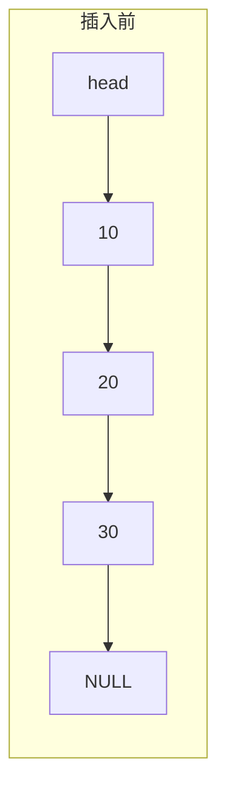
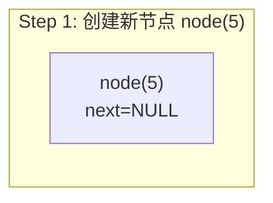
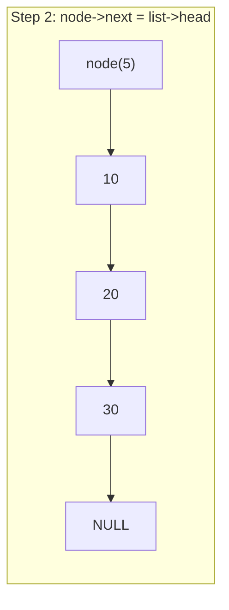
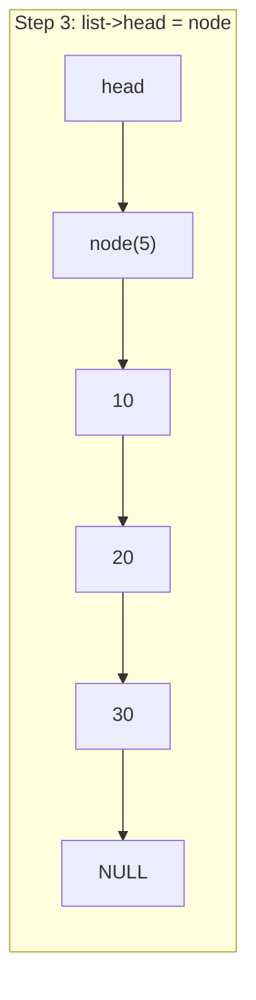

# Building a Singly Linked List from Scratch — A Practical Guide to Pointers and Memory

So far, we have worked with dynamic arrays. In that chapter, we used `malloc` and `free` to manage a contiguous block of memory, experiencing the thrill of "manual transmission" memory management. However, contiguous memory has an inherent limitation — when inserting or deleting elements in the middle, you have to shift all subsequent data, resulting in an O(n) time complexity. For scenarios with frequent insertions and deletions, this is clearly not elegant enough.

The linked list is a classic data structure born to solve this problem. You can think of it as a train — each car not only carries cargo (data) but also connects to the next car via a coupling (pointer). We only need to know where the head is, and we can follow the couplings car by car to reach any car. Unlike the neatly arranged "lockers" of an array, train cars don't need to be on the same track — each car can stop anywhere, as long as the couplings connect. This is the core trade-off of a linked list: it sacrifices memory contiguity and random access in exchange for O(1) insertions and deletions (assuming you have already found the position, of course).

Honestly, the linked list is the first hurdle many people encounter when learning data structures — not because the concept itself is difficult, but because the various edge cases in pointer operations are extremely error-prone. Null pointers, dangling pointers, broken chains, memory leaks... each one can keep you debugging until midnight. Python and Java programmers basically never need to build a linked list from scratch; the standard library hands you `list` and `LinkedList`, and garbage collection manages memory perfectly for you. But C has none of that — no standard linked list container, no garbage collection, no generics. You can only rely on pointers and `malloc` to build it yourself. This is precisely a great training opportunity, because only by writing every pointer operation of a linked list yourself can you truly understand what kind of trouble C++'s `std::unique_ptr` and `std::shared_ptr` actually save you.

So in this chapter, we won't do anything fancy. We will steadily build a classic singly linked list from scratch, going through core operations like node design, insertion, deletion, searching, traversal, and sentinel nodes, while leveling up our practical skills with pointers and memory management.

> **Learning Objectives**
>
> After completing this chapter, you will be able to:
>
> - [ ] Understand the singly linked list node structure design and memory model
> - [ ] Implement insertion and deletion at the head, tail, and specified positions
> - [ ] Master the sentinel node (dummy head) technique
> - [ ] Handle various edge cases in linked list operations
> - [ ] Understand linked list memory ownership and release strategies
> - [ ] Understand the design trade-offs of C++ standard library linked list containers

## Environment Setup

All code in this article was written and tested in the following environment:

```text
平台：Linux (x86_64)，WSL2
编译器：GCC 13+，编译选项 -Wall -Wextra -std=c17
构建工具：CMake 3.20+
调试工具：GDB + Valgrind（用于内存泄漏检测）
```

The code style follows project conventions: functions use `snake_case`, types use `PascalCase`, constants use `UPPER_SNAKE_CASE`, 4-space indentation, and pointers are left-aligned `Type* ptr`. We recommend always compiling with `-Wall -Wextra` enabled — for null pointer dereferences and dangling pointer issues in linked list code, compiler warnings can often catch them for you right away.

## Step 1 — Figure Out How to Design the Node

Everything is hard at the beginning. Let's first design the most basic building block of a linked list — the node. Each node needs to store two things: a data field and a pointer field. The data field holds the actual value, and the pointer field holds the address of the next node. You can compare it to a train — each car has both a cargo hold (data field) for carrying goods and a coupling (pointer field) for connecting to the next car.

```c
#include <stdio.h>
#include <stdlib.h>
#include <stdbool.h>

/// @brief 单链表节点
typedef struct ListNode {
    int data;                // 数据域
    struct ListNode* next;   // 指针域：指向下一个节点
} ListNode;
```

There is a detail worth noting here — inside the struct, you must write the full `struct Node*`, not just `Node*`. The reason is that when the `typedef` hasn't taken effect yet, the name `Node` doesn't exist yet, and the compiler doesn't recognize it. Self-referencing structs are just that awkward, but you get used to it.

> ⚠️ **Pitfall Warning**
> Writing `Node*` instead of `struct Node*` inside a self-referencing struct will cause a direct compilation error — because the `typedef` alias doesn't take effect until the entire declaration ends, and inside the struct the compiler only recognizes the full form `struct Node`. Almost every beginner falls into this trap exactly once.

Having just nodes is not enough; we also need a "linked list" type to manage the metadata of the entire chain. The simplest approach is to maintain only a head pointer:

```c
typedef struct {
    ListNode* head;    // 指向链表第一个节点
    int size;          // 链表长度，方便 O(1) 查询
} LinkedList;
```

Putting `size` inside the struct is a very practical approach — although you could count the nodes by traversing, that is an O(n) operation. Maintaining a `size` field makes getting the length O(1), at the cost of only modifying an extra integer during insertions and deletions, which is a great deal.

## Step 2 — Build the Linked List and Tear It Down Safely

Lifecycle management of a data structure is always the first step. To draw an analogy: a linked list is like building with blocks — first take a baseplate (the `LinkedList` struct), then stack blocks (the `Node`s) onto it one by one. When tearing it down, you must take them off one by one, and finally put away the baseplate too. The order cannot be messed up, or all the blocks will come crashing down.

Let's implement creation first:

```c
/// @brief 创建一个空链表
LinkedList* linked_list_create(void) {
    LinkedList* list = (LinkedList*)malloc(sizeof(LinkedList));
    if (list == NULL) {
        return NULL;
    }
    list->head = NULL;
    list->size = 0;
    return list;
}
```

When creating, set `head` to `NULL` and `size` to 0, and an empty linked list is born. The return value check for `malloc` cannot be omitted — although in learning code we often get lazy and skip it, in a real project, memory allocation failure is an error path that must be handled.

Next is a small helper function for creating a single node, which will be used by all subsequent insertion operations:

```c
/// @brief 创建一个新节点
/// @param data 节点数据
/// @return 新节点指针，失败返回 NULL
static ListNode* list_node_create(int data) {
    ListNode* node = (ListNode*)malloc(sizeof(ListNode));
    if (node == NULL) {
        return NULL;
    }
    node->data = data;
    node->next = NULL;
    return node;
}
```

It is decorated with `static` because this function is only used internally and not exposed to external callers. This is a good encapsulation habit — it reduces namespace pollution and conveys to the reader that "this is an internal implementation detail."

Destroying a linked list is a relatively error-prone area. We need to traverse each node and free it, and finally free the linked list struct itself. The problem is — if we directly `free` the current node, we lose the address of the next node, and the chain is broken. So we need a temporary pointer to "save first, delete later":

```c
/// @brief 销毁链表，释放所有内存
void linked_list_destroy(LinkedList* list) {
    if (list == NULL) {
        return;
    }

    ListNode* current = list->head;
    while (current != NULL) {
        ListNode* next = current->next;  // 先保存下一个节点的地址
        free(current);                    // 再释放当前节点
        current = next;                   // 移动到下一个
    }

    free(list);  // 最后释放链表结构体本身
}
```

This "save first, delete later" traversal-and-free pattern is very important — it is one of the most fundamental operation patterns in linked list manipulation. When deleting nodes later, the same idea applies, with the only difference being whether we are freeing a single node or all nodes.

> ⚠️ **Pitfall Warning**
> If you `free` first and then read `next` when destroying a linked list, that constitutes Use-After-Free — accessing memory that has already been reclaimed. This bug will immediately report an error under Valgrind, but if you don't run Valgrind, it might "happen to" work normally (because that memory hasn't been overwritten yet), only to randomly crash after you've been running it on an embedded device for a few hours. So you must memorize this order: save first, delete second, move last.

## Step 3 — Insert a Node at the Head

The simplest and most efficient insertion operation for a linked list is head insertion — placing the new node at the very front of the list and making `head` point to it. This operation is always O(1) and requires no traversal. Using the train analogy, it's like hooking another car in front of the locomotive and then moving the head marker to the new car.

```c
/// @brief 在链表头部插入元素
/// @return 成功返回 true，内存不足返回 false
bool linked_list_push_front(LinkedList* list, int data) {
    if (list == NULL) {
        return false;
    }

    ListNode* node = list_node_create(data);
    if (node == NULL) {
        return false;
    }

    node->next = list->head;  // 新节点指向原来的第一个节点
    list->head = node;        // head 指向新节点
    list->size++;
    return true;
}
```

Let's draw this process. Suppose the list was originally `1 -> 2 -> 3`, and now we want to insert `0` at the head:









The entire process only modifies two pointers, with no traversal, so it is O(1). Note that the order of these two steps cannot be reversed — if you modify `head` first, the address of the original first node is lost, and the list is immediately broken. This order is an iron rule for head operations on linked lists: **connect first, disconnect second** — hook the new node onto the chain first, then modify the `head` pointer.

## Step 4 — Append a Node at the Tail

Tail insertion requires one more step than head insertion — you need to find the last node first. If the list is empty, tail insertion is the same as head insertion.

```c
/// @brief 在链表尾部插入元素
bool linked_list_push_back(LinkedList* list, int data) {
    if (list == NULL) {
        return false;
    }

    ListNode* node = list_node_create(data);
    if (node == NULL) {
        return false;
    }

    if (list->head == NULL) {
        // 空链表：新节点就是第一个节点
        list->head = node;
    } else {
        // 非空链表：找到最后一个节点
        ListNode* tail = list->head;
        while (tail->next != NULL) {
            tail = tail->next;
        }
        tail->next = node;
    }

    list->size++;
    return true;
}
```

> ⚠️ **Pitfall Warning**
> When traversing to find the tail, the termination condition must be `curr->next != NULL` instead of `curr != NULL`. If you use the latter, when the loop ends `curr` is `NULL` — you lose the reference to the last node and have no way to attach the new node. Executing `curr->next = new_node` is then a null pointer dereference, resulting in an immediate segfault. This is a very high-frequency bug in linked list code.

The time complexity of tail insertion is O(n) because you have to traverse to the tail. If you frequently do tail insertions, you can maintain a `tail` pointer just like you maintain `size`, making tail insertion O(1) as well. However, maintaining an additional `tail` pointer adds considerable complexity to edge cases (you also need to update it when deleting the tail node), so we won't introduce it here. It will be naturally resolved later when we cover doubly linked lists.

## Step 5 — Insert a Node at a Specified Position

Having head and tail insertion is not enough; often we need to insert an element at a specified position. We agree: `pos` of 0 means head insertion, `pos` equal to `size` means tail insertion, and exceeding `size` is considered an invalid operation.

```c
/// @brief 在指定位置插入元素
/// @param index 插入位置（0-based）
bool linked_list_insert_at(LinkedList* list, int index, int data) {
    if (list == NULL || index < 0 || index > list->size) {
        return false;
    }

    if (index == 0) {
        return linked_list_push_front(list, data);
    }

    // 找到 index-1 位置的节点（前驱节点）
    ListNode* prev = list->head;
    for (int i = 0; i < index - 1; i++) {
        prev = prev->next;
    }

    ListNode* node = list_node_create(data);
    if (node == NULL) {
        return false;
    }

    node->next = prev->next;  // 新节点指向原来 index 位置的节点
    prev->next = node;        // 前驱节点指向新节点
    list->size++;
    return true;
}
```

The core of inserting at a specified position is finding the **predecessor node** — that is, the node at position `pos - 1`. Once found, the new node squeezes between the predecessor and the predecessor's next node: first point the new node's `next` to the predecessor's `next`, then point the predecessor's `next` to the new node. Just like head insertion, the order of these two steps cannot be reversed, or the chain after the predecessor is lost. Here again is that iron rule — **connect first, disconnect second**.

## Step 6 — Safely Delete Nodes

Deletion is the mirror operation of insertion, but it is more error-prone because we not only need to modify pointers but also free the deleted node's memory. As mentioned earlier, "save first, delete later" is the basic pattern of linked list operations, and we will use it repeatedly here.

### Head Deletion

```c
/// @brief 删除链表头部元素
/// @return 成功返回 true
bool linked_list_pop_front(LinkedList* list) {
    if (list == NULL || list->head == NULL) {
        return false;
    }

    ListNode* old_head = list->head;  // 先保存要删除的节点
    list->head = old_head->next;      // head 指向第二个节点
    free(old_head);                   // 释放原来的头节点
    list->size--;
    return true;
}
```

Again the "save first, delete later" pattern — you must save `next` first, otherwise after modifying `head` there is no way to `free` the original head node. If you write the order as `free` first and then read `next`, the second step of reading `next` is Use-After-Free.

### Deletion by Value

Deletion by value is one of the most careful operations in linked list manipulation because we need to handle quite a few edge cases: the list is empty, the node to delete is the head node, the node to delete doesn't exist...

```c
/// @brief 删除第一个值为 target 的节点
/// @return 找到并删除返回 true，未找到返回 false
bool linked_list_remove(LinkedList* list, int target) {
    if (list == NULL || list->head == NULL) {
        return false;
    }

    // 特殊情况：要删除的是头节点
    if (list->head->data == target) {
        return linked_list_pop_front(list);
    }

    // 一般情况：找到目标节点的前驱
    ListNode* prev = list->head;
    while (prev->next != NULL && prev->next->data != target) {
        prev = prev->next;
    }

    if (prev->next == NULL) {
        // 遍历完了也没找到
        return false;
    }

    // prev->next 就是要删除的节点
    ListNode* to_delete = prev->next;
    prev->next = to_delete->next;  // 前驱跳过被删节点
    free(to_delete);               // 释放被删节点
    list->size--;
    return true;
}
```

There is a very key design decision here — when we traverse, we maintain the **predecessor node** `prev`, not the current node `curr`. Because a singly linked list can only move forward, if you stand on the node to be deleted, you can't go back to modify the predecessor's `next` pointer. So we must always operate from the predecessor's position, using `prev->next` to check and manipulate the target node. This idea appears repeatedly in linked list operations, and we recommend thoroughly understanding it — in the sentinel node section later, we will see an elegant solution that eliminates the "head node special case."

### Deletion at a Specified Position

```c
/// @brief 删除指定位置的节点
bool linked_list_remove_at(LinkedList* list, int index) {
    if (list == NULL || index < 0 || index >= list->size) {
        return false;
    }

    if (index == 0) {
        return linked_list_pop_front(list);
    }

    // 找到 index-1 位置的节点（前驱）
    ListNode* prev = list->head;
    for (int i = 0; i < index - 1; i++) {
        prev = prev->next;
    }

    ListNode* to_delete = prev->next;
    prev->next = to_delete->next;
    free(to_delete);
    list->size--;
    return true;
}
```

Just like insertion at a specified position, the core is finding the predecessor node and then bypassing the deleted node.

## Step 7 — Search and Traverse, Let's Run It and See

Search and traversal are the most basic read-only operations of a linked list, and they are also our means of verifying that all previous insertions and deletions are correct.

```c
/// @brief 查找值为 target 的第一个节点的位置
/// @return 找到返回索引（0-based），未找到返回 -1
int linked_list_find(const LinkedList* list, int target) {
    if (list == NULL) {
        return -1;
    }

    ListNode* current = list->head;
    int index = 0;
    while (current != NULL) {
        if (current->data == target) {
            return index;
        }
        current = current->next;
        index++;
    }
    return -1;
}
```

```c
/// @brief 打印链表内容
void linked_list_print(const LinkedList* list) {
    if (list == NULL) {
        printf("[NULL list]\n");
        return;
    }

    printf("[");
    ListNode* current = list->head;
    while (current != NULL) {
        printf("%d", current->data);
        if (current->next != NULL) {
            printf(" -> ");
        }
        current = current->next;
    }
    printf("] (size=%d)\n", list->size);
}
```

```c
/// @brief 获取链表长度
int linked_list_size(const LinkedList* list) {
    return (list != NULL) ? list->size : 0;
}
```

At this point we have implemented a fully functional singly linked list. Let's run it to verify the results:

```c
int main(void) {
    LinkedList* list = linked_list_create();

    linked_list_push_back(list, 10);
    linked_list_push_back(list, 20);
    linked_list_push_back(list, 30);
    linked_list_print(list);

    linked_list_push_front(list, 5);
    linked_list_print(list);

    linked_list_insert_at(list, 2, 15);
    linked_list_print(list);

    linked_list_remove(list, 15);
    linked_list_print(list);

    int pos = linked_list_find(list, 20);
    printf("Found 20 at index %d\n", pos);

    linked_list_destroy(list);
    return 0;
}
```

Compile and run:

```text
$ gcc -Wall -Wextra -std=c17 linked_list.c -o linked_list_test && ./linked_list_test
[10 -> 20 -> 30] (size=3)
[5 -> 10 -> 20 -> 30] (size=4)
[5 -> 10 -> 15 -> 20 -> 30] (size=5)
[5 -> 10 -> 20 -> 30] (size=4)
Found 20 at index 2
```

Let's use Valgrind to check if there are any memory leaks:

```text
$ valgrind --leak-check=full ./linked_list_test
==12345== HEAP SUMMARY:
==12345==     in use at exit: 0 bytes in 0 blocks
==12345==   total heap usage: 8 allocs, 8 frees, 1,248 bytes allocated
==12345==
==12345== All heap blocks were freed -- no leaks are possible
```

Great, 8 `malloc`s correspond to 8 `free`s, and the memory is perfectly clean. Memory issues with linked lists often don't crash immediately at runtime; instead, they leak quietly, only causing an OOM crash after you've been running on an embedded device for hours, at which point troubleshooting becomes painful. So don't skip this verification step.

## Step 8 — Use a Sentinel Node to Eliminate Head Node Special Cases

The linked list we implemented earlier has an inelegant aspect — operations involving the head node always require special handling. During insertion, if `pos == 0` you need to take a special logic path, and during deletion, if the node to delete is the head node, you also need a special path. This kind of "head node special case" not only makes the code longer but is also easy to miss when making modifications.

The sentinel node (dummy head / sentinel node) is a classic technique for eliminating these special cases. The idea is to place a "fake" node at the very front of the list that doesn't store valid data — it just occupies a spot. You can think of it as hanging an empty car in front of the train — it carries no passengers, but it turns all "insert before a certain car" operations into a uniform "insert after the predecessor." This way, all real data nodes have a predecessor node — even the first data node's predecessor is the sentinel node. All operations targeting the "predecessor" can be handled uniformly, without any special cases.

```c
/// @brief 带哨兵节点的单链表
typedef struct {
    ListNode sentinel;   // 哨兵节点（直接嵌入，不是指针）
    int size;
} SentinelList;
```

Here we embed the sentinel node directly into the struct instead of using a pointer to it — the benefit of this approach is one fewer `malloc`, and the sentinel's lifetime is naturally tied to the linked list struct. The sentinel node's `data` field is meaningless; only the `next` field is useful.

```c
/// @brief 创建带哨兵节点的链表
SentinelList* sentinel_list_create(void) {
    SentinelList* list = (SentinelList*)malloc(sizeof(SentinelList));
    if (list == NULL) {
        return NULL;
    }
    list->sentinel.next = NULL;  // 哨兵的 next 指向第一个真实节点（空链表时为 NULL）
    list->size = 0;
    return list;
}
```

Now let's see how concise deletion by value becomes under the sentinel version:

```c
/// @brief 按值删除（哨兵版本）
bool sentinel_list_remove(SentinelList* list, int target) {
    if (list == NULL) {
        return false;
    }

    // prev 从哨兵开始，不需要特判头节点
    ListNode* prev = &list->sentinel;
    while (prev->next != NULL && prev->next->data != target) {
        prev = prev->next;
    }

    if (prev->next == NULL) {
        return false;
    }

    ListNode* to_delete = prev->next;
    prev->next = to_delete->next;
    free(to_delete);
    list->size--;
    return true;
}
```

Notice? There is no special case for `head == NULL`, and no branch for head deletion — all cases uniformly follow one set of logic. `prev` starts traversing from the sentinel, because the sentinel itself is a valid predecessor node. This is the power of the sentinel node — it uses one node that doesn't store data in exchange for consistent operation logic, eliminating all head node special cases. Many advanced variants of linked lists use sentinel nodes; for example, the Linux kernel's `list_head` is a classic implementation of a doubly circular linked list with a sentinel.

## Edge Case Checklist — Where You're Most Likely to Crash

The most bug-prone areas in linked list operations are edge cases. Let's organize the situations that must be covered:

Empty list operations — deleting from an empty list, searching an empty list, should all safely return an error code without crashing. Single-node list — after deleting the only node, the list becomes empty, and `head` should become `NULL`. Tail operations — after deleting the last node, the predecessor's `next` should become `NULL`. `list` parameter checks — the first parameter of all public APIs could be `NULL`, so defensive checks are mandatory. Index out of bounds — `pos` being negative or exceeding `size` should return an error.

When writing tests, you must cover all these situations, especially empty lists and single-node cases — many people only test on "normal length" lists, and then crash the moment they hit an edge case.

## Memory Ownership — Who Is Responsible for Freeing

When building data structures from scratch, memory ownership is a question that must be thought through clearly. In our implementation, the ownership relationship is very clear: `LinkedList` owns the ownership of all `Node`s, whoever creates destroys — `list_create` creates the list, `list_destroy` destroys the list and all nodes, each node belongs to only one list, and there is no sharing.

This clear single-ownership model makes memory management simple — you just need to free all nodes in `list_destroy`. But if the `data` we store is also dynamically allocated (like a `char*` string), ownership becomes more complex — is the list responsible for freeing the data, or is the caller responsible? Generally there are two strategies: one is that the list owns the data's ownership and frees it together when destroyed; the other is that the list only stores pointers and doesn't manage the data's lifetime, leaving it to the caller. The former is simple but not flexible enough, while the latter is flexible but prone to forgetting to free. In C, there is no one-size-fits-all answer; you need to think it through when designing the API and clearly state it in the documentation.

## Bridging to C++

After understanding all the details of building a singly linked list from scratch, let's see what the C++ standard library offers in this area.

### `std::forward_list` and `std::list`

The C++ STL provides two linked list containers — `std::forward_list` and `std::list`. `std::forward_list` is a singly linked list introduced in C++11, corresponding to the classic singly linked list we implemented in this article. `std::list` is a doubly linked list where each node additionally stores a `prev` pointer.

An interesting design trade-off is that `std::forward_list` doesn't even have a `size()` member function. The C++ standard committee's reasoning is that if `size()` were provided, certain operations (like `splice_after`, which transfers nodes from one list to another) would have to maintain the consistency of `size`, and this would incur additional overhead. Since `std::forward_list`'s design goal is "a singly linked list with minimal overhead," they simply chose not to provide `size()`, letting those who need it maintain it themselves. This forms an interesting contrast with our approach of maintaining a `size` field — the standard library chose flexibility over convenience.

### Smart Pointers and Linked Lists

In C++, while building a linked list with raw pointers is feasible, with smart pointers there is a safer approach. The most natural way is to use `std::unique_ptr` to manage node ownership:

```cpp
#include <memory>

struct ListNode {
    int data;
    std::unique_ptr<ListNode> next;  // 独占下一个节点的所有权
};
```

The benefit of doing this is that the linked list's destruction becomes automatic — when the head node's `std::unique_ptr` is destroyed, it recursively destroys the next node, which in turn destroys the next, all the way to the tail. There is no need to manually write a `list_destroy` function. However, note a potential issue: for very long linked lists (say, tens of thousands of nodes), this recursive destruction could cause a stack overflow. In this case, you still need to manually traverse and free.

A linked list using `std::unique_ptr` also has subtle changes during insertion and deletion — you can't simply assign pointers; you need to use `std::move` to transfer ownership:

```cpp
// 头部插入
void push_front(std::unique_ptr<ListNode>& head, int data) {
    auto new_node = std::make_unique<ListNode>();
    new_node->data = data;
    new_node->next = std::move(head);  // 转移所有权
    head = std::move(new_node);
}
```

Compared to the C version's `new_node->next = list->head`, the C++ version's `std::move` makes the ownership transfer explicit — every pointer transfer is clearly marked as a "move" rather than silently copying an address value. This is exactly the manifestation of C++ move semantics in pointer-intensive data structures like linked lists.

### The Iterator Pattern

When we wrote linked list traversal earlier, it was always `while (curr != NULL)`. This traversal logic is coupled to the specific linked list implementation — if you want to switch to a different container (like an array), the traversal code would all need to change.

C++'s iterator pattern abstracts the "traversal" operation. Whether it's a linked list, an array, or a tree, as long as it provides an iterator, you can use a uniform `begin()/end()` to traverse it, or even use a range-based for loop `for (auto& x : list)` to traverse it. The underlying implementation of iterators is of course still pointer operations — for a linked list, `++it` is `it = it->next`, and for an array, it's pointer increment. But the caller doesn't need to care about these details.

Doing iterators in pure C is rather troublesome — there is no operator overloading, no templates, and achieving generics can only be done with function pointers or macros. But after understanding the design intent of C++ iterators, we can achieve a similar abstraction in C — define a traversal function that accepts a callback function pointer and calls it for each element. This pattern is also used in the C standard library (such as the comparison function of `qsort`, the callback of `pthread_create`, etc.).

## Summary

At this point, we have built a complete singly linked list from scratch. Node design used a self-referencing struct, insertion and deletion revolve around "finding the predecessor node," head operations require special-casing the head node, the sentinel node technique eliminated this special-casing, and memory ownership follows the single-ownership principle of "whoever creates, destroys." These are not just linked list knowledge — they are universal paradigms for all pointer-intensive data structures. Trees, graphs, and the separate chaining of hash tables all rely on similar node + pointer operations underneath.

### Key Takeaways

- A singly linked list node contains a data field and a pointer field, chained together through pointers
- Head insertion/deletion is O(1); tail and middle operations require traversing to the target position
- The core of deletion is maintaining the predecessor node and bypassing the deleted node through it
- "Save first, delete later" is the basic pattern for linked list memory release; reversing the order results in Use-After-Free
- Sentinel nodes eliminate special handling of the head node, making code more concise and less error-prone
- Memory ownership must be clarified at design time — whether the list manages it or the caller manages it
- Edge cases (empty list, single node, tail) are the focus of testing
- `std::forward_list` corresponds to singly linked lists, `std::list` corresponds to doubly linked lists
- Smart pointers make linked list memory management safer, and `std::move` explicitly expresses ownership transfer

## Exercises

### Exercise 1: Reverse a Linked List

Implement a function that reverses a singly linked list in place. The space complexity must be O(1), and you cannot allocate new nodes.

```c
/// @brief 原地反转链表
/// @param list 链表指针
void linked_list_reverse(LinkedList* list);
```

Hint: Maintain three pointers — `prev`, `curr`, `next`, and reverse the `next` direction of each node one by one.

### Exercise 2: Merge Two Sorted Linked Lists

Given two linked lists sorted in ascending order, merge them into a new sorted linked list.

```c
/// @brief 合并两个升序链表
/// @param a 第一个有序链表
/// @param b 第二个有序链表
/// @return 合并后的新链表
LinkedList* linked_list_merge_sorted(const LinkedList* a, const LinkedList* b);
```

Hint: Traverse both lists simultaneously, each time taking the node with the smaller value and inserting it at the tail of the result list.

### Exercise 3: Detect a Linked List Cycle

Determine whether a linked list has a cycle (where some node's `next` points to a node that has already appeared).

```c
/// @brief 检测链表是否有环
/// @return 有环返回 true
bool linked_list_has_cycle(const LinkedList* list);
```

Hint: The classic solution is Floyd's Tortoise and Hare algorithm — use two pointers, one moving one step at a time and the other moving two steps. If there is a cycle, the fast pointer will eventually catch up to the slow pointer.

### Exercise 4: Complete Sentinel Version API

Re-implement the complete linked list API using a sentinel node (`list_create`, `list_push_front`, `list_push_back`, `list_insert`, `list_remove`), and experience which special-case code the sentinel node eliminates.

## References

- [C language structs - cppreference](https://en.cppreference.com/w/c/language/struct)
- [std::forward_list - cppreference](https://en.cppreference.com/w/cpp/container/forward_list)
- [std::list - cppreference](https://en.cppreference.com/w/cpp/container/list)
- [std::unique_ptr - cppreference](https://en.cppreference.com/w/cpp/memory/unique_ptr)
- [Floyd's cycle detection algorithm - Wikipedia](https://en.wikipedia.org/wiki/Cycle_detection#Floyd's_tortoise_and_hare)
