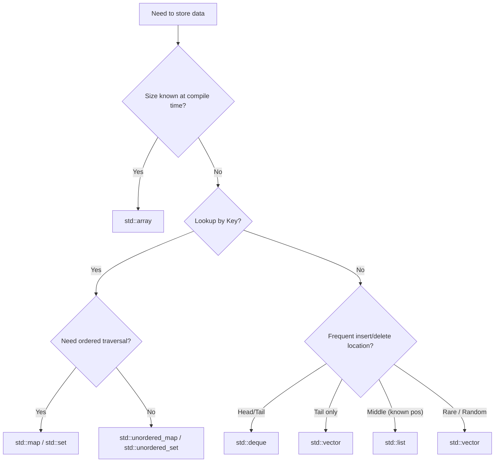

# Container Selection Guide: Pick the Right Container Based on Operations, Memory, and Invalidation Rules

## What this solves: Choosing the wrong container plants performance bugs

Volume 3 dismantled the major containers one by one—`std::array`, `std::vector`, `std::forward_list`/`std::list`/`std::deque`, `std::set`/`std::map`, `std::unordered_set`/`std::unordered_map`, and `std::string`. Each article focused on "what this container looks like internally and why it's designed this way." This article flips the perspective: standing from the angle of "I have a pile of data to store, which one should I pick," we put them on the same table for comparison. Choosing the wrong container rarely crashes immediately; it just makes your program slow, causes references to invalidate inexplicably, and triggers repeated reallocations in hot loops. These are the hardest performance bugs to diagnose because the code "runs," it just runs frustratingly slow.

Picking a container really comes down to three things: **what operations you need to perform (complexity), how data is laid out in memory (locality), and whether the iterators in your hand can still be trusted after modification (invalidation rules)**. Once these three are clear, the rest are details. We will walk through these three lines and wrap up with a decision tree.

## First, distinguish the two major camps: sequence containers and associative containers

Standard library containers are first divided into two broad categories, and this distinction determines the first question you ask. **Sequence containers** (`std::array`, `std::vector`, `std::deque`, `std::list`, `std::forward_list`) store data by "position." The order of elements in the container is the order you put them in, and you care about "inserting at which position, deleting at which position." **Associative containers** (`std::map`/`std::set` and their `unordered` versions) store data by "key." The order of elements is determined by the key (ordered) or by a hash (unordered), and you care about "what criteria I use to look up."

Associative containers are further divided into two sub-categories. `std::map`/`std::set`/`std::multimap`/`std::multiset` are **ordered**, implemented via red-black trees, sorted by key, offer stable `O(log n)` lookup, and support range-based traversal. `std::unordered_map`/`std::unordered_set` are **unordered**, implemented via hash tables, offer average `O(1)` lookup but worst-case `O(n)` (when everything collides in the same bucket), and cannot be traversed in order. In a nutshell: **Do you need to traverse in key order? If yes, use a red-black tree; if no, use a hash for average O(1)**. We have benchmarked this trade-off in the [Deep Dive into map and set](06-map-set-deep-dive.md) and [Deep Dive into unordered_map and set](07-unordered-map-set-deep-dive.md) articles.

## Complexity Cheat Sheet: Pick a container by operation

Let's spread the complexity out into a table to compare directly against the operations you need to perform. Note that the table refers to the cost of the "operation itself"; positioning (finding the spot to operate on) usually needs to be calculated separately.

| Container | Random Access | Insert/Delete at Front | Insert/Delete at Back | Insert/Delete in Middle | Lookup by Key |
|------|---------|---------|---------|---------|------------|
| `std::array` | O(1) | — | — | — | — |
| `std::vector` | O(1) | O(n) | Amortized O(1) | O(n) | — |
| `std::deque` | O(1) | O(1) | O(1) | O(n) | — |
| `std::list` | O(n) | O(1) | O(1) | O(1) (with iterator) | — |
| `std::forward_list` | O(n) | O(1) | — | O(1) (with iterator) | — |
| `std::set` / `std::map` | — | — | — | O(log n) | O(log n) |
| `std::unordered_set` / `std::unordered_map` | — | — | — | Avg O(1) | Avg O(1), Worst O(n) |

There are a few points in this table that are easily misinterpreted, so let's pull them out. First is the "O(1) insert in middle" for `std::list`/`std::forward_list`—this O(1) only applies to the **insertion action itself** (tweaking two pointers), provided you **already hold an iterator to that position**. If you have to traverse from the head to find the spot, that positioning step is O(n), making the total cost O(n). Many people see "list insert O(1)" and assume list is good for frequent insertions/deletions, but in most "frequent add/remove" scenarios, the positioning cost and cache unfriendliness drag list down to be slower than vector. Second is the "amortized O(1)" for `std::vector` at the tail—a single reallocation is indeed O(n), but amortized over N `push_back`s, each operation is constant, so the average is O(1); just remember to `reserve`, and reallocation counts can be suppressed to near zero. Third is `std::deque`; it looks beautiful with O(1) at both ends, but middle insertion is O(n) and more expensive than vector (due to its segmented structure moving more things), so deque is exclusive to "queues entering/exiting frequently at both ends"—don't use it as a general-purpose container.

## Memory Locality: Continuous vs. Node-based, the Performance Divide

The complexity table only tells you "asymptotic speed," but two containers both marked "O(1) traversal" can differ by an order of magnitude in real speed—the gap lies in memory locality. The storage method determines how data is laid out in memory, which in turn decides if the CPU cache hits or misses.

Sequence containers fall into three tiers based on storage. `std::array`, `std::vector` are **contiguous** memory; elements are placed right next to each other. During traversal, a whole cache line enters L1 together, and the prefetcher can fetch the next block. `std::deque` is **segmented contiguous**—internally a group of fixed-size chunks; contiguous within a chunk, discontinuous between chunks, so random access requires calculating "which element of which chunk," and traversal is smooth within a chunk but stutters across chunks. `std::list` / `std::forward_list` are **node-based** storage; each element is individually `new`'d as a node, linked by pointers. They are scattered all over memory, and traversal jumps to a new address almost every time, resulting in terrible cache hit rates. Associative containers are all node-based: a red-black tree has a node per element, a hash table has a bucket hanging a chain of nodes, and their locality is inferior to contiguous containers.

This gap isn't theoretical; run it and see.

```cpp
// Benchmark: Traversal speed comparison
#include <vector>
#include <list>
#include <iostream>

int main() {
    const int N = 100000;
    std::vector<int> vec(N);
    std::list<int> lst(N);

    // Fill with data
    for(int i=0; i<N; ++i) {
        vec[i] = i;
        // list initialization omitted for brevity, assume filled
    }

    volatile long long sum = 0; // prevent optimization

    // Vector traversal
    auto start_vec = std::chrono::high_resolution_clock::now();
    for(auto& val : vec) { sum += val; }
    auto end_vec = std::chrono::high_resolution_clock::now();

    // List traversal
    auto start_lst = std::chrono::high_resolution_clock::now();
    for(auto& val : lst) { sum += val; }
    auto end_lst = std::chrono::high_resolution_clock::now();

    std::cout << "Vector time: " << (end_vec - start_vec).count() << std::endl;
    std::cout << "List time: " << (end_lst - start_lst).count() << std::endl;
}
```

Running this shows `std::vector` traversal is several times faster than `std::list` (the exact multiplier depends on machine and cache size, but the magnitude is several times, not a few percent)—both traversals are O(n), each addition is O(1), but `std::vector`'s contiguous memory maxes out cache hits, while `std::list`'s every node requires a separate memory access. This is the underlying reason for "why default to vector": in the vast majority of "store a pile of data and traverse" scenarios, the cache bonus from contiguous memory far outweighs the move overhead saved by linked lists. **Only when you truly need frequent insertions/deletions at known positions, and the cost of insertion/deletion significantly outweighs the cost of traversal, might list win**—this condition is much stricter than intuition suggests.

## Iterator Invalidation Cheat Sheet: After modifying the container, can your references still be used?

The third dimension is iterator invalidation. You hold an iterator or reference, then perform an insertion/deletion on the container—can that iterator continue to be used? This directly determines whether you can "erase while traversing" or "store a reference for later use." The following table is a summary of the "Iterator invalidation" sections for each container on cppreference; it is authoritative and worth memorizing.

| Container | Insertion (insert / push) | Deletion (erase / pop) |
|------|----------------------|--------------------|
| `std::vector` / `std::string` | All invalid if reallocation occurs; otherwise, those after insertion point invalid | Erasure point and all after it invalid |
| `std::deque` | **All invalid** | **All invalid** |
| `std::list` / `std::forward_list` | Never invalid | Only the erased element invalid |
| `std::map` / `std::set` etc. | Never invalid | Only the erased element invalid |
| `std::unordered_map` / `std::unordered_set` etc. | Invalid if rehash triggered; otherwise never invalid | Only the erased element invalid |

Keep a close eye on the `std::deque` row in this table. Many people use deque as "a vector that can do O(1) at the head," but while vector only invalidates iterators after the point when not reallocating, **deque makes all iterators invalid on any erase**—this is caused by deque's segmented structure moving chunk pointers. If you "store a deque iterator, then later erase," you will almost certainly step on a landmine. Conversely, the biggest benefit of node-based containers (`std::list`, `std::set`, `std::map` and their unordered versions) is that **insertion never invalidates iterators, and deletion only invalidates the erased one**, so they naturally support "erasing by iterator while traversing" and "holding long-term references to elements."

There's also an unordered-container specific detail: rehash. `std::unordered_map` rehashes (expands buckets) when the load factor exceeds `max_load_factor` (default 1.0). This action invalidates all iterators (but references and pointers do **not** become invalid—this is explicitly guaranteed by the standard). The countermeasure is to `reserve` enough buckets upfront to avoid repeated rehashing in hot loops and to avoid iterators suddenly becoming invalid.

## Selection Decision Tree

Twisting the three lines into a tree, we start with the question that should be asked first.

The first cut is "Is the size known at compile time?": If known and constant, use `std::array` directly—zero heap allocation, `constexpr` capable, saves RAM by living in static storage, nothing is cheaper. If unknown and variable length, proceed to the second cut. The second cut is "Is lookup by key?": If yes, enter the associative container branch—if you need ordered traversal by key, use `std::map`/`std::set` (O(log n)); if you only need average O(1) lookup, use `std::unordered_map`/`std::unordered_set` (remember to `reserve`). If not lookup by key, enter the sequence container branch. The third cut is "Where do you frequently insert/delete?": Frequent entry/exit at head or tail, `std::deque`; only growing at the tail, `std::vector` (be sure to `reserve`); frequent insert/delete at known middle positions and no random access needed, `std::list`; if none of the above apply, default to `std::vector`.



Two supplements. First, if you only need to "borrow for a while" and don't want to transfer ownership, use `std::span`—it's the "unified read-only view for array/vector/C-arrays," the standard for zero-copy parameter passing, detailed in [Deep Dive into span](08-span.md). Second, starting with C++23, there are new options: if you want a "sorted + cache-friendly" map, look at `std::flat_map` (under the hood it's a sorted vector); if you want a "fixed capacity, never heap allocates" variable-length container, look at C++26's `std::dynarray`—we'll cover these two in the [New Standard Containers](10-new-containers-cpp23-26.md) article.

## Common Mis-selections

Listing a few high-frequency pitfalls to self-check when picking containers. First, **"Using list because of many insertions/deletions"**—ignoring positioning costs and cache unfriendliness; in most cases, vector plus erase is actually faster. List is only worth it when you truly hold a large number of iterators long-term, and insertions/deletions far outnumber traversals. Second, **unordered containers without reserve**—throwing N elements in without `reserve` triggers multiple rehashes; each rehash re-hashes all elements, wasting cycles in the hot path. Third, **vector repeated push_back without reserve**—same logic, moving the whole block on expansion; a single `reserve` eliminates most copies. Fourth, **passing references across containers ignoring invalidation rules**—especially storing iterators to deque then modifying the container, or erasing while traversing vector without updating the iterator. The compiler won't warn you about these bugs; they blow up at runtime.

## Wrapping Up

When picking a container, get three things clear first: operation complexity, memory locality, and iterator invalidation. If these three align, you're 90% there; for details (exception safety, custom allocators, heterogeneous lookup), go back to the specific deep-dive articles. A simple but useful default: **when in doubt, use vector**. It's contiguous, amortized O(1) at the tail, has the most complete interface, and is the safest card with the broadest coverage. Wait until you measure it as a bottleneck before switching. In the next article, we enter container adapters—`std::stack`, `std::queue`, `std::priority_queue`. They aren't new containers, but interface shells wrapping underlying containers into stacks/queues/heaps.

Want to try it out yourself? Click the online example below (runnable and viewable assembly):

<OnlineCompilerDemo
  title="Container Selection: Store by Position vs. Lookup by Key"
  source-path="code/examples/vol3/01_container_selection.cpp"
  description="Different operation costs for sequence containers (vector/list) and associative containers (map/unordered_map), echoing the selection decision tree"
  allow-run
/>

## Reference Resources

- [Container Library Overview (including iterator invalidation) — cppreference](https://en.cppreference.com/w/cpp/container)
- [Container Iterator Invalidation Rules (by operation) — cppreference](https://en.cppreference.com/w/cpp/container#Iterator_invalidation)
- [std::vector Iterator Invalidation Section — cppreference](https://en.cppreference.com/w/cpp/container/vector#Iterator_invalidation)
