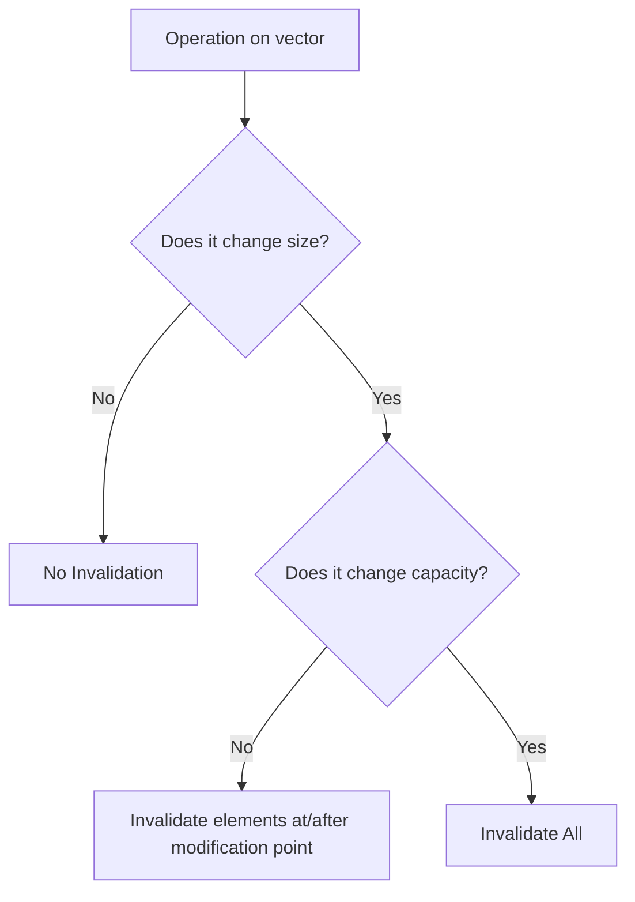

# Vector Deep Dive: Three Pointers, Reallocation, and Iterator Invalidation

In this post, I want to have a deep conversation with you about the implementation layer of `std::vector`.

In Volume 1, we've been using `std::vector` as a "self-growing array" quite smoothly, picking up `push_back`, `size`, `operator[]`, and iteration with ease. But I must be honest—using it smoothly and truly understanding it are two different things. Have you ever encountered these weird situations: a loop continuously `push_back`-ing, running fast most of the time, but stuttering inexplicably on one specific iteration; or you carefully cache an iterator or a pointer, and one day it points to a piece of garbage; or you thought you wrote strongly exception-safe code, only to have a hole silently torn in it during a reallocation.

The roots of these pitfalls are buried deep in `std::vector`'s implementation layer. So, in this post, we won't repeat how to call the APIs from Volume 1 (you surely know that by now). Instead, we'll break `std::vector` down into three pointers, a reallocation strategy, a rule table for invalidation, and conveniently connect the two new doors C++20 opened for it—`constexpr` and `erase_if`.

------

## Three Pointers Hold Up the Entire Vector

In mainstream standard library implementations (libstdc++, libc++, MSVC STL), the body of a `std::vector` is essentially just three pointers. Not an array, not a linked list, just `M_start` pointing to the first element, `M_finish` pointing to "one past" the last valid element, and `M_end_of_storage` pointing to the end of the allocated buffer. (I recall there was a question on Zhihu about this, and mainstream implementations indeed follow this.)

```cpp
// Simplified implementation structure
template<typename T>
class vector {
    T* M_start;           // Points to the beginning of the buffer
    T* M_finish;          // Points to one past the last element
    T* M_end_of_storage;  // Points to the end of the allocated capacity
};
```

Once you deduce along this diagram, everything clicks: `size()` is just `M_finish - M_start`, `capacity()` is `M_end_of_storage - M_start`, and `capacity() - size()` is exactly the number of elements you can still stuff in without reallocation. The standard text doesn't actually mandate `std::vector` must look like this (it only requires contiguous storage plus a bunch of interface behaviors), but once you know the underlying layer is these three pointers, all subsequent features become logical:

1. Reallocation is nothing more than moving this `M_start`/`M_finish`/`M_end_of_storage` chunk to a new buffer.
2. Iterator invalidation is nothing more than the buffer being swapped out.
3. `data()` can feed directly into C APIs because `M_start` points to a whole chunk of contiguous raw memory.

## Reallocation: Amortized Constant, but Single Operation Can Be O(n)

So what happens when you `push_back` into a `std::vector` that is already full? It triggers a *reallocation*—applying for a new buffer, moving old elements over, and releasing the old buffer. The standard's guarantee for this step is **amortized constant time complexity**. Please hold onto the word "amortized"; it is not "constant".

This is too easily misread as "`push_back` is O(1) every time", so some friends confidently stuff `push_back` into hot loops, only to see one specific reallocation become an O(n) move, causing a sharp spike in the performance curve. Why does amortized analysis hold? The key lies in the fact that during reallocation, capacity grows by a geometric factor greater than 1. Thus, the cost of that one expensive move is spread (amortized) over the preceding several cheap `push_back` operations.

(PS: I've been incredibly busy lately. If you find this topic interesting, try profiling it locally!)

```cpp
// Visualizing capacity jumps
#include <vector>
#include <iostream>

int main() {
    std::vector<int> v;
    for (int i = 0; i < 20; ++i) {
        size_t old_cap = v.capacity();
        v.push_back(i);
        if (v.capacity() != old_cap) {
            std::cout << "Capacity changed: " << old_cap << " -> " << v.capacity() << '\n';
        }
    }
}
```

So what is this multiplier exactly? Sorry, **the standard doesn't specify** (strictly speaking, it's *unspecified*, which is looser than *implementation-defined*; the latter at least requires the implementation to document it). So the three big players chose their own paths: libstdc++ and libc++ are roughly 2× (formulas are `2 * capacity` and `capacity + capacity / 2` respectively), while MSVC STL uses 1.5× (`capacity + capacity / 2`). If you don't believe me, `push_back` 16 elements in a row and print `capacity()`—libstdc++/libc++ follow the sequence 1, 2, 4, 8, 16, while MSVC follows 1, 2, 3, 4, 6, 9, 13.

MSVC choosing 1.5× wasn't a random decision. When the multiplier is strictly less than 2, previously freed empty blocks might be reused by a later allocation—mathematically, `current_capacity < 2 * previous_capacity`.

This means a historically freed block might be large enough to satisfy the current request, allowing the allocator to reuse it, reducing fragmentation, and preventing RSS (Resident Set Size) from staying too high. With strict 2×, `current_capacity >= 2 * previous_capacity`, so no previously freed block can fit the current request; reuse is impossible. The cost, of course, is that 1.5× involves more moves. This is a trade-off between "memory reuse" and "number of moves," and each vendor has their own calculation. (There's a small edge case: the first time `push_back` jumps from capacity 0 to 1, all three agree. This is purely a special case of "initially 0", so don't use that to verify the 2×/1.5× rule.)

> ⚠️ Let me repeat: when writing performance conclusions, please use "amortized constant". Don't write "constant" just to save space. The single `push_back` that triggers reallocation is genuinely O(n).

## Iterator Invalidation: A Table Summarizes All Rules

Probably no container is easier to trip up on "iterator invalidation" than `std::vector`—you store an iterator or a pointer, and after some operation, it silently becomes a wild pointer. The rules can actually be summarized in a table:

| Operation | When Invalidation Occurs | Scope of Invalidation |
|------|---------|---------|
| `push_back` / `emplace_back` | Only when reallocation is triggered | **All** if triggered; **None** if not triggered (space remains) |
| `resize` | When `resize` triggers reallocation | All if triggered; otherwise none |
| `reserve` | If reallocation occurs | All |
| `insert` | If `size() + n` triggers reallocation | All if triggered; otherwise references/pointers remain valid, only past-the-end iterators are invalidated |
| `pop_back` / `erase` | Always | **Deleted element and everything after it** are invalidated |
| `assign` | If reallocation | All if triggered; otherwise `position` and after are invalidated |
| `clear` | Always | All |
| `swap` / `std::swap` | Always | All (iterators point to the *other* container now) |
| `operator=` | —— | **Does not invalidate**: Iterators/pointers/references remain valid, but they now point to elements in the "other" container |

Think the table is too dense? Compress it into a decision tree and it's easier to remember:



The easiest one to misremember in the table is the last one, `swap`. It doesn't invalidate in the traditional sense—you swapped away the container's contents, but the iterator is still pinned to the original memory address. So now it points to the element inside the container that was swapped in. Once you understand this, you can see why some libraries write weird-looking code like `std::vector<T>().swap(v)` to "truly free" memory: it swaps in an empty temporary object, taking the original buffer and capacity away to be destructed, leaving things squeaky clean.

## `move_if_noexcept` During Reallocation

The strong exception guarantee requires that an operation either succeeds completely or leaves the state unchanged. When `std::vector` triggers reallocation, it must move old elements to the new buffer one by one. This step is a potential exception throwing point. To achieve "rollback if moving fails halfway", the standard library makes a critical judgment on each element during reallocation: **If the element's move constructor is `noexcept`, then move; otherwise, honestly fall back to copy.**

The basis for this judgment is `std::is_nothrow_move_constructible_v`. Translating this—if you wrote a move constructor for your type but didn't mark it `noexcept`, `std::vector` will get nervous during reallocation and would rather take the slower copy path. Why? If a copy fails, the old buffer is still there, so we can roll back. If a move fails, the source element might have been gutted already, making recovery impossible. So my advice is simple: if you can add `noexcept` to a move constructor, definitely do it. It directly decides whether reallocation in `std::vector` is a "move" (fast) or a "copy" (slow). The standard library specifically prepared a `std::move_if_noexcept` tool for this, though its real stage is exactly this job inside containers of "choosing between move/copy based on exception safety".

## Two New Doors C++20 Opened for Vector

### One Door is `constexpr vector`

C++20 finally allows `std::vector` to be used at compile time. Behind this are two proposals接力: **P0784R7** "More constexpr containers" first paved the way—making `allocator`'s `allocate`/`deallocate` and `allocator_traits`'s `select_on_container_copy_construction` `constexpr`, plus a model called *transient constexpr allocation*; **P1004R2** "Making std::vector constexpr" then built on this mechanism to mark `std::vector` (and `std::string`'s) member functions as `constexpr` one by one. To detect support, check the `__cpp_lib_constexpr_vector` feature test macro.

There is a limitation here that **must be clarified**: the transient allocation model requires that *memory allocated during constant evaluation must be released before the end of that same constant evaluation*, otherwise the program is ill-formed. In plain English—you cannot define a persistent `constexpr std::vector` variable and "bring" its buffer of heap objects out of compile time. So how do we actually use `std::vector` at compile time? The correct way is: inside a `constexpr` function, temporarily create it, perform a bunch of operations, and finally **return only a scalar result** (sum of elements, count, a specific element value, etc.), letting the buffer destruct itself before the function returns. This fits embedded systems and lookup table scenarios perfectly—use `std::vector` as a temporary workspace at compile time to calculate a constant, then move the result into a `std::array` or `constexpr` variable, saving all runtime initialization costs.

### The Other Door is `erase` / `erase_if`

In old C++, to delete all elements satisfying a condition from a `std::vector`, you had to hand-write the famous erase-remove idiom: `v.erase(std::remove(v.begin(), v.end(), value), v.end());`. It's long and error-prone—I've seen accidents where people forget the second `v.end()` or forget to wrap the outer `erase`. C++20 incorporated this with a pair of free functions: `std::erase` deletes all elements equal to a value, `std::erase_if` deletes all elements satisfying a predicate, and both return the number of elements erased.

These functions come from proposal **P1209R0**, titled "Adopt Consistent Container Erasure from Library Fundamentals 2 for C++20"—just looking at the title you know their intent: to formally land the unified erasure API that was originally in the Library Fundamentals TS into C++20. cppreference has a crisp definition for them: they *"erase all elements that compare equal to value / satisfy the predicate from the container"*, replacing that error-prone erase-remove. Don't get one detail mixed up: sequence containers (`vector`, `deque`, `forward_list`, `list`, `string`) get both `std::erase` and `std::erase_if`, while associative/unordered associative containers only get `std::erase_if`—because their member `erase` was already doing "delete by key", and stuffing another `std::erase` in would cause semantic conflict. To detect support, check `__cpp_lib_erase_if` (C++20, value `202002L`).

------

## Let's Run It

Talk is cheap. Below are a few snippets marked with platform and standard that can be compiled standalone. We'll run through the previous concepts one by one.

First, observe reallocation. Print a line every time capacity changes, and you can intuitively see whether yours is 2× or 1.5×.

```cpp
// Run this to see the capacity growth sequence
#include <vector>
#include <iostream>

int main() {
    std::vector<int> v;
    size_t old_cap = 0;
    for (int i = 0; i < 100; ++i) {
        v.push_back(i);
        if (v.capacity() != old_cap) {
            std::cout << "Size: " << v.size() << ", New Capacity: " << v.capacity() << '\n';
            old_cap = v.capacity();
        }
    }
}
```

Second, compare the two scenarios of iterator invalidation. `push_back` doesn't invalidate when there's space, but invalidates all once reallocation triggers; `insert` inevitably swaps buffers once it exceeds current capacity.

```cpp
// Iterator invalidation demo
#include <vector>
#include <iostream>

int main() {
    std::vector<int> v = {1, 2, 3};

    // Scenario 1: push_back without reallocation
    auto it1 = v.begin();
    v.push_back(4); // No reallocation, it1 remains valid
    std::cout << "After push_back (no realloc): " << *it1 << '\n';

    // Scenario 2: push_back triggering reallocation
    v.shrink_to_fit(); // Force tight capacity
    it1 = v.begin();
    v.push_back(5); // Likely triggers reallocation
    if (v.begin() != it1) {
        std::cout << "Iterator invalidated after reallocation!\n";
    }
}
```

Third, `move_if_noexcept`. For a type with a move constructor marked `noexcept`, reallocation uses move; without it, it falls back to copy.

```cpp
// move_if_noexcept behavior
#include <vector>
#include <iostream>
#include <string>

struct Copyable {
    std::string data;
    // Move constructor NOT noexcept (implicitly noexcept(false) if it can throw)
    Copyable(std::string s) : data(s) {}
    Copyable(const Copyable& other) : data(other.data) { std::cout << "Copied\n"; }
    Copyable(Copyable&& other) noexcept(false) : data(std::move(other.data)) { std::cout << "Moved\n"; }
};

struct Movable {
    std::string data;
    Movable(std::string s) : data(s) {}
    Movable(const Movable& other) : data(other.data) { std::cout << "Copied\n"; }
    Movable(Movable&& other) noexcept : data(std::move(other.data)) { std::cout << "Moved\n"; }
};

int main() {
    std::cout << "Testing Copyable (noexcept(false)):\n";
    std::vector<Copyable> v1;
    v1.reserve(1);
    v1.emplace_back("A");
    v1.emplace_back("B"); // Triggers reallocation, should see "Copied"

    std::cout << "\nTesting Movable (noexcept(true)):\n";
    std::vector<Movable> v2;
    v2.reserve(1);
    v2.emplace_back("A");
    v2.emplace_back("B"); // Triggers reallocation, should see "Moved"
}
```

Fourth, `constexpr vector`. Use it as a temporary workspace at compile time, bringing out only the scalar result.

```cpp
// constexpr vector usage (C++20)
#include <vector>
#include <numeric>

constexpr int sum_vector() {
    std::vector<int> v;
    for (int i = 0; i < 10; ++i) {
        v.push_back(i);
    }
    // Calculate sum, buffer is destroyed after return
    return std::accumulate(v.begin(), v.end(), 0);
}

int main() {
    constexpr auto sum = sum_vector();
    static_assert(sum == 45, "Sum check");
}
```

Fifth, `erase_if`, one line to replace erase-remove.

```cpp
// std::erase_if usage (C++20)
#include <vector>
#include <iostream>

int main() {
    std::vector<int> v = {1, 2, 3, 4, 5, 6};

    // Remove all even numbers
    auto erased_count = std::erase_if(v, [](int x) { return x % 2 == 0; });

    std::cout << "Erased " << erased_count << " elements.\n";
    for (auto x : v) std::cout << x << ' '; // 1 3 5
}
```

Of course, you can also click this to see the phenomenon!

<OnlineCompilerDemo
  title="Vector Implementation Deep Dive: Reallocation, Invalidation, constexpr, erase_if"
  source-path="code/examples/vol34567/15_vector_deep_dive.cpp"
  description="Observe vector capacity jumps, iterator invalidation, move_if_noexcept, and C++20 constexpr/erase_if"
  allow-run
  allow-x86-asm
/>

------

## Final Thoughts

Piecing these back into engineering practice, my advice usually boils down to a few points. First, **if you can estimate the scale, `reserve` it**—right after construction, `reserve` based on the known or estimated final size, compressing several reallocations into one allocation. The effect on hot paths is immediate. Second, **use `std::erase_if` to delete elements**, stop handwriting erase-remove; it's shorter and harder to miss that second `end()`. Third, **for compile-time table generation, use `std::vector` as a temporary zone**, calculate and hand only the scalar result to `std::array` or stuff it into a `constexpr` variable, comfortably enjoying the compile-time dynamic capability given by transient allocation without crossing the line.

Finally, leave you with this impression: `std::vector`'s body is roughly three pointers (`start`, `finish`, `end_of_storage`); `size()`/`capacity()` are calculated from them. `push_back` is amortized constant, not constant; the growth multiplier isn't specified by the standard (libstdc++/libc++ use 2×, MSVC uses 1.5×). Invalidation rules are just one table—reallocation operations "invalidate all only if triggered", `erase` invalidates "deleted and after", `swap` doesn't invalidate at all. Whether elements move during reallocation depends on if the move constructor is marked `noexcept`. C++20 makes `std::vector` `constexpr` (P0784R7 + P1004R2), but limited by transient allocation to be a compile-time temporary zone; in the same year, `std::erase`/`std::erase_if` (P1209R0) took care of erase-remove for you. With these in your pocket, you'll basically avoid all `std::vector` pitfalls.

------

## Reference Resources

- [std::vector — cppreference](https://en.cppreference.com/w/cpp/container/vector)
- [vector::capacity — cppreference](https://en.cppreference.com/w/cpp/container/vector/capacity)
- [vector::push_back — cppreference](https://en.cppreference.com/w/cpp/container/vector/push_back)
- [std::erase / std::erase_if (vector) — cppreference](https://en.cppreference.com/w/cpp/container/vector/erase2)
- [vector.capacity — eel.is/c++draft](https://eel.is/c++draft/vector.capacity) · [sequence.reqmts — eel.is/c++draft](https://eel.is/c++draft/sequence.reqmts)
- [P0784R7 More constexpr containers](https://www.open-std.org/jtc1/sc22/wg21/docs/papers/2019/p0784r7.html)
- [P1004R2 Making std::vector constexpr](https://www.open-std.org/jtc1/sc22/wg21/docs/papers/2019/p1004r2.pdf)
- [P1209R0 Adopt Consistent Container Erasure from Library Fundamentals 2 for C++20](https://www.open-std.org/jtc1/sc22/wg21/docs/papers/2018/p1209r0.html)
