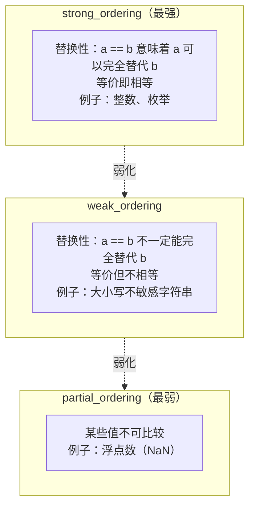

# Modern Embedded C++ Development — Three-Way Comparison Operator

## Introduction

Have you ever found comparison operators to be a headache while writing embedded code?

```cpp
class SensorReading {
public:
    uint16_t sensor_id;
    int32_t value;
    uint32_t timestamp;

    // 需要实现6个比较运算符！
    bool operator==(const SensorReading& other) const {
        return sensor_id == other.sensor_id &&
               value == other.value &&
               timestamp == other.timestamp;
    }

    bool operator!=(const SensorReading& other) const {
        return !(*this == other);
    }

    bool operator<(const SensorReading& other) const {
        if (sensor_id != other.sensor_id)
            return sensor_id < other.sensor_id;
        if (value != other.value)
            return value < other.value;
        return timestamp < other.timestamp;
    }

    bool operator<=(const SensorReading& other) const {
        return *this < other || *this == other;
    }

    bool operator>(const SensorReading& other) const {
        return other < *this;
    }

    bool operator>=(const SensorReading& other) const {
        return !(*this < other);
    }
};
```

This is a disaster! To implement a fully sortable type, you need to write six comparison operators, and they have complex interdependencies. Worse yet, if you modify member variables, you must synchronize all these operators.

The **Three-way Comparison Operator** introduced in C++20, commonly known as the **Spaceship Operator** (`<=>`), was designed to solve this problem.

> TL;DR: **The three-way comparison operator defines all six comparison operators with a single definition, drastically simplifying comparison logic for custom types.**

In embedded development, this feature is particularly useful:

1. Sorting sensor data by time or priority
2. Firmware version comparison (complex versions with alphabetic suffixes)
3. Lexicographical comparison of configuration parameters
4. Task sorting in priority queues

------
**Warning**: As of 2024, GCC 10+, Clang 10+, and MSVC 2019+ fully support the three-way comparison operator. If your compiler is older, you may need to upgrade or use an alternative solution.

------

## Basic Syntax of the Three-Way Comparison Operator

### Operator Symbol

The three-way comparison operator uses the `<=>` symbol, named so because it looks like a spaceship:

```cpp
#include <compare>

struct Point {
    int x, y;

    // 三路比较运算符
    std::strong_ordering operator<=>(const Point& other) const {
        if (auto cmp = x <=> other.x; cmp != 0)
            return cmp;
        return y <=> other.y;
    }
};
```

### Return Value Type

The return value of the three-way comparison operator is not `bool`, but a "comparison category" representing the comparison result:

```cpp
// <=> 返回值可以理解为：
// a <=> b < 0  表示 a < b
// a <=> b == 0 表示 a == b
// a <=> b > 0  表示 a > b

// 实际上，它返回的是一个类型
auto result = (a <=> b);

if (result < 0) { /* a < b */ }
else if (result == 0) { /* a == b */ }
else { /* a > b */ }
```

### Testing Comparison Results

The returned comparison category can be compared against 0, or you can use named methods:

```cpp
#include <compare>

int main() {
    auto cmp = 5 <=> 3;

    // 方式1：与0比较
    if (cmp < 0)    std::cout << "less\n";
    if (cmp == 0)   std::cout << "equal\n";
    if (cmp > 0)    std::cout << "greater\n";

    // 方式2：使用命名方法（推荐，更清晰）
    if (cmp == std::strong_ordering::less)    std::cout << "less\n";
    if (cmp == std::strong_ordering::equal)   std::cout << "equal\n";
    if (cmp == std::strong_ordering::greater) std::cout << "greater\n";

    return 0;
}
```

------
**Best Practice**: Use `<`, `==`, and `>` directly to judge the comparison result, rather than calling named methods. This makes the code more concise and applies to all comparison categories.

------

## Automatic Generation of Comparison Functions

### Using =default for Automatic Generation

The simplest usage is to use `= default` to let the compiler automatically generate all comparison operators:

```cpp
#include <compare>

struct SensorReading {
    uint16_t sensor_id;
    int32_t value;
    uint32_t timestamp;

    // 一行代码搞定所有6个比较运算符！
    auto operator<=>(const SensorReading&) const = default;

    // C++20还会自动生成!=
    // 但==仍需显式default（如果需要）
    bool operator==(const SensorReading&) const = default;
};
```

Now you can use all comparison operators:

```cpp
SensorReading s1{1, 100, 1000};
SensorReading s2{1, 100, 1000};
SensorReading s3{2, 100, 1000};

// 所有这些都可以工作！
bool b1 = (s1 == s2);  // true
bool b2 = (s1 != s2);  // false
bool b3 = (s1 < s3);   // true (按字典序)
bool b4 = (s1 <= s3);  // true
bool b5 = (s1 > s3);   // false
bool b6 = (s1 >= s3);  // false

// 还可以用在标准容器中
std::set<SensorReading> sensor_set;
std::map<SensorReading, std::string> sensor_map;

// 还可以用在算法中
std::vector<SensorReading> sensors;
std::sort(sensors.begin(), sensors.end());
```

### Comparison Order

The default generated `<=>` performs lexicographical comparison in **member declaration order**:

```cpp
struct Version {
    uint8_t major;
    uint8_t minor;
    uint8_t patch;

    auto operator<=>(const Version&) const = default;
    bool operator==(const Version&) const = default;
};

Version v1{1, 2, 3};
Version v2{1, 2, 4};
Version v3{1, 3, 0};

// 比较顺序：major -> minor -> patch
// v1 < v2 (patch: 3 < 4)
// v1 < v3 (minor: 2 < 3)
// v2 < v3 (minor: 2 < 3)
```

------
**Note**: The order of member variables matters! If you wish to compare in a specific order, you need to adjust the declaration order of the member variables.

------

## Deep Dive into Comparison Categories

C++20 defines three comparison categories to represent comparison relationships of different strengths.

### strong_ordering: Strong Ordering

`strong_ordering` represents the strongest comparison relationship with the following properties:

1. **Equivalence implies equality**: `a == b` if and only if all members of `a` and `b` are equal
2. **Substitutability**: When `a == b`, `f(a) == f(b)` holds for any function `f`

Use cases: Integers, strings, simple value types

```cpp
#include <compare>
#include <string>

struct Integer {
    int value;

    std::strong_ordering operator<=>(const Integer& other) const {
        return value <=> other.value;
    }

    bool operator==(const Integer& other) const = default;
};

// 使用
Integer a{5}, b{5}, c{10};
static_assert((a <=> b) == std::strong_ordering::equal);
static_assert((a <=> c) == std::strong_ordering::less);
static_assert((c <=> a) == std::strong_ordering::greater);
```

`std::strong_ordering` has three possible values:

| Value | Meaning |
|-----|------|
| `std::strong_ordering::less` | Less than |
| `std::strong_ordering::equal` | Equal |
| `std::strong_ordering::greater` | Greater than |
| `std::strong_ordering::equivalent` | Equivalent (for strong ordering, equivalent to equal) |

### partial_ordering: Partial Ordering

`partial_ordering` indicates that "incomparable" situations may exist:

1. Some values may not be comparable (e.g., `NaN`)
2. Equivalence does not imply equality

Use cases: Floating-point numbers (existence of `NaN`), ranges with permissible values

```cpp
#include <compare>
#include <cmath>

struct FloatValue {
    float value;

    std::partial_ordering operator<=>(const FloatValue& other) const {
        if (std::isnan(value) || std::isnan(other.value))
            return std::partial_ordering::unordered;
        return value <=> other.value;
    }

    bool operator==(const FloatValue& other) const {
        return value == other.value;
    }
};

// 使用
FloatValue a{1.0f}, b{2.0f}, c{NAN};

static_assert((a <=> b) == std::partial_ordering::less);
// (a <=> c) == std::partial_ordering::unordered
```

`std::partial_ordering` has four possible values:

| Value | Meaning |
|-----|------|
| `std::partial_ordering::less` | Less than |
| `std::partial_ordering::equivalent` | Equivalent |
| `std::partial_ordering::greater` | Greater than |
| `std::partial_ordering::unordered` | Unordered |

### weak_ordering: Weak Ordering

`weak_ordering` falls between strong ordering and partial ordering:

1. Equivalence does not imply equality (there may be indistinguishable alternative representations)
2. But all values are comparable (no `unordered`)

Use cases: Case-insensitive strings, comparisons ignoring certain fields

```cpp
#include <compare>
#include <string>
#include <cctype>

struct CaseInsensitiveString {
    std::string value;

    // 辅助函数：大小写不敏感比较
    static int compare_ic(const std::string& a, const std::string& b) {
        size_t i = 0;
        while (i < a.size() && i < b.size()) {
            int ca = std::tolower(static_cast<unsigned char>(a[i]));
            int cb = std::tolower(static_cast<unsigned char>(b[i]));
            if (ca != cb)
                return ca - cb;
            ++i;
        }
        if (a.size() < b.size()) return -1;
        if (a.size() > b.size()) return 1;
        return 0;
    }

    std::weak_ordering operator<=>(const CaseInsensitiveString& other) const {
        int cmp = compare_ic(value, other.value);
        if (cmp < 0) return std::weak_ordering::less;
        if (cmp > 0) return std::weak_ordering::greater;
        return std::weak_ordering::equivalent;
    }

    bool operator==(const CaseInsensitiveString& other) const {
        return compare_ic(value, other.value) == 0;
    }
};

// 使用
CaseInsensitiveString s1{"Hello"}, s2{"HELLO"}, s3{"hello"}, s4{"World"};

// s1, s2, s3 是等价的（weak_ordering::equivalent）
// 但它们不相等（value不同）
static_assert((s1 <=> s2) == std::weak_ordering::equivalent);
static_assert(!(s1 == s2));  // 不相等！
```

`std::weak_ordering` has three possible values:

| Value | Meaning |
|-----|------|
| `std::weak_ordering::less` | Less than |
| `std::weak_ordering::equivalent` | Equivalent |
| `std::weak_ordering::greater` | Greater than |

### Choosing Among the Three Comparison Categories

```cpp
#include <compare>

// 选择指南

// 1. strong_ordering：所有字段都精确比较
struct SensorData {
    uint8_t id;
    int16_t value;

    auto operator<=>(const SensorData&) const = default;
    bool operator==(const SensorData&) const = default;
    // 返回 strong_ordering
};

// 2. partial_ordering：存在NaN或不可比较的值
struct Measurement {
    float value;  // 可能是NaN

    std::partial_ordering operator<=>(const Measurement& other) const {
        if (std::isnan(value) || std::isnan(other.value))
            return std::partial_ordering::unordered;
        return value <=> other.value;
    }
};

// 3. weak_ordering：等价但不相等
struct ConfigKey {
    std::string key;
    bool case_sensitive;

    std::weak_ordering operator<=>(const ConfigKey& other) const {
        if (!case_sensitive) {
            // 大小写不敏感比较
            return case_insensitive_compare(key, other.key);
        }
        return key <=> other.key;
    }
};
```

### Comparison Category Relationship Diagram



------
**Important**: When using `= default`, the compiler automatically selects the most appropriate comparison category based on member types. If all members support `strong_ordering`, the generated result is `strong_ordering`.

------

## Real-World Embedded Scenarios

### Scenario 1: Sensor Data Priority Sorting

In embedded systems, sensor data often needs to be sorted by priority and timestamp:

```cpp
#include <compare>
#include <cstdint>
#include <queue>

class SensorMessage {
public:
    enum class Priority : uint8_t {
        Critical = 0,
        High = 1,
        Normal = 2,
        Low = 3
    };

    uint16_t sensor_id;
    Priority priority;
    int32_t value;
    uint32_t sequence;  // 序列号，用于同优先级排序

    // 按优先级升序（Critical在队列前面），然后按序列号
    auto operator<=>(const SensorMessage& other) const {
        // 优先级越小越重要
        if (auto cmp = priority <=> other.priority; cmp != 0)
            return cmp;
        // 同优先级按序列号（FIFO）
        return sequence <=> other.sequence;
    }

    bool operator==(const SensorMessage& other) const {
        return sensor_id == other.sensor_id &&
               priority == other.priority &&
               value == other.value &&
               sequence == other.sequence;
    }

    // 用于优先级队列（需要>运算符）
    bool operator>(const SensorMessage& other) const {
        return (*this <=> other) > 0;
    }
};

// 使用示例
void message_queue_example() {
    // 小顶堆（Priority值越小优先级越高）
    std::priority_queue<
        SensorMessage,
        std::vector<SensorMessage>,
        std::greater<>
    > message_queue;

    message_queue.push(SensorMessage{1, SensorMessage::Priority::Low, 100, 1});
    message_queue.push(SensorMessage{2, SensorMessage::Priority::Critical, 200, 2});
    message_queue.push(SensorMessage{3, SensorMessage::Priority::High, 150, 3});

    // 按优先级顺序处理：Critical -> High -> Low
    while (!message_queue.empty()) {
        auto msg = message_queue.top();
        process_message(msg);
        message_queue.pop();
    }
}
```

### Scenario 2: Firmware Version Comparison

Firmware version numbers may have complex formats, such as alphabetic suffixes:

```cpp
#include <compare>
#include <string>
#include <variant>

class FirmwareVersion {
public:
    uint8_t major;
    uint8_t minor;
    uint8_t patch;

    // 预发布标识：alpha < beta < rc < 正式版
    enum class PreRelease : uint8_t {
        None = 0,
        Alpha = 1,
        Beta = 2,
        RC = 3
    };

    PreRelease pre_release = PreRelease::None;
    uint8_t pre_release_version = 0;  // alpha1, alpha2等

    // 比较版本号
    std::strong_ordering operator<=>(const FirmwareVersion& other) const {
        // 主版本号
        if (auto cmp = major <=> other.major; cmp != 0)
            return cmp;

        // 次版本号
        if (auto cmp = minor <=> other.minor; cmp != 0)
            return cmp;

        // 补丁版本号
        if (auto cmp = patch <=> other.patch; cmp != 0)
            return cmp;

        // 预发布标识
        if (auto cmp = pre_release <=> other.pre_release; cmp != 0)
            return cmp;

        // 预发布版本号（只在都是预发布时比较）
        if (pre_release != PreRelease::None) {
            return pre_release_version <=> other.pre_release_version;
        }

        return std::strong_ordering::equal;
    }

    bool operator==(const FirmwareVersion& other) const = default;

    // 解析版本字符串 "1.2.3-beta2"
    static FirmwareVersion parse(const std::string& version_str);

    std::string to_string() const;
};

// 使用示例
void version_comparison() {
    FirmwareVersion current{1, 2, 3};
    FirmwareVersion available{1, 2, 4};

    if (available > current) {
        printf("New version available: %s\n",
               available.to_string().c_str());
    }

    // 预发布版本比较
    FirmwareVersion v1{2, 0, 0, FirmwareVersion::PreRelease::Alpha, 1};
    FirmwareVersion v2{2, 0, 0, FirmwareVersion::PreRelease::Beta, 1};
    FirmwareVersion v3{2, 0, 0, FirmwareVersion::PreRelease::None, 0};

    static_assert(v1 < v2);  // alpha < beta
    static_assert(v2 < v3);  // beta < 正式版
}
```

### Scenario 3: Configuration Parameter Comparison (Allowing Partial Equality)

In configuration systems, we might only want to compare specific key fields:

```cpp
#include <compare>
#include <string>
#include <optional>

struct NetworkConfig {
    std::string ssid;
    std::optional<std::string> password;  // 密码不参与比较
    uint8_t channel;
    bool hidden;

    // 比较时忽略密码字段
    auto operator<=>(const NetworkConfig& other) const {
        if (auto cmp = ssid <=> other.ssid; cmp != 0)
            return cmp;
        if (auto cmp = channel <=> other.channel; cmp != 0)
            return cmp;
        return hidden <=> other.hidden;
    }

    bool operator==(const NetworkConfig& other) const {
        return ssid == other.ssid &&
               channel == other.channel &&
               hidden == other.hidden;
        // 注意：password不参与比较
    }

    // 完全比较（包括密码）
    bool fully_equal(const NetworkConfig& other) const {
        if (*this != other) return false;
        if (password.has_value() != other.password.has_value())
            return false;
        if (password.has_value() && *password != *other.password)
            return false;
        return true;
    }
};

// 使用示例
void config_example() {
    NetworkConfig config1{"MyWiFi", "password123", 6, false};
    NetworkConfig config2{"MyWiFi", "different", 6, false};

    // 两个配置"相等"（忽略密码）
    static_assert(config1 == config2);

    // 可以检测配置是否改变
    NetworkConfig saved_config = load_from_flash();
    NetworkConfig current_config = get_current_config();

    if (current_config != saved_config) {
        printf("Configuration changed, need to save\n");
        save_to_flash(current_config);
    }

    // 但检查密码是否改变需要显式调用
    if (!config1.fully_equal(config2)) {
        printf("Password changed\n");
    }
}
```

### Scenario 4: Sensor Data with NaN

Some sensors might return invalid data (similar to the concept of NaN):

```cpp
#include <compare>
#include <optional>
#include <cmath>

struct SensorValue {
    std::optional<float> value;

    // 无效值（无值）被视为小于任何有效值
    std::partial_ordering operator<=>(const SensorValue& other) const {
        if (!value.has_value() && !other.value.has_value())
            return std::partial_ordering::equivalent;
        if (!value.has_value())
            return std::partial_ordering::less;
        if (!other.value.has_value())
            return std::partial_ordering::greater;

        // 两个都有值
        float v1 = *value;
        float v2 = *other.value;

        if (std::isnan(v1) || std::isnan(v2))
            return std::partial_ordering::unordered;

        if (v1 < v2) return std::partial_ordering::less;
        if (v1 > v2) return std::partial_ordering::greater;
        return std::partial_ordering::equivalent;
    }

    bool operator==(const SensorValue& other) const {
        if (!value.has_value() && !other.value.has_value())
            return true;
        if (!value.has_value() || !other.value.has_value())
            return false;
        return *value == *other.value;
    }
};

// 使用示例
void sensor_with_invalid_values() {
    std::vector<SensorValue> readings = {
        {10.5f},
        {std::nullopt},  // 无效读数
        {15.2f},
        {NAN},           // NaN读数
        {12.0f}
    };

    // 排序：无效值在前，然后NaN，然后有效值
    std::sort(readings.begin(), readings.end());

    for (const auto& reading : readings) {
        if (reading.value) {
            printf("%.1f ", *reading.value);
        } else {
            printf("(invalid) ");
        }
    }
    // 输出：(invalid) nan 10.5 12.0 15.2
}
```

### Scenario 5: Multi-Level Sensor Alerts

Alert systems need sorting across multiple dimensions:

```cpp
#include <compare>
#include <string>
#include <chrono>

class Alarm {
public:
    enum class Severity : uint8_t {
        Info = 0,
        Warning = 1,
        Error = 2,
        Critical = 3
    };

    enum class Status : uint8_t {
        Active = 0,
        Acknowledged = 1,
        Resolved = 2
    };

    uint32_t id;
    Severity severity;
    Status status;
    std::chrono::system_clock::time_point timestamp;
    std::string message;

    // 比较逻辑：
    // 1. Active告警优先
    // 2. 同状态下，Critical优先
    // 3. 同严重程度，最新的优先
    std::strong_ordering operator<=>(const Alarm& other) const {
        // 状态：Active < Acknowledged < Resolved
        if (auto cmp = status <=> other.status; cmp != 0)
            return cmp;

        // 严重程度：Critical > Error > Warning > Info
        // 但我们希望Critical在前面（更"小"）
        if (auto cmp = other.severity <=> severity; cmp != 0)
            return cmp;

        // 时间戳：最新的在前（更"小"）
        return other.timestamp <=> timestamp;
    }

    bool operator==(const Alarm& other) const {
        return id == other.id;
    }
};

// 使用示例
void alarm_system() {
    std::vector<Alarm> alarms = {
        {1, Alarm::Severity::Warning, Alarm::Status::Active,
         std::chrono::system_clock::now(), "Temperature high"},
        {2, Alarm::Severity::Critical, Alarm::Status::Acknowledged,
         std::chrono::system_clock::now(), "Power failure"},
        {3, Alarm::Severity::Error, Alarm::Status::Active,
         std::chrono::system_clock::now(), "Connection lost"}
    };

    // 排序后：
    // 1. Active Error (最新的Active告警)
    // 2. Active Warning
    // 3. Acknowledged Critical
    std::sort(alarms.begin(), alarms.end());

    for (const auto& alarm : alarms) {
        printf("[%d] %s: %s\n",
               static_cast<int>(alarm.severity),
               alarm.status == Alarm::Status::Active ? "Active" : "Acked",
               alarm.message.c_str());
    }
}
```

------

## Custom Three-Way Comparison Implementation

### Manual Implementation of Multi-Field Comparison

When the default lexicographical order does not meet requirements, manual implementation is needed:

```cpp
#include <compare>

struct Task {
    uint8_t priority;      // 0-255，越小越重要
    uint32_t deadline;     // 截止时间戳
    uint32_t created_at;   // 创建时间戳
    uint16_t task_id;

    // 比较逻辑：
    // 1. 优先级最高的先执行
    // 2. 同优先级，deadline最近的先执行
    // 3. 同deadline，创建最早的先执行
    // 4. 都相同，task_id小的先执行
    std::strong_ordering operator<=>(const Task& other) const {
        // 优先级升序
        if (auto cmp = priority <=> other.priority; cmp != 0)
            return cmp;

        // deadline升序
        if (auto cmp = deadline <=> other.deadline; cmp != 0)
            return cmp;

        // 创建时间升序（早创建的优先）
        if (auto cmp = created_at <=> other.created_at; cmp != 0)
            return cmp;

        // task_id升序
        return task_id <=> other.task_id;
    }

    bool operator==(const Task& other) const = default;
};
```

### Using Comparison Synthesis Helpers

C++23 provides the `std::compare_*` family of functions to simplify comparison logic:

```cpp
#include <compare>

// C++23风格的比较合成
struct Task {
    uint8_t priority;
    uint32_t deadline;
    uint32_t created_at;
    uint16_t task_id;

    std::strong_ordering operator<=>(const Task& other) const {
        // 使用C++23的合成函数（如果可用）
        return std::compare_three_way()(
            priority, other.priority,
            deadline, other.deadline,
            created_at, other.created_at,
            task_id, other.task_id
        );
    }

    bool operator==(const Task& other) const = default;
};
```

For C++20, you can implement a simple helper yourself:

```cpp
// C++20比较合成助手
namespace detail {
    template<typename... Ts>
    constexpr auto synthesized_three_way(const Ts&... args) {
        using R = std::common_comparison_category_t<
            typename std::decay_t<decltype(args <=> std::declval<Ts>())>::comparison_category...>;
        return R{};
    }

    // 简单实现
    template<typename T>
    constexpr auto compare_fields(const T& a, const T& b) {
        return a <=> b;
    }

    template<typename T, typename U, typename... Rest>
    constexpr auto compare_fields(const T& a, const T& b,
                                  const U& ua, const U& ub,
                                  const Rest&... rest) {
        if (auto cmp = a <=> b; cmp != 0)
            return cmp;
        return compare_fields(ua, ub, rest...);
    }
}

struct Task {
    uint8_t priority;
    uint32_t deadline;
    uint32_t created_at;
    uint16_t task_id;

    std::strong_ordering operator<=>(const Task& other) const {
        return detail::compare_fields(
            priority, other.priority,
            deadline, other.deadline,
            created_at, other.created_at,
            task_id, other.task_id
        );
    }

    bool operator==(const Task& other) const = default;
};
```

------
**Note**: C++23 offers more powerful comparison synthesis tools, such as `std::compare_three_way` and `std::compare_*_result`. Please refer to the latest standard library documentation when using them.

------

## Common Pitfalls

### Pitfall 1: Default == Does Not Reverse Generate <=> (Generation is One-Way)

A widespread but now outdated claim is: "Writing only `<=>` without `==` causes a compilation error." This was briefly true in early C++20 drafts, but was later fixed by **P1185 (Consistent defaulted comparisons, adopted as a C++20 Defect Report)**—the generation relationship between `<=>` and `==` is **one-way**:

- default `<=>` → The compiler conveniently generates `==`, `!=`, `<`, `>`, `<=`, and `>=` all together. So writing only `<=>` is perfectly sufficient; `==` comes "for free".
- Conversely, default `==` → Only generates `==` and `!=`; it will not reverse-generate `<=>` or any relational operators.

The real pitfall is the latter: You think "I only care about equality, defaulting a `==` is enough," but then someone writes a `a < b` expression, and the compilation blows up—because `==` doesn't come with relational operators.

```cpp
#include <compare>
#include <iostream>

// ✅ 只 default <=>：== 和 < 都自动有了（旧说法里那个「编译错误」其实是错的）
struct HasSpaceship {
    int value;
    auto operator<=>(const HasSpaceship&) const = default;
};

// ⚠️ 只 default ==：判等没问题，但拿不到 < / <=>
struct HasEquality {
    int value;
    bool operator==(const HasEquality&) const = default;
};

int main() {
    HasSpaceship a{1}, b{2};
    std::cout << (a == b) << (a < b) << '\n';   // OK：<=> 把 == 和 < 都生成出来了

    HasEquality c{1}, d{2};
    std::cout << (c == d) << '\n';              // OK：显式 default 了 ==
    // std::cout << (c < d) << '\n';            // 编译错误：default == 不反向生成 <=>
}
```

Tested (Arch Linux WSL, `-std=c++20`; g++ 16.1.1 and clang++ 22.1.6 behave consistently):

```text
$ g++ -std=c++20 gotcha.cpp -o gotcha && ./gotcha
01
0
$ g++ -std=c++20 -DTRY_LT gotcha.cpp
gotcha.cpp: In function 'int main()':
gotcha.cpp:23:21: error: no match for 'operator<' (operand types are 'HasEquality' and 'HasEquality')
   23 |     std::cout << (c < d) << '\n';
      |                   ~ ^ ~
```

A one-sentence mnemonic: `<=>` is "upstream", `==` is "downstream"—upstream sends all operators downstream, while downstream only minds its own business. As long as you want any kind of magnitude comparison, you need `<=>`; defaulting only `==` will never get you `<=>`. See the cppreference section on "[Default comparisons](https://en.cppreference.com/mwiki/index.php?title=cpp/language/default_comparisons)" for details.

### Pitfall 2: Inconsistent Comparison Categories

When implementing manually, ensure the returned comparison categories are consistent:

```cpp
// ❌ 错误：混合不同的比较类别
struct BadCompare {
    float f;
    int i;

    std::partial_ordering operator<=>(const BadCompare& other) const {
        // float <=> float 返回 partial_ordering
        // int <=> int 返回 strong_ordering
        // 不能直接组合！
        if (f <=> other.f != std::partial_ordering::equivalent)
            return f <=> other.f;
        return i <=> other.i;  // 类型不匹配
    }
};

// ✅ 正确：统一返回类型
struct GoodCompare {
    float f;
    int i;

    std::partial_ordering operator<=>(const GoodCompare& other) const {
        if (auto cmp = f <=> other.f;
            cmp != std::partial_ordering::equivalent)
            return cmp;
        // strong_ordering可以隐式转换为partial_ordering
        return i <=> other.i;
    }
};

// ✅ 或者使用通用比较类别
struct BetterCompare {
    float f;
    int i;

    auto operator<=>(const BetterCompare& other) const {
        // 使用auto推导合适的比较类别
        if (auto cmp = f <=> other.f; cmp != 0)
            return cmp;
        return i <=> other.i;
    }
};
```

### Pitfall 3: Comparison in Inheritance Hierarchies

Using `= default` in inheritance hierarchies requires caution:

```cpp
struct Base {
    int x;
    auto operator<=>(const Base&) const = default;
    bool operator==(const Base&) const = default;
};

// ✅ 如果派生类没有新增数据成员
struct Derived : Base {
    // 继承的比较运算符仍然有效
};

// ❌ 如果派生类新增了数据成员
struct DerivedWithNew : Base {
    int y;
    // 需要重新定义比较运算符
    auto operator<=>(const DerivedWithNew&) const = default;
    bool operator==(const DerivedWithNew&) const = default;
};

// ⚠️ 比较不同类型
Derived d1{1};
DerivedWithNew d2{1, 2};
// bool cmp = (d1 == d2);  // 编译错误！类型不同
```

### Pitfall 4: The NaN Problem with Floating-Point Numbers

Floating-point `NaN` (Not a Number) causes comparison results to be `unordered`:

```cpp
#include <cmath>

float nan_value = std::nan("1");

// ❌ 传统比较运算符的问题
if (nan_value > 0.0f) { /* 不会执行 */ }
if (nan_value < 0.0f) { /* 不会执行 */ }
if (nan_value == 0.0f) { /* 不会执行 */ }
// NaN与任何浮点数比较都是false！

// ✅ 使用partial_ordering处理NaN
struct SafeFloat {
    float value;

    std::partial_ordering operator<=>(const SafeFloat& other) const {
        if (std::isnan(value) || std::isnan(other.value))
            return std::partial_ordering::unordered;
        return value <=> other.value;
    }

    bool operator==(const SafeFloat& other) const {
        if (std::isnan(value) || std::isnan(other.value))
            return false;
        return value == other.value;
    }
};
```

### Pitfall 5: Compiler Support Issues

The three-way comparison operator requires a relatively new compiler:

```cpp
// 检查编译器支持
#if __cplusplus < 202002L
    #error "Three-way comparison requires C++20"
#endif

#if defined(__GNUC__) && __GNUC__ < 10
    #error "GCC 10 or later required for three-way comparison"
#endif

#if defined(__clang__) && __clang_major__ < 10
    #error "Clang 10 or later required for three-way comparison"
#endif

#if defined(_MSC_VER) && _MSC_VER < 1920
    #error "MSVC 2019 or later required for three-way comparison"
#endif
```

For projects needing to support older compilers, you can use macros for conditional compilation:

```cpp
#if __cpp_spaceship  // 或者 __cplusplus >= 202002L
    // 使用三路比较运算符
    #define ENABLE_SPACESHIP 1
#else
    // 回退到传统方法
    #define ENABLE_SPACESHIP 0
#endif

#if ENABLE_SPACESHIP
    struct ModernCompare {
        int value;
        auto operator<=>(const ModernCompare&) const = default;
        bool operator==(const ModernCompare&) const = default;
    };
#else
    struct LegacyCompare {
        int value;
        bool operator==(const LegacyCompare& other) const {
            return value == other.value;
        }
        bool operator!=(const LegacyCompare& other) const {
            return !(*this == other);
        }
        bool operator<(const LegacyCompare& other) const {
            return value < other.value;
        }
        bool operator<=(const LegacyCompare& other) const {
            return value <= other.value;
        }
        bool operator>(const LegacyCompare& other) const {
            return value > other.value;
        }
        bool operator>=(const LegacyCompare& other) const {
            return value >= other.value;
        }
    };
#endif
```

------

## C++20 Related Updates

### Rewriting Common Comparison Operators

C++20 allows the compiler to automatically rewrite certain comparison operators based on `<=>`:

```cpp
struct X {
    // 只要定义了<=>和==
    auto operator<=>(const X&) const = default;
    bool operator==(const X&) const = default;
};

X x1, x2;

// 以下表达式自动重写为：
x1 != x2;  // !(x1 == x2)
x1 < x2;   // (x1 <=> x2) < 0
x1 <= x2;  // (x1 <=> x2) <= 0
x1 > x2;   // (x1 <=> x2) > 0
x1 >= x2;  // (x1 <=> x2) >= 0
```

### Integration with std:: Algorithms

The three-way comparison operator works seamlessly with standard algorithms:

```cpp
#include <algorithm>
#include <vector>

struct Data {
    int key;
    std::string value;

    auto operator<=>(const Data&) const = default;
    bool operator==(const Data&) const = default;
};

void algorithm_example() {
    std::vector<Data> data = {
        {3, "three"}, {1, "one"}, {2, "two"}
    };

    // 排序
    std::sort(data.begin(), data.end());

    // 二分查找
    auto it = std::lower_bound(data.begin(), data.end(), Data{2, ""});
    if (it != data.end() && it->key == 2) {
        printf("Found: %s\n", it->value.c_str());
    }

    // 去重
    std::sort(data.begin(), data.end());
    auto last = std::unique(data.begin(), data.end());

    // 最小/最大
    auto [min_it, max_it] = std::minmax_element(data.begin(), data.end());
}
```

### Key Types for Associative Containers

The default generated `<=>` allows types to be used as keys in associative containers:

```cpp
#include <map>
#include <set>

struct ConfigKey {
    std::string section;
    std::string key;

    auto operator<=>(const ConfigKey&) const = default;
    bool operator==(const ConfigKey&) const = default;
};

// 可以直接用作map的键
std::map<ConfigKey, std::string> config = {
    {{"Network", "IP"}, "192.168.1.1"},
    {{"Network", "Port"}, "8080"},
    {{"Sensor", "Rate"}, "1000"}
};

// 可以直接用作set的元素
std::set<ConfigKey> keys;
keys.insert({"Network", "IP"});
```

------
**Note**: Prior to C++20, associative containers used `std::less` (requiring `operator<`). C++20 introduced `std::compare_three_way`, which can use `<=>` for comparison. However, for compatibility, most implementations still use `operator<`.

------

## Run Online

Experience C++20's three-way comparison operator default generation, custom version comparison, and partial_ordering online:

<OnlineCompilerDemo
  title="C++20 Three-Way Comparison Operator (Spaceship)"
  source-path="code/examples/vol4/08_spaceship.cpp"
  description="Experience default <=> auto-generation, custom version comparison, and partial_ordering"
  allow-run
/>

Looking back, the three-way comparison operator is an important feature introduced in C++20 that drastically simplifies comparison logic for custom types:

**Core Concepts**:

| Concept | Description |
|-----|------|
| `<=>` operator | Three-way comparison operator; defines all six comparison operators with a single definition |
| Comparison categories | `strong_ordering`, `weak_ordering`, `partial_ordering` |
| `= default` | Let the compiler automatically generate comparison logic |
| Comparison order | Defaults to lexicographical comparison based on member declaration order |

**Comparison Category Selection**:

| Category | Characteristics | Use Cases |
|-----|------|---------|
| `strong_ordering` | Equivalence implies equality | Integers, enums, simple value types |
| `weak_ordering` | Equivalence does not imply equality | Case-insensitive strings, comparisons ignoring partial fields |
| `partial_ordering` | Possibly incomparable | Floating-point numbers (NaN) |

The three-way comparison operator makes C++ comparison logic more concise and safe. Combined with previously learned features like auto, structured bindings, and attributes, modern C++ has evolved into a powerful and expressive system programming language. In embedded development, using these features appropriately makes code clearer and easier to maintain.
