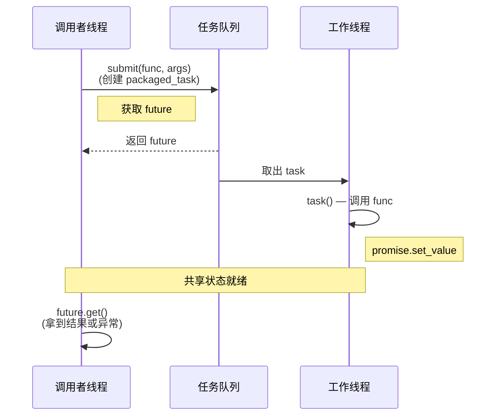

# promise and packaged_task

In the previous article, we used `std::async` to launch asynchronous tasks and retrieved results via `std::future`. The process is certainly convenient, but after experimenting with it, we found a limitation that feels rather uncomfortable: `std::async` tightly couples "launching a task" with "getting the result." Once you call `std::async`, the task launches, and the returned future is tied to that task. You cannot create a future first and set a value into it later; nor can you wrap an existing function object into an asynchronous task, push it into a queue, and execute it later. Once you want to decouple "task submission" from "task execution" (such as in a thread pool), `std::async` is no longer sufficient.

In this article, we will meet the "other end" of `std::future`—`std::promise` and `std::packaged_task`. They allow you to manually control when values are set and when tasks are executed, serving as the infrastructure for building more flexible asynchronous pipelines (like the task submission interface of a thread pool). We will also encounter `std::shared_future`, which solves the pain point of `std::future` being "read-only-once."

## std::promise\<T\>: Manually setting a future's value

Let's start with `std::promise`. You can think of it as the write end of `std::future`. A promise and a future are connected through a shared state: you set the value through the promise, and you read the value through the future. Their lifecycle relationship is as follows: the promise first calls `get_future()` to obtain the associated future, then passes the future to the consumer thread while staying in the producer thread to set the value.

Let's not overcomplicate things just yet. We'll use the simplest example to establish the relationship between a promise and a future. The following code compiles and runs on any standard-compliant compiler supporting C++11 and later:

```cpp
#include <future>
#include <iostream>
#include <thread>

void worker(std::promise<int> prom)
{
    // 模拟一些工作
    std::this_thread::sleep_for(std::chrono::seconds(1));

    // 通过 promise 设置结果值
    prom.set_value(42);
}

int main()
{
    // 创建 promise-future 对
    std::promise<int> prom;
    std::future<int> fut = prom.get_future();

    // 把 promise 移动给 worker 线程
    std::thread t(worker, std::move(prom));

    // 在主线程通过 future 等待结果
    int result = fut.get();
    std::cout << "从 worker 收到: " << result << "\n";

    t.join();
    return 0;
}
```

The core flow of this code is: the main thread creates a `std::promise<int>`, calls `get_future()` to get the associated `std::future<int>`, and then transfers the `std::future<int>` to the worker thread via `std::move` (because `std::future` is also a move-only type). After the worker thread finishes its work, it calls `set_value()`, and the main thread's `std::future<int>` can then retrieve this value. You will notice that throughout this entire process, we didn't use `std::async` at all—promise lets us manually control "when to set the value."

There is an important design choice here: why is the promise passed to the worker thread by move rather than by reference? Because the promise represents the "power to set a value"—this power is exclusive and should not be shared. By moving the promise, you explicitly transfer the power to set the value to the worker thread, leaving only the read-only future in the main thread's hands. This is a very clear expression of ownership.

### set_value(), set_exception(), and get_future()

Having understood the basic usage, we now need to clearly examine the three core operations of a promise together. First is `get_future()`, which returns a `std::future` associated with this promise—this operation can only be called once; a second call will throw `std::future_error`, and the returned future shares the same underlying shared state with the promise. Next is `set_value()`, which is used to set the value of the shared state; once the value is set, all threads waiting on futures associated with this shared state will be woken up. If the promise's template parameter is `void`, then `set_value()` takes no arguments and simply signifies "computation is complete." Just like `get_future()`, `set_value()` can also only be called once—attempting to set a second value will throw `std::future_error`. Finally, there is `set_exception()`, which is used to set an exception into the shared state; when the consumer calls `get()`, this exception will be rethrown. It is typically used in conjunction with `std::current_exception()`—catching the current exception in a catch block and storing it into the promise.

Let's look at a complete example that demonstrates both normal value passing and exception passing, connecting the three operations above:

```cpp
#include <future>
#include <iostream>
#include <thread>
#include <stdexcept>

void compute(std::promise<int> prom, int x)
{
    try {
        if (x < 0) {
            throw std::invalid_argument("输入不能为负数");
        }
        prom.set_value(x * x);
    } catch (...) {
        // 捕获异常并存入 promise
        prom.set_exception(std::current_exception());
    }
}

int main()
{
    // 正常路径
    {
        std::promise<int> prom;
        std::future<int> fut = prom.get_future();
        std::thread t(compute, std::move(prom), 5);

        try {
            std::cout << "5 的平方: " << fut.get() << "\n";
        } catch (const std::exception& e) {
            std::cout << "异常: " << e.what() << "\n";
        }
        t.join();
    }

    // 异常路径
    {
        std::promise<int> prom;
        std::future<int> fut = prom.get_future();
        std::thread t(compute, std::move(prom), -3);

        try {
            std::cout << "-3 的平方: " << fut.get() << "\n";
        } catch (const std::invalid_argument& e) {
            std::cout << "捕获到异常: " << e.what() << "\n";
        }
        t.join();
    }
    return 0;
}
```

Before rushing ahead, let's break down the exception propagation chain in this code clearly. `std::current_exception()` is a function used in a catch block that returns a `std::exception_ptr` pointing to the exception currently being handled. `set_exception()` accepts exactly this `std::exception_ptr` and stores the exception into the shared state. When the consumer calls `get()`, the stored exception is rethrown, and you can handle it with a corresponding catch block on the consumer side.

This exception propagation pattern is extremely useful in cross-thread communication—you don't need to design an error code system, nor do you need to serialize exception information into strings. The exception object crosses the thread boundary intact, with its type information perfectly preserved. Honestly, the first time we realized exceptions could be propagated across threads, we were quite surprised. After all, thread stacks are independent, but the standard library cleverly solves this problem through `std::exception_ptr`.

### The value channel of promise

Now let's look back at the core abstraction of promise/future. The value channel of a promise is the essence of the entire model: the promise is the write end, the future is the read end, and the shared state is the pipe between them. This abstraction allows us to pass values between different threads without needing shared variables or locks—synchronization is entirely guaranteed by the internal mechanisms of the shared state.

The value channel has a very important characteristic called the "synchronization point": when the producer calls `set_value()`, the value is written to the shared state and all waiting consumers are woken up; when the consumer calls `get()`, if the value is not yet ready, it blocks and waits. You will find that the semantics of this synchronization point are much clearer than those of a condition variable—no predicates are needed, no spurious wakeup defenses are needed, and no manual locking is required. For simple "one-shot value passing" scenarios, promise/future is much easier to use than `condition_variable`.

But don't rush to use promise for everything—it has an unignorable limitation: it is one-shot. `set_value()` can only be called once, and after that, the promise is essentially useless. This is symmetrical with the one-shot consumption semantics of `std::future`—one end writes only once, and the other end reads only once. If you need a channel that can be repeatedly written to and read from, you should use `std::atomic` or a message queue, not promise/future.

## std::packaged_task\<F\>: Wrapping callable objects

Great, now we know that a promise can manually set a future's value. But having to write try-catch and manually call `set_value()` or `set_exception()` every time is quite tedious. The C++ standard library provides a higher-level wrapper—`std::packaged_task`, which wraps a callable object (function, lambda, function object, etc.) and automatically associates a promise/future pair with it. When you invoke this packaged_task, it internally calls the wrapped callable object and automatically pushes the return value into the promise (or pushes the exception in if one is thrown).

The value of packaged_task lies in "decoupling task definition from task execution"—you can create a packaged_task in one thread, push it into a queue, and then pull it out and execute it in another thread. This is the foundational model of a thread pool, and it is exactly what we aim to build in this volume.

```cpp
#include <future>
#include <iostream>
#include <thread>
#include <queue>
#include <mutex>
#include <functional>
#include <memory>

int add(int a, int b)
{
    return a + b;
}

int main()
{
    // 创建 packaged_task，封装一个可调用对象
    std::packaged_task<int(int, int)> task(add);

    // 获取关联的 future
    std::future<int> fut = task.get_future();

    // 在另一个线程上执行 task
    std::thread t(std::move(task), 10, 20);

    // 在主线程获取结果
    int result = fut.get();
    std::cout << "10 + 20 = " << result << "\n";

    t.join();
    return 0;
}
```

Let's break down this code. The template parameter of packaged_task is a function signature, for example, `int(int, int)` means "accepts two int parameters and returns an int." The signature of the wrapped callable object must be compatible with this template parameter. When you call `get_future()`, you get the future associated with the internal promise. When you call `operator()`—note that it's not `get()` or `wait()`, just the direct function call operator—the internal promise is automatically set.

Additionally, note that packaged_task is also a move-only type—you cannot copy it, only move it. This design is reasonable: if two packaged_tasks shared the same callable object and shared state, calling it twice would lead to the promise being set twice (the second time throwing an exception), which is obviously not the desired behavior.

### Exception propagation in packaged_task

The next question is: what happens if the wrapped function throws an exception? The good news is that packaged_task handles this automatically for you—no need to manually try-catch and then call set_exception. When the wrapped function throws an exception, packaged_task catches it internally and stores it in the shared state, and the consumer can retrieve this exception via `get()`.

```cpp
#include <future>
#include <iostream>
#include <stdexcept>

int risky_func(int x)
{
    if (x == 0) {
        throw std::runtime_error("除零错误");
    }
    return 100 / x;
}

int main()
{
    std::packaged_task<int(int)> task(risky_func);
    std::future<int> fut = task.get_future();

    // 在当前线程调用 task（也可以在另一个线程）
    task(0);  // 传入 0，触发异常

    try {
        int result = fut.get();  // 重新抛出异常
        std::cout << "结果: " << result << "\n";
    } catch (const std::runtime_error& e) {
        std::cout << "捕获到异常: " << e.what() << "\n";
    }
    return 0;
}
```

Note that the call to `operator()` here does not throw an exception—the exception is silently captured internally by packaged_task. What actually throws is `get()`. This design allows task invocation and error handling to take place in different threads, which is very flexible—worker threads only focus on execution, while the main thread only handles results and exceptions, each doing its own job.

### Building a simple task queue with packaged_task

The most typical application scenario for packaged_task is as the task type for a thread pool. In this section, we will first build the most rudimentary version—a task queue with only one worker thread. It may be small, but it has all the vital organs, clearly demonstrating how promise, packaged_task, and future work together.

```cpp
#include <future>
#include <iostream>
#include <thread>
#include <queue>
#include <mutex>
#include <condition_variable>
#include <functional>

class SimpleTaskQueue
{
public:
    using TaskType = std::function<void()>;

    SimpleTaskQueue()
    {
        worker_ = std::thread([this]() { worker_loop(); });
    }

    ~SimpleTaskQueue()
    {
        {
            std::lock_guard<std::mutex> lock(mutex_);
            done_ = true;
        }
        cv_.notify_one();
        worker_.join();
    }

    // 提交一个 packaged_task，返回对应的 future
    template <typename F, typename... Args>
    auto submit(F&& f, Args&&... args)
        -> std::future<std::invoke_result_t<F, Args...>>
    {
        using ReturnType = std::invoke_result_t<F, Args...>;

        auto task = std::make_shared<std::packaged_task<ReturnType()>>(
            std::bind(std::forward<F>(f), std::forward<Args>(args)...));

        std::future<ReturnType> fut = task->get_future();

        {
            std::lock_guard<std::mutex> lock(mutex_);
            queue_.push([task]() { (*task)(); });
        }
        cv_.notify_one();

        return fut;
    }

private:
    void worker_loop()
    {
        while (true) {
            TaskType task;
            {
                std::unique_lock<std::mutex> lock(mutex_);
                cv_.wait(lock, [this]() { return done_ || !queue_.empty(); });
                if (done_ && queue_.empty()) {
                    return;
                }
                task = std::move(queue_.front());
                queue_.pop();
            }
            task();
        }
    }

    std::thread worker_;
    std::queue<TaskType> queue_;
    std::mutex mutex_;
    std::condition_variable cv_;
    bool done_{false};
};
```

Although this `TaskQueue` is rudimentary, it already demonstrates how promise, packaged_task, and future collaborate in a task queue. Let's break down the flow of `submit()`: it wraps the callable object passed in by the user into a `std::packaged_task`, wraps it with `std::move` and pushes it into the queue, and returns the corresponding future to the caller. The worker thread pulls the task from the queue and executes it. The execution result is automatically set into the shared state through the promise inside `std::packaged_task`, and the future in the caller's hand can `get()` the result. The entire chain connected looks like this: caller submits task -> packaged_task enters queue -> worker thread pulls and executes -> promise automatically calls set_value -> caller gets the result via future.

The usage is as follows:

```cpp
int heavy_compute(int x)
{
    std::this_thread::sleep_for(std::chrono::seconds(1));
    return x * x;
}

int main()
{
    SimpleTaskQueue queue;

    auto f1 = queue.submit(heavy_compute, 5);
    auto f2 = queue.submit(heavy_compute, 10);
    auto f3 = queue.submit([]() {
        return std::string("hello from task queue");
    });

    std::cout << "f1: " << f1.get() << "\n";  // 25
    std::cout << "f2: " << f2.get() << "\n";  // 100
    std::cout << "f3: " << f3.get() << "\n";  // hello from task queue
    return 0;
}
```

The return type of `submit()` is automatically adapted through trailing return type deduction—no matter what callable object you pass in, it can correctly deduce the return type and return the corresponding `std::future`. `std::invoke_result_t` is a type trait provided in C++17, used to deduce the return type of `std::invoke`. If your compiler only supports C++11/14, you can use `std::result_of_t` instead (`std::result_of` was deprecated in C++17 and removed in C++20, so we recommend using `std::invoke_result_t` directly).

## std::shared_future\<T\>: Shareable future values

Earlier, we repeatedly emphasized the one-shot consumption semantics of `std::future`—`get()` can only be called once, after which the future becomes invalid. In most scenarios, this is fine, but sometimes you need multiple threads to wait for the same result. For example, after an initialization task completes, multiple worker threads all need to obtain the initialization result before they can start working—at this point, a single `std::future` is not enough, because after the first thread calls `get()`, the future becomes invalid. `std::shared_future` is designed for exactly this "one-to-many" scenario.

The key difference between `std::shared_future` and `std::future` is that `std::shared_future`'s `get()` returns a `const T&` reference (for object types) rather than an rvalue reference, so it can be called repeatedly without consuming the shared state. At the same time, `std::shared_future` is copyable—each waiting thread can hold its own copy, and all copies share the same underlying state.

The way to obtain a `std::shared_future` is by calling the `share()` method on a `std::future` to convert it. At this point, the original `std::future` becomes invalid (its `valid()` becomes `false`), and the state is transferred to the `std::shared_future`.

```cpp
#include <future>
#include <iostream>
#include <thread>
#include <vector>

int main()
{
    std::promise<int> prom;
    std::shared_future<int> sf = prom.get_future().share();

    // prom.get_future() 返回 std::future<int>
    // .share() 将 future 转换为 shared_future<int>，原 future 失效

    auto worker = [sf](int id) {
        // 每个线程通过自己的 shared_future 副本获取结果
        int value = sf.get();  // 可以反复调用
        std::cout << "worker " << id << " 收到: " << value << "\n";
    };

    std::vector<std::thread> threads;
    for (int i = 0; i < 4; ++i) {
        threads.emplace_back(worker, i);
    }

    // 主线程设置值（模拟初始化完成）
    std::this_thread::sleep_for(std::chrono::seconds(1));
    prom.set_value(42);

    for (auto& t : threads) {
        t.join();
    }
    return 0;
}
```

A few key points in this code are worth explaining. The lambda captures `sf`—since `std::shared_future` is copyable, the lambda will hold a copy. The four threads each have their own `std::shared_future` copy, but they all point to the same shared state. When `set_value()` is called, all futures waiting on this shared state will be woken up.

There is a thread-safety detail worth mentioning here: `std::shared_future`'s member functions like `get()`, `wait()`, and others are guaranteed thread-safe by the standard—multiple threads can concurrently call `get()` on the same `std::shared_future` object without causing data races. This is also an important distinction between `std::future` and `std::shared_future`: `std::future`'s `get()` can only be called once, while `std::shared_future`'s `get()` not only supports repeated calls but also supports concurrent calls. However, the recommended practice is still to have each thread hold its own `std::shared_future` copy, as this makes the code's intent clearer and avoids concerns about contention on the same object.

### Broadcast pattern for multiple waiters

The most typical usage of `std::shared_future` is "one-shot broadcast"—one producer sets a value, and multiple consumers are woken up simultaneously. If you are familiar with `condition_variable`, you will find that shared_future's semantics are much simpler: no predicate is needed, no lock is needed, and there is no need to worry about spurious wakeups. There is, of course, a cost—it can only be used once, and set_value can only be called once.

```cpp
#include <future>
#include <iostream>
#include <thread>
#include <vector>
#include <chrono>

int main()
{
    // 模拟一个全局配置加载
    std::promise<std::string> config_prom;
    std::shared_future<std::string> config_fut = config_prom.get_future().share();

    auto worker = [config_fut](int id) {
        // 等待配置加载完成
        std::string config = config_fut.get();
        std::cout << "[worker " << id << "] 收到配置: "
                  << config << "，开始工作\n";
    };

    std::vector<std::thread> threads;
    for (int i = 0; i < 5; ++i) {
        threads.emplace_back(worker, i);
    }

    // 模拟配置加载
    std::cout << "正在加载配置...\n";
    std::this_thread::sleep_for(std::chrono::seconds(2));
    config_prom.set_value("mode=production, threads=8, cache=512MB");

    std::cout << "配置已广播\n";

    for (auto& t : threads) {
        t.join();
    }
    return 0;
}
```

This pattern is very practical in scenarios like system initialization and global state change notifications. The producer only needs one `set_value()`, and all consumers automatically receive the notification.

## Pattern: Task submission -> promise -> queue -> worker -> set_value

At this point, we have gone through the individual usages of promise, packaged_task, and future. Now it's time to put them together and see how they collaborate in a thread pool scenario. This is a very classic design pattern, and almost all C++ thread pools use this structure at their core.

The entire flow looks like this: the caller submits a task (a callable object + arguments), the thread pool wraps it into a `std::packaged_task`, obtains a `std::future` from the `std::packaged_task`, returns the future to the caller, and pushes the `std::packaged_task` (wrapped in a `std::function`) into the task queue. The worker thread pulls the task from the queue and executes it—upon execution, the `std::promise` inside the `std::packaged_task` is automatically set (via `set_value()` or `set_exception()`), and the `std::future` in the caller's hand becomes ready. Throughout this process, the caller doesn't need to know which thread the task is executing on, and the worker thread doesn't need to know where the task came from.

Let's use a pseudocode diagram to represent this flow:



The core advantage of this pattern lies in **decoupling**: the caller doesn't need to know which thread the task executes on or when it executes; the worker thread doesn't need to know the source of the task or where the return value goes. The two communicate through a shared state (jointly held by the promise inside the packaged_task and the future returned to the caller), and all synchronization details are encapsulated within the implementation of `std::promise`/`std::future`.

This is also why we said in the previous article that "thread pools are suitable for a large number of short tasks"—through the encapsulation of `std::packaged_task`, the result passing and exception handling for each task are automatic. The caller only needs the two steps of `submit()` + `get()`.

## Exercises: Value passing chains using promise/packaged_task

### Exercise 1: Promise chain passing

Create a processing chain consisting of three threads: Thread A generates a random number and passes it to Thread B via promise/future; Thread B multiplies this number by two and passes it to Thread C via promise/future; Thread C prints the result. Each thread runs independently, and values are passed between threads via promise/future.

```cpp
#include <future>
#include <iostream>
#include <thread>
#include <random>

void stage_a(std::promise<int> out)
{
    std::mt19937 rng(12345);
    std::uniform_int_distribution<int> dist(1, 100);
    int value = dist(rng);
    std::cout << "[A] 产生: " << value << "\n";
    out.set_value(value);
}

void stage_b(std::future<int> in, std::promise<int> out)
{
    int value = in.get();  // 等待 A 的结果
    int doubled = value * 2;
    std::cout << "[B] 翻倍: " << doubled << "\n";
    out.set_value(doubled);
}

void stage_c(std::future<int> in)
{
    int value = in.get();  // 等待 B 的结果
    std::cout << "[C] 最终结果: " << value << "\n";
}

int main()
{
    // A -> B 的通道
    std::promise<int> prom_ab;
    std::future<int> fut_ab = prom_ab.get_future();

    // B -> C 的通道
    std::promise<int> prom_bc;
    std::future<int> fut_bc = prom_bc.get_future();

    std::thread ta(stage_a, std::move(prom_ab));
    std::thread tb(stage_b, std::move(fut_ab), std::move(prom_bc));
    std::thread tc(stage_c, std::move(fut_bc));

    ta.join();
    tb.join();
    tc.join();
    return 0;
}
```

Note that `stage_b` simultaneously accepts a `std::future<int>` (as input) and a `std::promise<int>` (as output), acting as an intermediate node in the processing chain. `std::move` ensures that the exclusive ownership of promises and futures is correctly transferred between threads.

### Exercise 2: Implementing timeout waiting with packaged_task

Create a `std::packaged_task` wrapping a potentially time-consuming computation. Use `wait_for()` to set a timeout: if the task completes before the timeout, print the result; if it times out, print "computation timed out" and give up waiting.

```cpp
#include <future>
#include <iostream>
#include <chrono>

int slow_computation()
{
    // 模拟一个耗时 3 秒的计算
    std::this_thread::sleep_for(std::chrono::seconds(3));
    return 42;
}

int main()
{
    std::packaged_task<int()> task(slow_computation);
    std::future<int> fut = task.get_future();

    // 在独立线程执行
    std::thread t(std::move(task));

    // 设定 2 秒超时
    auto status = fut.wait_for(std::chrono::seconds(2));

    if (status == std::future_status::ready) {
        std::cout << "结果: " << fut.get() << "\n";
    } else if (status == std::future_status::timeout) {
        std::cout << "计算超时，放弃等待\n";
        // 注意：工作线程仍在运行，我们需要等待它结束
    } else {
        std::cout << "任务被延迟\n";
    }

    t.join();  // 确保线程正常结束
    return 0;
}
```

Note that the timeout here only prevents the main thread from waiting indefinitely, but the worker thread itself is not canceled—the C++ standard currently does not provide a thread cancellation mechanism. If the task never ends, `operator()` will keep blocking. In the next article, when we discuss jthread and stop tokens, we will see how to gracefully terminate long-running tasks through cooperative cancellation.

### Exercise 3: shared_future broadcast

Use `std::shared_future` to implement a "starting gun": the main thread sets a shared_future, and multiple worker threads wait for this future to become ready before starting work simultaneously. Observe whether their start times are close together (indicating they were woken up simultaneously, rather than serially).

## Summary

In this article, we met three companions of `std::future`: `std::promise`, `std::packaged_task`, and `std::shared_future`.

`std::promise` is the write end of `std::future`, setting normal results via `set_value()` and exception results via `set_exception()`. Promise and future communicate through a shared state, providing simpler synchronization semantics than condition variables—no locks, no predicates, and no spurious wakeup defenses are needed. The cost is that it is one-shot; you can only set a value once, but for single-shot result passing, this is actually a safe design.

`std::packaged_task` is a higher-level wrapper—it bundles a callable object with a promise, automatically pushing the result (or exception) into the promise when invoked. Its greatest value is decoupling task definition from task execution, which is the foundational model of thread pool task queues: the caller submits a packaged_task, the worker thread pulls and executes it, and the future passes the result across both.

`std::shared_future` solves the "read-only-once" limitation of `std::future`—it allows the same result to be read by multiple consumers, and its `get()` can be called repeatedly and is thread-safe. The typical usage is "one-shot broadcast": one producer calls set_value, and all waiting consumers are woken up simultaneously.

These four components (future, promise, packaged_task, and shared_future) form the asynchronous value-passing infrastructure of the C++ standard library. Once you master them, you will have a solid foundation for building thread pools later. In the next article, we will continue discussing jthread and stop tokens, looking at what improvements C++20 brought to thread lifecycle management—in particular, a cooperative cancellation mechanism that we feel "should have existed a long time ago."

> 💡 The complete example code is available in [Tutorial_AwesomeModernCPP](https://github.com/Awesome-Embedded-Learning-Studio/Tutorial_AwesomeModernCPP), visit `code/volumn_codes/vol5/ch05-future-task-threadpool/`.

## References

- [std::promise — cppreference](https://en.cppreference.com/w/cpp/thread/promise)
- [std::packaged_task — cppreference](https://en.cppreference.com/w/cpp/thread/packaged_task)
- [std::shared_future — cppreference](https://en.cppreference.com/w/cpp/thread/shared_future)
- [C++11 Concurrency Tutorial - Futures — Baptiste Wicht](https://baptiste-wicht.com/posts/2017/09/cpp11-concurrency-tutorial-futures.html)
- [Daily bit(e) of C++: std::promise, std::future — Simon Toth](https://medium.com/@simontoth/daily-bit-e-of-c-std-promise-std-future-4af3b6dd23ac)
- [What is std::promise? — isocpp.org](https://isocpp.org/blog/2013/07/what-is-stdpromise-stackoverflow)
