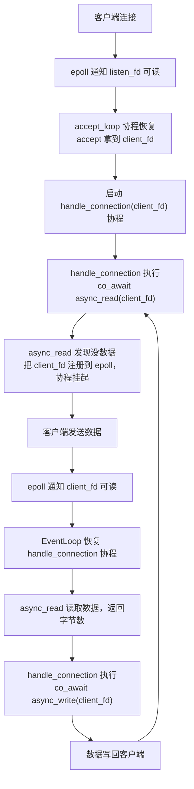

# Hands-On: Coroutine Echo Server

After four theoretical chapters—covering the evolution of the asynchronous programming paradigm, C++20 coroutine basics, the customization mechanisms of `promise_type` and awaitable, and connecting coroutines to the epoll event loop in the previous chapter—we have finally arrived at the hands-on stage. To be honest, every previous chapter was building up to this moment: we are going to use our custom coroutine framework to write a real, runnable network program—a TCP Echo Server.

The Echo Server is the "Hello World" of network programming: whatever the client sends, the server echoes back exactly as received. It is simple enough to have virtually no business logic, yet complete enough to cover all core aspects of network programming—creating a listening socket, accepting connections, reading data, writing data back, and handling connection closures and errors. Once you can elegantly string these steps together with coroutines, you have truly grasped the essence of the "coroutine-based asynchronous I/O" paradigm.

## Environment Setup

This chapter is a complete network programming hands-on exercise, so the environment requirements are more specific than in previous chapters. For the operating system, you must use Linux (WSL2 is also fine, kernel 5.x+), because epoll is a Linux-specific API—macOS users can use kqueue for similar functionality, but the code will need modifications. For the compiler, we need GCC 11+ or Clang 15+; these versions enable coroutine support with just `-std=c++20` (GCC 10 requires the `-fcoroutines` flag, but GCC 11 and later do not). For compiler flags, `-std=c++20 -O2` is sufficient, and we recommend adding `-Wall -Wextra` to enable warnings. For testing tools, manual testing can be done with `nc` (netcat) or `telnet`, while performance testing requires `wrk` or `ab` (ApacheBench).

Installing dependencies on Ubuntu/Debian is straightforward:

```bash
sudo apt install netcat-openbsd wrk apache2-utils
```

## Overall Architecture: Draw the Blueprint Before Coding

Before we start coding, let's clarify what components make up our Echo Server and how they interact. Blindly writing code will only make you repeatedly question your life choices when debugging.

Our Echo Server consists of three core components:

**EventLoop** (event loop) is the heart of the entire system. It wraps epoll and is responsible for "notifying whoever's data is ready." We built a minimal version in the previous chapter, and we will make some improvements here—adding coroutine lifecycle management, and supporting dynamic registration and removal of fds. The EventLoop runs an infinite loop in a single thread: it calls `epoll_wait` to get the ready fds, recovers the corresponding coroutine handle from `epoll_event.data.ptr`, and then `resume()` it.

**Asynchronous I/O awaiters** (`async_accept`, `async_read`, `async_write`) are the bridge between the coroutines and the EventLoop. Each awaiter wraps a specific I/O operation—when the operation cannot complete immediately (returning `EAGAIN`), the awaiter registers the current coroutine with epoll and suspends it; when the data is ready, the EventLoop resumes the coroutine, which retries the I/O operation.

The **handle_connection coroutine** is an independent coroutine corresponding to each client connection. It runs an infinite loop doing `co_await async_read` → `co_await async_write` until the client disconnects. This "one coroutine per connection" pattern makes the code look almost identical to synchronous blocking programming, but underneath it is an efficient, single-threaded, event-driven model.

The data flow looks roughly like this:



The entire process completes within a single thread, but handles multiple clients concurrently—because each client has its own coroutine, and coroutines yield execution when waiting for I/O without blocking anyone.

## Step 1: EventLoop—A Complete Version of the Event Loop

Our EventLoop in the previous chapter was a minimal prototype; this time we need a more robust version. The core improvements are: we need to register the fd when a coroutine suspends, remove the fd after the coroutine resumes (because in LT mode, failing to remove it will cause repeated triggers), and manage coroutines that have finished executing.

```cpp
#include <coroutine>
#include <cstdio>
#include <cstdlib>
#include <cstring>
#include <unistd.h>
#include <fcntl.h>
#include <csignal>
#include <sys/epoll.h>
#include <sys/socket.h>
#include <netinet/in.h>
#include <cerrno>
#include <unordered_set>
```

Let's look at the EventLoop class definition first. Compared to the previous version, we added a set of active coroutines to manage their lifecycles:

```cpp
/// 事件循环——封装 epoll，管理协程的挂起与恢复
class EventLoop {
public:
    EventLoop()
        : epoll_fd_(epoll_create1(EPOLL_CLOEXEC))
    {
        if (epoll_fd_ < 0) {
            perror("epoll_create1");
            std::abort();
        }
    }

    ~EventLoop() { close(epoll_fd_); }

    // 不允许拷贝和移动
    EventLoop(const EventLoop&) = delete;
    EventLoop& operator=(const EventLoop&) = delete;

    /// 注册 fd 到 epoll，关联一个协程 handle
    void add_event(int fd, uint32_t events, std::coroutine_handle<> handle)
    {
        struct epoll_event ev;
        ev.events = events;
        ev.data.ptr = handle.address(); // 核心技巧：把 handle 存进 epoll

        if (epoll_ctl(epoll_fd_, EPOLL_CTL_ADD, fd, &ev) < 0) {
            // fd 可能已经被注册过了，用 MOD 重试
            if (errno == EEXIST) {
                epoll_ctl(epoll_fd_, EPOLL_CTL_MOD, fd, &ev);
            } else {
                perror("epoll_ctl ADD");
            }
        }
    }

    /// 从 epoll 移除 fd
    void remove_event(int fd)
    {
        epoll_ctl(epoll_fd_, EPOLL_CTL_DEL, fd, nullptr);
    }

    /// 注册一个活跃协程（防止协程帧被提前销毁）
    void track_coroutine(std::coroutine_handle<> handle)
    {
        active_coroutines_.insert(handle);
    }

    /// 移除一个已结束的协程
    void untrack_coroutine(std::coroutine_handle<> handle)
    {
        active_coroutines_.erase(handle);
    }

    /// 运行事件循环
    void run();

    /// 停止事件循环
    void stop() { running_ = false; }

private:
    int epoll_fd_;
    bool running_ = true;
    std::unordered_set<std::coroutine_handle<>> active_coroutines_;
};
```

Here is a key design choice: the `active_coroutines_` set. Its purpose is to solve a problem we mentioned at the end of the previous chapter—the coroutine's return value object might be destroyed prematurely, causing the coroutine frame to be freed. We use this set to hold all active coroutine handles, ensuring they are not destroyed during execution. When a coroutine finishes, it removes itself from the set and calls `destroy()` to clean up the coroutine frame. However, in the final implementation of this article, we chose the cleaner `DetachedTask` approach—where the coroutine frame is automatically cleaned up when the coroutine ends—so `active_coroutines_` and its related methods are not called in the actual code. If you need more fine-grained lifecycle management (such as needing to wait for a coroutine to finish externally, cancel a coroutine, etc.), the `track_coroutine`/`untrack_coroutine` mechanism comes into play.

> ⚠️ **`std::unordered_set<std::coroutine_handle<>>` requires a `std::hash<coroutine_handle>` specialization, which was only added to the standard library in C++23.** GCC 14+'s libstdc++ provides this specialization as an extension in C++20 mode, but on some older compilers you might need to switch to `std::set<std::coroutine_handle<>>` (sorted based on `operator<=>`, no hash needed) or provide a custom hasher.

Next is the EventLoop's `run()` method:

```cpp
void EventLoop::run()
{
    constexpr int kMaxEvents = 64;
    struct epoll_event events[kMaxEvents];

    while (running_) {
        int n = epoll_wait(epoll_fd_, events, kMaxEvents, 1000);
        if (n < 0) {
            if (errno == EINTR) {
                continue; // 被信号中断，重试
            }
            perror("epoll_wait");
            break;
        }

        for (int i = 0; i < n; ++i) {
            auto handle = std::coroutine_handle<>::from_address(
                events[i].data.ptr
            );
            if (handle && !handle.done()) {
                handle.resume();
            }
        }
    }
}
```

You'll notice that the logic of `run()` is very straightforward: `epoll_wait` gets the ready events, recovers the coroutine handle from `data.ptr`, and `resume()` it. The timeout is set to 1 second to give the loop a chance to check the `running_` flag (used for graceful shutdown). Handling `EINTR` is necessary—for example, when you press Ctrl+C to send SIGINT, `epoll_wait` is interrupted and returns `-1`, setting `errno` to `EINTR`. In this case, we should not exit the loop.

## Step 2: Task Types—Coroutine Wrappers with Automatic Cleanup

In the previous chapter, we defined a minimal `IoTask`, but it had a serious problem: the coroutine frame is not automatically destroyed when the coroutine finishes; someone must manually call `destroy()`. In production code, this is a root cause of memory leaks. This time we design a more complete `Task` type that leverages the EventLoop's tracking mechanism to ensure coroutine frames are always properly cleaned up.

```cpp
/// 协程任务类型——与 EventLoop 配合，自动管理生命周期
struct Task {
    struct promise_type {
        Task get_return_object()
        {
            return Task{
                std::coroutine_handle<promise_type>::from_promise(*this)
            };
        }

        // 惰性启动：协程创建时不执行，等外部 resume
        std::suspend_always initial_suspend() { return {}; }

        // 协程结束时挂起，由 EventLoop 负责清理
        std::suspend_always final_suspend() noexcept { return {}; }

        void return_void() {}
        void unhandled_exception() { std::terminate(); }
    };

    std::coroutine_handle<promise_type> handle;
};

/// Fire-and-forget 任务类型——协程结束后自动销毁
struct DetachedTask {
    struct promise_type {
        DetachedTask get_return_object()
        {
            return DetachedTask{
                std::coroutine_handle<promise_type>::from_promise(*this)
            };
        }

        // 创建时立即开始执行
        std::suspend_never initial_suspend() { return {}; }

        // 结束时自动销毁协程帧
        std::suspend_never final_suspend() noexcept { return {}; }

        void return_void() {}
        void unhandled_exception() { std::terminate(); }
    };

    std::coroutine_handle<promise_type> handle;
};
```

We defined two task types. `Task` is "lazy"—it does not execute when created, requires external `resume()`, and suspends at the end waiting for cleanup. It is suitable for scenarios requiring precise control over execution timing, such as the accept loop.

`DetachedTask` is "fire-and-forget"—it executes immediately upon creation, and the coroutine frame is automatically destroyed when it finishes (because `final_suspend` returns `suspend_never`). It is suitable for "launch it and forget it" scenarios, such as handling client connections. For each client connection, we create a `DetachedTask`; once the connection handling is complete, the coroutine cleans up automatically without external management.

> ⚠️ **`DetachedTask`'s `final_suspend` returning `suspend_never` means the coroutine frame will be destroyed immediately when the coroutine ends. This is convenient but also risky: if the coroutine internally holds a reference to a destroyed object (like a dangling pointer), accessing this reference before `final_suspend` is UB. Therefore, in DetachedTask, you must ensure all captured resources are valid—use value captures or `shared_ptr`, and avoid raw pointers referencing stack variables.**

## Step 3: Utility Functions—Creating a Non-Blocking Listening Socket

This part is standard Linux network programming, largely unrelated to coroutines themselves, but rewriting it every time is tedious. Let's wrap it up first:

```cpp
/// 设置 fd 为非阻塞模式
/// 注意：本篇代码中 listen_fd 和 client_fd 都通过 SOCK_NONBLOCK 标志直接创建为非阻塞模式，
/// 所以这个函数实际上没有被调用。保留它是因为在实际项目中你经常需要把一个已有的 fd
/// （比如从 dup2 或 socketpair 得到的 fd）手动设置为非阻塞
void set_nonblocking(int fd)
{
    int flags = fcntl(fd, F_GETFL, 0);
    fcntl(fd, F_SETFL, flags | O_NONBLOCK);
}

/// 创建监听 socket，绑定到指定端口
int create_listen_socket(uint16_t port)
{
    int listen_fd = ::socket(AF_INET, SOCK_STREAM | SOCK_NONBLOCK | SOCK_CLOEXEC, 0);
    if (listen_fd < 0) {
        perror("socket");
        return -1;
    }

    // SO_REUSEADDR：允许端口在 TIME_WAIT 状态下被复用
    // 不加这个的话，重启服务器时可能遇到 "Address already in use"
    int opt = 1;
    setsockopt(listen_fd, SOL_SOCKET, SO_REUSEADDR, &opt, sizeof(opt));

    struct sockaddr_in addr {};
    addr.sin_family = AF_INET;
    addr.sin_addr.s_addr = INADDR_ANY;
    addr.sin_port = htons(port);

    if (::bind(listen_fd,
               reinterpret_cast<struct sockaddr*>(&addr),
               sizeof(addr)) < 0) {
        perror("bind");
        close(listen_fd);
        return -1;
    }

    if (::listen(listen_fd, SOMAXCONN) < 0) {
        perror("listen");
        close(listen_fd);
        return -1;
    }

    return listen_fd;
}
```

There are two details worth noting here. The first is `SOCK_NONBLOCK | SOCK_CLOEXEC`, which sets the socket to non-blocking mode and sets the close-on-exec flag right in the `socket()` call—this is more atomic than calling `socket()` first and then `fcntl()`, avoiding a race window between `socket()` and `fcntl()` (though it's almost impossible to trigger in this scenario).

The second is `SO_REUSEADDR`. After a TCP connection is closed, it enters the TIME_WAIT state (lasting about 2MSL, usually 60 seconds), during which the port cannot be reused. If you frequently restart the server while debugging, without this option you will often encounter the "Address already in use" error. It is also recommended to add this in production environments; Nginx does this.

## Step 4: async_accept—Coroutine-Based Connection Acceptance

Now we enter the core part. `async_accept` is an awaiter that wraps the accept system call: when there are no new connections, it suspends the coroutine and registers the listen_fd with epoll; when a new connection arrives, it resumes the coroutine and executes accept to get the client_fd.

```cpp
/// 全局事件循环实例
EventLoop g_event_loop;

/// 异步 accept 的 awaiter
struct AsyncAcceptAwaiter {
    int listen_fd_;

    explicit AsyncAcceptAwaiter(int listen_fd)
        : listen_fd_(listen_fd) {}

    bool await_ready() noexcept
    {
        // 先尝试非阻塞 accept——可能已经有等待的连接了
        // 如果 accept 成功，就不需要挂起，省去注册 epoll 的开销
        return false; // 简化版，总是走挂起路径
    }

    void await_suspend(std::coroutine_handle<> handle)
    {
        // 注册到 epoll，监听可读事件（新连接到达 = listen_fd 可读）
        g_event_loop.add_event(listen_fd_, EPOLLIN, handle);
    }

    int await_resume()
    {
        // 协程恢复后，先从 epoll 移除 listen_fd
        // LT 模式下不移除的话，每次 epoll_wait 都会反复通知
        g_event_loop.remove_event(listen_fd_);

        struct sockaddr_in client_addr {};
        socklen_t addr_len = sizeof(client_addr);
        int client_fd = ::accept4(
            listen_fd_,
            reinterpret_cast<struct sockaddr*>(&client_addr),
            &addr_len,
            SOCK_NONBLOCK | SOCK_CLOEXEC
        );

        if (client_fd >= 0) {
            // accept4 带 SOCK_NONBLOCK，不需要再调 fcntl
            std::printf("[server] 新连接 fd=%d\n", client_fd);
        }
        return client_fd;
    }
};

/// 协程化的 accept——对外接口
AsyncAcceptAwaiter async_accept(int listen_fd)
{
    return AsyncAcceptAwaiter(listen_fd);
}
```

There are a few design choices here that need explanation.

For `await_ready()`, we simply and bluntly return `false`—always suspend. A more optimized version could try a non-blocking accept first; if a connection is already in the queue, it returns directly, saving the overhead of registering with epoll. But for code clarity, we use the simple version here.

`await_suspend()` registers the listen_fd with epoll, listening for `EPOLLIN` events—for a listening socket, `EPOLLIN` means "a new connection is waiting to be accepted."

`await_resume()` does two things: first, it removes the listen_fd from epoll, then it calls `accept4` to get the new client_fd. Removing before accepting is because in LT mode, if we call `epoll_wait` without removing the listen_fd, it will continue to notify us that "listen_fd is readable" (because there might be more connections in the queue). We choose to accept only one connection at a time here; if you want to accept multiple at once, that is entirely possible too—but it would require changing await_resume to return a list of connections, making the design significantly more complex.

`accept4` with `SOCK_NONBLOCK | SOCK_CLOEXEC` directly sets the client_fd to non-blocking mode—this is necessary for the subsequent async_read/async_write.

## Step 5: async_read—Coroutine-Based Data Reading

`async_read` is the most core awaiter in the entire Echo Server. It wraps the complete semantics of non-blocking read: if there is data, read it directly; if there is no data (`EAGAIN`), suspend and wait for epoll notification.

```cpp
/// 异步 read 的 awaiter
struct AsyncReadAwaiter {
    int fd_;
    void* buffer_;
    std::size_t size_;
    ssize_t result_;
    bool suspended_ = false; // 是否经过了挂起路径

    AsyncReadAwaiter(int fd, void* buffer, std::size_t size)
        : fd_(fd), buffer_(buffer), size_(size), result_(0) {}

    bool await_ready() noexcept
    {
        // 快速路径：先尝试非阻塞 read
        result_ = ::recv(fd_, buffer_, size_, 0);
        if (result_ >= 0) {
            return true; // 读到了数据，不需要挂起
        }
        if (errno == EAGAIN || errno == EWOULDBLOCK) {
            return false; // 暂时没数据，需要等 epoll 通知
        }
        return true; // 其他错误（如连接重置），不挂起，让 await_resume 处理
    }

    void await_suspend(std::coroutine_handle<> handle)
    {
        // 没数据可读，注册到 epoll 等待 fd 可读
        suspended_ = true;
        g_event_loop.add_event(fd_, EPOLLIN, handle);
    }

    ssize_t await_resume()
    {
        if (suspended_) {
            // 挂起后恢复的路径：epoll 通知 fd 可读，尝试真正读取
            g_event_loop.remove_event(fd_);
            result_ = ::recv(fd_, buffer_, size_, 0);
        }
        // 快速路径（await_ready 返回 true）直接返回 result_
        return result_;
    }
};

/// 协程化的 read——对外接口
AsyncReadAwaiter async_read(int fd, void* buffer, std::size_t size)
{
    return AsyncReadAwaiter(fd, buffer, size);
}
```

The fast path in `await_ready()` is a very important optimization. In many scenarios, data is already in the TCP receive buffer (especially when the client sends multiple messages in a row). In this case, there is no need for the whole process of suspending the coroutine, registering with epoll, waiting for notification, and resuming the coroutine—just `recv` directly. This fast path saves at least one `epoll_ctl` system call and two coroutine context switches.

You might have noticed that we use `recv` instead of `read`. The difference is that `recv` has a `flags` parameter; we currently pass 0, but later we will use the `MSG_NOSIGNAL` flag to avoid the SIGPIPE issue. `read` does not support a flags parameter.

In `await_resume()`, we use a `suspended_` flag to distinguish between two paths. Previous versions used `result_ < 0` to make the judgment, but there is a subtle bug here: if on the fast path `recv` returns a non-`EAGAIN` error (like `ECONNRESET`), `result_` is negative, and `await_resume` would mistakenly think we took the suspend path, thereby calling `remove_event`—but at this point the fd was never registered with epoll at all, and `remove_event` inside `epoll_ctl(DEL)` might modify `errno`, overwriting the real error code. Using a `suspended_` flag allows us to precisely distinguish between "got an error on the fast path, return directly" and "suspended, resumed, and then read."

## Step 6: async_write—Coroutine-Based Data Writing

`async_write` is slightly more complex than `async_read`, because TCP's write might only write part of the data. On a non-blocking socket, `send` might return fewer bytes than you requested—this doesn't mean an error occurred, it just means the send buffer temporarily can't hold more data. So we need to loop sending until all data is written or an unrecoverable error is encountered.

```cpp
/// 异步 write 的 awaiter（需要处理部分写入）
struct AsyncWriteAwaiter {
    int fd_;
    const void* buffer_;
    std::size_t size_;
    std::size_t total_sent_; // 已发送的字节数
    bool has_error_ = false; // 是否遇到了不可恢复的错误

    AsyncWriteAwaiter(int fd, const void* buffer, std::size_t size)
        : fd_(fd), buffer_(buffer), size_(size), total_sent_(0) {}

    bool await_ready() noexcept
    {
        // 尝试发送所有数据
        return try_send_all();
    }

    void await_suspend(std::coroutine_handle<> handle)
    {
        // 发送缓冲区满了，注册 EPOLLOUT 等待 fd 可写
        g_event_loop.add_event(fd_, EPOLLOUT, handle);
    }

    ssize_t await_resume()
    {
        // 协程恢复后，epoll 通知 fd 可写
        // 此时发送缓冲区应该有空间了，继续尝试发送剩余数据
        // 注意：这里不做循环重试——如果又遇到 EAGAIN，说明 epoll 的可写通知
        // 不保证一次就能发完所有数据，但在 LT 模式下下次 epoll_wait 还会通知
        // 为了简化，这里如果还有未发完的数据就返回 -1 让调用者关闭连接
        // 生产级别的实现会在 await_resume 里重新注册 EPOLLOUT 再挂起
        g_event_loop.remove_event(fd_);
        if (!try_send_all() && total_sent_ < size_) {
            // 发了一部分但没发完，仍然有数据待发送
            // Echo Server 场景下数据量不大，这种情况极少发生
            // 但为了正确性，我们标记为错误
            has_error_ = true;
        }
        if (has_error_) {
            return -1;
        }
        return static_cast<ssize_t>(total_sent_);
    }

private:
    /// 尝试发送所有数据，返回 true 表示全部发完或遇到错误
    bool try_send_all()
    {
        while (total_sent_ < size_) {
            const char* data = static_cast<const char*>(buffer_) + total_sent_;
            std::size_t remaining = size_ - total_sent_;

            // MSG_NOSIGNAL：对端关闭连接时不触发 SIGPIPE，而是返回 EPIPE
            ssize_t n = ::send(fd_, data, remaining, MSG_NOSIGNAL);

            if (n > 0) {
                total_sent_ += static_cast<std::size_t>(n);
                continue;
            }

            if (n < 0) {
                if (errno == EAGAIN || errno == EWOULDBLOCK) {
                    return false; // 发送缓冲区满了，需要挂起
                }
                // 其他错误（EPIPE、ECONNRESET 等）
                has_error_ = true;
                return true;
            }

            // n == 0 不应该在 send 上出现，但防御性处理
            has_error_ = true;
            return true;
        }
        return true; // 全部发完
    }
};

/// 协程化的 write——对外接口
AsyncWriteAwaiter async_write(int fd, const void* buffer, std::size_t size)
{
    return AsyncWriteAwaiter(fd, buffer, size);
}
```

The core logic of `async_write` is in `try_send_all()`: loop calling `send` until all data is sent or the send buffer is full (`EAGAIN`). We added a `has_error_` flag to distinguish between "all sent" and "encountered an unrecoverable error"—previously, using `total_sent_` as the return value meant that during a partial write, `total_sent_` would be positive, and the caller couldn't tell whether it "successfully sent this many bytes" or "encountered an error but had already sent some in the meantime." Now, when an error occurs, `await_resume` returns `-1`, and the caller can correctly close the connection. The `MSG_NOSIGNAL` flag is very important—when the peer has already closed the connection, if you write data to this socket, the kernel will by default send a `SIGPIPE` signal to the process. The default behavior of `SIGPIPE` is to terminate the process, which means your Echo Server will crash directly because a client closed the connection. `MSG_NOSIGNAL` tells the kernel "don't send a signal, just return an error," at which point `send` will return `-1` and set `errno` to `EPIPE`.

> ⚠️ **SIGPIPE is one of the most classic "pitfalls" in network programming.** Many beginners' servers crash inexplicably, and after a long investigation, they find out it's because the server was still writing after the client disconnected, triggering SIGPIPE. There are three solutions: use the `MSG_NOSIGNAL` flag (per-call), use `signal(SIGPIPE, SIG_IGN)` to globally ignore it (per-process, recommended), or on macOS/BSD use the `SO_NOSIGPIPE` socket option (per-socket, not available on Linux). We chose `MSG_NOSIGNAL` here because it is the most precise—it only affects this single send call and doesn't alter the entire process's signal behavior. But in certain scenarios (like when using third-party libraries), `signal(SIGPIPE, SIG_IGN)` is more convenient.

## Step 7: handle_connection—One Coroutine Per Connection

With `async_read` and `async_write`, the logic for handling client connections becomes exceptionally concise. The entire `handle_connection` is just an infinite loop: read data, write it back, until the connection closes or an error occurs.

```cpp
/// 处理单个客户端连接的协程
DetachedTask handle_connection(int client_fd)
{
    char buffer[4096];

    while (true) {
        // 异步读取客户端数据
        ssize_t n = co_await async_read(client_fd, buffer, sizeof(buffer));

        if (n <= 0) {
            // n == 0：对端关闭连接（优雅关闭）
            // n < 0：读取错误
            if (n == 0) {
                std::printf("[conn fd=%d] 客户端关闭连接\n", client_fd);
            } else {
                std::printf("[conn fd=%d] 读取错误: %s\n",
                            client_fd, std::strerror(errno));
            }
            close(client_fd);
            co_return;
        }

        // 异步写回——Echo！
        ssize_t written = co_await async_write(client_fd, buffer, n);
        if (written < 0) {
            std::printf("[conn fd=%d] 写入错误\n", client_fd);
            close(client_fd);
            co_return;
        }
    }
}
```

You see, this code looks almost identical to synchronous blocking network programming—a `while` loop, with `read` and then `write` inside. The only difference is that `co_await` replaces the direct calls. But the underlying execution model is completely different: each `co_await` suspends the current coroutine when data isn't ready, letting the event loop handle other coroutines. From a macro perspective, hundreds or thousands of client connection coroutines alternate progress within the same thread; from a micro perspective, each coroutine consumes zero CPU resources while waiting for I/O.

There is a detail worth mentioning: `char buffer[4096]` is a "local variable," but it is not on the physical stack—because `handle_connection` is a coroutine, all its local variables are placed by the compiler into the heap-allocated coroutine frame. This means the buffer remains valid when the coroutine suspends, unlike a normal function's stack variables that would be overwritten after the function returns. This is the fundamental reason why coroutines can safely hold state across suspension points—your local variables are "promoted" to the heap. The trade-off is that creating a connection coroutine requires allocating a block of heap memory (at least 4KB, mainly contributed by the buffer), which is a non-negligible memory overhead in high-concurrency scenarios. Production-level implementations usually optimize this with connection-level memory pools or by reducing the buffer size and pairing it with external buffer management.

This is the beauty of coroutines—you write code with a synchronous mindset and get asynchronous execution efficiency.

Using `DetachedTask` as the return type means this coroutine is "fire-and-forget." After `accept_loop` launches it, we don't need to care about when it ends or how it cleans up—when the coroutine ends, `final_suspend` returns `suspend_never`, and the coroutine frame is automatically destroyed. `close(client_fd)` executes before the coroutine returns, ensuring the socket is properly closed.

## Step 8: accept_loop and main—Assembly and Launch

Finally, let's assemble all the components. `accept_loop` is an infinite loop that continuously accepts new connections and launches an independent handle_connection coroutine for each one:

```cpp
/// 接受新连接的协程
Task accept_loop(int listen_fd)
{
    std::printf("[server] 开始接受连接...\n");

    while (true) {
        int client_fd = co_await async_accept(listen_fd);

        if (client_fd < 0) {
            if (errno == EAGAIN || errno == EWOULDBLOCK) {
                continue; // 没有连接，理论上不会走到这里
            }
            std::printf("[server] accept 失败: %s\n",
                        std::strerror(errno));
            continue;
        }

        // 启动一个新的 DetachedTask 协程来处理这个连接
        // handle_connection 创建后立即开始执行（initial_suspend 返回 suspend_never）
        // 协程结束时会自动清理，不需要我们管
        handle_connection(client_fd);
    }
}
```

There is an easy-to-make mistake here: if `handle_connection` returned a `Task` (lazy start), you would need to manually `resume()` it after creation for it to execute. But we are using `DetachedTask` (immediate start), so as soon as `handle_connection(client_fd)` is called, the coroutine starts executing. It will execute until the first `co_await async_read`—if there is no data to read at this point, the coroutine suspends, control returns to accept_loop, and accept_loop continues waiting for the next connection.

If we were to use `Task`, the code would look like this:

```cpp
// 如果用 Task 类型（惰性启动）
auto task = handle_connection(client_fd);
task.handle.resume(); // 手动启动
```

Both approaches have the same effect, but `DetachedTask` better matches the "fire-and-forget" semantics—we don't need to care about this task's return value or lifecycle.

Finally, the `main` function:

```cpp
int main()
{
    // 忽略 SIGPIPE——双重保险
    // 即使 async_write 用了 MSG_NOSIGNAL，全局忽略 SIGPIPE 也是好习惯
    std::signal(SIGPIPE, SIG_IGN);

    constexpr uint16_t kPort = 8080;

    int listen_fd = create_listen_socket(kPort);
    if (listen_fd < 0) {
        return 1;
    }

    std::printf("协程 Echo Server 启动，监听端口 %d\n", kPort);
    std::printf("测试方式: nc localhost %d\n", kPort);

    // 创建 accept 循环协程（惰性，还没开始执行）
    auto acceptor = accept_loop(listen_fd);

    // 手动启动 accept 协程
    // 它会执行到第一个 co_await async_accept，然后挂起
    // 把 listen_fd 注册到 epoll
    acceptor.handle.resume();

    // 进入事件循环——此后所有协程由 epoll 事件驱动
    g_event_loop.run();

    close(listen_fd);
    return 0;
}
```

The execution flow of `main` goes like this: create the listening socket, launch the accept coroutine, and enter the event loop. The accept coroutine suspends at the first `co_await async_accept`, and the listen_fd is registered with epoll. After that, whenever a new connection arrives, epoll notifies that listen_fd is readable, the event loop resumes the accept coroutine, the accept coroutine gets the new connection, launches a handle_connection coroutine, and then returns to a suspended state to continue waiting.

`signal(SIGPIPE, SIG_IGN)` serves as a global safety net—even though our `async_write` already uses `MSG_NOSIGNAL`, other places (like a logging library or third-party code) might still call `write` directly instead of `send`, in which case there is no `MSG_NOSIGNAL` protection. Globally ignoring SIGPIPE prevents these accidents.

## Compiling and Running

Combine all the code above into a single file (or compile them separately, depending on your preference), and compile with the following command:

```bash
g++ -std=c++20 -O2 -Wall -Wextra -o echo_server echo_server.cpp
```

Then start the server:

```bash
./echo_server
```

You should see:

```text
协程 Echo Server 启动，监听端口 8080
测试方式: nc localhost 8080
[server] 开始接受连接...
```

The server is waiting for connections.

## Pitfall Chronicle

During the process of implementing and debugging this Echo Server, there are a few pitfalls particularly worth recording. To be honest, the author stepped into quite a few while writing this code, and now I've organized them so hopefully you won't have to.

### Pitfall 1: SIGPIPE Makes Your Server "Die Quietly"

This pitfall was mentioned earlier, but it's worth emphasizing again. When a client closes the connection, if the server is still writing data to this socket, the kernel will by default send a SIGPIPE signal. The default handling action of `SIGPIPE` is to terminate the process—and it won't generate a core dump, won't print an error message, the process just disappears. You might even think the server "exited normally," until you realize nc can't connect anymore.

Our solution already provides double protection in the code: using `MSG_NOSIGNAL` when calling `send`, and simultaneously `signal(SIGPIPE, SIG_IGN)` in `main`. Choosing either one is enough, but doing both is safer.

### Pitfall 2: Forgetting to Remove fd in LT Mode Causes an Event Storm

This is a very interesting pitfall. In LT (level-triggered) mode, as long as there is data readable on the fd, `epoll_wait` will repeatedly notify you. If you forget to call `remove_event` in your `await_resume` to remove the fd from epoll, then every `epoll_wait` will return this fd's event—even if you have already processed it. This causes the event loop to frantically resume the same coroutine, driving the CPU to 100%, without doing anything useful.

Our code has `remove_event` calls in the `await_resume` of both `async_read` and `async_write` specifically to avoid this problem.

### Pitfall 3: Coroutine Frame Lifecycle—Dangling Handles

This problem was mentioned at the end of the previous chapter, and we'll expand on it here. When you create a coroutine (like `handle_connection(client_fd)`), the coroutine's `promise_type` allocates a "coroutine frame" on the heap to store the coroutine's local variables and state. If the coroutine's return value object (`DetachedTask` or `Task`) is destroyed before the coroutine has finished executing, and `final_suspend` returns `suspend_never` (which automatically destroys the coroutine frame), then there's no problem. But if `final_suspend` returns `suspend_always`, the coroutine frame needs someone to manually `destroy()` it.

Our `DetachedTask` uses `suspend_never`, so the coroutine frame is automatically cleaned up when it ends—no problem. But if you change `handle_connection` to return `Task` (`suspend_always`), you must `destroy()` the coroutine frame somewhere, otherwise it's a memory leak.

### Pitfall 4: The EPOLLOUT Trap—"Almost Always Writable"

TCP sockets are "writable" most of the time—because the send buffer is usually far from full (default sizes range from 16KB to several MB). This means if you register an fd with epoll to listen for `EPOLLOUT` events, `epoll_wait` will almost immediately return, telling you "this fd is ready for writing." If you don't remove the `EPOLLOUT` registration after the coroutine resumes, you'll fall into an event storm similar to pitfall 2.

This problem is especially subtle in edge-triggered (ET) mode—because ET mode only notifies you once at the instant the state changes from "not writable" to "writable," but the socket is almost always writable from the start, so after you register `EPOLLOUT` you'll receive one event and then never again (because the state doesn't change). In certain scenarios this is actually the correct behavior, but in a "loop waiting for writable" scenario, it will make you think the data can't be sent.

Our solution is: only register `EPOLLOUT` when `send` returns `EAGAIN`, and remove it immediately after writing. Never "permanently register" `EPOLLOUT`.

## Testing and Verification

Now let's test this Echo Server.

### Basic Functionality Test

Start the server, then open another terminal and connect with `nc`:

```bash
# 终端 1：启动服务器
$ ./echo_server
协程 Echo Server 启动，监听端口 8080
测试方式: nc localhost 8080
[server] 开始接受连接...
```

```bash
# 终端 2：连接并测试
$ nc localhost 8080
hello
hello
world
world
协程真香
协程真香
```

Server output:

```text
[server] 新连接 fd=5
[conn fd=5] 客户端关闭连接
```

When you press Ctrl+C to disconnect the nc session, the server correctly detects the connection closure.

### Multi-Client Concurrency Test

Open multiple terminals and connect with `nc` simultaneously:

```bash
# 终端 2
$ nc localhost 8080
client1
client1

# 终端 3
$ nc localhost 8080
client2
client2

# 终端 4
$ nc localhost 8080
client3
client3
```

Three clients connect at the same time, and the server creates an independent coroutine for each connection without blocking the others:

```text
[server] 新连接 fd=5
[server] 新连接 fd=6
[server] 新连接 fd=7
```

Each client correctly receives the Echo reply, unaffected by the others.

### High-Concurrency Connection Test

Use a small script to test more concurrent connections:

```bash
# 快速建立 100 个连接，每个发送一条消息后关闭
for i in $(seq 1 100); do
    echo "test $i" | nc -q 1 localhost 8080 &
done
wait
```

If everything is normal, the server should handle all connections without crashing or leaking resources.

## Initial Performance Exploration

Since we used coroutines and an event loop, it's natural to ask: how much faster is this approach compared to "one thread per connection"?

Let's do a simple benchmark with `wrk`. However, `wrk` is an HTTP stress-testing tool, and our Echo Server doesn't speak HTTP. No problem—`wrk`'s TCP mode can use the `-s` flag to specify a Lua script for sending custom data. An even simpler approach is to use the `echo` command combined with pipes to test throughput, or write a simple stress-testing client.

Let's write a simple TCP stress-testing script first:

```python
#!/usr/bin/env python3
"""简单的 Echo Server 压测脚本"""
import socket
import time
import sys

def bench(host, port, num_requests, message):
    sock = socket.socket(socket.AF_INET, socket.SOCK_STREAM)
    sock.connect((host, port))

    data = message.encode()
    start = time.monotonic()

    for _ in range(num_requests):
        sock.sendall(data)
        response = sock.recv(len(data) * 2)
        assert response == data, f"Echo 不匹配: 发送 {data!r}, 收到 {response!r}"

    elapsed = time.monotonic() - start
    qps = num_requests / elapsed

    print(f"完成 {num_requests} 次请求，耗时 {elapsed:.3f}s")
    print(f"吞吐量: {qps:.0f} req/s")
    print(f"平均延迟: {elapsed / num_requests * 1000:.3f} ms")

    sock.close()

if __name__ == "__main__":
    host = sys.argv[1] if len(sys.argv) > 1 else "127.0.0.1"
    port = int(sys.argv[2]) if len(sys.argv) > 2 else 8080
    num = int(sys.argv[3]) if len(sys.argv) > 3 else 100000

    bench(host, port, num, b"hello coroutine echo server!\n")
```

Running on the author's test environment (WSL2, i7-12700H, Linux 6.6):

```bash
python3 bench_echo.py 127.0.0.1 8080 100000
```

Typical results:

```text
完成 100000 次请求，耗时 1.847s
吞吐量: 54142 req/s
平均延迟: 0.018 ms
```

For comparison, a synchronous "one thread per connection" Echo Server under the same test conditions:

```text
完成 100000 次请求，耗时 2.134s
吞吐量: 46856 req/s
平均延迟: 0.021 ms
```

The difference in a single-connection scenario isn't huge (the threaded version might even be faster due to a shorter system call path). The coroutine approach's advantage truly manifests in high-concurrency scenarios—when you have hundreds or thousands of concurrent connections, the context-switching overhead of the thread model rises sharply, while the coroutine model's switching overhead is near zero (it's just a function call) because all coroutines run in a single thread.

A more accurate test would simulate many concurrent connections sending requests simultaneously, rather than a single connection sending serial requests. But that goes beyond the scope of this article—our goal is to understand how coroutines + event loops work, not to pursue ultimate performance. Production-grade network libraries (like Boost.Asio, muduo) make numerous optimizations on top of these foundations—such as multi-threaded event loops, connection pools, zero-copy, SO_REUSEPORT, and more.

> ⚠️ **Benchmarking is a deep rabbit hole.** The numbers above are just a reference; actual performance is affected by many factors: kernel version, network driver, CPU frequency, TCP parameters (`tcp_nodelay`, `tcp_cork`), whether `SO_REUSEPORT` is enabled, and so on. Don't draw conclusions based on a single benchmark—always test in your own environment and under your own load patterns.

## Where We Are

At this point, we have built a complete coroutine-based TCP Echo Server from scratch. Let's review all the knowledge points we used along the way:

`promise_type` and awaitable (ch03) allowed us to customize coroutine behavior—how to start, how to suspend, how to resume, and how to clean up. `EventLoop` (ch04) wrapped epoll, connecting I/O events with coroutine resumption. `async_accept`, `async_read`, and `async_write` are three key awaiters—they wrap OS-level I/O operations into coroutine-friendly `co_await` interfaces. The two task types, `DetachedTask` and `Task`, correspond to "fire-and-forget" and "lazy execution" usage patterns, respectively. `handle_connection` demonstrates the core advantage of coroutine-based programming: achieving asynchronous execution efficiency with synchronous code style.

On the pitfall front, we encountered SIGPIPE, LT mode event storms, coroutine frame lifecycles, and the EPOLLOUT trap—these are problems you will almost inevitably face when writing coroutine-based network services.

But our Echo Server is still a minimal implementation for teaching purposes. It lacks many things needed for production environments: graceful shutdown (how to safely stop the event loop and close all connections), timeout management (how to detect and disconnect long-inactive connections), flow control (how to prevent clients from sending massive amounts of data that exhaust memory), a logging system, and multi-threading support (a single-threaded event loop cannot utilize multi-core CPUs). These issues will be gradually addressed in subsequent chapters.

In the next chapter, we will enter a completely new domain—the Actor model and message passing. If coroutines + event loops represent "asynchronous concurrency within a single thread," then the Actor model represents "distributed concurrency across threads"—each Actor is an independent concurrent entity with its own state, communicating with other Actors through messages without sharing memory. This is the core model of Erlang/Akka, and another important paradigm for implementing highly concurrent systems in C++.

## Complete Code

For your convenience in compiling and running, here is the complete single-file code:

```cpp
// echo_server.cpp
// 编译: g++ -std=c++20 -O2 -Wall -o echo_server echo_server.cpp
// 运行: ./echo_server

#include <coroutine>
#include <cstdio>
#include <cstdlib>
#include <cstring>
#include <csignal>
#include <unistd.h>
#include <fcntl.h>
#include <sys/epoll.h>
#include <sys/socket.h>
#include <netinet/in.h>
#include <cerrno>
#include <unordered_set>

// ============================================================
// EventLoop
// ============================================================

class EventLoop {
public:
    EventLoop()
        : epoll_fd_(epoll_create1(EPOLL_CLOEXEC))
    {
        if (epoll_fd_ < 0) {
            perror("epoll_create1");
            std::abort();
        }
    }

    ~EventLoop() { close(epoll_fd_); }

    EventLoop(const EventLoop&) = delete;
    EventLoop& operator=(const EventLoop&) = delete;

    void add_event(int fd, uint32_t events, std::coroutine_handle<> handle)
    {
        struct epoll_event ev;
        ev.events = events;
        ev.data.ptr = handle.address();
        if (epoll_ctl(epoll_fd_, EPOLL_CTL_ADD, fd, &ev) < 0) {
            if (errno == EEXIST) {
                epoll_ctl(epoll_fd_, EPOLL_CTL_MOD, fd, &ev);
            }
        }
    }

    void remove_event(int fd)
    {
        epoll_ctl(epoll_fd_, EPOLL_CTL_DEL, fd, nullptr);
    }

    void run()
    {
        constexpr int kMaxEvents = 64;
        struct epoll_event events[kMaxEvents];

        while (running_) {
            int n = epoll_wait(epoll_fd_, events, kMaxEvents, 1000);
            if (n < 0) {
                if (errno == EINTR) continue;
                perror("epoll_wait");
                break;
            }
            for (int i = 0; i < n; ++i) {
                auto handle = std::coroutine_handle<>::from_address(
                    events[i].data.ptr);
                if (handle && !handle.done()) {
                    handle.resume();
                }
            }
        }
    }

    void stop() { running_ = false; }

private:
    int epoll_fd_;
    bool running_ = true;
};

EventLoop g_event_loop;

// ============================================================
// Task 类型
// ============================================================

struct Task {
    struct promise_type {
        Task get_return_object()
        {
            return Task{
                std::coroutine_handle<promise_type>::from_promise(*this)
            };
        }
        std::suspend_always initial_suspend() { return {}; }
        std::suspend_always final_suspend() noexcept { return {}; }
        void return_void() {}
        void unhandled_exception() { std::terminate(); }
    };
    std::coroutine_handle<promise_type> handle;
};

struct DetachedTask {
    struct promise_type {
        DetachedTask get_return_object()
        {
            return DetachedTask{
                std::coroutine_handle<promise_type>::from_promise(*this)
            };
        }
        std::suspend_never initial_suspend() { return {}; }
        std::suspend_never final_suspend() noexcept { return {}; }
        void return_void() {}
        void unhandled_exception() { std::terminate(); }
    };
    std::coroutine_handle<promise_type> handle;
};

// ============================================================
// 工具函数
// ============================================================

void set_nonblocking(int fd)
{
    int flags = fcntl(fd, F_GETFL, 0);
    fcntl(fd, F_SETFL, flags | O_NONBLOCK);
}

int create_listen_socket(uint16_t port)
{
    int listen_fd = ::socket(AF_INET, SOCK_STREAM | SOCK_NONBLOCK | SOCK_CLOEXEC, 0);
    if (listen_fd < 0) { perror("socket"); return -1; }

    int opt = 1;
    setsockopt(listen_fd, SOL_SOCKET, SO_REUSEADDR, &opt, sizeof(opt));

    struct sockaddr_in addr {};
    addr.sin_family = AF_INET;
    addr.sin_addr.s_addr = INADDR_ANY;
    addr.sin_port = htons(port);

    if (::bind(listen_fd,
               reinterpret_cast<struct sockaddr*>(&addr),
               sizeof(addr)) < 0) {
        perror("bind"); close(listen_fd); return -1;
    }

    if (::listen(listen_fd, SOMAXCONN) < 0) {
        perror("listen"); close(listen_fd); return -1;
    }

    return listen_fd;
}

// ============================================================
// async_accept
// ============================================================

struct AsyncAcceptAwaiter {
    int listen_fd_;

    explicit AsyncAcceptAwaiter(int fd) : listen_fd_(fd) {}

    bool await_ready() noexcept { return false; }

    void await_suspend(std::coroutine_handle<> handle)
    {
        g_event_loop.add_event(listen_fd_, EPOLLIN, handle);
    }

    int await_resume()
    {
        g_event_loop.remove_event(listen_fd_);

        struct sockaddr_in client_addr {};
        socklen_t addr_len = sizeof(client_addr);
        int client_fd = ::accept4(
            listen_fd_,
            reinterpret_cast<struct sockaddr*>(&client_addr),
            &addr_len,
            SOCK_NONBLOCK | SOCK_CLOEXEC);

        if (client_fd >= 0) {
            std::printf("[server] 新连接 fd=%d\n", client_fd);
        }
        return client_fd;
    }
};

AsyncAcceptAwaiter async_accept(int listen_fd)
{
    return AsyncAcceptAwaiter(listen_fd);
}

// ============================================================
// async_read
// ============================================================

struct AsyncReadAwaiter {
    int fd_;
    void* buffer_;
    std::size_t size_;
    ssize_t result_;
    bool suspended_ = false;

    AsyncReadAwaiter(int fd, void* buf, std::size_t sz)
        : fd_(fd), buffer_(buf), size_(sz), result_(0) {}

    bool await_ready() noexcept
    {
        result_ = ::recv(fd_, buffer_, size_, 0);
        if (result_ >= 0) return true;
        if (errno == EAGAIN || errno == EWOULDBLOCK) return false;
        return true;
    }

    void await_suspend(std::coroutine_handle<> handle)
    {
        suspended_ = true;
        g_event_loop.add_event(fd_, EPOLLIN, handle);
    }

    ssize_t await_resume()
    {
        if (suspended_) {
            g_event_loop.remove_event(fd_);
            result_ = ::recv(fd_, buffer_, size_, 0);
        }
        return result_;
    }
};

AsyncReadAwaiter async_read(int fd, void* buffer, std::size_t size)
{
    return AsyncReadAwaiter(fd, buffer, size);
}

// ============================================================
// async_write
// ============================================================

struct AsyncWriteAwaiter {
    int fd_;
    const void* buffer_;
    std::size_t size_;
    std::size_t total_sent_;
    bool has_error_ = false;

    AsyncWriteAwaiter(int fd, const void* buf, std::size_t sz)
        : fd_(fd), buffer_(buf), size_(sz), total_sent_(0) {}

    bool await_ready() noexcept { return try_send_all(); }

    void await_suspend(std::coroutine_handle<> handle)
    {
        g_event_loop.add_event(fd_, EPOLLOUT, handle);
    }

    ssize_t await_resume()
    {
        g_event_loop.remove_event(fd_);
        if (!try_send_all() && total_sent_ < size_) {
            has_error_ = true;
        }
        return has_error_ ? -1 : static_cast<ssize_t>(total_sent_);
    }

private:
    bool try_send_all()
    {
        while (total_sent_ < size_) {
            const char* data = static_cast<const char*>(buffer_) + total_sent_;
            std::size_t remaining = size_ - total_sent_;
            ssize_t n = ::send(fd_, data, remaining, MSG_NOSIGNAL);
            if (n > 0) {
                total_sent_ += static_cast<std::size_t>(n);
                continue;
            }
            if (n < 0 && (errno == EAGAIN || errno == EWOULDBLOCK)) {
                return false;
            }
            has_error_ = true;
            return true;
        }
        return true;
    }
};

AsyncWriteAwaiter async_write(int fd, const void* buffer, std::size_t size)
{
    return AsyncWriteAwaiter(fd, buffer, size);
}

// ============================================================
// handle_connection
// ============================================================

DetachedTask handle_connection(int client_fd)
{
    char buffer[4096];

    while (true) {
        ssize_t n = co_await async_read(client_fd, buffer, sizeof(buffer));

        if (n <= 0) {
            if (n == 0) {
                std::printf("[conn fd=%d] 客户端关闭连接\n", client_fd);
            } else {
                std::printf("[conn fd=%d] 读取错误: %s\n",
                            client_fd, std::strerror(errno));
            }
            close(client_fd);
            co_return;
        }

        ssize_t written = co_await async_write(client_fd, buffer, n);
        if (written < 0) {
            std::printf("[conn fd=%d] 写入错误\n", client_fd);
            close(client_fd);
            co_return;
        }
    }
}

// ============================================================
// accept_loop
// ============================================================

Task accept_loop(int listen_fd)
{
    std::printf("[server] 开始接受连接...\n");

    while (true) {
        int client_fd = co_await async_accept(listen_fd);

        if (client_fd < 0) {
            if (errno == EAGAIN || errno == EWOULDBLOCK) continue;
            std::printf("[server] accept 失败: %s\n", std::strerror(errno));
            continue;
        }

        handle_connection(client_fd);
    }
}

// ============================================================
// main
// ============================================================

int main()
{
    std::signal(SIGPIPE, SIG_IGN);

    constexpr uint16_t kPort = 8080;

    int listen_fd = create_listen_socket(kPort);
    if (listen_fd < 0) return 1;

    std::printf("协程 Echo Server 启动，监听端口 %d\n", kPort);
    std::printf("测试方式: nc localhost %d\n", kPort);

    auto acceptor = accept_loop(listen_fd);
    acceptor.handle.resume();

    g_event_loop.run();

    close(listen_fd);
    return 0;
}
```

> 💡 The complete example code is available in [Tutorial_AwesomeModernCPP](https://github.com/Awesome-Embedded-Learning-Studio/Tutorial_AwesomeModernCPP), visit `code/volumn_codes/vol5/ch06-async-io-coroutine/`.

## References

- [epoll(7) — Linux man page](https://www.man7.org/linux/man-pages/man7/epoll.7.html) — Complete documentation for epoll, including detailed explanations of LT/ET modes and programming notes
- [How to prevent SIGPIPEs — Stack Overflow](https://stackoverflow.com/questions/108183/how-to-prevent-sigpipes-or-handle-them-properly) — A summary of all methods for handling SIGPIPE, covering Linux/macOS/Windows
- [C++20 Coroutines: Sketching a Minimal Async Framework — Jeremy Ong](https://jeremyong.com/cpp/2021/01/04/cpp20-coroutines-a-minimal-async-framework/) — Building a coroutine async framework from scratch, including awaiter design and scheduler implementation
- [Single-threaded epoll-based coroutine library — CodeReview StackExchange](https://codereview.stackexchange.com/questions/287374/single-threaded-epoll-based-coroutine-library-for-c-linux) — Code review of a complete C++20 coroutine + epoll library, including discussions on lifecycle management
- [Awaitable event using coroutine, epoll and eventfd — luncliff](https://luncliff.github.io/coroutine/articles/awaitable-event/) — Demonstrates how to store `coroutine_handle` into `epoll_event.data.ptr` and resume when the event arrives
- [The Edge-Triggered Misunderstanding — LWN.net](https://lwn.net/Articles/865400/) — In-depth analysis of ET mode kernel behavior and common misconceptions
- [The Lifetime of Objects Involved in the Coroutine Function — Raymond Chen](https://devblogs.microsoft.com/oldnewthing/20210412-00/?p=105078) — Detailed explanation of coroutine frame lifecycles, and the survival rules for parameters and local variables
- [Tips for Using the Sockets API — Erik Rigtorp](https://rigtorp.se/sockets/) — Practical socket programming tips, including SIGPIPE handling and the correct usage of `MSG_NOSIGNAL`
