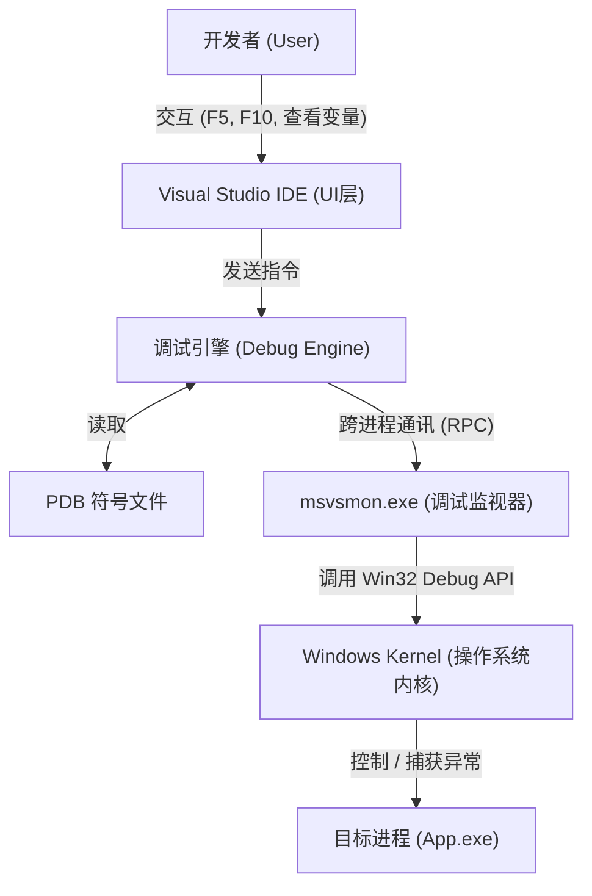

# Deep Dive: MSVC Debugging Mechanisms and Visual Studio Debugger Principles

I've been working on some Windows projects at home recently. Given the large scale of these projects, I found myself dealing with MSVC debugging-related topics. I'd like to share what I've learned over the past few days, combining my notes with the official MSVC documentation.

We have to admit that Visual Studio can sometimes be a bit clunky to use (especially when a project gets large—VS is quite heavy). However, its debugging capabilities are solid. I imagine many of you rely on debugging to solve problems in your own projects. That is the starting point of this blog post—taking a fresh look at debugging, specifically MSVC debugging.

## Starting with What Debugging Is

I think it's important to agree on a fundamental definition of "debugging" first. We usually say a program has a bug and you need to debug it. In this context, debugging means taking a snapshot and inspecting the program's state at a given point in time. For example, when I was working on the IMX6ULL Desktop, I encountered an illegal sensor data crash that was discovered during remote debugging.

Formally speaking—debugging is a **"god-view" observation and control technique for running programs**. It attempts to achieve three things:

1. **Observation**: Inspecting memory, registers, variable values, thread states, and call stacks without altering the program's logic.
2. **Control**: Taking over CPU execution. This includes suspending, single-stepping, resuming, and modifying memory or variable values.
3. **Mapping**: Translating obscure **machine code** and **memory addresses** back into human-readable **source code** in real time.

**In a nutshell**: Debugging is the process of using privileged interfaces provided by the operating system to forcefully intervene in a target process, making it run according to the developer's will and exposing its internal state.

---

## The Participants on the Debugging Stage

When you press F5 in Visual Studio, it's not just a single program at work, but a complex **multi-process collaborative system**. Let's take a look at who is involved in our debugging system when a session is active.

As the active party, we are responsible for clicking the GUI interface provided by the Visual Studio IDE (The Shell) to issue commands. But I must emphasize one point: VS does **not** handle the actual debugging logic; it is only responsible for **display**. It converts user clicks (like F10) into commands sent to the debug engine.

A crucial component is the Debug Engine (DE). It is responsible for parsing complex C++ expressions (like ``vec[0].m_data``), reading PDB symbol files, and translating the address ``0x00401234`` into ``main.cpp:20`` (somewhat similar to `addr2line` in the GNU toolchain).

`msvsmon.exe` (Remote Debugging Monitor) acts as the executor, agent, and isolation layer. We know that during debugging, our IDE process spawns this debugging process. The role of `msvsmon` is to ensure that if the target program crashes or hangs, it doesn't cause the VS IDE to crash as well. Meanwhile, ``msvsmon`` is responsible for passing data between the IDE and the target process. It is the "person" that actually calls the Windows APIs to control the target process.

We'll skip over the role of the Windows kernel here; it simply provides the debugging-related System APIs.

The PDB file (Program Database) is the static database connecting the "binary world" and the "source code world." Without it, the debugger is "blind" and can only see assembly code. Therefore, we must have a PDB file to debug; otherwise, VS will tell you that no symbols have been loaded (for example, in Release mode).

---

## How Does MSVC Debug? (The Workflow)

#### Phase 1: Establishing the Connection

During remote debugging, everything begins with **the interaction between the debugger and the host system**. Specifically, Visual Studio initiates a request through the Remote Debugging Monitor (``msvsmon.exe``), calling the crucial Win32 API — ``CreateProcess``. During this call, a critical flag, ``DEBUG_ONLY_THIS_PROCESS`` (or ``DEBUG_PROCESS``), is passed in. This flag is not just a startup instruction, but a "declaration of takeover" issued to the operating system, marking the target process as being in a controlled state from the moment of its creation.

Next, the process enters the **kernel-level binding and handshake phase**. When the Windows kernel receives a creation request with the debug flag, it doesn't merely launch an independent process. Instead, it establishes a parent-child or debugging association between the target program (Debuggee) and the debugger process (`msvsmon`) within its kernel data structures. This deep binding ensures that all events generated by the target process—such as exceptions, thread creations, or module loads—can be fed back to the debugger in real time through a specific debug channel, allowing the debugger to grasp the complete lifecycle of the target program.

Finally, we have the **pre-execution suspension and takeover phase**. To ensure developers don't miss a single line of code, the target process does not immediately jump to the ``main`` function or the user entry point to execute after initialization is complete. Instead, after the loader finishes its preliminary work, the operating system automatically places the main thread of the target process in a **Suspend** state. At this point, the target program is like a car that has started its engine but has the brake pedal firmly pressed, quietly waiting for further instructions from the debugger. Only when the debugger has finished preparations like symbol loading and breakpoint setting, and issues a "continue" command, will the target program truly begin executing its business logic.

This section reveals the black-box mechanism through which the debugger truly "takes control" of the target process. I have organized these core logics into a more professional and logical text description:

------

#### Phase 2: The Debug Loop — The Core Scheduling Heart

The operation of a debugger is essentially an efficient and rigorous **self-looping monitoring system**. When the debugger enters its working state, it maintains a persistent ``While Loop``, whose central hub is the ``WaitForDebugEvent`` API. At this point, the debugger enters an "efficiently blocked" state, silently waiting for signals triggered by any disturbance in the target process.

Once the target process triggers a key event—whether it's a module load (DLL Load), a thread creation, or the breakpoint trigger that developers care about the most—the **Windows kernel automatically intervenes**. The kernel instantly freezes all threads in the target process, packages the live environment into structured event information, and passes it to the debugger. The debugger then "wakes up" and executes the corresponding logic based on the event type: loading symbol files (PDB) to align with the source code, or handling the ``EXCEPTION_BREAKPOINT`` exception. Finally, when the developer finishes inspecting and commands to continue, the debugger calls ``ContinueDebugEvent``, requesting the kernel to resume the threads and bringing the program back to "life."

#### Phase 3: Breakpoint Injection and Instruction-Level Control

- **Software Breakpoints (INT 3):** When you click the red dot on the left side of a line of code, the debugger is actually "tampering" with the corresponding address in the target memory. It replaces the first byte of the original instruction at that location with ``0xCC`` (i.e., the ``INT 3`` instruction). When the CPU executes this, it forcibly triggers an interrupt exception, handing control over to the debugger.
- **Single Stepping:** To achieve "line-by-line execution," the debugger utilizes the CPU hardware-level **Trap Flag (TF)**. By setting the TF in the flags register to 1, the CPU enters single-step mode: after executing each machine instruction, it automatically generates a ``SINGLE_STEP`` exception and suspends. It is through this "execute one beat, pause one beat" rhythm that the debugger achieves microscopic observation of code execution details.

#### Phase 4: Detachment and Termination

When the debugging task ends, the debugger provides two graceful exit methods. The most common is **complete termination**, which cleanly ends the target process's lifecycle by calling ``TerminateProcess``. The other is the **Detach** mode: by calling ``DebugActiveProcessStop``, the debugger undoes all memory modifications (such as restoring the replaced ``0xCC`` byte) and releases the kernel binding. At this point, the target process shakes off its restraints, returns to an independent running state, and continues executing without disrupting the business logic.

## Summary Diagram (The Big Picture)

To help blog readers understand, you can picture an architecture diagram like this:

---

## The Cornerstone of Debugging: Build Systems and Symbol Files

Debugging doesn't start with F5; it starts with compilation. This is why we need to build in Debug mode for debugging—otherwise, the lack of debug symbols makes things very troublesome.

#### The "Map" and "Guide" of Debugging: PDB and Compilation Configurations

If the binary file is a maze, then the **PDB (Program Database)** is the map to that maze. It is not a simple auxiliary file, but a complex database that records the mapping between machine code addresses and source code line numbers, variable names, type definitions, and the FPO data required for stack backtraces.

When a program crashes at address ``0x00401000``, the debugger doesn't know what happened there. It quickly searches the PDB file and, through the mapping table, discovers that this address corresponds to line 15 of ``main.cpp``. It is precisely through this **symbolication** process that the debugger can translate raw register states into code contexts that developers can understand.

To ensure the accuracy of this map, **compiler flags** are crucial:

- **``/Zi`` or ``/ZI``**: Forcibly generate PDB debug information, where ``/ZI`` specifically reserves extra padding space for "Edit and Continue."
- **``/Od`` (Disable Optimization)**: This is the soul of Debug mode. When optimizing (``/O2``), the compiler will reorder instructions or inline functions for performance, causing the binary stream to become completely misaligned with the source code line numbers. Disabling optimization ensures a "what you see is what you get" debugging experience.

------

## Breakpoints, Evaluation, and Hot Patching

#### 1. Breakpoint Implementation: Software vs. Hardware

- **Software Breakpoints (INT 3):** When you press F9, the debugger performs a "bait-and-switch." It replaces the first byte of the instruction at the breakpoint with ``0xCC``. When the CPU hits this byte, it triggers an interrupt and transfers control to the operating system, which then notifies the debugger.
- **Hardware Breakpoints:** Implemented through the CPU's dedicated **debug registers (Dr0 - Dr7)**. They don't require modifying memory and are typically used to monitor variable changes (data breakpoints).

#### 2. Expression Evaluator (EE): A Miniature Compilation System

When you type ``ptr->member`` in the Watch window, the internal **Expression Evaluator** of VS immediately springs into action. It combines the type information from the PDB to calculate memory offsets, directly reads the target process's memory addresses, and formats the result into a human-readable structure.

#### 3. Edit and Continue: Hot Patching Technology

This is a highly challenging feature. When you modify code, VS performs an **incremental compilation** in the background, generating new binary fragments. Through "Hot Patching" technology, it modifies the original function's entry point into a jump instruction (JMP) pointing to the newly generated memory address, thereby achieving code updates without restarting the program (I've tried it and found that it doesn't always work well and can sometimes fail).

---

## Common Issues and Troubleshooting

Note that here are some common problems encountered during debugging, which I've summarized and listed below:

1. **"Breakpoint will not currently be hit" (Hollow circle breakpoint)**:
    - **Cause**: The PDB does not match the source code, or the PDB is not loaded.
    - **Solution**: Check the "Modules" window for symbol loading status; ensure the code hasn't been optimized away.
2. **Variable displays "Variable is optimized away"**:
    - **Cause**: In Release mode, the variable might be stored in a register for reuse, or directly eliminated by constant folding.
3. **Stack Corruption**:
    - The debugger cannot backtrace the stack. This is usually because a buffer overflow has overwritten the return address.
