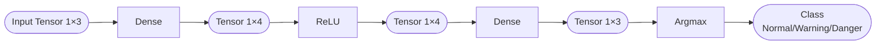

# What a Tensor holds in a neural network — four kinds of data, one container

The previous piece demystified a Tensor into "a 2D table of numbers." So what does that table actually hold in our neural network?

The answer might come as a relief: **almost everything**. Every number flowing through a neural network, from start to finish, lives inside a Tensor. The input is a Tensor, the trained parameters are Tensors, every intermediate result computed along the way is a Tensor. So-called "neural-network inference", **stripped to the bottom, is a computation of Tensor in, Tensor out.**

First let's set the scene for our own Lab, otherwise it's too abstract. What we're building is a little machine that reads sensor values and judges device state: feed it three readings — temperature, humidity, light — and it spits out a verdict: normal, warning, or danger. That concrete a thing. Every number flowing through this little machine from end to end is a Tensor, and this piece takes apart what kinds live around it.

To anchor that picture, let's tear down a Dense layer (fully-connected layer — I know you might be confused again, just pretend it's some mysterious little word, something like a function "A") and see what kinds of Tensors sit around it. Dense is the only arithmetic layer in our MLP; Stage 2 is devoted entirely to writing it, so we won't touch how it computes here — we only look at what numbers it has on hand.

What numbers does it actually have on hand? You don't need to trace how function "A" transforms things in the middle, but for it to do any work, it has to be storing something internally — otherwise why would the same input always produce the same output. What it stores boils down to two things.

One says how many inputs each output should gather and what proportions to mix them together before summing — those proportions are the **weights**, think of them as a recipe table. The other is a constant each output adds on at the very end, called the **bias** — like giving the fader one last push at the mixing desk.

## A Dense layer's four Tensors

Concretely, for the first layer, `Dense(3, 4)` means kneading 3 inputs into 4 intermediate values. Around this layer there are four Tensors:

| Data | What it is | Shape | Our notation |
|---|---|---|---|
| Input x | three sensor readings | a vector of length 3 | `Tensor<1, 3>` |
| Weights W | coefficients kneading 3 inputs into 4 outputs | 4 rows × 3 columns | `Tensor<4, 3>` |
| Bias b | a constant each output adds extra | a vector of length 4 | `Tensor<1, 4>` |
| Output y | the 4 intermediate values this layer computes | a vector of length 4 | `Tensor<1, 4>` |

Terms flying at your face — let's slow down.

**Input** is the three readings fed in — one temperature, one humidity, one light. It's naturally "a row of 3 numbers", so it's `Tensor<1, 3>` — 1 row, 3 columns. Neural networks have a special name for this "one row" form: a vector. We use the alias `Vector<N>` to express it; under the hood it's still `Tensor<1, N>`.

**Weights** are what this layer has truly "learned" — the most central parameters in the whole network. It's a 4×3 table: 4 rows for 4 outputs, 3 numbers per row for 3 inputs. The 3 numbers in row i are the coefficients used to compute output i. How those coefficients get multiplied against the input and summed is Stage 2's job; here you only need to accept "it's a 4×3 table, rows map to outputs, columns map to inputs".

**Bias** is a constant each output adds extra — 4 outputs, so a vector of length 4. Its job is to give each output an independent shift; pure addition, no input involved. Weights decide "how the inputs get mixed"; bias decides "how much the whole thing gets lifted after mixing".

**Output** is the 4 intermediate values this layer computed, shaped the same as the bias — a vector of length 4. These 4 numbers feed the next layer (first through a ReLU that zeros out negatives, then into the second Dense layer), propagating onward.

Those are the four Tensors. Notice — **vectors and matrices are both expressed with the same `Tensor<Rows, Cols>`**, a vector being just the special case `Rows = 1`. This is a deliberate unification in our Tensor design: one container holds every shape of data in a neural network, no need to build two separate ones for vectors and matrices.

## The whole pipeline is all Tensors

Zoom out to the whole pipeline and the "one container" intuition gets clearer. Our MLP from input to output:

Every stage's data is a Tensor. The first Dense takes a 1×3 Tensor and emits a 1×4; ReLU turns every negative in the Tensor into zero, shape unchanged; the second Dense turns 1×4 into 1×3; finally Argmax picks the largest of those 3, and its position (0/1/2) is the classification result — normal, warning, danger.

So what's each later stage doing? All of them are doing *something* with Tensors:

- Stage 2's Dense takes the input Tensor and the weights Tensor, multiplies and adds, adds the bias Tensor, produces the output Tensor
- Stage 3's ReLU zeros out every negative in a Tensor
- Stage 3's Argmax finds the position of the largest number in a Tensor

Once the Tensor is fixed, every later stage is just operations on top of it. That's also why we spend a whole Stage 1 getting the Tensor solid: if it collapses, everything after has to be rewritten.

## Then why not hold these in a ready-made container

You should be asking again: since it's just holding a few floats, can't we use `std::vector<float>` for the input and `std::vector<std::vector<float>>` for the weight matrix?

The answer to that is the same one as "why not a ready-made 2D array" at the end of the previous piece. It's tied to the hard constraints our v0.1 has to keep, and it deserves its own teardown. [03](./03-why-not-built-in.md) puts `std::vector`, nested `std::array`, and the native 2D array on trial one by one, and explains why in the end we have to build this Tensor ourselves.

Take two things away from this piece: **the input, weights, bias, and output flowing through a neural network are all Tensors, and a vector is just a Tensor with `Rows = 1`**; and **every later stage is an operation on top of Tensors**. With that foundation, when you go poke at the Tensor's design trade-offs, you'll know what each trade-off serves.
