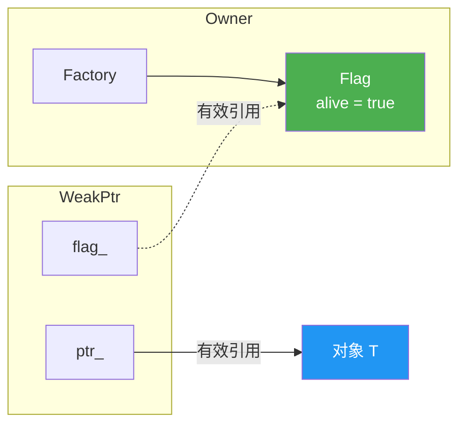
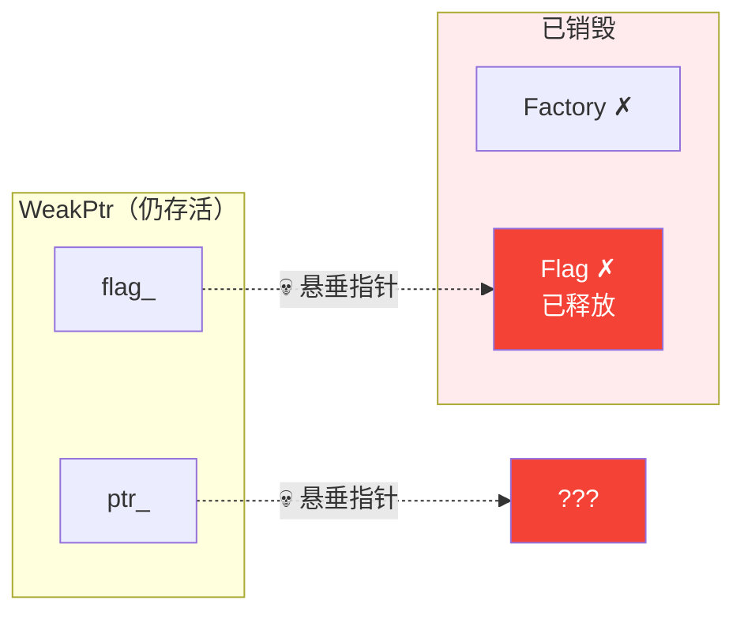

# The WeakPtr Anti-Pattern: The Fatal Trap of `T* + raw Flag*`

## Introduction

In the previous article, we covered borrowing and observation — `Borrowed<T>` and `ObserverPtr<T>` solved the problem of "what does this pointer actually mean," but they share a critical flaw: once the object is destroyed, there is nothing we can do with them. Dereferencing them is UB (undefined behavior), with no room for recovery.

So, the natural next requirement is a "weak reference" — we want to hold a reference to an object without owning it, and we want to safely detect when the object is destroyed, rather than dereferencing a dangling pointer.

What is the most intuitive approach? Use a flag:

```cpp
struct Flag {
    bool alive = true;
};
```

`WeakPtr` holds a `T*` and a `Flag*`, and we check the `flag_->alive` when using it. When the Owner is destructed, it sets `alive` to `false`. This sounds perfect — but the core argument of this article is: **this approach is fundamentally unsafe, and it should not be called WeakPtr.**

## Why This Design Is Tempting

Let's implement it first and see why it "appears to work."

```cpp
// unsafe_weak_ptr.h
// ⚠️ 教学用反模式实现，不要在生产代码中使用

#pragma once

#include <iostream>

struct Flag {
    bool alive = true;
};

template <typename T>
class UnsafeWeakPtr {
public:
    UnsafeWeakPtr(T* ptr, Flag* flag) : ptr_(ptr), flag_(flag) {}

    // 检查对象是否还活着
    bool is_valid() const
    {
        return flag_ && flag_->alive;
    }

    // 获取对象指针，如果已失效则返回 nullptr
    T* get() const
    {
        if (is_valid()) {
            return ptr_;
        }
        return nullptr;
    }

    T& operator*() const { return *get(); }
    T* operator->() const { return get(); }

private:
    T* ptr_;
    Flag* flag_;
};

template <typename T>
class UnsafeWeakPtrFactory {
public:
    explicit UnsafeWeakPtrFactory(T* owner) : owner_(owner) {}

    UnsafeWeakPtr<T> get_weak_ptr()
    {
        return UnsafeWeakPtr<T>(owner_, &flag_);
    }

    void invalidate()
    {
        flag_.alive = false;
    }

    ~UnsafeWeakPtrFactory()
    {
        flag_.alive = false;
    }

private:
    T* owner_;
    Flag flag_;  // Flag 作为 Factory 的成员变量存在
};
```

This looks quite reasonable — `Flag` and `Owner` are bound together. When the Owner is destructed, `flag_.alive` is set to `false`, and any external WeakPtr calling `get()` will return `nullptr`.

In synchronous, single-threaded scenarios where the WeakPtr's lifetime is strictly shorter than the Owner's, this implementation **does work**. The problem is that these prerequisites are extremely fragile in real-world engineering. If the WeakPtr's lifetime is strictly shorter than the Owner's, what is the point of this abstraction? It is not very robust.

## Why It Is Fundamentally Unsafe

There is only one core problem: **the flag's lifetime is bound to the Owner.**

When the Owner is destructed, `UnsafeWeakPtrFactory`, as a member of the Owner, is also destructed. `Flag flag_`, as a member variable of `UnsafeWeakPtrFactory`, is destroyed along with it. At this point, the `flag_` pointer held by any external, still-alive `UnsafeWeakPtr` — becomes a dangling pointer.

So what does the `UnsafeWeakPtr::is_valid()` function actually do? It dereferences a potentially dangling `Flag*` to read a no-longer-existent `bool alive`. This is **undefined behavior (UB)**.

Let's draw a lifetime diagram to see this process clearly:

**Phase 1: When the Owner is alive** — `flag_->alive == true`, everything is fine:



**Phase 2: After the Owner is destructed** — both `flag_` and `ptr_` are dangling pointers:



The moment `is_valid()` checks `flag_->alive`, the memory pointed to by `flag_` may have already been reclaimed, reused, or overwritten. Whether it returns `true` or `false` depends entirely on the current state of that memory — this is UB.

## Minimal UB Reproduction

Next, let's write a minimal example to actually trigger this issue. Note that the behavior of UB is unpredictable; the following code may "appear to work" under certain compilers or optimization levels, but that does not mean it is safe.

```cpp
// unsafe_weak_ptr_ub_demo.cpp
// 编译：g++ -std=c++17 -O0 -g unsafe_weak_ptr_ub_demo.cpp
// 注意：UB 的表现因编译器、优化级别、运行环境而异
// 这里用 -O0 是为了让 UB 更容易被观察到

#include <iostream>
#include <memory>

struct Flag {
    bool alive = true;
};

template <typename T>
class UnsafeWeakPtr {
public:
    UnsafeWeakPtr(T* ptr, Flag* flag) : ptr_(ptr), flag_(flag) {}
    bool is_valid() const { return flag_ && flag_->alive; }
    T* get() const { return is_valid() ? ptr_ : nullptr; }

private:
    T* ptr_;
    Flag* flag_;
};

template <typename T>
class UnsafeWeakPtrFactory {
public:
    explicit UnsafeWeakPtrFactory(T* owner) : owner_(owner) {}
    UnsafeWeakPtr<T> get_weak_ptr()
    {
        return UnsafeWeakPtr<T>(owner_, &flag_);
    }
    ~UnsafeWeakPtrFactory() { flag_.alive = false; }

private:
    T* owner_;
    Flag flag_;
};

struct Widget {
    int value = 42;
    UnsafeWeakPtrFactory<Widget> factory{this};

    UnsafeWeakPtr<Widget> get_weak_ptr()
    {
        return factory.get_weak_ptr();
    }
};

int main()
{
    UnsafeWeakPtr<Widget> weak = [] {
        auto w = std::make_unique<Widget>();
        return w->get_weak_ptr();
        // w 在这里析构
        // Widget 析构 → factory 析构 → Flag 析构
    }();

    // 此时 weak.flag_ 指向已销毁的 Flag
    // weak.ptr_ 指向已销毁的 Widget

    // ⚠️ UB：解引用已释放的 Flag
    std::cout << "is_valid() = " << std::boolalpha << weak.is_valid() << '\n';

    // ⚠️ UB：如果 is_valid() 恰好返回 true，get() 返回悬垂指针
    if (auto* p = weak.get()) {
        std::cout << "value = " << p->value << '\n';  // UB：读取已释放的内存
    } else {
        std::cout << "Widget 已失效（但这个结果本身就是 UB 的产物）\n";
    }
}
```

In my test environment (GCC 16, -O0), the output of this code is:

```text
is_valid() = false
Widget 已失效（但这个结果本身就是 UB 的产物）
```

It looks like `is_valid()` correctly returned `false` — but this does not mean it is safe. The reason it returns `false` is that `~UnsafeWeakPtrFactory()` first sets `alive` to `false`, and only then is the Widget's memory freed. `is_valid()` happens to read the value written by the destructor — because that memory hasn't been reused by the allocator yet. Compiling with AddressSanitizer (`-fsanitize=address`) clearly reveals the `heap-use-after-free` error: `is_valid()` is accessing freed memory.

With a different allocator, a different optimization level, or by inserting more memory operations between destruction and the read, the result could be completely different — `is_valid()` might return `true`, and `get()` might return a non-null pointer to freed memory. The behavior of UB is unpredictable, and **"appearing to work" is precisely the most dangerous manifestation of UB**.

## Why Async Callbacks Completely Break the Constraints

Some might argue: "As long as we guarantee that the WeakPtr doesn't outlive the Owner, we're fine." This constraint can barely be maintained through manual inspection in synchronous code, but it is almost impossible to guarantee in asynchronous callback scenarios.

```cpp
// 定时器回调场景
class Session {
public:
    UnsafeWeakPtr<Session> get_weak()
    {
        return factory_.get_weak_ptr();
    }

    void start_heartbeat()
    {
        auto weak = get_weak();
        // 1 秒后执行回调
        timer_.schedule(1000ms, [weak]() {
            // Session 可能已经在回调执行前被销毁了
            // weak.is_valid() 访问已销毁的 Flag → UB
            if (weak.is_valid()) {
                // ...
            }
        });
    }

private:
    UnsafeWeakPtrFactory<Session> factory_{this};
    Timer timer_;
};
```

The essence of an async callback is "save a reference and use it later." When is "later"? Will the object still be alive? We don't know. And the safety premise of `UnsafeWeakPtr` — "the WeakPtr doesn't outlive the Owner" — is a joke in async scenarios.

## What Should It Actually Be Called

This combination of `T* + raw Flag*` isn't entirely useless. Under specific constraints (synchronous use, strictly controlled WeakPtr lifetime relative to the Owner), it works. But it shouldn't be called `WeakPtr`, because that name implies "safe detection of invalidation after the object is destroyed" — which it fails to do.

More honest names would be:

- **`UnsafeWeakPtr<T>`**: explicitly marking it as unsafe
- **`OwnerBoundWeakPtr<T>`**: expressing that its lifetime is bound to the Owner
- **`BorrowedWeakPtr<T>`**: expressing that it is essentially still a borrow

If we must use it, the constraints must be clearly stated in the documentation and naming. But a better approach is to use a real WeakPtr. In the next article, we will implement a safe version.

## Summary

- `T* + raw Flag*` looks like a WeakPtr, but accessing `flag_->alive` via `Get()` can itself be UB
- Core problem: the flag's lifetime is bound to the Owner; once the Owner is destroyed, the flag no longer exists
- It might "work" in synchronous scenarios where the WeakPtr is strictly shorter-lived than the Owner, but this is not a reliable WeakPtr
- Async callbacks completely break the "WeakPtr doesn't outlive the Owner" constraint
- At best, it should be called `UnsafeWeakPtr` or `OwnerBoundWeakPtr`
- For safety: the control block must be independent of the Owner's lifetime — this is the topic of the next article

## References

- [Chromium Smart Pointer Guidelines](https://www.chromium.org/developers/smart-pointer-guidelines/) — Chrome's WeakPtr solves this problem using an independent control block
- [C++ Core Guidelines - CP.50: Define a mutex together with the data it guards](https://isocpp.github.io/CppCoreGuidelines/CppCoreGuidelines) — Although this is about mutexes, the design philosophy of "separating the control block from the object's lifetime" is similar
- [What is undefined behavior? - StackOverflow](https://stackoverflow.com/questions/23979841/what-is-undefined-behavior)
