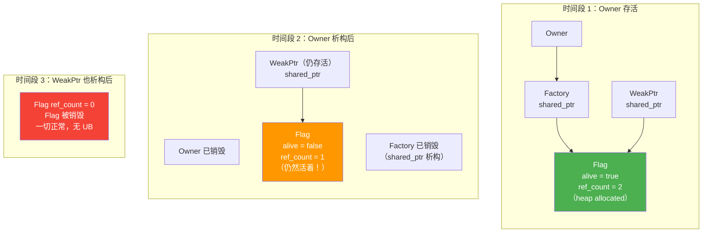
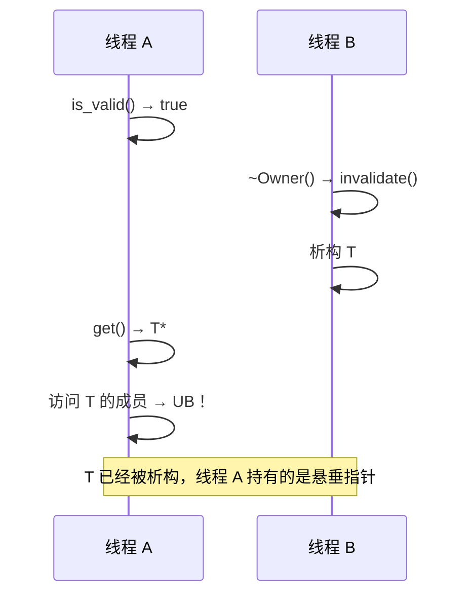

# SimpleWeakPtr: Safe Improvements with T* + shared_ptr\<Flag\>

## Introduction

In the previous article, we dissected the fatal flaw in `T* + raw Flag*`: the Flag's lifetime is bound to the Owner. When the Owner is destroyed, the Flag goes away with it, and the `flag_` held by external WeakPtrs becomes a dangling pointer — accessing `is_valid()` is undefined behavior (UB) in its own right.

The fix is straightforward: decouple the Flag's lifetime from the Owner. How? Use a `std::shared_ptr<Flag>` to hold it — the Factory and all WeakPtrs share ownership of the same Flag. When the Owner is destroyed, it only invalidates the Flag (sets `alive = false`), but the Flag object itself stays alive until the last WeakPtr holding it is also destroyed.

This way, `is_valid()` never accesses freed memory, because the Flag object it accesses is guaranteed to still be alive.

## Core Design

Let's look at the implementation first, and then we'll explain the design rationale section by section.

```cpp
// simple_weak_ptr.h
// 教学版 SimpleWeakPtr<T>：T* + shared_ptr<Flag>
// control block 通过 shared_ptr 管理，保证生命周期独立于 Owner

#pragma once

#include <memory>

struct Flag {
    bool alive = true;

    void invalidate() { alive = false; }
};

template <typename T>
class SimpleWeakPtr {
public:
    SimpleWeakPtr() = default;

    SimpleWeakPtr(T* ptr, std::shared_ptr<Flag> flag)
        : ptr_(ptr), flag_(std::move(flag)) {}

    // 检查对象是否还有效
    // 安全：flag_ 是 shared_ptr，只要这个 WeakPtr 还活着，Flag 就一定活着
    bool is_valid() const
    {
        return flag_ && flag_->alive;
    }

    // 获取对象指针，已失效则返回 nullptr
    T* get() const
    {
        if (is_valid()) {
            return ptr_;
        }
        return nullptr;
    }

    T& operator*() const { return *get(); }
    T* operator->() const { return get(); }
    explicit operator bool() const { return get() != nullptr; }

private:
    T* ptr_ = nullptr;
    std::shared_ptr<Flag> flag_;
};

template <typename T>
class SimpleWeakPtrFactory {
public:
    explicit SimpleWeakPtrFactory(T* owner)
        : owner_(owner), flag_(std::make_shared<Flag>()) {}

    SimpleWeakPtr<T> get_weak_ptr()
    {
        return SimpleWeakPtr<T>(owner_, flag_);
    }

    void invalidate()
    {
        if (flag_) {
            flag_->invalidate();
        }
    }

    ~SimpleWeakPtrFactory()
    {
        invalidate();
    }

private:
    T* owner_;
    std::shared_ptr<Flag> flag_;  // Factory 和 WeakPtr 共享同一个 Flag
};
```

## Why This Is Safe Now

The problem in the previous article was that `Flag*` was a raw pointer — it didn't own the Flag and couldn't guarantee the Flag was still alive. Now that we've switched to `std::shared_ptr<Flag>`, the situation is completely different.

A `std::shared_ptr` maintains an internal reference count. When the Factory creates a `SimpleWeakPtr`, it copies its `flag_` to the WeakPtr, incrementing the reference count by one. At this point, two `shared_ptr` instances point to the same Flag: one held by the Factory, and one held by the WeakPtr.

When the Owner is destroyed, the Factory's destructor calls `invalidate()` to set `flag_->alive` to `false`. Then the Factory's `shared_ptr<Flag>` is destroyed, and the reference count drops from two to one. However, the Flag object is **not** destroyed, because there is still one `shared_ptr` (the one held by the WeakPtr) referencing it.

The Flag is only destroyed when the last `shared_ptr` holding it is also destroyed. This means that as long as any `SimpleWeakPtr` is alive, `is_valid()` is accessing a Flag object that genuinely exists — not a dangling pointer.

Lifetime diagram:



## shared_ptr\<Flag\> Does Not Mean Owning T

There is an easily confused point here that we need to emphasize: `shared_ptr<Flag>` only owns the Flag as a control block; it does **not** own T.

The Flag only contains a `bool alive`. It doesn't hold a pointer to T, it doesn't participate in T's destruction, and it doesn't extend T's lifetime. T's lifetime is entirely managed by the Owner itself (it could be a stack object, a heap object managed by a `unique_ptr`, or something else). The only thing the Flag does is record the status of "is T still alive?"

This distinction is crucial — if you interpret `shared_ptr<Flag>` as "the shared pointer owns T," you're conflating it with `std::shared_ptr<T>`. The latter owns T, while the former only owns the control block.

## Thread Safety Discussion

At this point, we've solved the lifetime safety issue. But if you use `SimpleWeakPtr` in a multithreaded scenario, there are new pitfalls waiting.

**Problem one: data race on `bool alive`.** If one thread writes to `alive = false` in `invalidate()`, and another thread reads from `alive` in `is_valid()`, without any synchronization mechanism, this is a textbook data race — UB.

The fix is simple: replace `bool` with `std::atomic<bool>`:

```cpp
#include <atomic>

struct Flag {
    std::atomic<bool> alive{true};

    void invalidate() { alive.store(false, std::memory_order_release); }
    bool is_alive() const { return alive.load(std::memory_order_acquire); }
};
```

**Problem two: even if the Flag is atomic, concurrent access to T is still unsafe.** This is the most easily overlooked point. Suppose thread A calls `is_valid()` and gets `true`, then prepares to call `get()` to get a T* and access T's members. But between `is_valid()` and the actual access to T, thread B might be destroying T. This is the classic TOCTOU (Time-of-check-to-time-of-use) race condition.



`atomic<bool>` solves the data race on the Flag itself, not the concurrent access safety issue for T. We will dive into this in detail later in the fifth article when we discuss asynchronous callbacks.

## Summary

- `shared_ptr<Flag>` decouples the control block's lifetime from the Owner, solving the dangling pointer problem of `raw Flag*`
- `is_valid()` is now always safe — as long as the WeakPtr is alive, the Flag is guaranteed to be alive
- `shared_ptr<Flag>` only owns the control block, does not own T, and does not extend T's lifetime
- Thread safety requires two steps: use `atomic<bool>` for the Flag to resolve data races, but concurrent access to T requires additional synchronization mechanisms
- `atomic<bool>` solves "reading the Flag won't cause UB," not "accessing T is safe after reading alive=true"

This is a crucial step from "unsafe weak reference" to "safe weak reference." However, `shared_ptr` introduces the overhead of heap allocation and atomic reference counting. Is there a lighter-weight way to achieve the same safety guarantees? Yes — the Chrome-style reference-counted control block. We'll implement it in the next article.

## Reference Resources

- [std::shared_ptr - cppreference](https://en.cppreference.com/w/cpp/memory/shared_ptr)
- [std::atomic - cppreference](https://en.cppreference.com/w/cpp/atomic/atomic)
- [C++ Memory Order 详解](../../../vol5-concurrency/ch03-atomic-memory-model/02-memory-ordering.md) — Volume five of this tutorial provides an in-depth discussion of memory order
