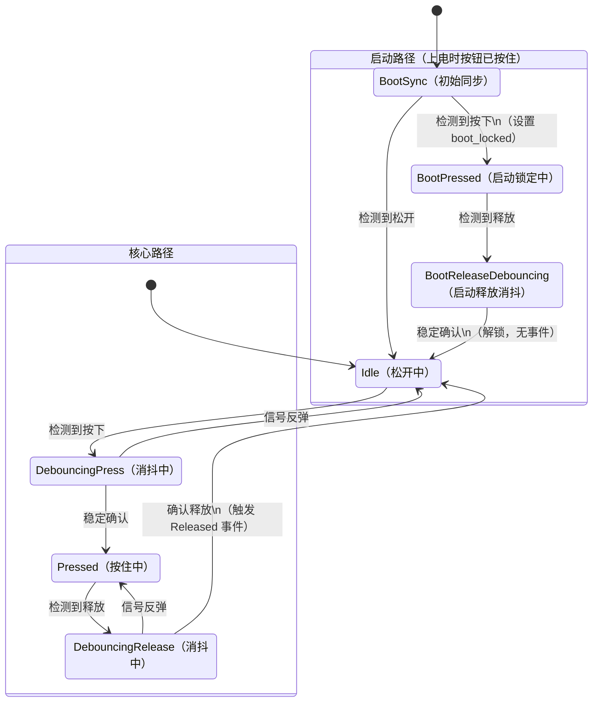

# Part 25: The 7-State Debounce State Machine — The Core of This Series

> Following up on the previous article: non-blocking debounce works, but state variables are scattered, there is no concept of events, and startup edge cases are unhandled. This article uses a 7-state finite state machine to solve all these problems. This is a complete breakdown of the `poll_events()` method in `button.hpp`.

---

## Why We Need a State Machine

The core logic of the non-blocking debounce code from the previous article looks like this:

```c
if (current != last_raw) {
    last_raw = current;
    last_change_time = HAL_GetTick();
}
if ((HAL_GetTick() - last_change_time) >= debounce_ms) {
    if (last_raw != last_stable) {
        last_stable = last_raw;
        // 触发事件
    }
}
```

It works, but it has problems. This `if-else` structure mixes "debounce waiting," "state confirmation," and "event triggering" together without clear boundaries. As requirements grow—needing to distinguish between press and release, handling a button held at startup, and correctly handling signal bounce during debounce—`if-else` will become increasingly tangled.

A state machine breaks this logic into discrete states and explicit transition rules. Each state only cares about "I am here, what is the input, and where do I go next." Instead of "a bunch of intertwined conditional checks," we get "a clear state transition diagram."

---

## The 7 States

Our state machine has 7 states, defined in a private `enum class State` within `button.hpp`:

```cpp
enum class State {
    BootSync,            // 启动同步：第一次采样，确定初始状态
    Idle,                // 空闲：按钮松开，等待按下
    DebouncingPress,     // 消抖中（按下方向）：等待信号稳定
    Pressed,             // 已确认按下：按钮正在被按住
    DebouncingRelease,   // 消抖中（释放方向）：等待信号稳定
    BootPressed,         // 启动锁定：上电时按钮已被按住
    BootReleaseDebouncing, // 启动释放消抖：启动锁定后的释放消抖
};
```

Don't let the 7 states intimidate you. The core flow only has 4 states: `Idle → DebouncingPress → Pressed → DebouncingRelease → Idle`, which map one-to-one with the non-blocking logic from the previous article. The extra 3 states (`BootSync`, `BootPressed`, `BootReleaseDebouncing`) exist solely to handle the edge case where "the button is already held at startup."

### State Transition Diagram



---

## A State-by-State Breakdown

### State::BootSync — Startup Synchronization

```cpp
case State::BootSync:
    raw_pressed_ = sample;
    stable_pressed_ = sample;
    debounce_start_ = now_ms;
    boot_locked_ = sample;
    state_ = sample ? State::BootPressed : State::Idle;
    return;
```

This is the initial state of the state machine (the default value of `state_` is `State::BootSync`). It only executes once—during the first call to `poll_events()`.

It does three things:

1. Initializes `raw_pressed_` and `stable_pressed_` with the first sample value
2. If the button is already pressed, sets `boot_locked_ = true`—entering "boot lock"
3. Transitions to `BootPressed` or `Idle` based on the sample result

Why do we need this step? Because the state machine needs to know "what the initial state is." If the button is already held at power-on, we cannot trigger a `Pressed` event—the user didn't "press" the button; it was held from the very beginning.

### State::Idle — Idle

```cpp
case State::Idle:
    if (sample) {
        raw_pressed_ = true;
        debounce_start_ = now_ms;
        state_ = State::DebouncingPress;
    }
    return;
```

The idle state means the button is currently released. It only cares about one thing: was a press signal detected? If so, it records the timestamp and enters the debounce state.

This state outputs nothing and triggers no events. It is simply "waiting."

### State::DebouncingPress — Press Debounce

```cpp
case State::DebouncingPress:
    if (sample != raw_pressed_) {
        raw_pressed_ = sample;
        debounce_start_ = now_ms;
    }
    if (!sample) {
        state_ = State::Idle;
        return;
    }
    if ((now_ms - debounce_start_) < debounce_ms) {
        return;
    }
    stable_pressed_ = true;
    state_ = State::Pressed;
    cb(Pressed{});
    return;
```

This is the core of the debounce logic. Three checks correspond to three scenarios:

**Scenario 1: Signal bounced back.** `sample != raw_pressed_` means the signal bounced back during the jitter. We update `raw_pressed_` and reset the timer—starting the count over.

**Scenario 2: Signal clearly returned to low.** `!sample` means the button was released again—this press was a false signal, so we return to `Idle`.

**Scenario 3: Signal remains high and has been stable for `debounce_ms`.** Press confirmed! We update the stable state, transition to `Pressed`, and trigger the `Pressed` event.

The order of these three checks is critical. We first check for bounce (Scenario 1), then check for returning to low (Scenario 2), and finally check for timeout confirmation (Scenario 3). This order ensures:

- Every bounce during the jitter period resets the timer
- If the signal clearly returns to the initial level, we abort immediately (without waiting for a timeout)
- Confirmation only happens when the signal remains stable

### State::Pressed — Confirmed Press

```cpp
case State::Pressed:
    if (sample != raw_pressed_) {
        raw_pressed_ = sample;
        debounce_start_ = now_ms;
        state_ = State::DebouncingRelease;
    }
    return;
```

After the button press is confirmed, it only cares about one thing: was a release signal detected? If so, it enters the release debounce state.

Note that the `Pressed` state does not trigger the `Pressed` event again—events are only triggered once upon state transition. This guarantees that no matter how long the user holds the button, the `Pressed` event fires exactly once.

### State::DebouncingRelease — Release Debounce

```cpp
case State::DebouncingRelease: {
    if (sample != raw_pressed_) {
        raw_pressed_ = sample;
        debounce_start_ = now_ms;
        if (sample) {
            state_ = State::Pressed;
        }
        return;
    }
    if (sample) {
        state_ = State::Pressed;
        return;
    }
    if ((now_ms - debounce_start_) < debounce_ms) {
        return;
    }
    stable_pressed_ = false;
    state_ = State::Idle;
    if (boot_locked_) {
        boot_locked_ = false;
        return;
    }
    cb(Released{});
    return;
}
```

This is structurally symmetric to `DebouncingPress`, but in the opposite direction. Three core checks:

**Scenario 1: Signal bounced.** Reset the timer. If it bounced back to high (`sample` is true), return to the `Pressed` state.

**Scenario 2: Signal clearly returned to high.** Return to `Pressed`; this release was a false signal.

**Scenario 3: Timeout confirmed.** The stable value is low, so the release is confirmed. But there is an additional check here: `boot_locked_`.

### Boot-Lock Check

```cpp
if (boot_locked_) {
    boot_locked_ = false;
    return;  // 不触发 Released 事件
}
cb(Released{});
```

If `boot_locked_` is true, it means this "release" is the first release after the button was held at startup. In this case, we **do not trigger the `Released` event**—because the user never "pressed" the button while the system was running. We simply clear `boot_locked_` and let the state machine enter normal operation mode.

This is an easily overlooked edge case. If your code doesn't handle `boot_locked_` specially, and the button happens to be held at power-on (for example, the button is stuck, or the user is holding it down), releasing the button will trigger a "baffling Released event"—the user did nothing, yet the LED turns off.

### State::BootPressed and BootReleaseDebouncing

These two states are "silent versions" of `Pressed` and `DebouncingRelease`—the logic is identical, but they do not trigger any events:

```cpp
case State::BootPressed:
    // 和 Pressed 一样的消抖逻辑，但释放后进入 BootReleaseDebouncing
    ...

case State::BootReleaseDebouncing:
    // 和 DebouncingRelease 一样的消抖逻辑
    // 确认释放后：
    boot_locked_ = false;
    stable_pressed_ = false;
    state_ = State::Idle;  // 静默进入 Idle，不触发 Released
    return;
```

Why not let `Pressed` and `DebouncingRelease` handle the boot lock functionality at the same time? Because that would require adding an `if (boot_locked_)` check in every state, making the logic more complex. By factoring out two separate states, we add one extra pair of states, but the logic within each state remains pure—either it only handles the normal flow, or it only handles the startup flow.

---

## Complete State Transition Table

| Current State | Input | Condition | Next State | Action |
|---------|------|------|---------|------|
| BootSync | High | — | Idle | Initialize, no lock |
| BootSync | Low | — | BootPressed | Initialize, set boot_locked |
| Idle | Low | — | Idle | Nothing happens |
| Idle | High | — | DebouncingPress | Record timestamp |
| DebouncingPress | Bounce | — | DebouncingPress | Reset timer |
| DebouncingPress | Low | — | Idle | False signal, abort |
| DebouncingPress | High | Time not reached | DebouncingPress | Keep waiting |
| DebouncingPress | High | Time reached | **Pressed** | **Trigger Pressed event** |
| Pressed | High | — | Pressed | Nothing happens |
| Pressed | Low | — | DebouncingRelease | Record timestamp |
| DebouncingRelease | Bounce | Returned to high | Pressed | False signal |
| DebouncingRelease | High | — | Pressed | False signal |
| DebouncingRelease | Low | Time not reached | DebouncingRelease | Keep waiting |
| DebouncingRelease | Low | Time reached + boot_locked | Idle | Clear lock, no event |
| DebouncingRelease | Low | Time reached + normal | **Idle** | **Trigger Released event** |

The state transitions for the startup path are symmetric to the above, but they do not trigger any events.

---

## Comparison with the Previous Non-Blocking Code

The `if-else` code from the previous article was about 15 lines and accomplished basic debouncing. The state machine version is about 80 lines, adding startup handling and the concept of events. Does this look like over-engineering?

It isn't. The 15-line version will run into problems in the following scenarios:

1. **Distinguishing press from release**: You need debouncing in both directions—press needs debouncing, and release needs debouncing too. The `if-else` version only performs one "stability check" without distinguishing direction.
2. **Signal bounce during debounce**: Jitter isn't as simple as "wait 20ms and it's stable." The signal might bounce at 5ms, then bounce again at 10ms. Each bounce needs to reset the timer. The state machine handles this scenario explicitly.
3. **Startup edge cases**: The button state is uncertain at power-on. The state machine's `BootSync` + `BootPressed` path handles this edge case elegantly.
4. **Extensibility**: If we need to add "long-press detection" or "double-click detection" in the future, we just add a few states to the state machine. Adding these to `if-else` would make the code much harder to maintain.

The essence of a state machine is trading space for time—we write a few more lines of code, but the responsibility of each state is clear, the logic is simple, and states don't interfere with one another.

---

## Looking Back

This article is the core of the entire button tutorial. We provided a detailed breakdown of the 7-state state machine in the `poll_events()` method of `button.hpp`:

- **Core path**: `Idle → DebouncingPress → Pressed → DebouncingRelease → Idle`, handling normal press and release
- **Startup path**: `BootSync → BootPressed → BootReleaseDebouncing → Idle`, handling the edge case where the button is held at power-on
- **Debounce mechanism**: Every signal bounce resets the timer, and state changes are confirmed only after sustained stability
- **boot-lock**: The startup lock ensures that a button held at power-on does not trigger false events

Once you understand this state machine, the rest of `button.hpp` (template parameters, Concepts callbacks, `std::variant` events) are simply wrapper layers built on top of it. The next few articles will gradually explain these C++ features.
