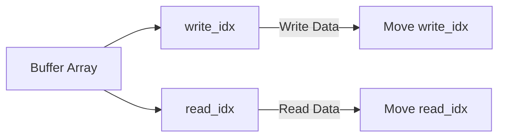

# Embedded C++ Tutorial — Circular Buffer

In the embedded world, one problem recurs constantly: **a data source produces data continuously, a consumer processes it slowly, and we want to avoid `malloc` in between.** Thus, an ancient but timeless data structure takes the stage—the **Circular Buffer (Ring Buffer)**.

You can think of it as a warehouse with a fixed size; when it's full, we start over from the beginning. No resizing, no fragmentation, no "new failed," making it perfect for MCUs, drivers, interrupts, DMA, serial ports, audio streams, and other scenarios.

------

## Why Does Embedded Love Circular Buffers So Much?

In the PC world, we can freely `malloc` and `new`. But in embedded systems, these operations sound dangerous:

- Heap memory is small and prone to fragmentation.
- We cannot `malloc` within an interrupt context.
- Real-time systems cannot tolerate unpredictable latency.

The characteristics of a circular buffer are practically tailor-made for embedded systems:

- **Fixed size, determined at compile time or initialization.**
- **O(1) enqueue / dequeue.**
- **Contiguous memory, cache-friendly.**
- **No dynamic allocation required.**
- **Simple implementation, easy to make lock-free / interrupt-safe.**

To summarize in one sentence:

> **It isn't smart, but it is reliable.**

------

## The Core Idea of a Circular Buffer (Actually Very Simple)

A circular buffer is essentially:

- A fixed-size array.
- Two indices:
  - `write_idx`: The write position.
  - `read_idx`: The read position.

When an index reaches the end of the array, it **wraps around to the beginning**, like a circle.



Writing data: Move `write_idx`.
Reading data: Move `read_idx`.

There is only one key question to figure out:
👉 **How to distinguish "full" from "empty"?**

------

## How to Distinguish "Empty" and "Full"? (The Classic Puzzle)

There are three common approaches:

1. **Waste one element (most common).**
2. Maintain an extra `count`.
3. Use an extra `bool` flag.

In embedded systems, **Approach 1 is the most popular**: simple, unambiguous, and logically clear. The rules are:

- Buffer size is `Capacity + 1`.
- Actual maximum storage is `Capacity` elements.
- Condition checks:
  - Empty: `read_idx == write_idx`
  - Full: `(write_idx + 1) % Size == read_idx`

Yes, we sacrifice one slot to buy a lifetime of peace.

------

## A Clean C++ Circular Buffer Implementation

Below is a **no-dynamic-memory, templated, embedded-friendly** implementation.

### Basic Interface Design

```cpp
template <typename T, size_t Capacity>
class CircularBuffer {
    // Actual array size = User available capacity + 1
    T data_[Capacity + 1];
    size_t read_idx_ = 0;
    size_t write_idx_ = 0;

public:
    // ... methods
};
```

Note one detail:
👉 **`data_[Capacity + 1]` actual array size = user available capacity + 1**

------

## Enqueue (push): Step Forward

```cpp
bool push(const T& item) {
    if (full()) {
        return false; // Buffer full
    }

    data_[write_idx_] = item;
    write_idx_ = (write_idx_ + 1) % (Capacity + 1);
    return true;
}
```

There is no black magic here:

- First check if full.
- Write data.
- Move `write_idx_`.
- If at the end, wrap to the beginning.

**O(1), never slow.**

------

## Dequeue (pop): The Consumer Enters

```cpp
bool pop(T& item) {
    if (empty()) {
        return false; // Buffer empty
    }

    item = data_[read_idx_];
    read_idx_ = (read_idx_ + 1) % (Capacity + 1);
    return true;
}
```

Equally simple:

- Fail if empty.
- Read data.
- Move `read_idx_`.

------

## Status Check Functions

```cpp
bool empty() const {
    return read_idx_ == write_idx_;
}

bool full() const {
    return (write_idx_ + 1) % (Capacity + 1) == read_idx_;
}
```

The `full()` check is very common in embedded systems; it avoids complex branching and doesn't use an extra counter.

------

## A Real-World Embedded Use Case

### Serial Reception (ISR + Main Loop)

```cpp
CircularBuffer<uint8_t, 256> rx_buffer;

// UART Interrupt Service Routine
void USART1_IRQHandler() {
    if (USART1->ISR & USART_ISR_RXNE) {
        uint8_t data = USART1->RDR;
        rx_buffer.push(data); // Non-blocking write
    }
}

// Main Loop
int main() {
    while (1) {
        uint8_t byte;
        if (rx_buffer.pop(byte)) {
            process_byte(byte); // Process slowly
        }
        // Do other tasks...
    }
}
```

This approach has several very "embedded" advantages:

- The logic inside the ISR is extremely short.
- No `malloc`.
- The main loop processes data at its own pace.
- Even if processing is slow, it won't block the interrupt.

------

## A Reality Check on Thread Safety / Interrupt Safety

The implementation above is:

- **Single Producer + Single Consumer (SPSC)**
- One runs in an interrupt, the other in the main loop.

On many MCUs, this is **naturally safe** (as long as index reads and writes are atomic).

However, if you encounter one of the following situations:

- Multithreading.
- Multiple producers.
- SMP (Symmetric Multi-Processing).
- Communication between RTOS tasks.

You will need:

- Critical sections (disable interrupts).
- Atomic variables.
- Or a mutex / spinlock.

------

## Comparison with std::queue / std::vector

| Approach      | Dynamic Allocation | Deterministic | Embedded Friendly |
| ------------- | ------------------ | ------------- | ----------------- |
| std::vector  | Yes                | No            | ❌                 |
| std::queue   | Depends on underlying container | No | ❌ |
| Circular Buffer | No            | Yes           | ✅                 |
