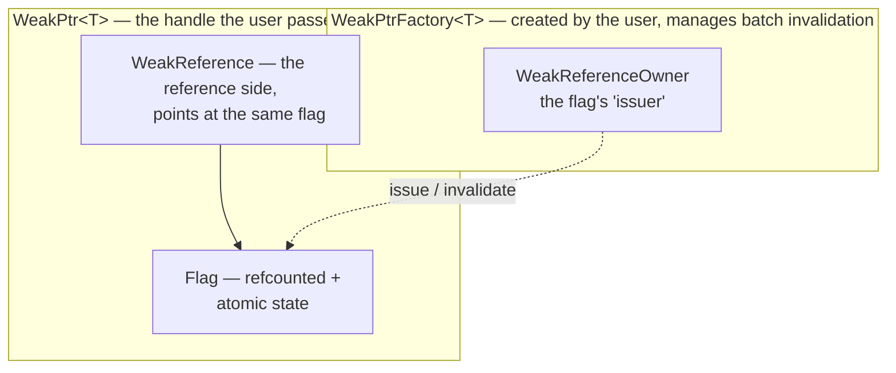

# weak_ptr Design Guide (I): Motivation and API Design

Back in 01-4, when we hand-rolled the cancellation token, I took a shortcut: slap an atomic flag on the callback, 0 while the object is alive, flip it to 1 right before the destructor, and `if`-check it before the callback runs. The dangling problem was papered over. But there was a loose end I never felt good about: who actually owns that flag, and how does the callback get hold of it?

Sit with how awkward this is for a second. The flag is created by object A, and the callback runs somewhere else entirely. For the callback to see the flag, you have to hand it a pointer to the flag. Pass a raw pointer and, the moment A destructs, the flag goes with it, so the callback is holding a dangling pointer and we've looped right back to the start. Pass a `shared_ptr`? Now the flag never destructs. But we're only managing the flag, not A itself, so the problem isn't solved at all. We've just moved the hole.

This awkwardness is, in fact, the concrete avatar of the classic C++ weak-reference problem. Chromium gives it a fairly hardcore answer inside `base`, and it's called `WeakPtr`. In this piece we'll sort out the motivation, pin down the hole it has to fill, and fix the target API as we go. Interface before implementation; the code lands in the next few pieces.

---

## Starting from a bug

### The scenario: posting an async task

Say we have a `Controller` that posts tasks to a thread pool, and when a task finishes it comes back to update its own state.

```cpp
class Controller {
public:
    void start_work(ThreadPool& pool) {
        // Post a task to the pool; on completion, call back into on_work_done
        pool.post([this] { this->on_work_done(); });
    }
    void on_work_done() { /* update state */ ++work_count_; }
private:
    int work_count_ = 0;
};
```

This code passes nine and a half times out of ten. But the moment `Controller` gets destructed before the task is reached (the user switched pages, the owning window closed), the task system is still clutching a copy of `this` inside that callback. When the task finally runs, `on_work_done` dereferences an already-destructed object. Segfault.

### This is the problem we already met in 01-4

It's the same thing as the hand-rolled cancellation token back then: hang a flag on the Controller, flip it to 1 before the destructor runs, and check the flag before the callback fires. Identical idea.

What I did back then was cut a corner: the flag's lifetime was glued together by "callback holds `shared_ptr<Flag>`, Controller holds the raw flag," because the teaching version only wanted to make the "check" step clear. This time we have to do it properly. The real move is to fuse "the flag" and "a weak reference to the object" into one thing. What the callback receives is not a lonely little flag but a `WeakPtr<Controller>`: it can tell the callback whether the Controller is dead, and when it isn't, it can call the Controller's methods directly.

That is what `WeakPtr` is for.

---

## Why three obvious solutions all fall short

Before building a wheel of our own, let's close off the three ready-made roads, so you see why Chromium insisted on building its own.

The raw `this` pointer is the code above: the object destructs, the callback dangles, UAF, nothing more to say.

`shared_ptr<Controller>` doesn't work either. It forces you to rewrite Controller as shared ownership, where a previously clean single owner becomes "theoretically anyone can hold one." Worse, as long as the callback is clutching that `shared_ptr`, the Controller **never destructs**. The task is still queuing, so the Controller just refuses to leave, and you get a resource leak on top of an out-of-control lifetime. This isn't fixing the bug, it's trading it for a different one.

And `std::weak_ptr<Controller>`? It needs a `shared_ptr` to exist first, so it loops right back to the previous road. Every access has to `lock()` to grab a temporary `shared_ptr`, which is both noisy and an extra atomic-op tax on a hot path like a callback. We covered its abstraction limits systematically in [prerequisite (0)](./pre-00-weak-ptr-weak-reference-and-lifetime.md); here, code speaks for itself.

Three roads: either unsafe, or polluting ownership, or tied to the cost of being non-intrusive. What Chromium wants is plain: let Controller keep its original single-owner model, and hand the callback a weak reference that "doesn't extend lifetime, can check liveness, and can be invalidated in bulk."

---

## Chromium's answer: the WeakPtr design philosophy

Chromium's `WeakPtr` is not one isolated little class. It's a four-layer structure. Let's look from the bottom up. This layering is the same trick as the `BindState` we covered in [OnceCallback (I)](../../01_once_callback/full/01-1-once-callback-motivation-and-api-design.md): the bottom does type erasure and refcounting, the top hands the user a lightweight handle. Learn one and the other is basically free.

### The four-layer architecture



At the very bottom is `Flag`, an internal class the user never touches. It's the "is the object dead yet" state, carrying `RefCountedThreadSafe`, shared by the issuer and every reference holder, with a single atomic flag bit inside. One layer up is `WeakReference`, a reference wrapper around `Flag` that holds a `scoped_refptr<const Flag>`. That's the "weak reference" entity inside WeakPtr. Above that is `WeakPtr<T>`, the handle the user actually manipulates, holding a `WeakReference` plus a `T*`. Its size is two pointers, and it's marked `TRIVIAL_ABI` so it can ride in registers. At the very top sits `WeakPtrFactory<T>`, hanging off the observed object as the "mint." Call `GetWeakPtr()` to mint a fresh WeakPtr; call `InvalidateWeakPtrs()` to void every minted one in a single shot.

There's a design choice here I find genuinely pretty: **every WeakPtr minted from the same factory shares one and the same Flag**. So "the object destructs, call `InvalidateWeakPtrs()` once, and every WeakPtr drops together" is almost free. This is precisely the "one invalidate, a whole batch" that `std::weak_ptr` cannot do.

### Why this shape

Look back at that knot from 01-4: how does the flag get passed around? Chromium's answer is this whole structure. Flag manages its own life through refcounting: as long as some WeakPtr is holding it, Flag stays alive. The object Flag points at destructs whenever it destructs; Flag doesn't get in the way. Two lifetimes, fully separated.

The Controller's life is decided by its owner, and it has nothing to do with WeakPtr. Flag's life is managed by refcounting, from the first WeakPtr minted to the last one destroyed. And the "is the Controller dead" state lives inside Flag, with the factory calling `Invalidate` once to flip the bit, right before the Controller's destructor runs.

This is "doesn't介入 ownership + can check liveness," made concrete. The four requirements we laid out in [prerequisite (0)](./pre-00-weak-ptr-weak-reference-and-lifetime.md) get eaten one by one by this four-layer structure.

---

## Pinning down the target API

Now let's fix the target API. This is how engineers work: figure out "what I want" first, then come back and argue every decision. Naming follows the project's `tamcpp::chrome` namespace, snake_case style, consistent with the OnceCallback series.

### The weak pointer: WeakPtr\<T\>

```cpp
#include "weak_ptr/weak_ptr.hpp"
using namespace tamcpp::chrome;

// Minted from a factory (see below)
WeakPtr<Controller> wp = factory.get_weak_ptr();

// Liveness check + dereference
if (wp) {
    wp->on_work_done();      // operator-> : valid → normal call
}

// After invalidation
wp->on_work_done();          // operator-> : object dead → CHECK fails, abort
wp.get();                    // get()      : object dead → returns nullptr, no crash

// Reset
wp.reset();                  // let go; after this, wp == nullptr
```

### The factory: WeakPtrFactory\<T\>

```cpp
class Controller {
public:
    void start_work(ThreadPool& pool);
    void on_work_done();
    // Expose the minting interface to the outside (the factory itself stays private)
    WeakPtr<Controller> get_weak() { return weak_factory_.get_weak_ptr(); }
    ~Controller() = default;
private:
    int work_count_ = 0;
    // Key point: the factory is the last member, and it stays private (02-3 explains why)
    WeakPtrFactory<Controller> weak_factory_{this};
};

// Mint from elsewhere (through a public interface, not by poking the private factory)
WeakPtr<Controller> wp = controller.get_weak();
```

> Active invalidation (`invalidate_weak_ptrs()`) and querying (`has_weak_ptrs()`) are the factory's own methods, usually forwarded through the Controller's public methods. The object itself decides when to void all its observers, rather than letting external code poke `weak_factory_` directly. Otherwise one slip in outside code calls invalidate, and every observer goes blind at once. 02-3 expands on this encapsulation.

### Integration with callbacks (preview of 02-5)

This step is the "eye" of the whole series. The real Chromium idiom isn't `if (wp) wp->...`. You bind the WeakPtr straight into the callback, and the callback becomes a no-op **automatically** once the object dies:

```cpp
// This task silently drops itself once controller dies; no dangling dereference
pool.post(bind_once(&Controller::on_work_done, controller.weak_factory_.get_weak_ptr()));
```

That's where the hand-rolled cancellation token from 01-4 finally plugs into a real callback system. In 02-5 we'll tear the mechanism down to the assembly level.

---

## Walking through the API decisions

The API is fixed, but every signature hides a decision. Let's lay out the "why" point by point. Every conclusion in this section maps to a comment or a line of implementation in the Chromium source, and the implementation pieces will cash each one in.

### Why `get()` returns a raw pointer, while `operator*`/`operator->` use CHECK

`WeakPtr` deliberately keeps "checked" and "unchecked" dereference far apart.

`get()` returns a `T*`: the live address when the object is alive, `nullptr` when it's dead, **no crash**, and the judgment is yours. `operator*` and `operator->` are meaner: dereference after death and they fire a `CHECK`, halting the program. That holds in release builds too, not just the debug-only DCHECK.

Why so harsh? Because dereferencing an invalidated WeakPtr is a **definite logic error**. You could `if (wp)` first, or call `get()` to check liveness. If you skip that and dereference anyway, the code is simply wrong. A bug like this has to blow up immediately in release, not limp along with a dangling pointer producing a pile of inexplicable symptoms later. Chromium's source comment writes this out as an explicit contract (`weak_ptr.h:240-252`).

As for `get()`, it's the escape hatch for "I'll check liveness myself," returning a raw pointer without doing the check for you. It's what you reach for when you have to feed a liveness-checked pointer into older code that doesn't take a WeakPtr.

### Why no `operator==` and no `operator<=>`

You might find it odd. Smart pointers usually compare on address; why doesn't WeakPtr even give you `==`? Chromium wrote a dedicated comment explaining this (`weak_ptr.h:196-201`):

> WeakPtr deliberately does not implement `operator==` or `operator<=>`, because weak-reference comparison is inherently unstable.

Two reasons. If the comparison factored in validity, two WeakPtrs could be equal this instant, and a second later one is invalidated while the other isn't. The result keeps shifting, and there's no way to use it for sorting or as a key. And if the comparison only looked at the underlying pointer value, it gets worse: after the object destructs, that address might get reused by a brand-new object, and two completely unrelated WeakPtrs compare "equal" because of an address collision. That's a sneakier bug.

So WeakPtr only compares against `nullptr`, i.e. the `if (wp)` liveness check. Every other comparison is simply not provided, shutting the misuse down at the type level.

### Why WeakPtrFactory is composition, not inheritance

There are actually two ways to get a WeakPtr in Chromium.

The mainstream one is composition: the object holds a `WeakPtrFactory<T> weak_factory_{this}` as a member. It's controllable, flexible, and even works for non-class types, like `WeakPtrFactory<bool>`. Historically there was also an inheritance flavor: Chromium used to ship `SupportsWeakPtr<T>`, where T inheriting from it would automatically get `GetWeakPtr()`. That form **has been removed from Chromium**, because it encouraged unsafe usage, and current `//base` only keeps the composition form. I bring this up so you don't get confused reading old code; do not use it in new code.

This series only implements the composition form, because it's the mainstream idiom Chromium recommends, and it's what carries the famous "last member" convention. 02-3 unpacks that. The inheritance form is really just syntactic sugar over it; once you understand composition, the other comes for free.

### Why the factory has to be the last member

02-3 will prove this carefully using destruction order. For now, just the conclusion: `WeakPtrFactory<T> weak_factory_{this}` must be declared after every other member. The reason is that C++ destroys members in the reverse of declaration order. Put the factory last and it destructs first, so by the time any other member starts destructing, every WeakPtr is already invalidated. Flip it around: if the factory came first, some member would destruct while WeakPtrs were still valid, and anyone dereferencing one gets a half-destroyed object. This idiom is the watershed between WeakPtr used right and WeakPtr used wrong, and we dedicate 02-3 to it.

---

## Our implementation vs. Chromium's tradeoffs

Like the OnceCallback series, our teaching version keeps the core mechanism (the Flag, WeakReference, WeakPtr, WeakPtrFactory four layers) but simplifies a few things. Let's preview the tradeoffs; 02-6 closes it out with measured comparisons.

| Dimension | Chromium | Our teaching version |
|---|---|---|
| Flag's refcount | `RefCountedThreadSafe` (atomic, cross-sequence) | Same (this is core, can't cut it) |
| Atomic flag | `base::AtomicFlag` (release/acquire wrapper) | Plain `std::atomic` with explicit memory_order |
| Sequence checking | `SEQUENCE_CHECKER` (no-op in release) | Simplified to an optional debug assertion |
| `SafeRef` | Full (non-null, crashes on dangle) | Not implemented (left as an extension) |
| `BindOnce` integration | Full `InvokeHelper<true>` dispatch | Simplified trampoline + hookup to the OnceCallback from 01 |
| `TRIVIAL_ABI` | Annotated | Annotated (clang) |

We swap `std::atomic` plus explicit memory_order in for Chromium's `base::AtomicFlag` because the former is standard library and everyone can compile it. One thing to be clear about, though: the two are equivalent in release/acquire semantics, which is exactly what pre-02 is about.

---

## Setting up the environment

WeakPtr's toolchain demands are lighter than OnceCallback's. It uses C++20 concepts and requires (conversion constructors, const overloads), but it doesn't need C++23's `move_only_function` or deducing this.

### Compiler requirements

GCC 11+ or Clang 12+ will do; compile with `-std=c++20`. We'll reach for `[[clang::trivial_abi]]` where it matters. This is **a Clang-only attribute; neither GCC nor MSVC supports it** (tested: GCC 16 still treats it as an ignored scoped attribute, no error but no register-passing effect either). Our `TAMCPP_TRIVIAL_ABI` macro expands to nothing on non-Clang compilers, so the code still compiles and behaves correctly, just without the trivial_abi ABI optimization.

### Verification code

```cpp
#include <atomic>
#include <concepts>

// Verify concepts are available
template <typename U, typename T>
    requires std::convertible_to<U*, T*>
constexpr bool check_convertible() { return true; }

// Verify atomic + memory_order are available (each order's value is
// implementation-defined; the standard only guarantees they're distinct.
// Here we only assert distinctness, which holds across compilers.)
static_assert(std::memory_order::acquire != std::memory_order::release);

int main() { return 0; }
```

If this compiles, the environment is ready. The project scaffolding lives in `code/volumn_codes/vol9/full_tutorial_codes/chrome_design/`, and starting in 02-2 we'll drop the `12_` through `18_` batch of examples into it.

---

## References

- [Chromium `base/memory/weak_ptr.h` source and design comments](https://source.chromium.org/chromium/chromium/src/+/main:base/memory/weak_ptr.h)
- [Chromium `base/memory/weak_ptr.cc` implementation](https://source.chromium.org/chromium/chromium/src/+/main:base/memory/weak_ptr.cc)
- [OnceCallback hands-on (IV): the cancellation token](../../01_once_callback/full/01-4-once-callback-cancellation-token.md)
- [WeakPtr prerequisite (0): weak references and the lifetime puzzle](./pre-00-weak-ptr-weak-reference-and-lifetime.md)
