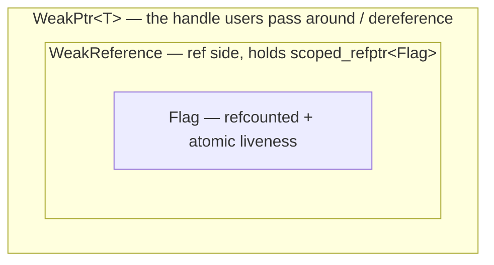

# WeakPtr Hands-on (II): The Core Skeleton and Control Block

## Recap of the three layers

WeakPtr is a three-layer structure: `Flag` (the control block), `WeakReference` (the reference side), and `WeakPtr<T>` (the user handle). The seven prerequisite pieces gathered all the parts. Intrusive refcounting, acquire/release, CHECK/DCHECK. In this piece we weld them together and watch how they mesh as real code. We build bottom-up, starting with the lowest and most heavily loaded layer, `Flag`. It's the carrier for the "is the object dead yet?" state from [prerequisite (0)](./pre-00-weak-ptr-weak-reference-and-lifetime.md), and the industrial-grade version of the hand-rolled flag in [01-4 cancellation token](../../01_once_callback/full/01-4-once-callback-cancellation-token.md).

Following the diagram from [02-1](./02-1-weak-ptr-motivation-and-api-design.md), let's put it in front of us again before we fill in the code:



Each layer's job is straightforward. `Flag` owns the "is the object dead yet?" state: one atomic flag bit plus a refcount. `WeakReference` is a thin wrapper around `scoped_refptr<const Flag>`, nothing more. `WeakPtr<T>` takes a `WeakReference` and adds a `T*`, becoming the handle you actually hold.

---

## Layer one: Flag, a refcounted atomic state

Before designing `Flag`, let's lay out the situation it's in. The factory side holds it, every WeakPtr side holds it, a crowd shares it. That settles it: it needs a refcount. The state it carries is a single boolean bit, "invalidated or not", and that bit gets read and written from different sequences, so it has to be atomic. On top of that, the refcount governs who deletes it, and the last sequence to let go might be the one doing the delete at any moment, so the count itself must be cross-thread safe.

Stack those three together and you get [prerequisite (I)](./pre-01-weak-ptr-intrusive-refcount-and-scoped-refptr.md)'s `RefCountedThreadSafe` meeting [prerequisite (II)](./pre-02-weak-ptr-atomic-and-memory-order.md)'s acquire/release. We reuse the minimal `RefCounted` from pre-01, give it the atomic counting semantics of `RefCountedThreadSafe`, then build Flag on top.

```cpp
// Platform: host | C++ Standard: C++17
#pragma once
#include <atomic>
#include <cassert>
#include <cstddef>

namespace tamcpp::chrome::internal {

// Sequence-safe intrusive refcount base (simplified RefCountedThreadSafe)
class RefCountedThreadSafe {
public:
    void add_ref() const noexcept {
        ref_count_.fetch_add(1, std::memory_order_relaxed);
    }
    bool release() const noexcept {
        if (ref_count_.fetch_sub(1, std::memory_order_acq_rel) == 1) {
            return true;    // caller is responsible for delete this
        }
        return false;
    }
    bool has_one_ref() const noexcept {
        return ref_count_.load(std::memory_order_acquire) == 1;
    }
protected:
    RefCountedThreadSafe() = default;
    ~RefCountedThreadSafe() = default;
private:
    mutable std::atomic<int> ref_count_{0};
};

// Matches Chromium's base::AtomicFlag: one-shot, release/acquire boolean flag
class AtomicFlag {
public:
    void Set() noexcept {
        flag_.store(1, std::memory_order_release);
    }
    bool IsSet() const noexcept {
        return flag_.load(std::memory_order_acquire) != 0;
    }
private:
    std::atomic<uint_fast8_t> flag_{0};
};

}  // namespace tamcpp::chrome::internal
```

With both parts in place, `Flag` itself is thin:

```cpp
// Platform: host | C++ Standard: C++17
namespace tamcpp::chrome::internal {

class Flag : public RefCountedThreadSafe {
public:
    Flag() = default;

    // Invalidate: release-store publishes "object entered invalidated state"
    // along with all prior writes.
    void Invalidate() noexcept {
        // Teaching version omits the sequence check; Chromium DCHECKs
        // seq.CalledOnValidSequence() || HasOneRef() here.
        invalidated_.Set();
    }

    // Liveness (same-sequence contract): acquire-load.
    bool IsValid() const noexcept {
        return !invalidated_.IsSet();
    }

    // Liveness (cross-sequence hint): also acquire-load, but the caller
    // owns the risk that a positive result is not to be trusted.
    bool MaybeValid() const noexcept {
        return !invalidated_.IsSet();
    }

private:
    template <typename> friend class scoped_refptr;   // allow delete when count hits zero
    ~Flag() = default;                   // private: outsiders can't delete directly
    AtomicFlag invalidated_;
};

}  // namespace tamcpp::chrome::internal
```

A few points in this code deserve a separate callout. `Flag` inherits `RefCountedThreadSafe`, so the atomic refcount comes for free. The destructor is deliberately `private`, narrowing the delete path to `release` and friends. That's the "block outsiders from deleting directly" trick from the end of [prerequisite (I)](./pre-01-weak-ptr-intrusive-refcount-and-scoped-refptr.md), saving us from careless hands.

`Invalidate` pairs with `IsValid`: one release-store, one acquire-load. We worked through the happens-before of this pair in [prerequisite (II)](./pre-02-weak-ptr-atomic-and-memory-order.md). As long as you read "invalidated", every write the object made before entering that state is visible to you, no extra locking needed. The teaching version drops the sequence checks (Chromium hangs `DCHECK(seq.CalledOnValidSequence() || HasOneRef())` in `Invalidate` and `DCHECK_CALLED_ON_VALID_SEQUENCE` in `IsValid`); we pick those back up in 02-4 when we cover lazy binding. The acquire/release core semantics, though, are not discounted by a single word here.

---

## Layer two: WeakReference, a wrapper around Flag

One level up is `WeakReference`. Plainly put, it's a shell around `scoped_refptr<const Flag>`, and it doesn't do much: hold a refcounted handle to Flag, and forward `IsValid` / `MaybeValid` / `Reset` straight through.

```cpp
// Platform: host | C++ Standard: C++17
namespace tamcpp::chrome::internal {

// Simplified scoped_refptr (see pre-01 for the full version)
template <typename T>
class scoped_refptr {
public:
    scoped_refptr() noexcept = default;
    explicit scoped_refptr(T* p) noexcept : ptr_(p) { if (ptr_) ptr_->add_ref(); }
    scoped_refptr(const scoped_refptr& o) noexcept : ptr_(o.ptr_) { if (ptr_) ptr_->add_ref(); }
    scoped_refptr(scoped_refptr&& o) noexcept : ptr_(o.ptr_) { o.ptr_ = nullptr; }
    ~scoped_refptr() { if (ptr_ && ptr_->release()) delete ptr_; }
    scoped_refptr& operator=(scoped_refptr r) noexcept { T* t = ptr_; ptr_ = r.ptr_; r.ptr_ = t; return *this; }
    T* get() const noexcept { return ptr_; }
    explicit operator bool() const noexcept { return ptr_ != nullptr; }
private:
    T* ptr_ = nullptr;
};

class WeakReference {
public:
    WeakReference() = default;
    explicit WeakReference(const scoped_refptr<Flag>& flag) : flag_(flag) {}

    bool IsValid() const noexcept { return flag_ && flag_->IsValid(); }
    bool MaybeValid() const noexcept { return flag_ && flag_->MaybeValid(); }
    void Reset() noexcept { flag_ = nullptr; }

private:
    scoped_refptr<Flag> flag_;
};

}  // namespace tamcpp::chrome::internal
```

`flag_` holds a refcounted handle, so multiple WeakReferences sharing one Flag won't step on each other. Once a Flag is constructed, its identity (which Flag `flag_` points at) never moves again. The only thing that changes is the single bit in `AtomicFlag invalidated_`, and `Set()` / `IsSet()` are thread-safe atomic operations in their own right, so cross-sequence reads and writes need no extra lock. (The real Chromium version at `weak_ptr.h:153` uses `scoped_refptr<const Flag>` here, letting the type itself shout "Flag identity is immutable". The teaching version drops that const to stay consistent with the matching `weak_ptr.hpp`.)

`Reset()` nulls `flag_`, and `IsValid()` / `MaybeValid()` immediately flip to false. That's letting go on purpose.

---

## Layer three: WeakPtr\<T\>, the user handle

At the top sits `WeakPtr<T>`, which takes a `WeakReference` and adds a `T*`. The semantics of that pointer are a little counterintuitive. While the object lives it points at it; once the object destructs, it's allowed to dangle, hanging there in plain sight but off-limits. [Prerequisite (V)](./pre-05-weak-ptr-template-friend-and-uintptr-t.md) explains why this deliberately avoids `raw_ptr`: allowing the dangle is part of the design, and `WeakReference` does the gating.

```cpp
// Platform: host | C++ Standard: C++20
#include <concepts>

namespace tamcpp::chrome {

template <typename T> class WeakPtrFactory;   // forward declaration

template <typename T>
class [[clang::trivial_abi]] WeakPtr {
public:
    WeakPtr() = default;
    WeakPtr(std::nullptr_t) noexcept {}    // NOLINT(google-explicit-constructor)

    // Upcast conversion constructor (see pre-04)
    template <typename U>
        requires(std::convertible_to<U*, T*>)
    WeakPtr(const WeakPtr<U>& other) noexcept
        : ref_(other.ref_), ptr_(other.ptr_) {}

    template <typename U>
        requires(std::convertible_to<U*, T*>)
    WeakPtr(WeakPtr<U>&& other) noexcept
        : ref_(std::move(other.ref_)), ptr_(other.ptr_) {}

    // Two postures: liveness check and dereference
    T* get() const noexcept { return ref_.IsValid() ? ptr_ : nullptr; }

    T& operator*() const { assert(ref_.IsValid()); return *ptr_; }   // teaching version uses assert; Chromium uses CHECK
    T* operator->() const { assert(ref_.IsValid()); return ptr_; }

    explicit operator bool() const noexcept { return get() != nullptr; }

    void reset() noexcept {
        ref_.Reset();
        ptr_ = nullptr;
    }

    bool maybe_valid() const noexcept { return ref_.MaybeValid(); }
    bool was_invalidated() const noexcept { return ptr_ && !ref_.IsValid(); }

private:
    template <typename U> friend class WeakPtr;
    friend class WeakPtrFactory<T>;

    // Only the factory can call this: used at mint time
    WeakPtr(internal::WeakReference&& ref, T* ptr) noexcept
        : ref_(std::move(ref)), ptr_(ptr) {
        assert(ptr);
    }

    internal::WeakReference ref_;
    T* ptr_ = nullptr;     // RAW_PTR_EXCLUSION: dangling allowed, ref_ gates before deref
};

}  // namespace tamcpp::chrome
```

Nothing here is casual. Every line maps back to some prerequisite piece. Let's go through them.

The `[[clang::trivial_abi]]` at the top of the class comes from pre-06. Its job is to let a type with a non-trivial destructor still pass through registers like a trivial type. Pre-06 worked through the safety preconditions: `ptr_` is a raw pointer and trivial already, and the `scoped_refptr` inside `ref_` is trivially relocatable. Both hold, so the annotation doesn't flip over.

The `requires` on the conversion constructors (pre-04's product) gates the cast direction. `WeakPtr<Derived>` can go to `WeakPtr<Base>`; the reverse and unrelated types get stopped at compile time. The `template <typename U> friend class WeakPtr` right after (pre-05) isn't decoration. The conversion constructors need to read `other.ref_` and `other.ptr_`, and without that friend declaration they couldn't reach them.

`operator*` and `operator->` use `assert` in the teaching version, catching trouble in debug. Chromium's real version uses `CHECK`, which crashes in release too. Dereferencing after invalidation is a flat-out logic error; in production it has to blow up on the spot. In 02-6 we'll switch the release behavior with a macro, so keep that in mind.

The private constructor plus `friend WeakPtrFactory<T>` at the end is the minting slot reserved for the factory. Through it the factory can write directly into `ref_` and `ptr_`, while nobody outside can touch them. That upholds the contract: only the factory makes WeakPtrs.

### The gating chain inside get()

The most important line is `get()`:

```cpp
T* get() const noexcept { return ref_.IsValid() ? ptr_ : nullptr; }
```

Expanded, the whole gating chain is:

```text
get() → ref_.IsValid() → (flag_ && flag_->IsValid()) → !invalidated_.IsSet()
                                                          ↑ acquire-load
```

One `get()` call boils down to a single atomic acquire-load underneath. Read "not invalidated", return `ptr_`, and the caller derefs with confidence. Read "invalidated", hand back `nullptr` honestly. Every bit of WeakPtr's safety hangs on this gate, and every dereference goes through, and only through, `get()`. `operator*` and `operator->` look like they touch `ptr_` directly, but each one `CHECK`s `ref_.IsValid()` first, which amounts to confirming `get()` won't return null.

---

## Stringing it together: a minimal runnable example

The factory isn't written yet (that's the next piece's job), but we can hand-assemble a Flag and a WeakReference to verify the three layers run end to end. The snippet below is pseudocode for exposition. It calls WeakPtr's private constructor directly, which in normal use only `WeakPtrFactory` can reach through friendship. The real compilable version sits in the matching `code/.../chrome_design/16_weak_ptr_skeleton.cpp`, and it goes through the factory's proper minting path.

```cpp
// Platform: host | C++ Standard: C++20
#include <iostream>

struct Foo { int x = 42; };

int main() {
    using namespace tamcpp::chrome;
    using namespace tamcpp::chrome::internal;

    Foo foo;

    // Hand-assemble a Flag + WeakReference (simulating the factory mint; 02-3 wraps it)
    auto* flag = new Flag();
    scoped_refptr<Flag> flag_ref(flag);                 // ref_count = 1
    WeakReference ref(flag_ref);                        // ref_count = 2
    WeakPtr<Foo> wp(std::move(ref), &foo);              // holds ref + &foo

    std::cout << (wp ? "alive" : "dead") << '\n';       // alive
    std::cout << wp->x << '\n';                         // 42

    flag->Invalidate();                                 // simulate the invalidation before object destructs
    std::cout << (wp ? "alive" : "dead") << '\n';       // dead
    std::cout << wp.get() << '\n';                      // 0 (nullptr)

    return 0;
}
```

Run it and the terminal prints `alive` / `42` / `dead` / `0`. Once `Invalidate` is called, `wp`'s `operator bool` (which goes through `get()` under the hood) flips to false, and `get()` honestly hands back nullptr. The promise [02-1](./02-1-weak-ptr-motivation-and-api-design.md) made back then, that when the object dies the callback gets nullptr rather than a dangling pointer, is now made good in code.

Our Flag here is still hand-assembled, though. Who mints it, and who calls `Invalidate` the moment the object destructs? That's where `WeakPtrFactory` steps in. Implementing the factory, plus the famous "last member" idiom, is the next piece.

## References

- [Chromium `base/memory/weak_ptr.h`](https://source.chromium.org/chromium/chromium/src/+/main:base/memory/weak_ptr.h)
- [Chromium `base/memory/weak_ptr.cc`](https://source.chromium.org/chromium/chromium/src/+/main:base/memory/weak_ptr.cc)
- [WeakPtr prerequisite (I): intrusive refcounting and scoped_refptr](./pre-01-weak-ptr-intrusive-refcount-and-scoped-refptr.md)
- [WeakPtr prerequisite (II): std::atomic and memory_order](./pre-02-weak-ptr-atomic-and-memory-order.md)
