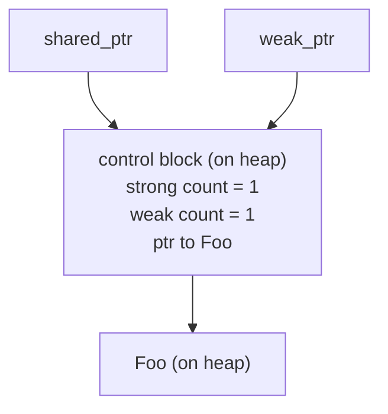

# WeakPtr prerequisite (0): weak references and the lifetime puzzle

In [OnceCallback hands-on (IV): the cancellation token](../../01_once_callback/full/01-4-once-callback-cancellation-token.md) we hand-rolled an atomic flag. Zero while the object is alive, flipped to 1 right before destruction, glanced at before the callback runs, no-op if set. The dangling problem went away. But the more we sat with it, the more something else bugged us: who owns that flag? How long does it live? How does the callback actually get hold of it? The tail we waved off back then is the most stubborn kind of problem in C++, lifetime and ownership.

Object A wants to reference object B without extending B's life, and still be able to ask at any moment whether B is still around. This piece unpacks that: how the standard library's `std::weak_ptr` handles it, why it falls short for async callbacks, and why Chromium rolled its own `WeakPtr` from scratch.

---

## Lifetime: two ends of an ownership spectrum

Zoom all the way out first. "A references B" in C++ sits on an ownership spectrum with two clean extremes and a whole lot of empty space in between. What we're hunting for is a foothold somewhere in that middle.

### Strong reference: to reference is to keep alive

`std::shared_ptr<T>` is the canonical strong reference. It expresses shared ownership: as long as one `shared_ptr` points at B, B cannot die; when the last one leaves, B gets destructed.

```cpp
auto sp = std::make_shared<Foo>();  // refcount = 1
{
    std::shared_ptr<Foo> sp2 = sp;  // refcount = 2
}   // sp2 leaves, refcount back to 1, Foo survives
// sp still around, Foo still alive
```

The rule is safe. The cost is real, too: anyone who takes a `shared_ptr` gets a hand in B's lifespan. Say A is a timer and B is the business object A holds a reference to so it can call B's method when the timer fires. What happens if A takes a `shared_ptr<B>`? As long as the timer hangs around, B can never be destructed, even when business logic says B should be gone. A meant to borrow B for a moment and ended up co-owning it. The ownership graph gets muddy, and everyone who later reasons about lifetimes has to squint.

### Raw pointer: owns nothing, and doesn't notice when the other side is gone

At the other end is the raw pointer `T*`. It stays entirely out of ownership; B's fate is none of A's business, use it if you want it. Light, yes. Dangerous, also yes:

```cpp
Foo* p = obj;
obj = nullptr;       // somewhere else destructed the object
p->do_something();   // dangling pointer, undefined behavior, likely a segfault
```

Note the real problem with raw pointers is not "doesn't extend lifetime", which is exactly what we want. The problem is that it has no way to express "and I still want to check whether the other side is alive." A pointer is an address, and an address doesn't go blank when the object is destroyed. `p` is still `p`, pointing at memory that may already be occupied by some other object. Access it and you get a use-after-free.

### What we actually want

Lay the two extremes side by side and what we want becomes clear, somewhere in the middle of the spectrum:

> Doesn't own, so it doesn't extend lifetime; but the slip of paper in your hand can still tell you whether the other side is gone.

That is a weak reference: it observes liveness without taking part in the ownership count. The standard library ships `std::weak_ptr`, but it carries nontrivial baggage; Chromium wrote its own `WeakPtr` in `//base`. The job of this series is to take both apart, understand them, and finally hand-build a teaching version ourselves.

---

## std::weak_ptr: the standard library's weak reference

`std::weak_ptr` entered the standard library in C++11. It has a hard rule: you can only construct it from a `shared_ptr`. You cannot conjure up a `weak_ptr` that points at a stack object or a bare `new`'d object.

The rule grows out of its mechanism. A `shared_ptr` internally points not only at a raw pointer but also at a separate heap block called the control block, which holds the reference counts. A `weak_ptr` shares that same control block but increments a separate counter, the weak reference count.



Here's the crux: `weak_ptr` doesn't bump the strong count, so it has no say in when Foo destructs. But it does bump the weak count, and that keeps the control block itself alive. That's where the weak reference picks up its distinctive trick: even after the object destructs, it can still answer "is the object gone yet."

### Three core operations

```cpp
auto sp = std::make_shared<Foo>();
std::weak_ptr<Foo> wp = sp;   // constructed from shared_ptr, doesn't bump strong count

wp.use_count();   // how many strong refs are left
wp.expired();     // equivalent to use_count() == 0, has the object destructed?
auto locked = wp.lock();  // try to upgrade back to a shared_ptr
```

`expired()` tells you whether the object is dead; `lock()` tries to promote the weak reference into a strong one. If the object is still alive it hands you a valid `shared_ptr`; if it's already gone it hands you a null one.

### Why you must use lock(), not expired() plus construction

The most natural way for a newcomer to write it is also the easiest way to crash:

```cpp
std::weak_ptr<Foo> wp = sp;
// ... somewhere else might release sp ...

if (!wp.expired()) {
    // wp isn't expired here?
    sp->do_something();   // wrong! sp may have been released between expired() and this line
}
```

The instant `expired()` returns `false` the object is genuinely alive. But between you getting that `false` and actually dereferencing, another thread may release the last `shared_ptr` and trigger destruction. This is the textbook TOCTOU (time-of-check-to-time-of-use) race: the moment you check and the moment you use are separated by an open window.

The fix is `lock()`. It packs "is it alive" and "promote to a strong reference" into a single atomic operation. Either you get a `shared_ptr` that guarantees the object is alive, or you get a null one. No gap in between:

```cpp
if (auto locked = wp.lock()) {
    locked->do_something();   // locked holds a strong count, object guaranteed alive
}
```

This step is the lifeline of safe `weak_ptr` use, and it's worth digesting: `lock()` folds the liveness check and the lifetime extension into one atomic op. Chromium's `WeakPtr` takes a different route. It doesn't extend lifetime at all, it only checks liveness, so it doesn't lean on `lock()`'s "check-plus-extend atomicity" to close the TOCTOU window. Instead it throws down a sequence contract: deref and invalidate must land on the same sequence, and within a sequence tasks run serially, so the window is gone at the root. We unpack that contract in 02-4 (sequence affinity); for now just plant the impression.

---

## make_shared and the control block: a counterintuitive memory detail

There's a detail worth stopping on here, because it leads straight into the "intrusive vs non-intrusive refcounting" question that motivates the next piece. We'll just plant the seed now.

`std::shared_ptr`'s control block is non-intrusive: a separate heap allocation, living apart from the object. So a single `std::shared_ptr<Foo>(new Foo)` is really two heap allocations under the hood, one for Foo and one for the control block.

```cpp
std::shared_ptr<Foo> sp1(new Foo);   // two heap allocations: Foo + control block
auto sp2 = std::make_shared<Foo>();   // one heap allocation: Foo and control block packed together
```

`std::make_shared` fuses the object and the control block into a single heap allocation, which is the main reason it's faster than `shared_ptr(new)`. But that optimization drags out a counterintuitive side effect: as long as one `weak_ptr` points at it, the entire block (including the chunk the object occupied) is never released, even after the object has long since destructed.

```cpp
std::weak_ptr<Foo> wp;
{
    auto sp = std::make_shared<Foo>();   // one allocation: control block + Foo
    wp = sp;
}   // sp leaves, Foo destructs, but the control block survives because wp is still around
// Foo's destructor has run, but the memory it occupied is still pinned, because the control
// block is packed together with it
auto sp2 = wp.lock();   // returns an empty shared_ptr, the object is indeed gone
// but that make_shared block only gets released once wp itself is destroyed
```

Why? The control block has to outlive every `weak_ptr` (otherwise `weak_ptr` couldn't safely query `expired()`), and `make_shared` chose to bundle the control block and the object into one allocation. Object destruction is not the same as memory release. In a scenario where the `weak_ptr` lives long, you end up dragging along a chunk of "dead but still occupied" memory.

This isn't a `weak_ptr` bug. It's the fallout of two design choices stacked together: a non-intrusive control block plus `make_shared`'s fused allocation. But it is a real cost, and Chromium's `WeakPtr` sidesteps it with intrusive refcounting. More on that in the next piece.

---

## Four limits of std::weak_ptr in async / callback scenarios

Zoom back in, to the scenario this series actually cares about: async callbacks and task posting. `std::weak_ptr` is a general, correct design; nobody is disputing that. But drop it into a system built on "post tasks + don't take ownership + serialized execution" and it bumps into you in four places, and each one is a reason Chromium started over.

### Limit one: must pair with shared_ptr, forcing ownership involvement

This one stings the most. `weak_ptr` can only come from a `shared_ptr`, which means: you want a weak reference? First rewrite the object to live behind a `shared_ptr`. But plenty of objects have a natural ownership that isn't shared at all. The object belongs to one owner, and when the owner goes it should go; it doesn't need the whole reference-counting apparatus.

Slap a `shared_ptr` onto an object that has no business being shared and the ownership graph distorts on the spot. What used to be a clean "single owner" becomes "in principle anyone could grab one." Every maintainer who later sees a `shared_ptr` has to stop and wonder: is this a genuine share, or a `shared_ptr` bolted on just to fabricate a `weak_ptr`? That hesitation has a cost you can't see but can definitely feel.

### Limit two: non-intrusive control block brings allocation overhead

Covered in the previous section: `shared_ptr` means either two allocations, or `make_shared`'s single allocation that pins memory. For a weakly referenced object created at high frequency (and callback targets are often exactly that), the overhead is not friendly. Chromium went intrusive: the refcount is baked into the object as a member, one allocation and done. More on that in the next piece.

### Limit three: can't invalidate a batch at once

Say an object is referenced by a dozen callbacks or timers, each clutching a `weak_ptr`. When the object destructs, those dozen `weak_ptr`s should expire together. But `weak_ptr` has no "actively batch-invalidate" move; they expire simply because the object's last `shared_ptr` went away. In other words, invalidation is a side effect driven by the refcount, not an action you can explicitly call.

In pure lifetime management that's fine. But the moment you want to express "the object is still alive, but it has entered a state where it must not be called back anymore," `weak_ptr` has nothing to say. In Chromium that kind of need is mundane; `WeakPtr` handles it (`InvalidateWeakPtrs()`, covered in 02-3).

### Limit four: no sequence affinity

`std::weak_ptr`'s threading model is "atomic operations are themselves safe; whether a dereference needs synchronization is your problem." In generic code that's a reasonable default. But drop it into a Chromium-style engineering discipline where "tasks run on a sequence, and almost every object recognizes exactly one sequence," and that freedom turns into a footgun. It won't remind you that "this object should only be deref'd on a particular sequence." Sooner or later you forget which dereference needed a lock.

Chromium wants the inverse. A weak reference can flow between sequences, but dereference and invalidation must land on the bound sequence, and violations get caught at least in debug builds. That's what `WeakPtr`'s `SEQUENCE_CHECKER` is for, expanded in 02-4.

---

## Chromium's trade: the weak reference it wanted

Stack the four limits together and Chromium's requirements become about as clear as they can get:

| Limit of `std::weak_ptr` | What Chromium's `WeakPtr` wants |
|---|---|
| Must pair with `shared_ptr` | **Doesn't take ownership**, the object is managed however it was managed, WeakPtr is only an observer |
| Non-intrusive control block | **Intrusive refcount**, the count is an object member, one allocation |
| Can't batch-invalidate | **Shared flag**, one factory invalidate drops every WeakPtr together |
| No sequence affinity | **Sequence-bound**, deref and invalidation must hit the bound sequence, DCHECK in debug |

That table is the roadmap for the six hands-on pieces that follow. What we're doing is dropping those four requirements into code, line by line: a `RefCountedThreadSafe` flag (intrusive plus cross-sequence safe), a release/acquire atomic pair (safe visibility across sequences), a `WeakPtrFactory` that carries batch invalidation, and a set of `SEQUENCE_CHECKER` macros standing guard over the sequence contract.

But before that, a few prerequisites need laying down first: how intrusive refcounting actually works (`scoped_refptr` / `RefCountedThreadSafe`, next piece), atomics and memory order (pre-02), sequences and thread affinity (pre-03), and the concepts plus `TRIVIAL_ABI` that WeakPtr leans on (pre-04 through pre-06). This piece is the "why." Get the requirements straight in your head and every implementation step that follows will clearly show which hole it's filling.

## References

- [cppreference: std::weak_ptr](https://en.cppreference.com/w/cpp/memory/weak_ptr)
- [cppreference: std::shared_ptr and the control block](https://en.cppreference.com/w/cpp/memory/shared_ptr)
- [cppreference: std::make_shared](https://en.cppreference.com/w/cpp/memory/shared_ptr/make_shared)
- [Chromium `base/memory/weak_ptr.h` design notes](https://source.chromium.org/chromium/chromium/src/+/main:base/memory/weak_ptr.h)
