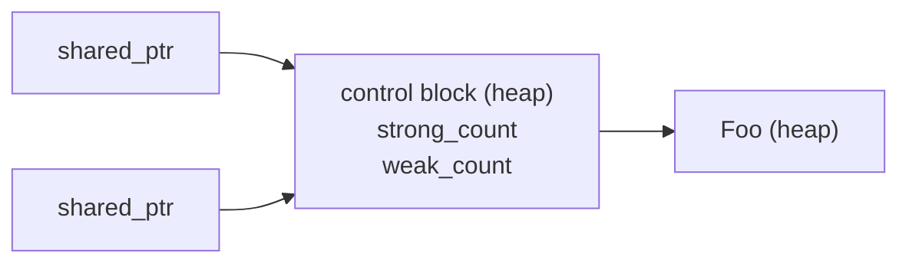
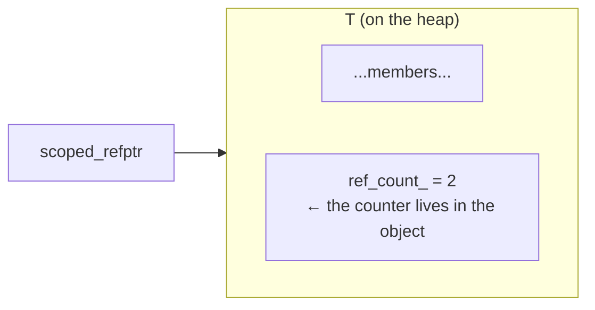

# WeakPtr prerequisite (I): intrusive refcount and scoped_refptr

In the previous piece we left a thread hanging: Chromium's `WeakPtr` parks the "is the object still alive?" state inside a small thing called `Flag`, and that Flag gets shared between the object's owner and every callback holding a WeakPtr, which often run on different sequences. A small object, shared by several parties, that still has to be freed safely. That is exactly the job refcounting was built for.

Yet Chromium does not use `std::shared_ptr`. It rolls its own intrusive refcount, with a shell called `scoped_refptr` and a base class `RefCountedThreadSafe`. The first time I hit this in the source I was honestly puzzled: the standard library already ships this, so why reinvent it? This piece works through that puzzle. Three things, laid out plainly: how `std::shared_ptr`'s non-intrusive control block differs from an intrusive counter, what the `scoped_refptr` shell actually looks like, and why WeakPtr's Flag has to be the cross-sequence-safe version.

---

## Refcounting: letting several owners share one object

Set the smart-pointer syntax aside for a second and look at the essence. Refcounting answers one question: an object is held by several owners, so how do we make sure it only gets destructed when the last owner leaves? The mechanism is almost embarrassingly simple, two steps. Pick up a new reference, bump the counter. Drop a reference, decrement; if it hits zero, you were the last one out, so turn off the lights and destruct the object.

The mechanism itself does not care where the counter lives. But "where the counter lives" is exactly the fork that splits `std::shared_ptr` and Chromium's `scoped_refptr` into two roads, one called non-intrusive, the other intrusive.

---

## Non-intrusive: how std::shared_ptr does it

`std::shared_ptr` puts the counter outside the object, in its own heap allocation called the control block. The smart pointer stores two pointers internally: one to the object, one to the control block.



The upside is direct: the object has no idea it is being refcounted. Take any type `T`, drop it into a `shared_ptr<T>`, and `T` does not change a single line. That is the great strength of non-intrusive, it is universal, anything fits.

The cost lands on allocation. You write `std::shared_ptr<Foo>(new Foo)` and under the hood there are two heap allocations, one for Foo, one for the control block. `std::make_shared<Foo>()` folds them into one and saves a malloc, but we covered its side effect in [prerequisite (0)](./pre-00-weak-ptr-weak-reference-and-lifetime.md): hang a long-lived `weak_ptr` off it and the entire object's memory sticks around unreleased.

There is a sneakier cost. The control block gets attached at runtime, so when all you have is a `T*` there is no way to backtrack to its refcount. That sounds harmless until you hit a question like "am I the sole owner right now?", and then it forces you to detour.

---

## Intrusive: the counter is a member of the object

Intrusive refcounting flips it around, the counter becomes part of the object itself. The usual move is to have `T` inherit a base class that carries the counter:



Now the pros and cons swap places compared to non-intrusive. The win is one allocation: object and counter are the same chunk, one `new` does it, no extra control block. The more valuable win is that any code holding a `T*` can reach the counter, because the counter is a member; `shared_ptr` given a raw pointer is helpless. The cost is the "intrusion" itself, `T` has to inherit a base class, change a line of code, and not just any type walks in.

### Comparison table

| Axis | Non-intrusive (`shared_ptr`) | Intrusive (`scoped_refptr`) |
|---|---|---|
| Counter location | Standalone control block (heap) | Member of the object itself |
| Heap allocations | 2 (or 1 with `make_shared`, but memory is fused) | **1** |
| Object modification needed | None | Must inherit a base class |
| Can a `T*` read the count | No | Yes (`HasOneRef()` etc.) |
| Weak reference | Built-in `weak_ptr` | Must build separately (that is what WeakPtr is for) |

Chromium picks intrusive fundamentally to crush overhead and to keep one uniform convention. `//base` has a flood of small objects all going through refcounting; shaving one allocation and one pointer indirection per object, at browser scale, is real money. And the uniform intrusive convention makes "read the count straight off a raw pointer" a legitimate operation, which is exactly the capability that `WeakPtr::Flag::Invalidate` needs for its cross-thread destruction exemption.

---

## Hand-rolling a minimal intrusive refcount

Theory is fine, but it is more fun to build one ourselves and let Chromium's design decisions fall out of it step by step. First the counting base class:

```cpp
// Platform: host | C++ Standard: C++17
#include <atomic>
#include <cstddef>

// Atomic intrusive refcount base (this is Chromium's RefCountedThreadSafe,
// not the non-atomic RefCounted (that one is for single-sequence objects;
// here we go cross-sequence, so atomics)
class RefCountedThreadSafe {
public:
    void add_ref() const noexcept {
        ref_count_.fetch_add(1, std::memory_order_relaxed);
    }

    bool release() const noexcept {
        // release semantics: writes before destruction stay visible to the
        // thread that then observes count == 0
        if (ref_count_.fetch_sub(1, std::memory_order_acq_rel) == 1) {
            return true;   // caller is responsible for delete this
        }
        return false;
    }

    bool has_one_ref() const noexcept {
        return ref_count_.load(std::memory_order_acquire) == 1;
    }

protected:
    RefCountedThreadSafe() = default;
    ~RefCountedThreadSafe() = default;

private:
    mutable std::atomic<int> ref_count_{0};
};
```

A few things deserve a tap. The counter is `mutable`, because `add_ref` / `release` do not, logically, change the observable state of the object, so they have to be callable on a `const` object. The `acq_rel` on `release` is deliberate: the acquire side synchronizes correctly with other threads' `add_ref` / `release` (it establishes happens-before; "always read the freshest value" is a different claim and would need `seq_cst`), and the release side, when the count drops to zero, publishes every write on this object to whichever thread picks up the `delete`.

Now have the target type inherit it:

```cpp
class Flag : public RefCountedThreadSafe {
public:
    Flag() = default;
    // ... business interface ...
};
```

At this point `Flag` carries its own counter. But a counter alone is not enough, we still need a smart pointer that calls `add_ref` / `release` automatically on copy, move, and destruct. That thing is `scoped_refptr`.

---

## scoped_refptr: the smart-pointer shell for intrusive refcount

`scoped_refptr<T>` does the same job as `std::shared_ptr<T>`: copy bumps the count, destruct decrements, hit zero and delete the object. The difference is that it does not keep a separate control block; it just calls the `add_ref` / `release` that `T` inherited. A minimal implementation looks like this:

```cpp
// Platform: host | C++ Standard: C++17
template <typename T>
class scoped_refptr {
public:
    scoped_refptr() noexcept = default;

    explicit scoped_refptr(T* p) noexcept : ptr_(p) {
        if (ptr_) ptr_->add_ref();
    }

    // copy: +1
    scoped_refptr(const scoped_refptr& other) noexcept : ptr_(other.ptr_) {
        if (ptr_) ptr_->add_ref();
    }

    // move: no bump, just empty the source
    scoped_refptr(scoped_refptr&& other) noexcept : ptr_(other.ptr_) {
        other.ptr_ = nullptr;
    }

    ~scoped_refptr() { release(); }

    scoped_refptr& operator=(scoped_refptr r) noexcept {  // copy-and-swap
        swap(r);
        return *this;
    }

    void swap(scoped_refptr& other) noexcept {
        T* tmp = ptr_; ptr_ = other.ptr_; other.ptr_ = tmp;
    }

    T* get() const noexcept { return ptr_; }
    T& operator*() const noexcept { return *ptr_; }
    T* operator->() const noexcept { return ptr_; }
    explicit operator bool() const noexcept { return ptr_ != nullptr; }

private:
    void release() noexcept {
        if (ptr_ && ptr_->release()) {
            delete ptr_;   // last reference, destruct
            ptr_ = nullptr;
        }
    }

    T* ptr_ = nullptr;
};
```

The `operator=` here has a point to it: it uses copy-and-swap. The by-value parameter `r` already performs one copy and bumps the count; inside the body it swaps with `this`, and when `r` destructs it releases the old reference `this` was holding. One move handles self-assignment and exception safety in the same stroke. Chromium's `scoped_refptr` is roughly this shape, with more details (inter-type conversions, `raw_ptr` integration, that sort of thing), but the core skeleton matches what we have here.

Usage is almost identical to `shared_ptr`:

```cpp
auto p = scoped_refptr<Flag>(new Flag);   // ref_count = 1
{
    auto p2 = p;                           // ref_count = 2
}                                          // p2 destructs, ref_count = 1
// p is still around, Flag is alive
```

But in memory it only allocated once, the `Flag` object itself, with the counter embedded inside.

---

## RefCounted vs RefCountedThreadSafe

Chromium actually keeps two versions of the refcount base class, and the difference comes down to "atomics or not."

One is `RefCounted<T>`, the non-atomic version. The counter is a plain integer doing plain add/sub, so it can only be used on a single sequence. It carries a `SequenceChecker` internally that, in debug builds, catches violations like "refcount touched from another sequence." If the count stays at 1 and never gets copied, the object can in fact be moved to another sequence; but the moment `add_ref` / `release` get called concurrently, that is a real data race. The upside is the lowest overhead.

The other is `RefCountedThreadSafe<T>`, the atomic version. The counter uses atomic instructions (`fetch_add` / `fetch_sub` with `acq_rel`), so multiple sequences and threads can bump and drop concurrently and safely. The cost is higher than the non-atomic version, one atomic op is not the same as one plain add/sub, but for an object shared across sequences it is a hard requirement.

The tradeoff is plain: stay single-sequence when you can, save the atomic cost; reach for the atomic version only when cross-sequence is unavoidable. Chromium does not just slap `ThreadSafe` on everything. In a browser the vast majority of objects are single-sequence by nature, and stacking atomics on hot paths adds up to real cost.

### HasOneRef(): the privilege of reading the count off a raw pointer

Intrusive has one capability non-intrusive cannot match. With nothing but a `T*` in hand, you can ask directly "am I the only reference right now":

```cpp
bool has_one_ref() const noexcept {
    return ref_count_.load(std::memory_order_acquire) == 1;
}
```

`shared_ptr` cannot do this, because it needs a `shared_ptr` first before it can reach the control block; hand it a bare `T*` and it has no idea where the control block is. But an intrusive counter grows right out of the object, so a `T*` is enough.

WeakPtr uses this trick cleverly. As we will see in [02-2 hands-on], `Flag::Invalidate` has this line:

```cpp
DCHECK(sequence_checker_.CalledOnValidSequence() || HasOneRef());
```

Read it out loud: Invalidate must be called on the bound sequence; but if `HasOneRef()` is true, meaning no WeakPtr is holding this Flag anymore, then it does not matter which sequence destructs it, let it through. That cross-thread destruction opening only exists when two things line up: intrusive refcount, and the ability to read the count off `this`. It is the most concrete, most valuable payoff of intrusive refcounting inside WeakPtr.

---

## A pit you must plug: never let users new/delete directly

Intrusive refcounting has one iron invariant, the object may only be `delete`d by `release()` at the exact moment the count hits zero, and never directly by outside code. Think it through: a user grabs a `scoped_refptr`, then turns around and `delete p.get()`s it; the counter is still being referenced by other `scoped_refptr`s, but the object is already destroyed. Instant dangling.

`std::shared_ptr` does not have to worry about this, because the control block holds the object in its grip. Intrusive cannot lean on that; it has to get the object to cooperate. Hide the destructor as `private` or `protected` and leave only the refcount `release` path as the way in. That is exactly what Chromium's `RefCountedThreadSafe` does: through a `friend`-protected `Destroy()` it actually runs `delete this`, and outside code cannot touch the destructor, so mistaken deletes are cut off at the source.

```cpp
// Teaching version: non-template base (matches RefCountedThreadSafe above at line 123)
// Real Chromium is the template form RefCountedThreadSafe<Flag>; see note below
class Flag : public RefCountedThreadSafe {
public:
    Flag() = default;

private:
    template <typename> friend class scoped_refptr;   // teaching: scoped_refptr does the delete
    ~Flag() = default;          // private: outside code cannot delete directly
    // ...
};
```

When we hand-roll the teaching version we follow the same principle, a private destructor plus a controlled release path, but one detail has to be said plainly. In real Chromium, `release()` calls a `Destroy()` static method that `RefCountedThreadSafe<T>` befriends, and that runs `delete this`; our simplified version writes `delete ptr_` straight inside `scoped_refptr<T>::~scoped_refptr()`. So in the teaching version Flag's friend is `scoped_refptr`, not `RefCountedThreadSafe`. The companion code `12_intrusive_refcount.cpp` and `weak_ptr.hpp` is written exactly this way and compiles directly. This approach is a twin sibling of RAII: resource acquisition is initialization, and release goes through exactly one controlled path.

---

The two forms of refcounting are now unwound. Non-intrusive `std::shared_ptr` parks the counter in a standalone control block, universal, at the price of one extra allocation; intrusive `scoped_refptr` embeds the counter in the object, one allocation, and hands you "read the count off a `T*`" as a bonus, at the price of the object having to inherit a base class. Chromium bets on intrusive across `//base` to crush overhead and keep one uniform convention. The choice between the two bases, `RefCounted` (non-atomic, single-sequence) and `RefCountedThreadSafe` (atomic, cross-sequence), comes down to "save where you can."

For WeakPtr specifically, the Flag is shared by WeakPtrs on several sequences, so it has to be `RefCountedThreadSafe`; and the "read the count off `this`" trick in `HasOneRef()` is the premise that lets `Flag::Invalidate` write its cross-thread destruction exemption. The next building block is atomics and memory order, so we can actually understand the `acq_rel` sitting inside `RefCountedThreadSafe`.

## References

- [Chromium `base/memory/ref_counted.h`](https://source.chromium.org/chromium/chromium/src/+/main:base/memory/ref_counted.h)
- [Chromium `base/memory/scoped_refptr.h`](https://source.chromium.org/chromium/chromium/src/+/main:base/memory/scoped_refptr.h)
- [cppreference: std::shared_ptr](https://en.cppreference.com/w/cpp/memory/shared_ptr)
- [cppreference: std::atomic and memory_order](https://en.cppreference.com/w/cpp/atomic/memory_order)
