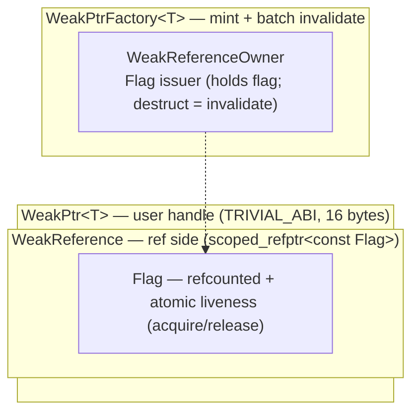

# weak_ptr Design Guide (I): Motivation, API, and the Control Block

> Hands-on track. Assumes you're already comfortable with acquire/release, concepts, and intrusive refcounting; if not, skim the [full/ prerequisites](../full/pre-00-weak-ptr-weak-reference-and-lifetime.md) first.

In the [OnceCallback design guide](../../01_once_callback/hands_on/01-once-callback-design.md) we hand-rolled a cancellation token: an atomic flag, set when the object destructs, checked before the callback runs. It solves the "callback outlives the object" dangling problem, but it leaves a loose end: who owns the flag's lifetime, and how does it reach the callback? Chromium's `//base` ships the industrial-strength answer, and it's `WeakPtr`. Implementation and tests come in the next two pieces.

## Where `std::weak_ptr` breaks down in async callbacks

`std::weak_ptr` is a general, correct design, but in a system built on "post tasks + don't take ownership + serialized execution" it has four sharp edges:

1. **Forces `shared_ptr`, so it drags in ownership.** Want a weak reference? You must rewrite the object to live behind a `shared_ptr`, distorting a clean single-owner model.
2. **Non-intrusive control block.** Either two heap allocations, or `make_shared` fuses them, but then a long-lived `weak_ptr` pins the entire object's memory.
3. **Can't invalidate a batch at once.** Invalidation is a refcount side effect (the last `shared_ptr` dying); there's no explicit invalidate-all. You can't express "the object still exists, but it's entered a state where it must not be called back."
4. **No sequence affinity.** Atomics are safe in themselves, but whether a dereference needs synchronization is on you, and in a "tasks run on a sequence" world that freedom is a footgun.

## The Chromium WeakPtr design philosophy

All four have a matching answer in WeakPtr; the tradeoffs are in the table:

| Sharp edge | WeakPtr's answer |
|---|---|
| Forces shared_ptr | **Doesn't take ownership** — observer, not owner |
| Non-intrusive control block | **Intrusive refcount** — Flag is `RefCountedThreadSafe`, one allocation |
| Can't batch-invalidate | **Shared Flag** — one factory invalidate, all WeakPtrs drop together |
| No sequence affinity | **Sequence-bound** — deref/invalidate must hit the bound sequence; DCHECK catches violations in debug |

The move is straightforward: we peel “is the object still alive?” off the object itself and make it a small refcounted thing (Chromium calls it Flag) that the factory and every WeakPtr share. Split it out this way and “one invalidate, all observers drop” follows naturally; when the pointed-at object destructs is none of WeakPtr’s business.

## The API

The public surface is small:

```cpp
// Weak handle: doesn't extend lifetime, can check liveness
template <typename T> class [[clang::trivial_abi]] WeakPtr {
public:
    WeakPtr() = default;
    WeakPtr(std::nullptr_t);

    template <typename U> requires(std::convertible_to<U*, T*>)   // upcast
    WeakPtr(const WeakPtr<U>&);

    T* get() const;                 // invalidated → nullptr, no crash
    T& operator*() const;           // invalidated → CHECK/assert
    T* operator->() const;
    explicit operator bool() const;
    void reset();

    bool maybe_valid() const;       // cross-sequence hint: negative trusted, positive not
    bool was_invalidated() const;   // distinguish "invalidated" from "manually reset"
};

// The mint: hangs on the observed object, batch-invalidates
template <typename T> class WeakPtrFactory {
public:
    explicit WeakPtrFactory(T* ptr);
    WeakPtr<T> get_weak_ptr();                  // non-const overload requires(!is_const_v<T>)
    WeakPtr<const T> get_weak_ptr() const;
    void invalidate_weak_ptrs();                // invalidate + mint a fresh Flag
    void invalidate_weak_ptrs_and_doom();       // invalidate + stop minting (cheaper)
    bool has_weak_ptrs() const;
};
```

A few signature calls we made (see [full/02-1](../full/02-1-weak-ptr-motivation-and-api-design.md)): `operator*`/`operator->` use `CHECK` (dereferencing an invalidated handle is a definite bug, crashes in release too), `get()` returns a raw pointer as the escape hatch; `operator==`/`<=>` are deliberately absent (weak-reference comparison is unstable); `WeakPtrFactory` uses composition, not inheritance, and must be the last member.

## Internals: the two-layer control block

The whole mechanism stacks into four layers, isomorphic to OnceCallback's `BindState` (type erasure + refcount at the bottom, a lightweight handle on top):



**Flag** is the lifeline: `RefCountedThreadSafe` (cross-sequence sharing) + `AtomicFlag invalidated_` (the liveness bit, release-Set / acquire-IsSet). `Invalidate` does a release-store, `IsValid` does an acquire-load. That pair establishes happens-before: if you read invalidated, you also see every write the object made before entering the invalidated state, with no extra locking. Flag also carries a `SEQUENCE_CHECKER` (lazy-bound, zero bytes as a no-op in release).

Flag's refcount only governs how long Flag itself lives (as long as any WeakPtr holds it, Flag stays); the pointed-at object destructs whenever it destructs, Flag doesn't care.

## Key design decisions

| Decision | Choice | Reason |
|---|---|---|
| Assert level on invalidated deref | `CHECK` (crashes in release too) | UAF in the making; fail immediately |
| Assert level on sequence violation | `DCHECK` (debug only) | Contract violation, not immediate memory-safety; debug catch is enough |
| `ptr_` as raw pointer + `RAW_PTR_EXCLUSION` | Dangling allowed | `IsValid` gates before deref; raw_ptr quarantine would bloat memory |
| Storing the pointer as `uintptr_t` (in factory base) | Sunk into a non-template base | Shrinks template bloat (each T instantiates only a thin derived layer) |
| `WeakPtrFactory` composition vs inheritance | Composition | Flexible, works for any type, doesn't pollute the inheritance chain |
| `[[clang::trivial_abi]]` | Annotated | `ptr_` raw trivial + scoped_refptr trivially relocatable; passes in registers |

The architecture and signatures are on paper; in the next piece we turn these promises into code, line by line.

## References

- [Chromium `base/memory/weak_ptr.h`](https://source.chromium.org/chromium/chromium/src/+/main:base/memory/weak_ptr.h)
- [weak_ptr design guide (II): step-by-step implementation](./02-weak-ptr-implementation.md)
- [WeakPtr prerequisite (0): weak references and the lifetime puzzle](../full/pre-00-weak-ptr-weak-reference-and-lifetime.md)
- [OnceCallback design guide (I): motivation and API design](../../01_once_callback/hands_on/01-once-callback-design.md)
