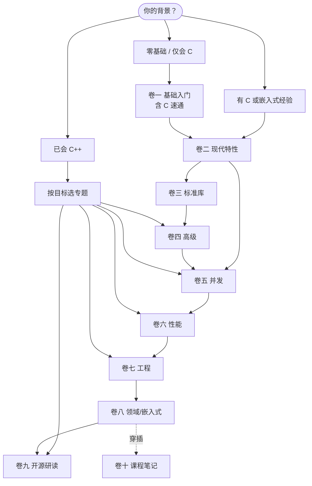

# 学习路线图

这套教程是一份系统化的现代 C++ 学习材料，**十卷从入门一路走到嵌入式实战**。这份路线图只回答三个问题：该怎么学、从哪里开始、每一卷教什么。

无论你是零基础、有 C/嵌入式底子，还是已经会写 C++ 想补齐工程能力，下面都先帮你按背景选起点，再逐卷展开。

> 这里是**学习路线图**（读者怎么学）。项目本身的开发进展与规划是另一回事，见文末[内容成熟度与项目路线图](#内容成熟度与项目路线图)。

## 这份路线图怎么用

整套教程按一条递进主线组织：

```
基础 → 现代特性 → 标准库 → 高级 → 并发 → 性能 → 工程 → 领域实战
```

几点先说清楚：

- **不是语法速查**。每个关键概念都配可编译的 CMake 示例，能跑、能改、能验证。
- **卷与卷之间有依赖**。后面的卷默认你掌握了前面的核心，其中**卷一 → 卷二是最关键的分水岭**——过了卷二，你才算真正进入「现代 C++」。
- **可以跳读**。有相关背景的读者不必从卷一第一页读起，按下面的「三条路径」选起点即可。
- **配套资源随时查**。[C++ 特性参考卡](/cpp-reference/)（按标准版本 + 功能类别双视图速查）、[实战项目](/projects/)、[课程笔记](/vol10-open-lecture-notes/)。

## 三条学习路径（按背景选起点）



**路径 A · 零基础 / 仅会 C** —— 起点 [卷一](/vol1-fundamentals/)（含完整的 C 语言速通）。沿主线一卷一卷走，最稳，也最长。跳读策略：已有编程经验的话，C 速通可快速过，重点啃值类别、OOP、模板初步。

**路径 B · 有 C 或嵌入式经验** —— 你的语法底子够，直接进 [卷二](/vol2-modern-features/) 补「现代 C++ 写法」，然后扎进 [卷八 嵌入式](/vol8-domains/) 实战；并发（卷五）、性能（卷六）、工程（卷七）按需补。

**路径 C · 已会 C++** —— 按目标直取专题：要并发/异步读 [卷五](/vol5-concurrency/)，要性能读 [卷六](/vol6-performance/)，要工程化读 [卷七](/vol7-engineering/)，想读大型源码读 [卷九](/vol9-open-source-project-learn/)，追前沿读 [卷四](/vol4-advanced/)。

## 卷级详解

### 卷一 · 基础入门

- **定位**：从零建立完整的 C++ 知识体系，是全仓的地基与起点；附一份完整的 C 语言速通（含嵌入式相关的高级 C）。
- **关键主题**：环境搭建 · 类型系统与值类别 · 控制流与函数 · 指针与引用 · 数组与字符串 · 类与面向对象 · 运算符重载 · 继承与多态 · 模板初步 · 异常处理 · STL 初见 · 内存模型基础；C 速通覆盖指针精髓、结构体与对齐、C 陷阱、嵌入式 C 模式。
- **难度 · 前置**：入门 → 中级 / 无前置。
- **建议节奏**：零基础全读；有底子的跳过 C 速通，重点看值类别、OOP、模板初步——这几块决定后面顺不顺。这卷正在重写（快速入门 → 全栈入门），章节可能微调，但核心主题稳定。

### 卷二 · 现代特性

- **定位**：系统掌握 C++11/14/17 核心特性，是「会写 C++」与「会写现代 C++」的关键分水岭。
- **关键主题**：移动语义与右值引用 · 智能指针与 RAII · `constexpr` 编译期计算 · Lambda 与函数式 · 类型安全（`enum class`/`variant`/`optional`） · 结构化绑定 · `auto`/`decltype` · 属性 · `string_view` · `filesystem` · 现代错误处理（`optional`/`expected`） · 用户自定义字面量。
- **难度 · 前置**：中级 / 卷一。
- **建议节奏**：核心转折卷，务必精读；它决定你后续所有卷的顺畅度。

### 卷三 · 标准库深入

- **定位**：STL 容器与字符串的实现细节、性能与内存底层机制。
- **关键主题**：`vector` 三指针表示 / 扩容 / 迭代器失效 · `string` 内存模型与小字符串优化 · `char8_t` 与 UTF-8 · `array` · `span` · 对象大小与平凡类型 · 自定义分配器。
- **难度 · 前置**：中级 / 卷一、卷二。
- **建议节奏**：篇幅小而深，按需精读；做性能敏感或嵌入式开发时回头看。其中 `vector`/`string`/`char8_t` 几篇最稳，可先读，其余在重写中。

### 卷四 · 高级主题

- **定位**：C++20/23 前沿特性与元编程技术，写库、写高性能泛型代码的人必经。
- **关键主题**：协程（基础 + 调度器实现） · Ranges（views + 管道实践） · 三路比较 `<=>` · 空基类优化 · C++ Modules（MSVC） · 指定初始化。
- **难度 · 前置**：高级 / 卷二、卷三。
- **建议节奏**：先读协程、Ranges、三路比较三块；模板体系（C++11→23 元编程）等内容在规划中，随用随补。

### 卷五 · 并发编程

- **定位**：从线程原语到协程异步，建立完整并发判断力——先正确再性能、先锁再无锁、先同步再任务。
- **关键主题**：线程生命周期与 RAII · 互斥与同步原语（含 `latch`/`barrier`/`semaphore`） · `atomic` 与六种内存序 · 无锁数据结构（SPSC/MPMC 队列） · `future` 与线程池 · 协程与事件循环（Echo 服务器） · Actor/Channel。
- **难度 · 前置**：中高 / 卷一 ~ 卷四。
- **建议节奏**：全仓投入最重、动手项目最多的一卷，配有 Lab 0–5 + Capstone（Mini Concurrent Runtime）。强烈建议动手做 Lab，别只读。

### 卷六 · 性能优化

- **定位**：编译器优化、代码大小评估、SIMD 等 C++ 性能核心技术。
- **关键主题**：内联与编译器优化（破除「`inline` = 性能开关」的迷思） · 性能与代码大小评估 · AVX/AVX2。
- **难度 · 前置**：中高 / 卷五。
- **建议节奏**：内容在扩充；先建立缓存层级与 SIMD 直觉，后续按专题深入。

### 卷七 · 工程实践

- **定位**：C++ 软件工程落地——构建、交叉编译、链接、调试、平台开发。
- **关键主题**：CMake 与交叉编译 · 编译器选项 · 链接器与链接脚本 · WSL 开发 · MSVC 调试原理 · C++ Modules（VS2026） · 文件 I/O（文件拷贝器实战）。
- **难度 · 前置**：中级 / 建议先读「编译与链接深入」。
- **建议节奏**：配合[编译与链接](/compilation/)一起学，按当前工程栈挑读。

### 编译与链接深入

- **定位**：C/C++ 编译、链接、静态/动态库、符号可见性的底层机制，是工程实践的基础。
- **关键主题**：编译链接概述 · 复用与库的概念 · 静态库 · 动态库（设计原则 / 符号可见性 / 运行时加载 / 库检索逻辑 / 动态库可执行化）。
- **难度 · 前置**：中级 / C++ 基础。
- **建议节奏**：作为卷七的前置；做嵌入式/交叉编译前必读。这卷内容已完整稳定。

### 卷八 · 领域应用

- **定位**：现代 C++ 在各垂直领域的实战，**主线是嵌入式**。
- **关键主题**：STM32（**仅 STM32F1，如 Blue Pill；暂无 F4**）环境搭建 · LED / 按键 / UART 三条全流程（从 C 写法重构到 C++23 模板封装） · 零开销抽象 · 类型安全寄存器访问 · 循环缓冲 / 对象池 / 侵入式容器等嵌入式模式 · 中断安全；另有 C++ 深潜（指针语义系列）。网络 / GUI / 数据存储 / 算法等子域在规划中。
- **难度 · 前置**：中级 / 卷一 ~ 卷七。
- **建议节奏**：嵌入式是当前最完整的领域主线，按外设循序渐进；手头有 STM32F1 板子可同步实操。

### 卷九 · 开源项目学习

- **定位**：拆解工业级开源项目源码，学真实世界的 C++ 设计与实现。
- **关键主题**：目前聚焦 Chromium 的 `OnceCallback` 回调组件——从动机、API 设计、核心骨架到 `bind_once`，并穿插 C++23 `deducing this`、`move_only_function` 等前置深潜。更多项目在规划中。
- **难度 · 前置**：中高 / 卷一 ~ 卷七（尤其卷四、卷五）。
- **建议节奏**：读源码导向；建议先掌握卷四高级特性，再来读工业级实现。

### 卷十 · 课程与演讲笔记

- **定位**：CppCon 等技术会议演讲的阅读笔记和二次创作。
- **关键主题**：目前是 CppCon 2025 四场——Bjarne Stroustrup《Concept-based Generic Programming》、Matt Godbolt《Some Assembly Required》（读汇编 / Compiler Explorer）、Mike Shah《Back to Basics: Ranges》、Ben Saks《Back to Basics: Move Semantics》。
- **难度 · 前置**：中级 / 卷一 ~ 卷五。
- **建议节奏**：用作「深化」——学完对应卷后看相关演讲笔记加固理解，穿插在读主线之间。

## 学习节奏与建议

- **时间预期**：零基础走完整条主线是长期工程，别指望速成；按卷设里程碑，每卷配示例动手敲。
- **推荐顺序**：严格按 一 → 二 → 三 → 四 → 五 → 六 → 七 → 八 的依赖走最稳；有背景则按「三条路径」切入。
- **跳读策略**：卷一可跳 C 速通；卷三、卷六篇幅小或扩充中，按需读；卷九目前聚焦单一项目，等积累够了再读；卷十穿插在对应卷之后当复习。
- **用实战串联**：每学完一块，去[实战项目](/projects/)找对应项目练手（协程服务器、并发运行时、嵌入式等），把零散知识捏成完整能力。

## 配套资源

- [C++ 特性参考卡](/cpp-reference/)：C++98 → C++23 速查，按标准版本与功能类别双视图组织，每张卡标注嵌入式适用性。
- [贯穿式实战项目](/projects/)：一个项目索引页，把散落在各卷的实战（协程 Echo 服务器、Mini Concurrent Runtime、Chromium OnceCallback 研读等）串起来；规划中还有手写 STL、迷你 HTTP 服务器、迷你 GUI、嵌入式迷你 OS。
- [社区文章](/community/)：社区来稿与审阅收录，也欢迎你投稿。
- [卷十 课程笔记](/vol10-open-lecture-notes/)：CppCon 等顶级演讲的二次创作，深化用。

## 内容成熟度与项目路线图

各卷的当前状态，供你判断哪部分内容最扎实（只给定性判断，不纠结具体篇数）：

- ✓ **成熟稳定**：卷二 现代特性、卷五 并发、编译与链接深入。
- ✦ **推进中**：卷一 基础（正重写为全栈入门）、卷七 工程、卷八 领域（嵌入式主线已完整）、卷九 开源研读、卷十 课程笔记。
- ◇ **扩充 / 重写中**：卷三 标准库（半数在重写）、卷四 高级（模板体系等在规划）、卷六 性能（扩充中）。

想看**项目本身的开发规划**（要做什么、发布节奏、TODO 优先级），那是另一份文档：

- 📋 [项目开发路线图（`community/dev/`）](/community/dev/) — 维护节奏、发布治理、站点演进。
- 📦 [版本变更记录（`changelogs/`）](https://github.com/Awesome-Embedded-Learning-Studio/Tutorial_AwesomeModernCPP/tree/main/changelogs) — 每个已发布版本改了什么。

> 简言之：**学习路线图**（本页）回答「我该怎么学」；**项目路线图**回答「这个项目在做什么」。
