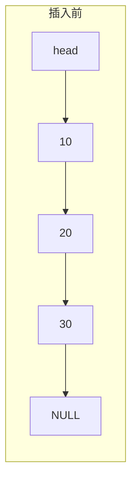
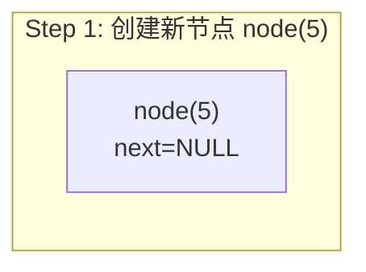
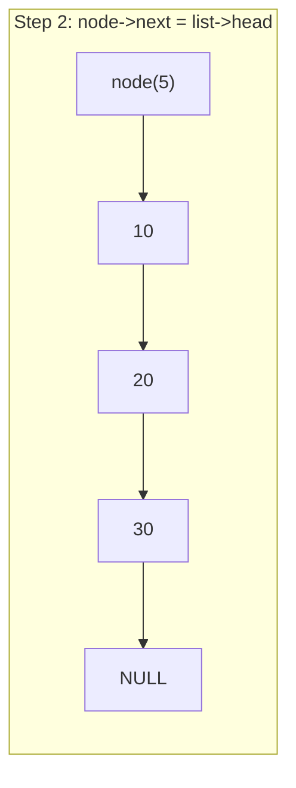
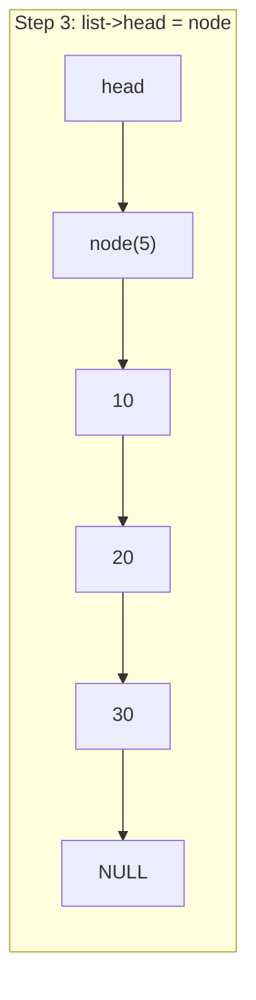

# 手搓单链表——指针与内存的实战

到目前为止我们已经折腾过动态数组了，那一篇里我们用 `malloc` 和 `realloc` 管理一块连续内存，体验了一把"手动挡"内存管理的乐趣。但是连续内存有一个天生的限制——在中间插入和删除元素的时候，你需要把后面所有的数据都挪一遍，时间复杂度 O(n)。对于频繁插入删除的场景，这显然不够优雅。

链表就是为了解决这个问题而生的经典数据结构。你可以把它想象成一列火车——每节车厢不仅装着货物（数据），还通过车钩（指针）和下一节车厢连在一起。我们只需要知道车头在哪，就能顺着车钩一节一节走到任意车厢。和数组那排整齐的"储物柜"不同，火车车厢不需要排在同一条轨道上——每节车厢可以停在任意位置，只要车钩连着就行。这就是链表的核心 trade-off：它放弃了内存连续性和随机访问能力，换来了 O(1) 的插入和删除（当然前提是你已经找到了位置）。

说实话，链表是很多人学数据结构时碰到的第一个坎——不是因为概念本身有多难，而是因为指针操作的各种边界条件实在太容易出错。空指针、野指针、断链、内存泄漏……每一个都能让你调到半夜。Python 和 Java 程序员基本不需要手搓链表，标准库直接给你 `list`、`LinkedList`，垃圾回收帮你把内存管得妥妥当当。但 C 语言什么都没有——没有标准链表容器、没有垃圾回收、没有泛型，你只能靠指针和 `malloc` 自己搓。这恰恰是我们练兵的好机会，因为只有亲手把链表的每一个指针操作都写过一遍，你才能真正理解 C++ 的 `std::forward_list`、`std::unique_ptr` 这些工具到底帮你省掉了哪些麻烦。

所以这篇我们就不搞花哨的了，踏踏实实从零手搓一个经典单链表，把节点设计、插入删除、查找遍历、哨兵节点这些核心操作全部过一遍，顺便把指针和内存管理的实战能力再拉一个台阶。

> **学习目标**
>
> 完成本章后，你将能够：
>
> - [ ] 理解单链表节点结构设计与内存模型
> - [ ] 实现头部/尾部/指定位置的插入与删除
> - [ ] 掌握哨兵节点（dummy head）技巧
> - [ ] 处理链表操作中的各种边界条件
> - [ ] 理解链表内存所有权与释放策略
> - [ ] 了解 C++ 标准库链表容器的设计取舍

## 环境说明

本文所有代码在以下环境中编写和测试：

```text
平台：Linux (x86_64)，WSL2
编译器：GCC 13+，编译选项 -Wall -Wextra -std=c17
构建工具：CMake 3.20+
调试工具：GDB + Valgrind（用于内存泄漏检测）
```

代码风格遵循项目约定：函数 `snake_case`，类型 `PascalCase`，常量 `kPascalCase`，4 空格缩进，指针靠左写 `int* p`。建议始终开启 `-Wall -Wextra` 编译——链表代码里的空指针解引用和野指针问题，编译器警告往往能第一时间帮你揪出来。

## 第一步——搞清楚节点怎么设计

万事开头难，我们先来设计链表最基本的构建单元——节点（Node）。每个节点需要存两个东西：一个数据域和一个指针域。数据域存放实际的值，指针域存放下一个节点的地址。你可以类比一列火车——每节车厢既有装载货物的货舱（数据域），又有连接下一节车厢的车钩（指针域）。

```c
#include <stdio.h>
#include <stdlib.h>
#include <stdbool.h>

/// @brief 单链表节点
typedef struct ListNode {
    int data;                // 数据域
    struct ListNode* next;   // 指针域：指向下一个节点
} ListNode;
```

这里有一个细节值得注意——`struct ListNode* next` 里面必须写完整的 `struct ListNode`，不能只写 `ListNode*`。原因在于 `typedef` 还没生效的时候，`ListNode` 这个名字还不存在，编译器不认识它。自引用结构体就是这么别扭，但习惯了就好。

> ⚠️ **踩坑预警**
> 自引用结构体里写 `ListNode* next` 而不是 `struct ListNode* next` 会直接编译报错——因为 `typedef` 别名要到整个声明结束才生效，在结构体内部编译器只认识 `struct ListNode` 这个完整写法。这个坑新手几乎必踩一次。

光有节点还不够，我们还需要一个"链表"类型来管理整条链的元信息。最简单的做法是只维护一个头指针：

```c
typedef struct {
    ListNode* head;    // 指向链表第一个节点
    int size;          // 链表长度，方便 O(1) 查询
} LinkedList;
```

把 `size` 放在结构体里是一个很实用的做法——虽然可以通过遍历来数节点，但那是 O(n) 的操作。维护一个 `size` 字段让获取长度变成 O(1)，代价只是每次增删时多改一个整数，非常划算。

## 第二步——把链表造出来再安全地拆掉

数据结构的生命周期管理永远是第一步。类比一下：链表就像搭积木——先拿一块底板（`LinkedList` 结构体），然后往上面一个一个叠积木块（`ListNode`）。拆的时候要一个一个取下来，最后把底板也收走。顺序不能乱，否则积木哗啦啦全倒了。

先来实现创建：

```c
/// @brief 创建一个空链表
LinkedList* linked_list_create(void) {
    LinkedList* list = (LinkedList*)malloc(sizeof(LinkedList));
    if (list == NULL) {
        return NULL;
    }
    list->head = NULL;
    list->size = 0;
    return list;
}
```

创建的时候 `head` 设为 `NULL`，`size` 设为 0，一个空链表就诞生了。`malloc` 的返回值检查不能省——虽然在学习代码里经常偷懒跳过，但在正式项目里内存分配失败是必须处理的错误路径。

接下来是创建单个节点的小函数，后面插入操作都会用到它：

```c
/// @brief 创建一个新节点
/// @param data 节点数据
/// @return 新节点指针，失败返回 NULL
static ListNode* list_node_create(int data) {
    ListNode* node = (ListNode*)malloc(sizeof(ListNode));
    if (node == NULL) {
        return NULL;
    }
    node->data = data;
    node->next = NULL;
    return node;
}
```

用 `static` 修饰是因为这个函数只在内部使用，不暴露给外部调用者。这是一种很好的封装习惯——减小命名空间的污染，也向读者传达"这是内部实现细节"的信息。

销毁链表是一个比较容易出错的地方。我们需要逐个遍历节点并释放，最后再释放链表结构体本身。问题是——如果直接 `free` 当前节点，就丢失了下一个节点的地址，链就断了。所以我们需要一个临时指针来"先存后删"：

```c
/// @brief 销毁链表，释放所有内存
void linked_list_destroy(LinkedList* list) {
    if (list == NULL) {
        return;
    }

    ListNode* current = list->head;
    while (current != NULL) {
        ListNode* next = current->next;  // 先保存下一个节点的地址
        free(current);                    // 再释放当前节点
        current = next;                   // 移动到下一个
    }

    free(list);  // 最后释放链表结构体本身
}
```

这个"先存后删"的遍历释放模式非常重要——它是链表操作中最基本的操作模式之一。后面删节点的时候也是同样的思路，区别只是释放的是单个节点还是全部节点。

> ⚠️ **踩坑预警**
> 销毁链表时如果先 `free(current)` 再读 `current->next`，就构成 Use-After-Free——释放后访问已回收的内存。这种 bug 在 Valgrind 下会立刻报错，但如果不跑 Valgrind，它可能"恰好"正常工作（因为那块内存还没被覆写），等你在嵌入式设备上跑了几个小时之后才随机炸掉。所以这个顺序必须牢记：先存、再删、后移。

## 第三步——在头部插入节点

链表最简单也最高效的插入操作就是头部插入——把新节点放在链表的最前面，让 `head` 指向它。这个操作永远是 O(1) 的，不需要遍历。类比火车的话，就是在火车头前面再挂一节车厢，然后把车头的标记移到新车厢上。

```c
/// @brief 在链表头部插入元素
/// @return 成功返回 true，内存不足返回 false
bool linked_list_push_front(LinkedList* list, int data) {
    if (list == NULL) {
        return false;
    }

    ListNode* node = list_node_create(data);
    if (node == NULL) {
        return false;
    }

    node->next = list->head;  // 新节点指向原来的第一个节点
    list->head = node;        // head 指向新节点
    list->size++;
    return true;
}
```

我们来画一下这个过程。假设链表原来是 `10 -> 20 -> 30`，现在要在头部插入 `5`：









整个过程只改了两个指针，没有遍历，所以是 O(1)。注意这两步的顺序不能反——如果先 `list->head = node`，那原来第一个节点的地址就丢了，链表直接断链。这个顺序是链表头部操作的铁律：**先连后断**——先把新节点接到链上，再改 `head` 指针。

## 第四步——在尾部追加节点

尾部插入比头部插入多一步——需要先找到最后一个节点。如果链表为空，那尾部插入和头部插入是一样的。

```c
/// @brief 在链表尾部插入元素
bool linked_list_push_back(LinkedList* list, int data) {
    if (list == NULL) {
        return false;
    }

    ListNode* node = list_node_create(data);
    if (node == NULL) {
        return false;
    }

    if (list->head == NULL) {
        // 空链表：新节点就是第一个节点
        list->head = node;
    } else {
        // 非空链表：找到最后一个节点
        ListNode* tail = list->head;
        while (tail->next != NULL) {
            tail = tail->next;
        }
        tail->next = node;
    }

    list->size++;
    return true;
}
```

> ⚠️ **踩坑预警**
> 遍历找尾部时，终止条件必须是 `tail->next != NULL` 而不是 `tail != NULL`。如果用后者，循环结束时 `tail` 是 `NULL`——你就丢失了对最后一个节点的引用，没法把新节点挂上去，执行 `tail->next = node` 就是空指针解引用，直接段错误。这是链表代码里非常高频的一个 bug。

尾部插入的时间复杂度是 O(n)，因为要遍历到尾部。如果频繁做尾部插入，可以像维护 `size` 一样维护一个 `tail` 指针，这样尾部插入就也是 O(1) 了。不过维护额外的 `tail` 指针增加了不少边界条件的复杂度（删除尾节点时还要更新它），我们这里先不引入，后面在双向链表里会自然解决。

## 第五步——在指定位置插入节点

有了头部和尾部插入还不够，很多时候我们需要在指定位置插入元素。我们约定：`index` 为 0 表示头部插入，`index` 等于 `size` 表示尾部插入，超过 `size` 则视为非法操作。

```c
/// @brief 在指定位置插入元素
/// @param index 插入位置（0-based）
bool linked_list_insert_at(LinkedList* list, int index, int data) {
    if (list == NULL || index < 0 || index > list->size) {
        return false;
    }

    if (index == 0) {
        return linked_list_push_front(list, data);
    }

    // 找到 index-1 位置的节点（前驱节点）
    ListNode* prev = list->head;
    for (int i = 0; i < index - 1; i++) {
        prev = prev->next;
    }

    ListNode* node = list_node_create(data);
    if (node == NULL) {
        return false;
    }

    node->next = prev->next;  // 新节点指向原来 index 位置的节点
    prev->next = node;        // 前驱节点指向新节点
    list->size++;
    return true;
}
```

在指定位置插入的核心是找到**前驱节点**——也就是 `index - 1` 位置的节点。找到之后，新节点挤在前驱和前驱的下一个节点之间：先把新节点的 `next` 指向前驱的 `next`，再把前驱的 `next` 指向新节点。和头部插入一样，这两步的顺序不能反，否则前驱后面的链就丢了。这里还是那个铁律——**先连后断**。

## 第六步——安全地删除节点

删除和插入是镜像操作，但更容易出错，因为我们不仅要改指针，还要释放被删除节点的内存。前面说了"先存后删"是链表操作的基本模式，这里我们会反复用到。

### 头部删除

```c
/// @brief 删除链表头部元素
/// @return 成功返回 true
bool linked_list_pop_front(LinkedList* list) {
    if (list == NULL || list->head == NULL) {
        return false;
    }

    ListNode* old_head = list->head;  // 先保存要删除的节点
    list->head = old_head->next;      // head 指向第二个节点
    free(old_head);                   // 释放原来的头节点
    list->size--;
    return true;
}
```

又是"先存后删"的模式——必须先保存 `old_head`，否则改了 `head` 之后就没法 `free` 原来的头节点了。这里如果把顺序写成先 `free(list->head)` 再 `list->head = list->head->next`，那第二步读 `list->head->next` 就是 Use-After-Free。

### 按值删除

按值删除是链表操作中最需要小心的之一，因为我们要处理的边界情况比较多：链表为空、要删除的是头节点、要删除的节点不存在……

```c
/// @brief 删除第一个值为 target 的节点
/// @return 找到并删除返回 true，未找到返回 false
bool linked_list_remove(LinkedList* list, int target) {
    if (list == NULL || list->head == NULL) {
        return false;
    }

    // 特殊情况：要删除的是头节点
    if (list->head->data == target) {
        return linked_list_pop_front(list);
    }

    // 一般情况：找到目标节点的前驱
    ListNode* prev = list->head;
    while (prev->next != NULL && prev->next->data != target) {
        prev = prev->next;
    }

    if (prev->next == NULL) {
        // 遍历完了也没找到
        return false;
    }

    // prev->next 就是要删除的节点
    ListNode* to_delete = prev->next;
    prev->next = to_delete->next;  // 前驱跳过被删节点
    free(to_delete);               // 释放被删节点
    list->size--;
    return true;
}
```

这里有一个很关键的设计决策——我们遍历的时候维护的是**前驱节点** `prev`，而不是当前节点 `current`。因为单链表只能往前走，如果你站在要删除的节点上，就没法回去修改前驱的 `next` 指针了。所以我们必须始终在前驱的位置上操作，通过 `prev->next` 来检查和操作目标节点。这个思路在链表操作中反复出现，建议彻底理解它——后面哨兵节点那一节我们会看到一个消除"头节点特殊情况"的优雅方案。

### 指定位置删除

```c
/// @brief 删除指定位置的节点
bool linked_list_remove_at(LinkedList* list, int index) {
    if (list == NULL || index < 0 || index >= list->size) {
        return false;
    }

    if (index == 0) {
        return linked_list_pop_front(list);
    }

    // 找到 index-1 位置的节点（前驱）
    ListNode* prev = list->head;
    for (int i = 0; i < index - 1; i++) {
        prev = prev->next;
    }

    ListNode* to_delete = prev->next;
    prev->next = to_delete->next;
    free(to_delete);
    list->size--;
    return true;
}
```

和指定位置插入一样，核心是找到前驱节点，然后绕过被删节点。

## 第七步——查找与遍历，跑一下看效果

查找和遍历是链表最基本的只读操作，也是我们验证前面所有插入删除是否正确的手段。

```c
/// @brief 查找值为 target 的第一个节点的位置
/// @return 找到返回索引（0-based），未找到返回 -1
int linked_list_find(const LinkedList* list, int target) {
    if (list == NULL) {
        return -1;
    }

    ListNode* current = list->head;
    int index = 0;
    while (current != NULL) {
        if (current->data == target) {
            return index;
        }
        current = current->next;
        index++;
    }
    return -1;
}
```

```c
/// @brief 打印链表内容
void linked_list_print(const LinkedList* list) {
    if (list == NULL) {
        printf("[NULL list]\n");
        return;
    }

    printf("[");
    ListNode* current = list->head;
    while (current != NULL) {
        printf("%d", current->data);
        if (current->next != NULL) {
            printf(" -> ");
        }
        current = current->next;
    }
    printf("] (size=%d)\n", list->size);
}
```

```c
/// @brief 获取链表长度
int linked_list_size(const LinkedList* list) {
    return (list != NULL) ? list->size : 0;
}
```

到这里我们已经实现了一个功能完整的单链表。来跑一下验证效果：

```c
int main(void) {
    LinkedList* list = linked_list_create();

    linked_list_push_back(list, 10);
    linked_list_push_back(list, 20);
    linked_list_push_back(list, 30);
    linked_list_print(list);

    linked_list_push_front(list, 5);
    linked_list_print(list);

    linked_list_insert_at(list, 2, 15);
    linked_list_print(list);

    linked_list_remove(list, 15);
    linked_list_print(list);

    int pos = linked_list_find(list, 20);
    printf("Found 20 at index %d\n", pos);

    linked_list_destroy(list);
    return 0;
}
```

编译运行：

```text
$ gcc -Wall -Wextra -std=c17 linked_list.c -o linked_list_test && ./linked_list_test
[10 -> 20 -> 30] (size=3)
[5 -> 10 -> 20 -> 30] (size=4)
[5 -> 10 -> 15 -> 20 -> 30] (size=5)
[5 -> 10 -> 20 -> 30] (size=4)
Found 20 at index 2
```

用 Valgrind 检查一下内存有没有泄漏：

```text
$ valgrind --leak-check=full ./linked_list_test
==12345== HEAP SUMMARY:
==12345==     in use at exit: 0 bytes in 0 blocks
==12345==   total heap usage: 8 allocs, 8 frees, 1,248 bytes allocated
==12345==
==12345== All heap blocks were freed -- no leaks are possible
```

很好，8 次 `malloc` 对应 8 次 `free`，内存干干净净。链表的内存问题在运行时往往不会立刻崩溃，而是悄悄地泄漏，等你在嵌入式设备上跑了几个小时之后才 OOM 爆掉，那时候排查起来就痛苦了。所以这一步验证千万别跳过。

## 第八步——用哨兵节点消灭头节点特判

前面我们实现的链表有一个不太优雅的地方——头节点相关的操作总是需要特殊处理。插入时如果 `index == 0` 要走特殊逻辑，删除时如果要删的是头节点也要走特殊逻辑。这种"头节点特判"不仅让代码变长，还容易在修改时遗漏。

哨兵节点（dummy head / sentinel node）是消除这些特判的经典技巧。思路是在链表的最前面放一个"假"节点，它不存储有效数据，只是占个位置。你可以把它想象成火车前面挂了一节空车厢——它不载人，但让所有"在某个车厢前面插入"的操作都变成了统一的"在前驱后面插入"。这样一来，所有真正的数据节点都有前驱节点了——即使是第一个数据节点，它的前驱也是哨兵节点。所有针对"前驱"的操作都可以统一处理，不需要任何特判。

```c
/// @brief 带哨兵节点的单链表
typedef struct {
    ListNode sentinel;   // 哨兵节点（直接嵌入，不是指针）
    int size;
} SentinelList;
```

这里我们把哨兵节点直接嵌入到结构体里而不是用指针指向它——这样做的好处是少一次 `malloc`，而且哨兵和链表结构体的生命周期天然绑定。哨兵节点的 `data` 字段没有意义，只有 `next` 字段有用。

```c
/// @brief 创建带哨兵节点的链表
SentinelList* sentinel_list_create(void) {
    SentinelList* list = (SentinelList*)malloc(sizeof(SentinelList));
    if (list == NULL) {
        return NULL;
    }
    list->sentinel.next = NULL;  // 哨兵的 next 指向第一个真实节点（空链表时为 NULL）
    list->size = 0;
    return list;
}
```

现在我们来看看按值删除在哨兵版本下有多简洁：

```c
/// @brief 按值删除（哨兵版本）
bool sentinel_list_remove(SentinelList* list, int target) {
    if (list == NULL) {
        return false;
    }

    // prev 从哨兵开始，不需要特判头节点
    ListNode* prev = &list->sentinel;
    while (prev->next != NULL && prev->next->data != target) {
        prev = prev->next;
    }

    if (prev->next == NULL) {
        return false;
    }

    ListNode* to_delete = prev->next;
    prev->next = to_delete->next;
    free(to_delete);
    list->size--;
    return true;
}
```

注意到没有？没有了 `if (list->head->data == target)` 的特判，没有了头部删除的分支——所有情况统一走一套逻辑。`prev` 从哨兵开始遍历，因为哨兵本身就是一个合法的前驱节点。这就是哨兵节点的威力——它用一个不存数据的节点换来了一致的操作逻辑，消除了所有的头节点特判。链表的很多高级变体都使用哨兵节点，比如 Linux 内核的 `list_head` 就是双向循环链表带哨兵的经典实现。

## 边界条件清单——哪些地方最容易翻车

链表操作中最容易出 bug 的地方就是边界条件。我们整理一下必须覆盖的情况：

空链表操作——删除空链表、查找空链表，都应该安全返回错误码，不能崩溃。单节点链表——删除唯一的节点后链表变空，`head` 应该变成 `NULL`。尾部操作——删除最后一个节点后前驱的 `next` 应该变成 `NULL`。`NULL` 参数检查——所有公开 API 的第一个参数都可能是 `NULL`，必须防御性检查。索引越界——`index` 为负或超过 `size` 应该返回错误。

写测试的时候一定要把这些情况都覆盖到，尤其是空链表和单节点的情况——很多人只在"正常长度"的链表上测试，结果边界条件一碰就炸。

## 内存所有权——谁负责释放

手搓数据结构的时候，内存所有权是一个必须想清楚的问题。在我们的实现中，所有权关系很清晰：`LinkedList` 拥有所有 `ListNode` 的所有权，谁创建谁销毁——`linked_list_create` 创建链表，`linked_list_destroy` 销毁链表及所有节点，每个节点只属于一个链表，不存在共享。

这种清晰的单一所有权模型让内存管理变得简单——只需要在 `destroy` 里把所有节点都释放掉就行。但如果我们存储的 `data` 也是动态分配的（比如 `char*` 字符串），那所有权就变复杂了——是链表负责释放数据，还是调用者负责？一般来说有两种策略：一种是链表拥有数据的所有权，销毁时一起释放；另一种是链表只存指针，不管数据的生命周期，调用者自己管理。前者简单但不够灵活，后者灵活但容易忘记释放。在 C 语言里没有万能答案，需要在设计 API 时就想清楚并在文档中明确说明。

## C++ 衔接

理解了手搓单链表的全部细节之后，我们来看看 C++ 标准库在这方面提供了什么。

### `std::forward_list` 和 `std::list`

C++ STL 提供了两个链表容器——`std::forward_list` 和 `std::list`。`std::forward_list` 是 C++11 引入的单链表，对应我们这篇文章实现的经典单链表。`std::list` 是双向链表，每个节点额外存一个 `prev` 指针。

一个有意思的设计取舍是：`std::forward_list` 甚至没有 `size()` 成员函数。C++ 标准委员会的理由是，如果提供 `size()`，某些操作（比如 `splice`，把一个链表的节点转移到另一个链表）就必须维护 `size` 的一致性，而这会带来额外的开销。既然 `forward_list` 的设计目标是"最小开销的单链表"，那干脆不提供 `size()`，让需要的人自己维护。这和我们维护 `size` 字段的做法形成了有趣的对比——标准库选择了灵活性而非便利性。

### 智能指针与链表

在 C++ 中，用裸指针手搓链表虽然可行，但有了智能指针之后有更安全的写法。最自然的做法是用 `std::unique_ptr` 管理节点的所有权：

```cpp
#include <memory>

struct ListNode {
    int data;
    std::unique_ptr<ListNode> next;  // 独占下一个节点的所有权
};
```

这样做的好处是链表的销毁变成了自动的——当头节点的 `unique_ptr` 被销毁时，它会递归地销毁下一个节点，下一个又销毁下下一个，直到链尾。不需要手动写 `destroy` 函数。不过要注意一个潜在问题：对于很长的链表（比如上万个节点），这种递归销毁可能导致栈溢出。这种情况下还是需要手动遍历释放。

用 `unique_ptr` 的链表在插入和删除时也有微妙的变化——你不能简单地赋值指针，需要用 `std::move` 来转移所有权：

```cpp
// 头部插入
void push_front(std::unique_ptr<ListNode>& head, int data) {
    auto new_node = std::make_unique<ListNode>();
    new_node->data = data;
    new_node->next = std::move(head);  // 转移所有权
    head = std::move(new_node);
}
```

对比 C 版本的 `node->next = list->head; list->head = node;`，C++ 版本的 `std::move` 让所有权转移变得显式化了——每次指针转移都清楚地标记为"移动"，而不是默默地拷贝了一个地址值。这正是 C++ 移动语义在链表这种指针密集型数据结构中的体现。

### 迭代器模式

我们前面写链表遍历的时候，每次都是 `ListNode* current = list->head; while (current != NULL) { ... current = current->next; }`。这种遍历逻辑和具体的链表实现耦合在一起——如果想换一种容器（比如数组），遍历的代码就得全改。

C++ 的迭代器模式把"遍历"这个操作抽象了出来。不管是链表、数组还是树，只要提供了迭代器，就可以用统一的 `for (auto it = container.begin(); it != container.end(); ++it)` 来遍历，甚至用 range-based for 循环 `for (auto& elem : container)` 来遍历。迭代器的底层实现当然还是指针操作——对链表来说，`++it` 就是 `it = it->next`，对数组来说就是指针加一。但调用者不需要关心这些细节。

在纯 C 里做迭代器比较麻烦——没有运算符重载，没有模板，要做泛型只能用函数指针或者宏。但理解了 C++ 迭代器的设计意图之后，在 C 里我们也可以做到类似的抽象——定义一个遍历函数，接受一个回调函数指针，对每个元素调用它。这种模式在 C 标准库中也有应用（比如 `qsort` 的比较函数、`bsearch` 的回调等）。

## 小结

到这里我们从零手搓了一个完整的单链表。节点设计用了自引用结构体，插入和删除围绕"找到前驱节点"展开，头部操作需要特判头节点，哨兵节点技巧消除了这种特判，内存所有权遵循"谁创建谁销毁"的单一归属原则。这些不只是链表的知识——它们是所有指针密集型数据结构的通用范式。树、图、哈希表的链地址法，底层都是类似的节点 + 指针操作。

### 关键要点

- 单链表节点包含数据域和指针域，通过指针串联成链
- 头部插入/删除是 O(1)，尾部和中间操作需要遍历到目标位置
- 删除操作的核心是维护前驱节点，通过前驱来绕过被删节点
- "先存后删"是链表内存释放的基本模式，顺序反了就是 Use-After-Free
- 哨兵节点消除了头节点的特殊处理，使代码更简洁更不容易出错
- 内存所有权需要在设计时明确——是链表管理还是调用者管理
- 边界条件（空链表、单节点、尾部）是测试的重点
- `std::forward_list` 对应单链表，`std::list` 对应双向链表
- 智能指针让链表的内存管理更安全，`std::move` 显式表达所有权转移

## 练习

### 练习 1：链表反转

实现一个函数，将单链表原地反转。要求空间复杂度 O(1)，不能分配新节点。

```c
/// @brief 原地反转链表
/// @param list 链表指针
void linked_list_reverse(LinkedList* list);
```

提示：维护三个指针——`prev`、`current`、`next`，逐个反转每个节点的 `next` 方向。

### 练习 2：合并两个有序链表

给定两个按升序排列的链表，将它们合并为一个新的有序链表。

```c
/// @brief 合并两个升序链表
/// @param a 第一个有序链表
/// @param b 第二个有序链表
/// @return 合并后的新链表
LinkedList* linked_list_merge_sorted(const LinkedList* a, const LinkedList* b);
```

提示：同时遍历两个链表，每次取较小的那个节点值插入到结果链表的尾部。

### 练习 3：检测链表环

判断一个链表是否有环（某个节点的 `next` 指向了前面已经出现过的节点）。

```c
/// @brief 检测链表是否有环
/// @return 有环返回 true
bool linked_list_has_cycle(const LinkedList* list);
```

提示：经典解法是 Floyd 龟兔赛跑算法——用两个指针，一个每次走一步，一个每次走两步。如果有环，快指针最终会追上慢指针。

### 练习 4：哨兵版完整 API

用哨兵节点重新实现完整的链表 API（`push_front`、`push_back`、`insert_at`、`remove`、`find`），体会哨兵节点消除了哪些特判代码。

## 参考资源

- [C 语言结构体 - cppreference](https://en.cppreference.com/w/c/language/struct)
- [std::forward_list - cppreference](https://en.cppreference.com/w/cpp/container/forward_list)
- [std::list - cppreference](https://en.cppreference.com/w/cpp/container/list)
- [std::unique_ptr - cppreference](https://en.cppreference.com/w/cpp/memory/unique_ptr)
- [Floyd 环检测算法 - Wikipedia](https://en.wikipedia.org/wiki/Cycle_detection#Floyd's_tortoise_and_hare)
