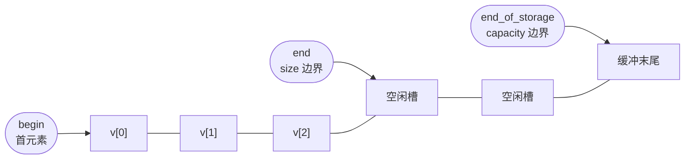
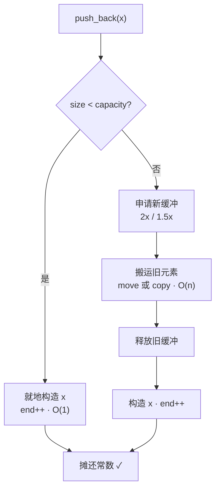
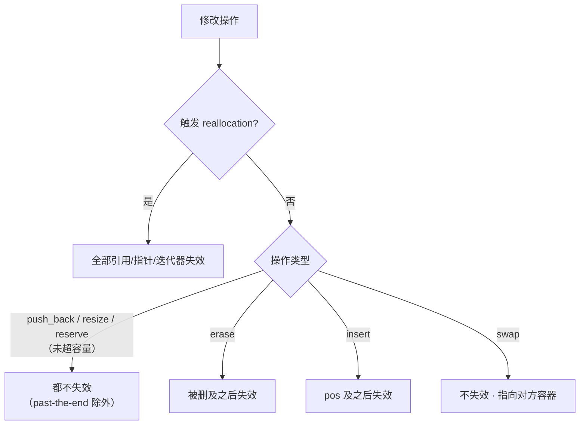

# vector 深入：三指针、扩容与迭代器失效

这一篇，笔者想跟各位好好聊聊 `std::vector` 的实现层。

卷一里我们已经把 `vector` 当个"会自己长大的数组"用得很顺了，`push_back`、`size()`、`capacity()`、`reserve()` 信手拈来。但笔者必须说一句实话——用得顺，和真懂，是两码事。不知道各位有没有碰上过这种邪门的情况：一个循环里不停地 `push_back`，绝大多数次都飞快，偏偏某一次卡顿得离谱；或者你小心翼翼缓存了一个迭代器、一个指针，某天它就指向了一片垃圾；又或者你自以为写得很稳的强异常安全，被一次扩容悄悄撕了个口子。

这些坑，根全埋在 `vector` 的实现层里。所以这一篇我们不重复卷一那些 API 怎么调（那个您肯定会了），而是把 `vector` 拆成三个指针、一个扩容策略、一张失效规矩表，再顺手接上 C++20 给它开的两扇新门——`constexpr` 和 `erase/erase_if`。

------

## 三个指针，撑起整个 vector

主流标准库实现里（libstdc++、libc++、MSVC STL），一个 `vector` 的本体，其实就是仨指针。不是数组、不是链表，就是 `begin` 指向首元素、`end` 指向最后一个有效元素的"下一个"位置、`end_of_storage` 指向已分配缓冲的尽头。（这个知乎上笔者记得有提问，主流实现亦是如此。）



顺着这图一推，什么都通了：`size()` 就是 `end - begin`，`capacity()` 就是 `end_of_storage - begin`，而 `capacity() - size()`，正是你还能不扩容就直接塞进去的元素数。标准文本其实并没有规定 `vector` 必须长成这样（它只要求连续存储加一堆接口行为），但你一旦知道底层就是这仨指针，后面所有特性都变得顺理成章：

1. 扩容，无非是把 `[begin, end)` 这一坨搬到新缓冲；
2. 迭代器失效，无非是缓冲被人换了；
3. `data()` 能直接喂给 C API，无非是因为 `begin` 指向的就是一整块连续裸内存。

## 扩容这件事：说是摊还常数，单次可能是 O(n)

那往一个 `capacity` 已经塞满的 `vector` 里再 `push_back` 会怎样？会触发一次 *reallocation*——申请新缓冲、把旧元素搬过去、释放旧缓冲。标准对这一步的承诺是 `push_back` 的**摊还常数复杂度**，请各位务必咬住"摊还"这两个字，它不是"常数"。

这话太容易被读成"每次 `push_back` 都是 O(1)"，于是一些朋友就放心地往热循环里塞 `push_back`，结果某一次扩容直接是一次 O(n) 的搬家，性能曲线上"咔"地掉一个尖峰。摊还分析为什么能成立？关键就在于每次扩容时，容量是按一个大于 1 的几何倍数往上翻的，于是那一次昂贵的搬家费用，就被摊到了之前若干次便宜的 `push_back` 头上。

(PS：这个地方笔者最近忙的起飞，如果您觉得这个话题有意思，可以试试在本地profile下！)



那这个倍数到底是多少？不好意思，**标准没规定**（严格讲叫 *unspecified*，比 *implementation-defined* 还宽松，后者好歹要求实现写进文档）。于是三家各选各的：libstdc++ 和 libc++ 都约摸是 2×（公式分别是 `size()+max(size(),n)` 和 `max(2*capacity(),n)`），MSVC STL 用的是 1.5×（`capacity()+capacity()/2`）。您要是不信，连续 `push_back` 16 个元素自己打印 `capacity()` 看——libstdc++/libc++ 走的是 `0 → 1 → 2 → 4 → 8 → 16 → 32`，MSVC 走的是 `0 → 1 → 2 → 3 → 4 → 6 → 9 → 13 → 19`。

MSVC 选 1.5× 不是拍脑袋。当倍数严格小于 2 时，前面几次释放掉的空闲块，是有可能被后面某次分配重新用上的——数学上

$$\sum_{i=0}^{k-1} 1.5^i = 2(1.5^k - 1) > 1.5^k$$

意思是历史释放的某块够大，能塞下当前请求，分配器就能复用、少制造碎片、RSS 也不至于居高不下。而严格 2× 呢，$\sum_{i=0}^{k-1} 2^i = 2^k - 1 < 2^k$，之前释放的任何一块都装不下当前请求，永远复用不了。代价当然也有：1.5× 搬家次数更多。这是一笔"内存复用 vs 搬家次数"的取舍，两家各有各的算盘。（还有个小边界：头一次 `push_back` 容量从 0 直接蹦到 1，三家一致，纯粹是"初始为 0"的特例，别拿这个去套 2×/1.5×。）

> ⚠️ 笔者再啰嗦一遍：写性能结论的时候，请用"摊还常数"，别图省事写"常数"。单次触发扩容的那个 `push_back`，就是实打实的 O(n)。

## 迭代器失效：一张表讲完所有规矩

大概没有哪个容器比 `vector` 更容易在"迭代器失效"上栽跟头了——你存了个迭代器、存了个指针，某个操作一过，它就悄悄成了野指针。规矩其实能归纳成一张表:

| 操作 | 何时失效 | 失效范围 |
|------|---------|---------|
| `push_back` / `emplace_back` | 仅当触发 reallocation | 触发时**全部**失效；没触发（还有余量）则**都不失效** |
| `reserve(n)` | 当 `n > 当前 capacity()` 触发 reallocation | 触发则全部失效；否则不失效 |
| `shrink_to_fit` | 若发生 reallocation | 全部失效 |
| `resize(n)` | `n > capacity()` 触发 reallocation | 触发则全部失效；否则引用/指针不失效，仅 past-the-end 迭代器失效 |
| `erase(p)` / `erase(first, last)` | 必然 | **被删元素及其之后**全部失效 |
| `insert` / `emplace` | 若 reallocation | 触发则全部失效；否则 `pos` 及其之后失效 |
| `clear` | 必然 | 全部失效 |
| `assign` / `assign_range` | 必然 | 全部失效 |
| `swap` | —— | **不失效**：迭代器/指针/引用仍然有效，但它们现在指向"对方"容器里的元素 |

嫌表密？把它压成一棵决策树就好记了：



表里最容易记反的是最后那条 `swap`。它不失效——你换走的是容器里的内容，但迭代器还钉在原来那块内存上，于是它现在指向的，是被换过来的那个容器。理解了这一点，您就能看懂为啥有些库爱写 `vector<T>().swap(v)` 这种看着诡异的代码来"真释放"内存：它换进来一个空的临时对象，把原缓冲连同容量一块带走析构，干干净净。

## 扩容时的 move_if_noexcept

强异常保证要求一次操作要么成、要么状态纹丝不动。`push_back` 触发扩容时要把旧元素一个个搬去新缓冲，这一步本身就是个潜在的抛异常点。那要想"搬一半失败了还能回滚"，标准库在扩容时对每个元素下了一个关键判断：**这元素的移动构造要是 `noexcept` 的，就 move；不然，老老实实退回去 copy。**

判定的依据是 `std::is_nothrow_move_constructible_v<T>`。翻译一下就是——你给类型写了 move 构造，却没标 `noexcept`，`vector` 扩容时就会不放心，宁可走更慢的 copy。为啥？copy 失败了旧缓冲还在，能回滚；move 失败了源元素可能已经被掏空，回天乏术。所以笔者的忠告很朴素：能加 `noexcept` 的 move 构造，一定加上，它在 `vector` 里直接决定了扩容是"搬家"还是"抄家"。标准库为此专门备了个 `std::move_if_noexcept` 工具，不过它真正的舞台，也就是容器内部这种"看异常安全性在 move/copy 之间二选一"的活儿。

## C++20 给 vector 开的两扇新门

### 一扇叫 constexpr vector

C++20 终于让 `vector` 能在编译期用了。这背后是两个提案接力：**P0784R7**「More constexpr containers」先把机制铺好——`constexpr` 的 `new`/`delete`、`std::construct_at`/`std::destroy_at`，外加一个叫 *transient constexpr allocation* 的模型；**P1004R2**「Making std::vector constexpr」再在这机制之上，把 `vector`（顺手也把 `string`）的成员函数逐个标成 `constexpr`。想探测支持，看 `__cpp_lib_constexpr_vector` 这个特性宏就行。

这里有个**必须掰扯清楚**的限制：transient allocation 模型要求：*常量求值期间分配出来的内存，必须在同一次常量求值结束之前释放掉*，否则程序直接 ill-formed。说人话就是——你没法定义一个持久的 `constexpr std::vector` 变量，把它装着堆对象的缓冲"带出"编译期。那编译期到底怎么用 `vector`？正确姿势是：在一个 `constexpr` 函数里临时把它造出来、做一通操作、最后**只返回一个标量结果**（元素和、元素个数、某个元素值都行），让缓冲在函数返回前自己析构掉。这恰恰合了嵌入式和查表场景的胃口——编译期拿 `vector` 当临时工作区算出一个常量，再把结果搬进 `std::array` 或 `constexpr` 变量里，运行时初始化全省了。

### 另一扇叫 erase / erase_if

老 C++ 里想从 `vector` 中删掉所有满足条件的元素，得手写那个著名的 erase-remove 惯用法：`v.erase(std::remove_if(v.begin(), v.end(), pred), v.end());`。又长又容易写错——第二个参数的 `v.end()` 忘了、外层 `erase` 忘了套，都是笔者见过的事故现场。C++20 用一对自由函数把它收编了：`std::erase(v, value)` 删所有等于 `value` 的，`std::erase_if(v, pred)` 删所有满足谓词的，返回值都是被删掉的元素个数。

这对函数来自提案 **P1209R0**，标题就叫「Adopt Consistent Container Erasure from Library Fundamentals 2 for C++20」——光看标题您就明白它的初衷了：把原本待在 Library Fundamentals TS 里的统一擦除 API，正式落地到 C++20。cppreference 上对它俩有一句很干脆的定义性描述：它们 *"erase all elements that compare equal to value / satisfy the predicate from the container"*，替掉的就是那个易错的 erase-remove。有个细节别记岔：序列容器（`vector`、`deque`、`list`、`forward_list`、`string`）同时拿到 `erase` 和 `erase_if`，而关联/无序关联容器只有 `erase_if`——因为它们的成员 `erase(key)` 早就在干"按键删"的活了，再塞一个 `erase(c, value)` 进来会语义打架。探测支持看 `__cpp_lib_erase_if`（C++20，值 `202002`）。

------

## 上手跑一跑

光说不练假把式，下面这几段都标了平台和标准，能单独编译。我们把前面的概念挨个跑一遍。

头一个，观察扩容。每次容量变了就打印一行，您能直观看到自家这把到底是 2× 还是 1.5×。

```cpp
// Standard: C++17  | Platform: host
#include <iostream>
#include <vector>

void trace_growth(std::vector<int>& v, int value)
{
    std::size_t cap_before = v.capacity();
    v.push_back(value);
    if (v.capacity() != cap_before) {
        std::cout << "push " << value << ": size=" << v.size()
                  << " capacity " << cap_before << " -> " << v.capacity() << '\n';
    }
}

int main()
{
    std::vector<int> v;
    for (int i = 0; i < 17; ++i) {
        trace_growth(v, i);
    }
    return 0;
}
```

第二个，迭代器失效的两种情形摆一块对比。`push_back` 在还有余量时不失效，一触发扩容就全失效；`reserve` 一旦超过当前容量，必然换缓冲。

```cpp
// Standard: C++17  | Platform: host
#include <iostream>
#include <vector>

int main()
{
    std::vector<int> v{1, 2, 3};
    v.reserve(3);  // 预留：当前已有 3，不触发扩容

    const int* p = &v[1];
    v.push_back(4);  // 还有 1 个余量，不扩容
    std::cout << "no realloc, p valid? " << (p == &v[1]) << '\n';  // 1

    v.reserve(100);  // 超过 capacity，必然换缓冲
    std::cout << "after reserve, p valid? " << (p == &v[1]) << '\n';  // 0，已失效
    return 0;
}
```

第三个，`move_if_noexcept`。给一个 move 构造标了 `noexcept` 的类型，扩容时走 move；没标的，退回 copy。

```cpp
// Standard: C++17  | Platform: host
#include <iostream>
#include <vector>

class Tracked {
public:
    int id;
    static int move_count;
    static int copy_count;

    explicit Tracked(int i) : id(i) {}
    Tracked(const Tracked& o) : id(o.id) { ++copy_count; }
    // 故意不标 noexcept：扩容时不放心，退回 copy
    Tracked(Tracked&& o) noexcept(false) : id(o.id) { ++move_count; }
};
int Tracked::move_count = 0;
int Tracked::copy_count = 0;

int main()
{
    std::vector<Tracked> v;
    v.reserve(2);
    v.emplace_back(1);
    v.emplace_back(2);
    v.emplace_back(3);  // 触发扩容

    std::cout << "moves=" << Tracked::move_count
              << " copies=" << Tracked::copy_count << '\n';
    // 未标 noexcept 时多半走 copy；把 noexcept(false) 改成 noexcept 再跑，会变成 move
    return 0;
}
```

第四个，`constexpr vector`。编译期拿它当临时工作区，只把标量结果带出来。

```cpp
// Standard: C++20  | Platform: host
#include <vector>

constexpr int sum_first_n(int n)
{
    std::vector<int> v;
    for (int i = 0; i < n; ++i) {
        v.push_back(i + 1);  // 常量求值期分配，函数返回前必须释放
    }
    int sum = 0;
    for (int x : v) {
        sum += x;
    }
    return sum;  // 只返回标量，缓冲在函数内自然析构
}

static_assert(sum_first_n(100) == 5050);  // 全程编译期完成

int main() { return 0; }
```

第五个，`erase_if`，一行干掉 erase-remove。

```cpp
// Standard: C++20  | Platform: host
#include <iostream>
#include <vector>

int main()
{
    std::vector<int> v{1, 2, 3, 4, 5, 6};
    std::size_t removed = std::erase_if(v, [](int x) { return x % 2 == 0; });
    std::cout << "removed " << removed << ", left:";
    for (int x : v) {
        std::cout << ' ' << x;
    }
    std::cout << '\n';  // removed 3, left: 1 3 5
    return 0;
}
```

当然，也可以点点这个看看现象！

<OnlineCompilerDemo
  title="vector 实现层深入：扩容、失效、constexpr、erase_if"
  source-path="code/examples/vol3/03_vector_deep_dive.cpp"
  description="观察 vector 扩容容量跳变、迭代器失效、move_if_noexcept 与 C++20 constexpr/erase_if"
  allow-run
  allow-x86-asm
/>

------

## 临了收几句

把前面这些拼回工程实践，笔者常嘱咐的就那么几条。一是**能预估规模就 `reserve`**——构造完 `vector` 立马按已知或估摸的最终大小 `reserve` 一下，把好几次扩容压成一次分配，热路径上立竿见影。二是**删元素用 `erase_if`**，别再手写 erase-remove 了，又短又不容易漏掉那个 `v.end()`。三是**编译期算表，拿 `vector` 当临时区**，算完只把标量结果交给 `static_assert` 或者塞进 `constexpr` 变量，舒舒服服享受 transient allocation 给的编译期动态能力，又不越界。

最后给各位留个印象：`vector` 的本体约等于三个指针 `{begin, end, end_of_storage}`，`size`/`capacity` 都是从它们算出来的；`push_back` 是摊还常数不是常数，增长倍数标准没规定（libstdc++/libc++ 用 2×、MSVC 用 1.5×）；失效的规矩就一张表——扩容型操作"触发才全失效"，`erase` 是"被删及之后失效"，`swap` 压根不失效；扩容时元素 move 不 move，看 move 构造有没有标 `noexcept`；C++20 让 `vector` 能 `constexpr`（P0784R7 + P1004R2），但受 transient allocation 限制只能当编译期临时区；同一年 `erase`/`erase_if`（P1209R0）替你干掉了 erase-remove。把这些揣兜里，`vector` 的坑基本就踩不到了。

------

## 参考资源

- [std::vector — cppreference](https://en.cppreference.com/w/cpp/container/vector)
- [vector::capacity — cppreference](https://en.cppreference.com/w/cpp/container/vector/capacity)
- [vector::push_back — cppreference](https://en.cppreference.com/w/cpp/container/vector/push_back)
- [std::erase / std::erase_if (vector) — cppreference](https://en.cppreference.com/w/cpp/container/vector/erase2)
- [vector.capacity — eel.is/c++draft](https://eel.is/c++draft/vector.capacity) · [sequence.reqmts — eel.is/c++draft](https://eel.is/c++draft/sequence.reqmts)
- [P0784R7 More constexpr containers](https://www.open-std.org/jtc1/sc22/wg21/docs/papers/2019/p0784r7.html)
- [P1004R2 Making std::vector constexpr](https://www.open-std.org/jtc1/sc22/wg21/docs/papers/2019/p1004r2.pdf)
- [P1209R0 Adopt Consistent Container Erasure from Library Fundamentals 2 for C++20](https://www.open-std.org/jtc1/sc22/wg21/docs/papers/2018/p1209r0.html)
