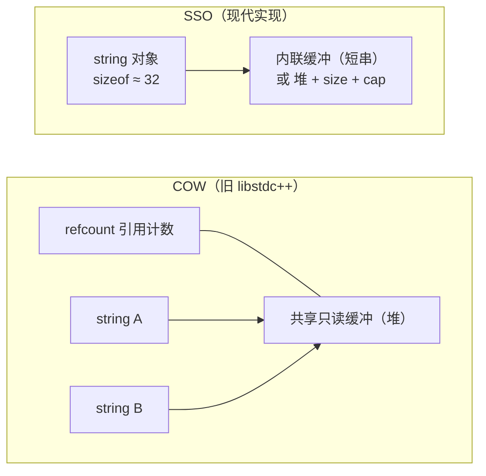
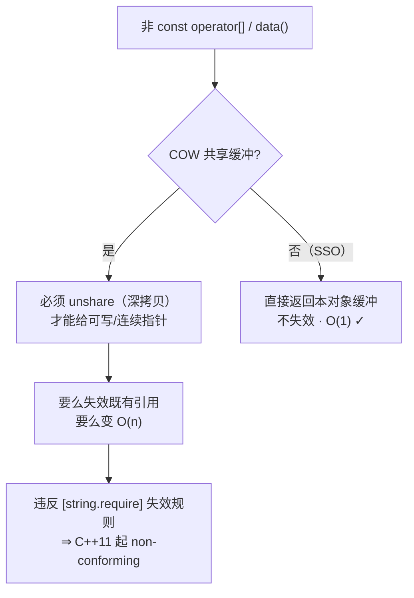

# string 深入：SSO、COW 与 resize_and_overwrite

`std::string` 大概是标准库里被使唤得最多、却被理解得最浅的类型了。各位随手 `std::string s = "hello";` 写得开开心心，可一旦被人追问——"为什么 `sizeof(std::string)` 在我这机器上是 32？""为什么老代码里两个 string 居然共享同一份缓冲？""C++23 那个 `resize_and_overwrite` 到底省了啥？"——多半就答不上来了。这些问题，根全在 `string` 的内存模型和它的陈年历史里。

这一篇，笔者就专门跟各位聊 `string` 的内存与缓冲这条主线：SSO 跟 COW 的历史纠葛、SSO 的实现阈值、还有 C++23 给我们送来的缓冲复用 API `resize_and_overwrite`。（C++20 的 `char8_t` 是另一个独立主题，见卷三 [char8_t 与 UTF-8 字符串](./30-char8-t-utf8.md)。）

------

## SSO 和 COW：一段 ABI 的陈年旧事

要弄明白今天的 `string` 为啥长这样，得先把时钟拨回 C++03。那会儿有种特别诱人的实现路子——**写时复制（Copy-On-Write，COW）**：你写 `string b = a;` 的时候，它压根不真拷字符，而是让 `b` 跟 `a` 共享同一份只读缓冲，只额外维护一个引用计数；非得等到某一方要写入了，才真去深拷贝一份出来。这在大量拷贝只读串的场景里，能省下一大笔内存和时间，早期的 libstdc++（GCC 的 C++ 标准库）就是 COW 的铁杆拥趸。



可 C++11 一纸标准，就把 COW 判了"违规"。提案 **N2668**「Concurrency Modifications to Basic String」改写了 `[string.require]` 的失效规矩和 `data()`/`c_str()` 的语义，原文里有一句说得斩钉截铁——*"This change effectively disallows copy-on-write implementations."* 那法理上的根因到底是个啥？笔者得提醒一句，很多人以为是"线程安全"或者"`noexcept`"，错，那俩顶多算放大矛盾的旁支，真正的判据是底下这三条叠一块儿：

- **失效规矩**：`[string.require]` 规定，调 `operator[]`、`at`、`front`、`back`、`begin/end` 这些元素访问，还有 `data()` 本身，都不能让已有的引用和迭代器失效。
- **`data()`/`c_str()` 的连续 null 结尾**：它俩必须返回指向本对象缓冲的、连续且 null 结尾的数组。
- **非 const 访问要给可写指针**：你一旦 `s[0]` 或者 `s.data()` 拿到的是非 const，COW 就被迫在共享缓冲上 *unshare*（深拷贝），才能塞给你一个独占的、连续的、可写的指针。



您瞧，COW 想同时把"共享""不失效引用""O(1)""连续 null 结尾"全搂进怀里，那是自相矛盾的。标准果断选了后三个，COW 自然就成了 non-conforming。落到现实里更是一波三折：libstdc++ 因为 ABI 兼容的包袱，硬是拖到 **GCC 5（2015）** 才通过 `_GLIBCXX_USE_CXX11_ABI` 这个开关，切到非 COW 实现（新的内联符号叫 `std::__cxx11::basic_string`）；而 libc++ 和 MSVC 那套 Dinkumware 实现，打一开始就是 SSO，压根没这段历史债。

## SSO 的阈值：sizeof 凭什么是 32

COW 退场之后，主流实现齐刷刷转向了 **SSO（Small String Optimization，小字符串优化）**：在 `string` 对象里头预留一小段内联缓冲，短到能塞进这段缓冲的串，就不去堆上分配，直接存在对象自己身上。这同时也回答了"为什么 `sizeof(std::string)` 是 32"——对象得同时装得下内联缓冲、堆指针、size 和 capacity 这些字段，主流实现就把它们一股脑塞进了约 32 字节。

笔者得提一句：SSO 的阈值，是**实现细节，标准从不规定**（属于 QoI，质量实现细节）。在主流实现里，libstdc++、libc++、MSVC STL 的阈值大约都在 15 字节上下（libc++ 还另有一种 22 字节的布局变体）。这些数字不是承诺，跨实现、跨版本都可能变，所以——笔者把话放这儿——**别在代码里把阈值当成硬性假设来用**，今天 15、明天换个编译器可能就不是了。

## resize_and_overwrite：C++23 终于让你拿 string 当缓冲使了

C++23 给 `string` 塞了个相当趁手的成员——`resize_and_overwrite`，提案是 **P1072R10**「basic_string::resize_and_overwrite」。它最典型的用法是：把 `string` 当成一块可写缓冲，去对接那种"写一部分、再告诉你写了多少"的 C API（`read`、`fread`、`getenv` 这一挂的）。

签名长这样：`template<class Operation> constexpr void resize_and_overwrite(size_type count, Operation op);`。它先把字符串容量扩到至少 `count`，然后把一个指针 `p`（指向连续存储的首字符）和那个 `count` 一块儿交给回调 `op`，由 `op` 就地把实际内容写进去，再**返回一个整数 r 当作新的长度**（要求 `r ∈ [0, count]`）。好处在哪？跟 `resize(count)` 不同，它**不会**把新增那一段值初始化（清零），省掉一笔多余的写；你只在回调里写真正需要的字节，然后报个实际长度就完事。

自由是有代价的，`resize_and_overwrite` 有几条 UB 红线，各位得盯紧：`op` 必须返回落在 `[0, count]` 里的整数，越界就是未定义行为；`op` 抛异常是 UB（所以 `op` 通常标 `noexcept`）；`op` 不能去改 `p` 或 `count` 这俩参数本身；最后保留区间 `[p, p+r)` 里每个字符，都得是 `op` 亲手写下的确定值，不能留不确定值。还有个容易忽视的——不管这次调用有没有触发 reallocation，它都会把所有迭代器、指针、引用全失效掉。探测支持看 `__cpp_lib_string_resize_and_overwrite`（C++23，值 `202110L`）。

------

## 上手跑一跑

先看 SSO。把 `sizeof(std::string)` 打出来，再瞅瞅短串和长串的 `data()` 地址，到底落没落在对象里头。

```cpp
// Standard: C++17  | Platform: host
#include <iostream>
#include <string>

bool points_inside_object(const std::string& s)
{
    const char* obj = reinterpret_cast<const char*>(&s);
    return s.data() >= obj && s.data() < obj + sizeof(std::string);
}

int main()
{
    std::cout << "sizeof(std::string) = " << sizeof(std::string) << '\n';

    std::string short_s = "hi";       // 很可能走 SSO
    std::string long_s(64, 'x');      // 超过 SSO 阈值，出堆

    std::cout << "short_s.data() in object? " << points_inside_object(short_s) << '\n';  // 多半是 1
    std::cout << "long_s.data()  in object? " << points_inside_object(long_s) << '\n';   // 多半是 0
    return 0;
}
```

再看 `resize_and_overwrite` 跟老写法 `resize()` 的对比。笔者这里造了个"模拟 C API"——往缓冲里写死内容、返回实际写入字节数，好让两种写法的差别一目了然。

```cpp
// Standard: C++23  | Platform: host
#include <algorithm>
#include <cstring>
#include <iostream>
#include <string>

// 模拟一个 C API：向 buf 最多写 n 字节，返回实际写入数
std::size_t fake_read(char* buf, std::size_t n)
{
    static const char msg[] = "hello";
    std::size_t len = std::min(n, sizeof(msg) - 1);
    std::memcpy(buf, msg, len);
    return len;
}

int main()
{
    // 旧写法：resize(64) 先把 64 个字符全部值初始化（清零），再被覆盖
    std::string old_buf;
    old_buf.resize(64);
    std::size_t got = fake_read(old_buf.data(), old_buf.size());
    old_buf.resize(got);  // 再截回实际长度
    std::cout << "old: '" << old_buf << "' (len=" << old_buf.size() << ")\n";

    // C++23：resize_and_overwrite 不清零多余字符，回调报告实际长度
    std::string buf;
    buf.resize_and_overwrite(64, [](char* p, std::size_t n) noexcept {
        return fake_read(p, n);  // 只写实际字节，返回新长度
    });
    std::cout << "new: '" << buf << "' (len=" << buf.size() << ")\n";
    return 0;
}
```

<OnlineCompilerDemo
  title="string 内存深入：SSO 观察与 resize_and_overwrite"
  source-path="code/examples/vol3/04_string_memory.cpp"
  description="观察 std::string 的 sizeof 与 SSO 行为，对比 resize() 与 C++23 resize_and_overwrite 的缓冲复用"
  run-options="-std=c++23"
  allow-run
  allow-x86-asm
/>

------

## 参考资源

- [std::basic_string — cppreference](https://en.cppreference.com/w/cpp/string/basic_string)
- [basic_string::data — cppreference](https://en.cppreference.com/w/cpp/string/basic_string/data)
- [basic_string::resize_and_overwrite — cppreference](https://en.cppreference.com/w/cpp/string/basic_string/resize_and_overwrite)
- [N2668 Concurrency Modifications to Basic String](https://www.open-std.org/jtc1/sc22/wg21/docs/papers/2008/n2668.htm)
- [P1072R10 basic_string::resize_and_overwrite](https://www.open-std.org/jtc1/sc22/wg21/docs/papers/2021/p1072r10.html)
