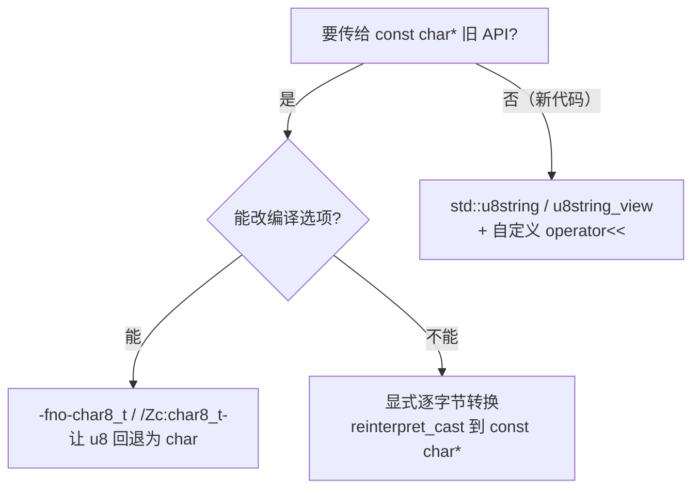

# char8_t 与 UTF-8 字符串

在 C++20 之前，UTF-8 字符串字面量 `u8"..."` 的类型是 `const char[N]`——跟普通字符串在类型上压根没区别。这听着好像无所谓，其实是不少坑的老巢：你没法在类型层面分清"这一串是 UTF-8"还是"这一串是本地执行字符集"，编译器也帮不上你挡住那种把 UTF-8 当裸字节乱打印的错。C++20 引入 `char8_t`，就是要把 UTF-8 从 `char` 那片模糊地带里独立出来，给它一个专属类型，让类型系统替咱们把关。这改动来自提案 **P0482R6**「char8_t: A type for UTF-8 characters and strings」，探测支持看 `__cpp_char8_t`（C++20，值 `201811L`）。

不过——笔者得提前打个预防针——这个"独立类型"的改动是**带破坏性**的：它一把改了 `u8` 字面量的类型，于是一大批在 C++17 下岁月静好的老代码，升到 C++20 直接就编不过了。这一篇，我们就把这俩最常踩的坑、怎么搬代码、还有 C++23 后来补的那一刀，一次讲清楚。

------

## u8 字面量，类型整个换了灵魂

C++20 起，UTF-8 字符串字面量 `u8"..."` 的类型，从 `const char[N]` 变成了 `const char8_t[N]`；UTF-8 字符字面量 `u8'c'` 的类型，也从 `char` 变成了 `char8_t`。这个 `char8_t` 是个**独立的 fundamental 类型**，底层类型（underlying type）是 `unsigned char`，大小、对齐、转换秩都跟 `unsigned char` 一致——但它**不参与别名规则**（不是 [basic.lval] 里允许别名访问的那几个类型之一），也就是说，你不能拿 `char8_t*` 去合法地别名访问别的对象内存。

至于为啥要这么较真地单造一个类型？道理很简单：类型一旦分开，编译器就能在"把 UTF-8 串误当本地编码 `char` 串使""把 `char8_t` 当整数打印"这类错误上直接报错，而不是等运行时输出一屏乱码才让你拍大腿。拿类型安全换一点点迁移成本，这笔账 C++20 觉得值。

## 两个最经典的坑

类型一换，两个迁移坑就浮上水面了。

**头一个坑：`u8""` 不能再隐式转 `const char*`。** C++17 里，`const char* p = u8"text";` 完全合法（那会儿 `char` 跟 `char8_t` 还是一家人）；到了 C++20，`u8"text"` 成了 `const char8_t[N]`，而 `char8_t` 不会隐式转 `char`，这行直接 ill-formed。所有把 `u8` 字面量塞给期望 `const char*` 的旧接口（构造 `std::string`、传给 C API、`std::filesystem::u8path` 的某些重载等等）统统中招。

**第二个坑：标准库故意 `=delete` 了 `char8_t` 的 ostream 重载。** 您可能想——那我直接 `std::cout << u8"text";` 打呗？也不行。C++20 起，标准库对 `char8_t`、`const char8_t*` 这类 UTF-8 字符/字符串，在 `basic_ostream<char>` 和 `basic_ostream<wchar_t>` 上的 `operator<<` 重载，是**显式删除**的（注意，不是"忘了实现"，是故意的）。于是 `std::cout << u8'z'`、`std::cout << u8"text"` 都会因为命中 deleted 重载而编译失败。这么干，就是为了拦住历史代码把 UTF-8 数据当整数或指针胡乱打印出来。

## 老代码怎么搬过来

碰上这俩坑，怎么把 C++17 的老代码挪到 C++20？几条路，笔者按代价从低到高给您捋：



最省事的，是**编译选项回退**：GCC/Clang 上加 `-fno-char8_t`、MSVC 上加 `/Zc:char8_t-`，把 `u8` 字面量的类型退回 C++17 的 `char` 语义，老代码立马又能编。这只是过渡期的权宜之计，新代码别长期依赖它。其次，是**显式逐字节转换**：当你确实要喂给一个只认 `const char*` 的接口、且心里有数内容就是 UTF-8 字节时，用 `reinterpret_cast<const char*>(u8"text")`（或者 C 风格转换）切个视角——字节内容不变，只是换个指针类型，把"头一个坑"绕过去。最"政治正确"的，是**走 `std::u8string` 路线**：用 `u8string`/`u8string_view` 类型安全地持有 UTF-8 文本，要打印时再写个小小的 `operator<<` 把它转出去，把类型安全贯彻到底。

## C++23 的 P2513：又补回来一点

"头一个坑"里"不能初始化"的范围，后来倒是被收窄了一点点。提案 **P2513R4**「char8_t Compatibility and Portability」作为 C++20 的缺陷报告（DR），在 C++23 落地（`__cpp_char8_t` 的值也跟着改成 `202207L`），**重新允许用 `u8` 字符串字面量去初始化 `char` 或 `unsigned char` 数组**——也就是 `char ca[] = u8"text";` 这种又变回合法了。但请注意，它只放宽了"数组初始化"这一条；`const char8_t*` 到 `const char*` 的指针隐式转换，**至今仍然 ill-formed**，坑一里那个指针赋值的情形，可没被放过。

------

## 上手跑一跑

下面这个 demo，把两个坑（笔者用注释"封印"起来，您取消注释立马编译失败）和两种正确写法摆一块儿，方便对照。

```cpp
// Standard: C++20  | Platform: host
#include <iostream>
#include <string>

// —— 坑一（取消注释会编译失败）：u8"" 不再隐式转 const char* ——
// const char* p = u8"text";   // ill-formed since C++20

// —— 坑二（取消注释会编译失败）：ostream 显式 =delete 了 char8_t 重载 ——
// std::cout << u8"text";      // ill-formed since C++20
// std::cout << u8'z';         // ill-formed since C++20

// 正确写法之一：显式逐字节转换（内容不变，仅切换指针类型视角）
void print_as_char(const char* s)
{
    std::cout << s << '\n';
}

// 正确写法之二：用 std::u8string 类型安全地持有 UTF-8，并自定义打印
std::ostream& operator<<(std::ostream& os, const std::u8string& s)
{
    return os << reinterpret_cast<const char*>(s.data());
}

int main()
{
    // 路线 A：把 u8 字面量当 const char* 用（适合喂给只认窄字符的旧接口）
    print_as_char(reinterpret_cast<const char*>(u8"text"));

    // 路线 B：u8string 全程保持 UTF-8 类型，打印时再转
    std::u8string u8s = u8"UTF-8 text";
    std::cout << u8s << '\n';
    return 0;
}
```

<OnlineCompilerDemo
  title="char8_t 与 UTF-8 字符串：两坑与正确写法"
  source-path="code/examples/vol3/14_char8_t.cpp"
  description="演示 C++20 u8 字面量类型变更的两个编译失败坑，以及显式转换与 u8string 两种正确写法"
  allow-run
  allow-x86-asm
/>

------

## 参考资源

- [char8_t — cppreference](https://en.cppreference.com/w/cpp/keyword/char8_t)
- [String literal — cppreference](https://en.cppreference.com/w/cpp/language/string_literal)
- [operator<<(basic_ostream) — cppreference](https://en.cppreference.com/w/cpp/io/basic_ostream/operator_ltlt2)
- [P0482R6 char8_t: A type for UTF-8 characters and strings](https://www.open-std.org/jtc1/sc22/wg21/docs/papers/2018/p0482r6.html)
- [P2513R4 char8_t Compatibility and Portability](https://www.open-std.org/jtc1/sc22/wg21/docs/papers/2022/p2513r4.html)
