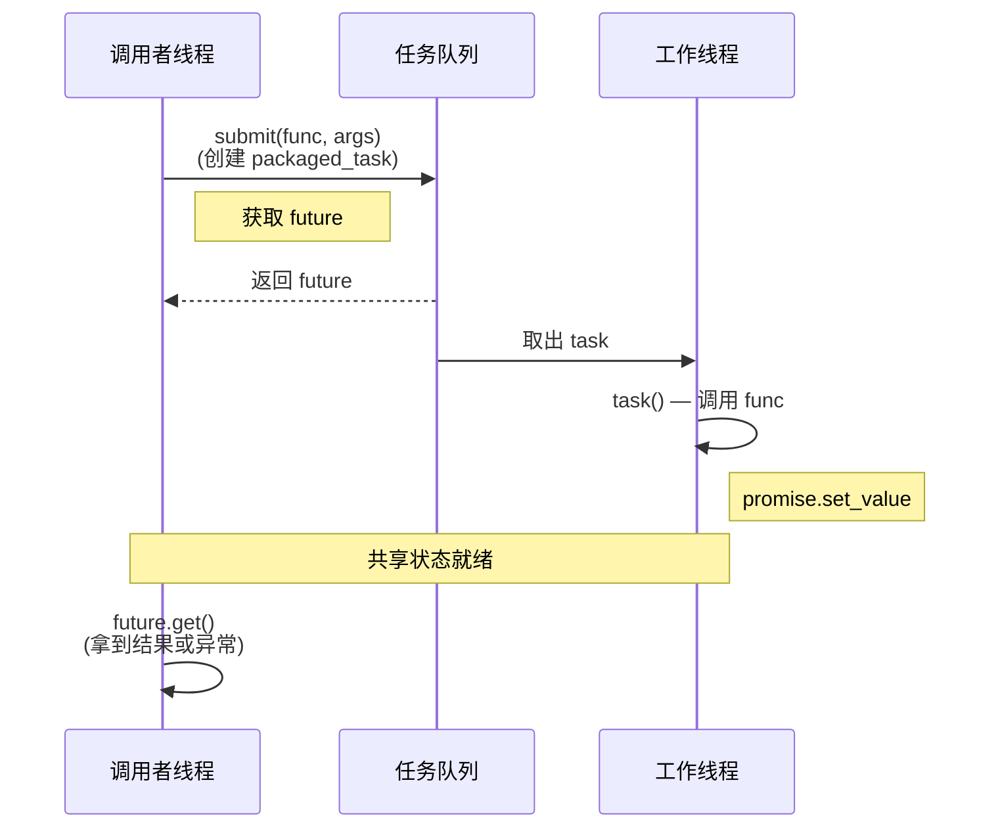

# promise 与 packaged_task

上一篇我们用 `std::async` 启动异步任务，通过 `std::future` 拿回结果。整个过程确实方便，但笔者折腾下来发现有一个限制让人不太舒服：`std::async` 把"启动任务"和"获取结果"绑死了——你调用了 `std::async`，任务就启动了，返回的 future 就跟这个任务关联了。你没法先创建一个 future，然后在某个时刻往里面塞值；也没法把一个已有的函数对象包装成异步任务，塞到队列里稍后再执行。一旦你想做"任务提交"和"任务执行"分离的事情（比如线程池），`std::async` 就不够用了。

这一篇我们要认识的是 `std::future` 的"另一端"——`std::promise` 和 `std::packaged_task`。它们让你可以手动控制值的设置时机和任务的执行时机，是构建更灵活的异步管道（比如线程池的任务提交接口）的基础设施。我们还会遇到 `std::shared_future`，它解决了 `std::future` "只能读一次"的痛点。

## std::promise\<T\>：手动设置 future 的值

我们先从 `std::promise` 说起。你可以把它理解为 `std::future` 的写端。一个 promise 和一个 future 通过共享状态（shared state）连接在一起：你通过 promise 设置值，通过 future 读取值。两者的生命周期关系是：promise 先调用 `get_future()` 获取关联的 future，然后把 future 交给消费者线程，自己留在生产者线程里设值。

我们先不用想太复杂，用一个最简的例子把 promise 和 future 的关系建立起来。以下代码在 C++11 及以上的任何标准编译器上都能编译运行：

```cpp
#include <future>
#include <iostream>
#include <thread>

void worker(std::promise<int> prom)
{
    // 模拟一些工作
    std::this_thread::sleep_for(std::chrono::seconds(1));

    // 通过 promise 设置结果值
    prom.set_value(42);
}

int main()
{
    // 创建 promise-future 对
    std::promise<int> prom;
    std::future<int> fut = prom.get_future();

    // 把 promise 移动给 worker 线程
    std::thread t(worker, std::move(prom));

    // 在主线程通过 future 等待结果
    int result = fut.get();
    std::cout << "从 worker 收到: " << result << "\n";

    t.join();
    return 0;
}
```

这段代码的核心流程是：主线程创建 `promise`，调用 `get_future()` 拿到关联的 `future`，然后把 `promise` 通过 `std::move` 移交给 worker 线程（因为 `std::promise` 也是只移动类型）。worker 线程做完工作后调用 `prom.set_value(42)`，主线程的 `fut.get()` 就能拿到这个值。你会发现，整个过程中我们完全没用 `std::async`——promise 让我们手动控制了"什么时候设值"这件事。

这里有一个重要的设计选择：为什么 promise 是按移动传递给 worker 线程，而不是按引用？因为 promise 代表的是"设置值的权力"——这个权力是独占的，不应该被共享。通过移动 promise，你明确地把设置值的权力转移给了 worker 线程，主线程手里只留下只读的 future。这是一种很清晰的所有权表达。

### set_value()、set_exception() 和 get_future()

了解了基本用法之后，我们现在要把 promise 的三个核心操作一起看清楚。首先是 `get_future()`，它返回一个与这个 promise 关联的 `std::future`——这个操作只能调用一次，第二次调用会抛出 `std::future_error`，返回的 future 和 promise 共享同一个底层共享状态。然后是 `set_value()`，它用来设置共享状态的值，值设置之后所有在这个共享状态的 future 上等待的线程都会被唤醒。如果 promise 的模板参数是 `void`，那么 `set_value()` 不接受任何参数，仅仅表示"计算完成了"。跟 `get_future()` 一样，`set_value()` 也只能调用一次——试图设置第二个值会抛出 `std::future_error`。最后是 `set_exception()`，它用来设置一个异常到共享状态，当消费者调用 `future.get()` 时这个异常会被重新抛出。通常配合 `std::current_exception()` 使用——在 catch 块中捕获当前异常并存入 promise。

我们来看一个同时演示正常值传递和异常传递的完整示例，把上面三个操作串起来看：

```cpp
#include <future>
#include <iostream>
#include <thread>
#include <stdexcept>

void compute(std::promise<int> prom, int x)
{
    try {
        if (x < 0) {
            throw std::invalid_argument("输入不能为负数");
        }
        prom.set_value(x * x);
    } catch (...) {
        // 捕获异常并存入 promise
        prom.set_exception(std::current_exception());
    }
}

int main()
{
    // 正常路径
    {
        std::promise<int> prom;
        std::future<int> fut = prom.get_future();
        std::thread t(compute, std::move(prom), 5);

        try {
            std::cout << "5 的平方: " << fut.get() << "\n";
        } catch (const std::exception& e) {
            std::cout << "异常: " << e.what() << "\n";
        }
        t.join();
    }

    // 异常路径
    {
        std::promise<int> prom;
        std::future<int> fut = prom.get_future();
        std::thread t(compute, std::move(prom), -3);

        try {
            std::cout << "-3 的平方: " << fut.get() << "\n";
        } catch (const std::invalid_argument& e) {
            std::cout << "捕获到异常: " << e.what() << "\n";
        }
        t.join();
    }
    return 0;
}
```

先别急着往下走，我们把这段代码的异常传递链路拆解清楚。`std::current_exception()` 是一个在 catch 块中使用的函数，它返回一个指向当前正在处理的异常的 `std::exception_ptr`。`promise.set_exception()` 接受的就是这个 `exception_ptr`，它会把这个异常存储到共享状态中。当消费者调用 `fut.get()` 时，存储的异常会被重新抛出，你可以在消费者端用对应的 catch 块来处理。

这种异常传递模式在跨线程通信中非常有用——你不需要设计错误码体系，不需要把异常信息序列化成字符串，异常对象完整地穿越了线程边界，类型信息完好无损。说实话，笔者第一次意识到异常可以跨线程传递的时候还挺惊讶的，毕竟线程栈是独立的，但标准库通过 `exception_ptr` 巧妙地解决了这个问题。

### 通过 promise 的值通道

现在我们回头看 promise/future 的核心抽象。promise 的值通道（value channel）是整个模型的精髓：promise 是写端，future 是读端，共享状态是它们之间的管道。这种抽象让我们可以在不同线程之间传递值，而不需要共享变量或锁——同步完全由共享状态的内部机制来保证。

值通道有一个很重要的特性叫"同步点"：当生产者调用 `set_value()` 时，值被写入共享状态并唤醒所有等待的消费者；当消费者调用 `get()` 时，如果值还没就绪就阻塞等待。你会发现，这个同步点的语义比条件变量清晰太多了——不需要 predicates、不需要 spurious wakeup 防御、不需要手动加锁。对于简单的"一次性的值传递"场景，promise/future 比 condition_variable 好用得多。

但先别急着什么都用 promise——它有一个不可忽视的局限：它是一次性的。`set_value()` 只能调用一次，调用后 promise 就没什么用处了。这跟 `std::future` 的一次性消耗语义是对称的——一端只写一次，另一端只读一次。如果你需要一个可以反复写入/读取的通道，应该用 `std::condition_variable` 或者消息队列，而不是 promise/future。

## std::packaged_task\<F\>：封装可调用对象

很好，现在我们知道了 promise 可以手动设置 future 的值。但每次都要自己写 try-catch、手动调 `set_value()` 或 `set_exception()`，也挺繁琐的。C++ 标准库提供了一个更高级的封装——`std::packaged_task<F>`，它把一个可调用对象（函数、lambda、函数对象等）包装起来，自动关联一个 promise/future 对。当你调用这个 packaged_task 时，它内部会调用被包装的可调用对象，把返回值自动塞进 promise 里（如果抛异常就把异常塞进去）。

packaged_task 的价值在于"解耦任务的定义和任务的执行"——你可以在一个线程里创建 packaged_task，把它塞到队列里，然后在另一个线程里从队列取出来执行。这就是线程池的基础模型，也是我们这一卷最终要搭建起来的东西。

```cpp
#include <future>
#include <iostream>
#include <thread>
#include <queue>
#include <mutex>
#include <functional>
#include <memory>

int add(int a, int b)
{
    return a + b;
}

int main()
{
    // 创建 packaged_task，封装一个可调用对象
    std::packaged_task<int(int, int)> task(add);

    // 获取关联的 future
    std::future<int> fut = task.get_future();

    // 在另一个线程上执行 task
    std::thread t(std::move(task), 10, 20);

    // 在主线程获取结果
    int result = fut.get();
    std::cout << "10 + 20 = " << result << "\n";

    t.join();
    return 0;
}
```

我们来拆解一下这段代码。packaged_task 的模板参数是一个函数签名，比如 `int(int, int)` 表示"接受两个 int 参数，返回 int"。被封装的可调用对象的签名必须跟这个模板参数兼容。当你调用 `task.get_future()` 时，得到的就是内部 promise 关联的 future。当你调用 `task(args...)` 时——注意不是 `task.run()` 也不是 `task.execute()`，就是直接用函数调用运算符——内部的 promise 会自动被设置。

另外需要注意，packaged_task 也是只移动类型——你不能拷贝它，只能移动它。这个设计是合理的：如果两个 packaged_task 共享同一个可调用对象和共享状态，那调用两次就会导致 promise 被设置两次（第二次会抛异常），这显然不是期望的行为。

### packaged_task 的异常传播

接下来问题来了：如果被封装的函数抛了异常怎么办？好消息是 packaged_task 自动帮你处理了——不需要你手动 try-catch 再 set_exception。当被封装的函数抛出异常时，packaged_task 会在内部捕获异常并存储到共享状态中，消费者通过 `future.get()` 就能拿到这个异常。

```cpp
#include <future>
#include <iostream>
#include <stdexcept>

int risky_func(int x)
{
    if (x == 0) {
        throw std::runtime_error("除零错误");
    }
    return 100 / x;
}

int main()
{
    std::packaged_task<int(int)> task(risky_func);
    std::future<int> fut = task.get_future();

    // 在当前线程调用 task（也可以在另一个线程）
    task(0);  // 传入 0，触发异常

    try {
        int result = fut.get();  // 重新抛出异常
        std::cout << "结果: " << result << "\n";
    } catch (const std::runtime_error& e) {
        std::cout << "捕获到异常: " << e.what() << "\n";
    }
    return 0;
}
```

注意这里 `task(0)` 的调用不会抛异常——异常被 packaged_task 内部静默捕获了。真正抛异常的是 `fut.get()`。这种设计让任务的调用和错误的处理可以在不同的线程上进行，非常灵活——工作线程只管执行，主线程只管处理结果和异常，各司其职。

### 用 packaged_task 构建简单的任务队列

packaged_task 最典型的应用场景是作为线程池的任务类型。这一节我们先搭一个最简陋的版本——只有一个工作线程的任务队列，麻雀虽小五脏俱全，把 promise/packaged_task/future 三者的协作方式展示清楚。

```cpp
#include <future>
#include <iostream>
#include <thread>
#include <queue>
#include <mutex>
#include <condition_variable>
#include <functional>

class SimpleTaskQueue
{
public:
    using TaskType = std::function<void()>;

    SimpleTaskQueue()
    {
        worker_ = std::thread([this]() { worker_loop(); });
    }

    ~SimpleTaskQueue()
    {
        {
            std::lock_guard<std::mutex> lock(mutex_);
            done_ = true;
        }
        cv_.notify_one();
        worker_.join();
    }

    // 提交一个 packaged_task，返回对应的 future
    template <typename F, typename... Args>
    auto submit(F&& f, Args&&... args)
        -> std::future<std::invoke_result_t<F, Args...>>
    {
        using ReturnType = std::invoke_result_t<F, Args...>;

        auto task = std::make_shared<std::packaged_task<ReturnType()>>(
            std::bind(std::forward<F>(f), std::forward<Args>(args)...));

        std::future<ReturnType> fut = task->get_future();

        {
            std::lock_guard<std::mutex> lock(mutex_);
            queue_.push([task]() { (*task)(); });
        }
        cv_.notify_one();

        return fut;
    }

private:
    void worker_loop()
    {
        while (true) {
            TaskType task;
            {
                std::unique_lock<std::mutex> lock(mutex_);
                cv_.wait(lock, [this]() { return done_ || !queue_.empty(); });
                if (done_ && queue_.empty()) {
                    return;
                }
                task = std::move(queue_.front());
                queue_.pop();
            }
            task();
        }
    }

    std::thread worker_;
    std::queue<TaskType> queue_;
    std::mutex mutex_;
    std::condition_variable cv_;
    bool done_{false};
};
```

这个 `SimpleTaskQueue` 虽然简陋，但已经展示了 promise/packaged_task/future 三者在任务队列中的协作方式。我们来拆一下 `submit()` 的流程：它把用户传进来的可调用对象包装成 `packaged_task`，用 `shared_ptr` 包装后塞进队列，返回对应的 future 给调用者。工作线程从队列取出任务执行，执行结果通过 `packaged_task` 内部的 promise 自动设置到共享状态中，调用者手里的 future 就能 `get()` 到结果了。整条链路串起来就是：调用者提交任务 -> packaged_task 入队 -> 工作线程取出执行 -> promise 自动 set_value -> 调用者通过 future 拿到结果。

使用方式如下：

```cpp
int heavy_compute(int x)
{
    std::this_thread::sleep_for(std::chrono::seconds(1));
    return x * x;
}

int main()
{
    SimpleTaskQueue queue;

    auto f1 = queue.submit(heavy_compute, 5);
    auto f2 = queue.submit(heavy_compute, 10);
    auto f3 = queue.submit([]() {
        return std::string("hello from task queue");
    });

    std::cout << "f1: " << f1.get() << "\n";  // 25
    std::cout << "f2: " << f2.get() << "\n";  // 100
    std::cout << "f3: " << f3.get() << "\n";  // hello from task queue
    return 0;
}
```

`submit()` 的返回类型通过尾置返回值推导自动适配——不管你传什么可调用对象，它都能正确推导返回类型并返回对应的 `std::future<T>`。`std::invoke_result_t<F, Args...>` 是 C++17 提供的类型萃取，用来推导 `F(Args...)` 的返回类型。如果你的编译器只支持 C++11/14，可以用 `std::result_of_t<F(Args...)>` 代替（C++17 中 `std::result_of` 已被废弃，C++20 中已移除，所以建议直接用 `invoke_result_t`）。

## std::shared_future\<T\>：未来值可共享

前面我们反复强调 `std::future` 的一次性消耗语义——`get()` 只能调用一次，之后 future 就失效了。大部分场景下这没什么问题，但有时候你需要多个线程等待同一个结果。比如一个初始化任务完成后，多个工作线程都需要拿到初始化结果才能开始工作——这时候一个 `std::future` 就不够用了，因为第一个线程 `get()` 完之后 future 就失效了。`std::shared_future<T>` 就是为这种"一对多"场景设计的。

`std::shared_future` 和 `std::future` 的关键区别在于：`shared_future` 的 `get()` 返回的是 `const` 引用（对于对象类型）而不是右值引用，所以可以反复调用而不消耗共享状态。同时 `std::shared_future` 是可拷贝的——每个等待线程可以持有自己的副本，所有副本共享同一个底层状态。

获取 `std::shared_future` 的方式是从 `std::future` 调用 `share()` 方法转换得到。这时候原来的 `std::future` 就失效了（`valid()` 变为 `false`），状态转移给了 `shared_future`。

```cpp
#include <future>
#include <iostream>
#include <thread>
#include <vector>

int main()
{
    std::promise<int> prom;
    std::shared_future<int> sf = prom.get_future().share();

    // prom.get_future() 返回 std::future<int>
    // .share() 将 future 转换为 shared_future<int>，原 future 失效

    auto worker = [sf](int id) {
        // 每个线程通过自己的 shared_future 副本获取结果
        int value = sf.get();  // 可以反复调用
        std::cout << "worker " << id << " 收到: " << value << "\n";
    };

    std::vector<std::thread> threads;
    for (int i = 0; i < 4; ++i) {
        threads.emplace_back(worker, i);
    }

    // 主线程设置值（模拟初始化完成）
    std::this_thread::sleep_for(std::chrono::seconds(1));
    prom.set_value(42);

    for (auto& t : threads) {
        t.join();
    }
    return 0;
}
```

这段代码的几个要点值得说明一下。lambda 捕获了 `sf`——由于 `shared_future` 是可拷贝的，lambda 会持有一个副本。4 个线程各有自己的 `shared_future` 副本，但它们都指向同一个共享状态。当 `prom.set_value(42)` 被调用时，所有在这个共享状态上等待的 future 都会被唤醒。

这里有一个值得说明的线程安全细节：`std::shared_future` 的 `get()` 和 `wait()` 等成员函数是标准保证线程安全的——多线程可以在同一个 `shared_future` 对象上并发调用 `get()` 而不会产生数据竞争。这也是 `shared_future` 和 `future` 的一个重要区别：`std::future::get()` 只能调用一次，而 `std::shared_future::get()` 不仅支持反复调用，还支持并发调用。不过在实践中的推荐做法还是让每个线程持有自己的 `shared_future` 副本，这样代码意图更清晰，也避免了在同一个对象上竞争的疑虑。

### 多个等待者的广播模式

`std::shared_future` 最典型的用法就是"一次性广播"——一个生产者设置值，多个消费者同时被唤醒。如果你熟悉 `std::condition_variable::notify_all()`，你会发现 shared_future 的语义更简单：不需要 predicate、不需要锁、不需要担心 spurious wakeup。代价当然也是有的——它只能用一次，set_value 只能调一次。

```cpp
#include <future>
#include <iostream>
#include <thread>
#include <vector>
#include <chrono>

int main()
{
    // 模拟一个全局配置加载
    std::promise<std::string> config_prom;
    std::shared_future<std::string> config_fut = config_prom.get_future().share();

    auto worker = [config_fut](int id) {
        // 等待配置加载完成
        std::string config = config_fut.get();
        std::cout << "[worker " << id << "] 收到配置: "
                  << config << "，开始工作\n";
    };

    std::vector<std::thread> threads;
    for (int i = 0; i < 5; ++i) {
        threads.emplace_back(worker, i);
    }

    // 模拟配置加载
    std::cout << "正在加载配置...\n";
    std::this_thread::sleep_for(std::chrono::seconds(2));
    config_prom.set_value("mode=production, threads=8, cache=512MB");

    std::cout << "配置已广播\n";

    for (auto& t : threads) {
        t.join();
    }
    return 0;
}
```

这个模式在系统初始化、全局状态变更通知等场景中非常实用。生产者只需要一次 `set_value()`，所有消费者自动收到通知。

## 模式：任务提交 -> promise -> 队列 -> worker -> set_value

事情到这里，我们已经把 promise、packaged_task 和 future 各自的用法都过了一遍。现在该把它们放在一起，看看在线程池场景下是怎么协作的。这是一个非常经典的设计模式，几乎所有 C++ 线程池的底层都是这个结构。

整个流程是这样的：调用者提交一个任务（一个可调用对象 + 参数），线程池把它包装成 `packaged_task`，从 `packaged_task` 获取 `future`，把 future 返回给调用者，把 `packaged_task`（包在 `std::function` 里）塞进任务队列。工作线程从队列取出任务执行——执行时 `packaged_task` 内部的 `promise` 自动被设置（通过 `set_value` 或 `set_exception`），调用者手里的 `future` 就就绪了。整个过程调用者完全不需要知道任务在哪个线程上执行，工作线程也不需要知道任务的来源。

我们用一张伪代码图来表示这个流程：



这个模式的核心优势在于**解耦**：调用者不需要知道任务在哪个线程上执行、什么时候执行；工作线程不需要知道任务的来源和返回值去向。两者通过共享状态（由 packaged_task 内部的 promise 和返回给调用者的 future 共同持有）进行通信，所有同步细节都被封装在 `std::promise`/`std::future` 的实现里了。

这也是为什么我们在上一篇说"线程池适合大量短任务"——通过 `packaged_task` 的封装，每个任务的结果传递和异常处理都是自动的，调用者只需要 `submit()` + `get()` 两个步骤。

## 练习：使用 promise/packaged_task 的值传递链

### 练习 1：promise 链式传递

创建一个由三个线程组成的处理链：线程 A 产生一个随机数，通过 promise/future 传给线程 B；线程 B 将这个数乘以 2，通过 promise/future 传给线程 C；线程 C 将结果打印出来。每个线程独立运行，值通过 promise/future 在线程间传递。

```cpp
#include <future>
#include <iostream>
#include <thread>
#include <random>

void stage_a(std::promise<int> out)
{
    std::mt19937 rng(12345);
    std::uniform_int_distribution<int> dist(1, 100);
    int value = dist(rng);
    std::cout << "[A] 产生: " << value << "\n";
    out.set_value(value);
}

void stage_b(std::future<int> in, std::promise<int> out)
{
    int value = in.get();  // 等待 A 的结果
    int doubled = value * 2;
    std::cout << "[B] 翻倍: " << doubled << "\n";
    out.set_value(doubled);
}

void stage_c(std::future<int> in)
{
    int value = in.get();  // 等待 B 的结果
    std::cout << "[C] 最终结果: " << value << "\n";
}

int main()
{
    // A -> B 的通道
    std::promise<int> prom_ab;
    std::future<int> fut_ab = prom_ab.get_future();

    // B -> C 的通道
    std::promise<int> prom_bc;
    std::future<int> fut_bc = prom_bc.get_future();

    std::thread ta(stage_a, std::move(prom_ab));
    std::thread tb(stage_b, std::move(fut_ab), std::move(prom_bc));
    std::thread tc(stage_c, std::move(fut_bc));

    ta.join();
    tb.join();
    tc.join();
    return 0;
}
```

注意 stage_b 同时接受一个 `future`（作为输入）和一个 `promise`（作为输出），充当处理链的中间节点。`std::move` 保证了 promise 和 future 的独占所有权在线程间正确转移。

### 练习 2：用 packaged_task 实现超时等待

创建一个 `packaged_task`，封装一个可能耗时的计算。使用 `wait_for()` 设定一个超时时间：如果在超时前任务完成了，打印结果；如果超时了，打印"计算超时"并放弃等待。

```cpp
#include <future>
#include <iostream>
#include <chrono>

int slow_computation()
{
    // 模拟一个耗时 3 秒的计算
    std::this_thread::sleep_for(std::chrono::seconds(3));
    return 42;
}

int main()
{
    std::packaged_task<int()> task(slow_computation);
    std::future<int> fut = task.get_future();

    // 在独立线程执行
    std::thread t(std::move(task));

    // 设定 2 秒超时
    auto status = fut.wait_for(std::chrono::seconds(2));

    if (status == std::future_status::ready) {
        std::cout << "结果: " << fut.get() << "\n";
    } else if (status == std::future_status::timeout) {
        std::cout << "计算超时，放弃等待\n";
        // 注意：工作线程仍在运行，我们需要等待它结束
    } else {
        std::cout << "任务被延迟\n";
    }

    t.join();  // 确保线程正常结束
    return 0;
}
```

注意这里的超时只是让你在主线程不用无限等待，但工作线程本身并没有被取消——C++ 标准目前没有提供线程取消机制。如果任务一直不结束，`t.join()` 就会一直阻塞。在下一篇讨论 jthread 和停止令牌时，我们会看到如何通过协作式取消来优雅地终止长时间运行的任务。

### 练习 3：shared_future 广播

使用 `std::shared_future` 实现一个"发令枪"：主线程设置一个 shared_future，多个工作线程等待这个 future 就绪后同时开始工作。观察它们的启动时间是否接近（说明是同时被唤醒的，而不是串行唤醒的）。

## 小结

这篇我们认识了 `std::future` 的三个搭档：`std::promise`、`std::packaged_task` 和 `std::shared_future`。

`std::promise<T>` 是 `std::future<T>` 的写端，通过 `set_value()` 设置正常结果，通过 `set_exception()` 设置异常结果。promise 和 future 之间通过共享状态通信，提供了比条件变量更简洁的同步语义——不需要锁、不需要 predicate、不需要 spurious wakeup 防御。代价是它是一次性的，只能设一次值，但对于单次结果传递来说这反而是一种安全的设计。

`std::packaged_task<F>` 是一个更高层的封装——它把可调用对象和 promise 打包在一起，调用时自动把结果（或异常）塞进 promise。它最大的价值是解耦任务的定义和执行，这是线程池任务队列的基础模型：调用者提交 packaged_task，工作线程取出执行，future 跨越两者传递结果。

`std::shared_future<T>` 解决了 `std::future` "只能读一次"的限制——它允许同一个结果被多个消费者读取，`get()` 可以反复调用并且是线程安全的。典型用法是"一次性广播"：一个生产者 set_value，所有等待的消费者同时被唤醒。

这四个组件（future、promise、packaged_task、shared_future）构成了 C++ 标准库的异步值传递基础设施。掌握了它们，后面搭线程池就有了坚实的底座。下一篇我们会继续讨论 jthread 和停止令牌，看看 C++20 为线程生命周期管理带来了哪些改进——特别是一个让笔者觉得"早就该有"的协作式取消机制。

> 💡 完整示例代码在 [Tutorial_AwesomeModernCPP](https://github.com/Awesome-Embedded-Learning-Studio/Tutorial_AwesomeModernCPP)，访问 `code/volumn_codes/vol5/ch05-future-task-threadpool/`。

## 参考资源

- [std::promise — cppreference](https://en.cppreference.com/w/cpp/thread/promise)
- [std::packaged_task — cppreference](https://en.cppreference.com/w/cpp/thread/packaged_task)
- [std::shared_future — cppreference](https://en.cppreference.com/w/cpp/thread/shared_future)
- [C++11 Concurrency Tutorial - Futures — Baptiste Wicht](https://baptiste-wicht.com/posts/2017/09/cpp11-concurrency-tutorial-futures.html)
- [Daily bit(e) of C++: std::promise, std::future — Simon Toth](https://medium.com/@simontoth/daily-bit-e-of-c-std-promise-std-future-4af3b6dd23ac)
- [What is std::promise? — isocpp.org](https://isocpp.org/blog/2013/07/what-is-stdpromise-stackoverflow)
