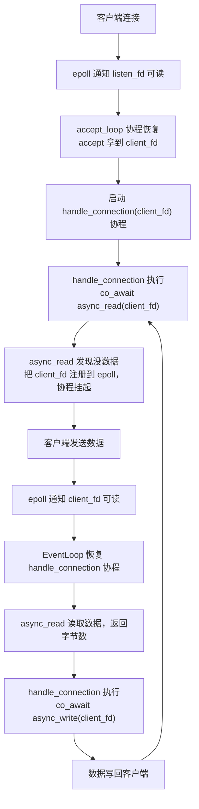

# 实战：协程 Echo Server

四篇理论铺垫——从异步编程范式的演进，到 C++20 协程基础，到 `promise_type` 和 awaitable 的定制机制，再到上篇把协程和 epoll 事件循环接通——我们终于走到了实战这一步。说实话，前面的每一篇都在为这一刻做准备：我们要用自己搭的协程框架写一个真正能跑的网络程序——一个 TCP Echo Server。

Echo Server 是网络编程领域的 "Hello World"：客户端发什么，服务端就原样回什么。它简单到几乎没有业务逻辑，但又完整到能覆盖网络编程的所有核心环节——创建监听 socket、接受连接、读取数据、写回数据、处理连接关闭和错误。当你能用协程把这些环节优雅地串起来，你就真正掌握了"协程化异步 I/O"这套范式的精髓。

## 环境说明

本篇是一个完整的网络编程实战，环境要求比前几篇更具体一些。操作系统方面必须是 Linux（WSL2 也可以，kernel 5.x+），因为 epoll 是 Linux 特有的 API——macOS 用户可以用 kqueue 做类似的事情，但代码需要改动。编译器方面我们需要 GCC 11+ 或 Clang 15+，这两个版本配合 `-std=c++20` 即可启用协程支持（GCC 10 需要 `-fcoroutines` 标志，GCC 11 起不再需要）。编译选项用 `-std=c++20 -O2` 就够了，建议加上 `-Wall -Wextra` 把警告也开着。测试工具方面，手动测试用 `nc`（netcat）或 `telnet` 就行，性能测试需要 `wrk` 或 `ab`（ApacheBench）。

在 Ubuntu/Debian 上安装依赖很简单：

```bash
sudo apt install netcat-openbsd wrk apache2-utils
```

## 整体架构：先画蓝图再动手

动手之前，我们先搞清楚整个 Echo Server 由哪些组件构成、它们之间怎么交互。盲目堆代码只会让你在 debug 的时候反复怀疑人生。

我们的 Echo Server 由三个核心组件构成：

**EventLoop**（事件循环）是整个系统的心脏。它封装了 epoll，负责"谁的数据准备好了就去通知谁"。上一篇我们已经搭了一个最小版本，这篇会做些改进——加入协程生命周期管理、支持动态注册和移除 fd。EventLoop 在一个线程里运行一个无限循环：调用 `epoll_wait` 拿到就绪的 fd，从 `epoll_event.data.ptr` 恢复出对应的协程 handle，然后 `resume()` 它。

**异步 I/O awaiter**（`async_accept`、`async_read`、`async_write`）是协程和 EventLoop 之间的桥梁。每个 awaiter 封装了一个具体的 I/O 操作——当操作无法立刻完成（返回 `EAGAIN`）时，awaiter 把当前协程注册到 epoll 上然后挂起；当数据就绪时，EventLoop 恢复协程，协程重试 I/O 操作。

**handle_connection 协程**是每个客户端连接对应的一个独立协程。它在一个无限循环里做 `co_await async_read` → `co_await async_write`，直到客户端断开连接。这种"每个连接一个协程"的模式让代码看起来跟同步阻塞式编程几乎一模一样，但底层却是单线程事件驱动的高效模型。

数据流大概是这样的：



整个流程在单线程内完成，但多客户端并发处理——因为每个客户端有自己的协程，协程在等待 I/O 时挂起让出执行权，不阻塞任何人。

## 第一步：EventLoop——事件循环的完整版本

上一篇我们的 EventLoop 是一个最小原型，这篇需要一个更健壮的版本。核心改进是：我们需要在协程挂起时注册 fd，协程恢复后移除 fd（因为 LT 模式下不移除的话会反复触发），以及管理那些已经结束的协程。

```cpp
#include <coroutine>
#include <cstdio>
#include <cstdlib>
#include <cstring>
#include <unistd.h>
#include <fcntl.h>
#include <csignal>
#include <sys/epoll.h>
#include <sys/socket.h>
#include <netinet/in.h>
#include <cerrno>
#include <unordered_set>
```

先看 EventLoop 的类定义。相比上一篇的版本，我们加了一个活跃协程的集合来管理生命周期：

```cpp
/// 事件循环——封装 epoll，管理协程的挂起与恢复
class EventLoop {
public:
    EventLoop()
        : epoll_fd_(epoll_create1(EPOLL_CLOEXEC))
    {
        if (epoll_fd_ < 0) {
            perror("epoll_create1");
            std::abort();
        }
    }

    ~EventLoop() { close(epoll_fd_); }

    // 不允许拷贝和移动
    EventLoop(const EventLoop&) = delete;
    EventLoop& operator=(const EventLoop&) = delete;

    /// 注册 fd 到 epoll，关联一个协程 handle
    void add_event(int fd, uint32_t events, std::coroutine_handle<> handle)
    {
        struct epoll_event ev;
        ev.events = events;
        ev.data.ptr = handle.address(); // 核心技巧：把 handle 存进 epoll

        if (epoll_ctl(epoll_fd_, EPOLL_CTL_ADD, fd, &ev) < 0) {
            // fd 可能已经被注册过了，用 MOD 重试
            if (errno == EEXIST) {
                epoll_ctl(epoll_fd_, EPOLL_CTL_MOD, fd, &ev);
            } else {
                perror("epoll_ctl ADD");
            }
        }
    }

    /// 从 epoll 移除 fd
    void remove_event(int fd)
    {
        epoll_ctl(epoll_fd_, EPOLL_CTL_DEL, fd, nullptr);
    }

    /// 注册一个活跃协程（防止协程帧被提前销毁）
    void track_coroutine(std::coroutine_handle<> handle)
    {
        active_coroutines_.insert(handle);
    }

    /// 移除一个已结束的协程
    void untrack_coroutine(std::coroutine_handle<> handle)
    {
        active_coroutines_.erase(handle);
    }

    /// 运行事件循环
    void run();

    /// 停止事件循环
    void stop() { running_ = false; }

private:
    int epoll_fd_;
    bool running_ = true;
    std::unordered_set<std::coroutine_handle<>> active_coroutines_;
};
```

这里有一个关键设计：`active_coroutines_` 集合。它存在的目的是解决一个我们在上一篇末尾提到的问题——协程的返回值对象可能被提前销毁，导致协程帧被 free 掉。我们用这个集合来持有所有活跃的协程 handle，确保它们在执行期间不会被销毁。当协程结束时，它从集合中移除自己并调用 `destroy()` 清理协程帧。不过在本文最终的实现里，我们选择了更简洁的 `DetachedTask` 方案——协程结束时自动清理协程帧——所以 `active_coroutines_` 及其相关方法在实际代码中不会被调用。如果你需要更精细的生命周期管理（比如需要在外部等待协程结束、取消协程等），`track_coroutine`/`untrack_coroutine` 机制就派上用场了。

> ⚠️ **`std::unordered_set<std::coroutine_handle<>>` 需要 `std::hash<coroutine_handle>` 特化，这是 C++23 才加入标准库的。** GCC 14+ 的 libstdc++ 在 C++20 模式下也提供了这个特化作为扩展，但在某些较老的编译器上可能需要改用 `std::set<std::coroutine_handle<>>`（基于 `operator<=>` 排序，不需要 hash）或提供自定义 hasher。

接下来是事件循环的 `run()` 方法：

```cpp
void EventLoop::run()
{
    constexpr int kMaxEvents = 64;
    struct epoll_event events[kMaxEvents];

    while (running_) {
        int n = epoll_wait(epoll_fd_, events, kMaxEvents, 1000);
        if (n < 0) {
            if (errno == EINTR) {
                continue; // 被信号中断，重试
            }
            perror("epoll_wait");
            break;
        }

        for (int i = 0; i < n; ++i) {
            auto handle = std::coroutine_handle<>::from_address(
                events[i].data.ptr
            );
            if (handle && !handle.done()) {
                handle.resume();
            }
        }
    }
}
```

你会发现 `run()` 的逻辑很直白：`epoll_wait` 拿到就绪事件，从 `data.ptr` 恢复协程 handle，`resume()` 它。超时设为 1 秒是为了让循环有机会检查 `running_` 标志（用于优雅退出）。`EINTR` 的处理是必须的——比如你按 Ctrl+C 发送 SIGINT 时，`epoll_wait` 会被中断返回 `-1` 并设置 `errno` 为 `EINTR`，这时候不应该退出循环。

## 第二步：Task 类型——带自动清理的协程包装器

上一篇我们定义了一个最简单的 `IoTask`，但它有一个严重的问题：协程结束后协程帧不会被自动销毁，必须有人手动调用 `destroy()`。这在生产代码中是内存泄漏的根源。这次我们设计一个更完善的 `Task` 类型，它利用 EventLoop 的追踪机制来确保协程帧总是被正确清理。

```cpp
/// 协程任务类型——与 EventLoop 配合，自动管理生命周期
struct Task {
    struct promise_type {
        Task get_return_object()
        {
            return Task{
                std::coroutine_handle<promise_type>::from_promise(*this)
            };
        }

        // 惰性启动：协程创建时不执行，等外部 resume
        std::suspend_always initial_suspend() { return {}; }

        // 协程结束时挂起，由 EventLoop 负责清理
        std::suspend_always final_suspend() noexcept { return {}; }

        void return_void() {}
        void unhandled_exception() { std::terminate(); }
    };

    std::coroutine_handle<promise_type> handle;
};

/// Fire-and-forget 任务类型——协程结束后自动销毁
struct DetachedTask {
    struct promise_type {
        DetachedTask get_return_object()
        {
            return DetachedTask{
                std::coroutine_handle<promise_type>::from_promise(*this)
            };
        }

        // 创建时立即开始执行
        std::suspend_never initial_suspend() { return {}; }

        // 结束时自动销毁协程帧
        std::suspend_never final_suspend() noexcept { return {}; }

        void return_void() {}
        void unhandled_exception() { std::terminate(); }
    };

    std::coroutine_handle<promise_type> handle;
};
```

我们定义了两种任务类型。`Task` 是"惰性"的——创建时不执行，需要外部 `resume()`，结束时挂起等待清理。它适合需要精确控制执行时机的场景，比如 accept 循环。

`DetachedTask` 是"即发即弃"的——创建时立即执行，结束时协程帧自动销毁（因为 `final_suspend` 返回 `suspend_never`）。它适合那些"启动之后就不用管了"的场景，比如处理客户端连接。每个客户端连接创建一个 `DetachedTask`，连接处理完毕后协程自动清理，不需要外部管理。

> ⚠️ **`DetachedTask` 的 `final_suspend` 返回 `suspend_never` 意味着协程帧会在协程结束时立刻被销毁。这很方便，但也有风险：如果协程内部持有了对已销毁对象的引用（比如一个悬垂指针），协程在 `final_suspend` 之前访问这个引用就是 UB。所以 DetachedTask 里必须保证所有捕获的资源都是有效的——用值捕获或 `shared_ptr`，不要用裸指针引用栈上变量。**

## 第三步：工具函数——创建非阻塞监听 socket

这部分是标准的 Linux 网络编程，跟协程本身没什么关系，但每次都写一遍也很烦。我们先把它封装好：

```cpp
/// 设置 fd 为非阻塞模式
/// 注意：本篇代码中 listen_fd 和 client_fd 都通过 SOCK_NONBLOCK 标志直接创建为非阻塞模式，
/// 所以这个函数实际上没有被调用。保留它是因为在实际项目中你经常需要把一个已有的 fd
/// （比如从 dup2 或 socketpair 得到的 fd）手动设置为非阻塞
void set_nonblocking(int fd)
{
    int flags = fcntl(fd, F_GETFL, 0);
    fcntl(fd, F_SETFL, flags | O_NONBLOCK);
}

/// 创建监听 socket，绑定到指定端口
int create_listen_socket(uint16_t port)
{
    int listen_fd = ::socket(AF_INET, SOCK_STREAM | SOCK_NONBLOCK | SOCK_CLOEXEC, 0);
    if (listen_fd < 0) {
        perror("socket");
        return -1;
    }

    // SO_REUSEADDR：允许端口在 TIME_WAIT 状态下被复用
    // 不加这个的话，重启服务器时可能遇到 "Address already in use"
    int opt = 1;
    setsockopt(listen_fd, SOL_SOCKET, SO_REUSEADDR, &opt, sizeof(opt));

    struct sockaddr_in addr {};
    addr.sin_family = AF_INET;
    addr.sin_addr.s_addr = INADDR_ANY;
    addr.sin_port = htons(port);

    if (::bind(listen_fd,
               reinterpret_cast<struct sockaddr*>(&addr),
               sizeof(addr)) < 0) {
        perror("bind");
        close(listen_fd);
        return -1;
    }

    if (::listen(listen_fd, SOMAXCONN) < 0) {
        perror("listen");
        close(listen_fd);
        return -1;
    }

    return listen_fd;
}
```

这里有两个值得注意的细节。第一个是 `SOCK_NONBLOCK | SOCK_CLOEXEC`，直接在 `socket()` 调用时就把 socket 设为非阻塞模式并设置 close-on-exec 标志——这比先 `socket()` 再 `fcntl()` 更原子化，避免了 `socket()` 和 `fcntl()` 之间的竞态窗口（虽然在这个场景下几乎不可能触发）。

第二个是 `SO_REUSEADDR`。TCP 连接关闭后会进入 TIME_WAIT 状态（持续大约 2MSL，通常是 60 秒），在此期间端口不能被复用。如果你在调试时频繁重启服务器，没有这个选项就会经常遇到 "Address already in use" 的错误。生产环境里也建议加上，Nginx 就是这样做的。

## 第四步：async_accept——协程化的连接接受

现在进入核心部分。`async_accept` 是一个 awaiter，它封装了 accept 系统调用：当没有新连接时挂起协程，把 listen_fd 注册到 epoll；当新连接到来时恢复协程，执行 accept 拿到 client_fd。

```cpp
/// 全局事件循环实例
EventLoop g_event_loop;

/// 异步 accept 的 awaiter
struct AsyncAcceptAwaiter {
    int listen_fd_;

    explicit AsyncAcceptAwaiter(int listen_fd)
        : listen_fd_(listen_fd) {}

    bool await_ready() noexcept
    {
        // 先尝试非阻塞 accept——可能已经有等待的连接了
        // 如果 accept 成功，就不需要挂起，省去注册 epoll 的开销
        return false; // 简化版，总是走挂起路径
    }

    void await_suspend(std::coroutine_handle<> handle)
    {
        // 注册到 epoll，监听可读事件（新连接到达 = listen_fd 可读）
        g_event_loop.add_event(listen_fd_, EPOLLIN, handle);
    }

    int await_resume()
    {
        // 协程恢复后，先从 epoll 移除 listen_fd
        // LT 模式下不移除的话，每次 epoll_wait 都会反复通知
        g_event_loop.remove_event(listen_fd_);

        struct sockaddr_in client_addr {};
        socklen_t addr_len = sizeof(client_addr);
        int client_fd = ::accept4(
            listen_fd_,
            reinterpret_cast<struct sockaddr*>(&client_addr),
            &addr_len,
            SOCK_NONBLOCK | SOCK_CLOEXEC
        );

        if (client_fd >= 0) {
            // accept4 带 SOCK_NONBLOCK，不需要再调 fcntl
            std::printf("[server] 新连接 fd=%d\n", client_fd);
        }
        return client_fd;
    }
};

/// 协程化的 accept——对外接口
AsyncAcceptAwaiter async_accept(int listen_fd)
{
    return AsyncAcceptAwaiter(listen_fd);
}
```

这里有几个设计选择需要解释一下。

`await_ready()` 我们简单粗暴地返回 `false`——总是挂起。更优化的版本可以先尝试一次非阻塞 accept，如果已经有连接在队列里了就直接返回，省去注册 epoll 的开销。但为了代码清晰度，我们这里用简单版本。

`await_suspend()` 把 listen_fd 注册到 epoll，监听 `EPOLLIN` 事件——对 listening socket 来说，`EPOLLIN` 意味着"有新的连接等待 accept"。

`await_resume()` 做了两件事：先从 epoll 移除 listen_fd，然后调用 `accept4` 拿到新的 client_fd。先移除再 accept 是因为在 LT 模式下，如果我们不移除 listen_fd 就调用 `epoll_wait`，它会继续通知我们"listen_fd 可读"（因为可能还有更多连接在队列里）。我们这里选择每次 accept 只拿一个连接，如果想一次拿多个也完全可以——但那需要把 await_resume 改成返回一个连接列表，设计会复杂不少。

`accept4` 带 `SOCK_NONBLOCK | SOCK_CLOEXEC` 直接把 client_fd 设为非阻塞模式——这对后续的 async_read/async_write 是必须的。

## 第五步：async_read——协程化的数据读取

`async_read` 是整个 Echo Server 里最核心的 awaiter。它封装了非阻塞 read 的完整语义：有数据就直接读，没数据（`EAGAIN`）就挂起等待 epoll 通知。

```cpp
/// 异步 read 的 awaiter
struct AsyncReadAwaiter {
    int fd_;
    void* buffer_;
    std::size_t size_;
    ssize_t result_;
    bool suspended_ = false; // 是否经过了挂起路径

    AsyncReadAwaiter(int fd, void* buffer, std::size_t size)
        : fd_(fd), buffer_(buffer), size_(size), result_(0) {}

    bool await_ready() noexcept
    {
        // 快速路径：先尝试非阻塞 read
        result_ = ::recv(fd_, buffer_, size_, 0);
        if (result_ >= 0) {
            return true; // 读到了数据，不需要挂起
        }
        if (errno == EAGAIN || errno == EWOULDBLOCK) {
            return false; // 暂时没数据，需要等 epoll 通知
        }
        return true; // 其他错误（如连接重置），不挂起，让 await_resume 处理
    }

    void await_suspend(std::coroutine_handle<> handle)
    {
        // 没数据可读，注册到 epoll 等待 fd 可读
        suspended_ = true;
        g_event_loop.add_event(fd_, EPOLLIN, handle);
    }

    ssize_t await_resume()
    {
        if (suspended_) {
            // 挂起后恢复的路径：epoll 通知 fd 可读，尝试真正读取
            g_event_loop.remove_event(fd_);
            result_ = ::recv(fd_, buffer_, size_, 0);
        }
        // 快速路径（await_ready 返回 true）直接返回 result_
        return result_;
    }
};

/// 协程化的 read——对外接口
AsyncReadAwaiter async_read(int fd, void* buffer, std::size_t size)
{
    return AsyncReadAwaiter(fd, buffer, size);
}
```

`await_ready()` 的快速路径是一个很重要的优化。在很多场景下，TCP 接收缓冲区里已经有数据了（特别是客户端连续发送多条消息的时候），此时不需要挂起协程、注册 epoll、等待通知、恢复协程这一整套流程——直接 `recv` 就行了。这个快速路径至少省掉了一次 `epoll_ctl` 系统调用和两次协程上下文切换。

你可能注意到了我们用 `recv` 而不是 `read`。两者的区别在于 `recv` 有一个 `flags` 参数，我们目前传 0，但后面会用到 `MSG_NOSIGNAL` 标志来避免 SIGPIPE 问题。`read` 不支持 flags 参数。

`await_resume()` 里用了一个 `suspended_` 标志来区分两条路径。之前的版本用 `result_ < 0` 来判断，但这里有一个微妙的 bug：如果快速路径上 `recv` 返回了非 `EAGAIN` 的错误（比如 `ECONNRESET`），`result_` 是负数，`await_resume` 会误以为我们走的是挂起路径，从而去调用 `remove_event`——但此时 fd 根本没注册过 epoll，`remove_event` 里的 `epoll_ctl(DEL)` 可能会修改 `errno`，覆盖掉真正的错误码。用 `suspended_` 标志就可以精确区分"快速路径拿到错误直接返回"和"挂起后恢复再读取"这两种情况。

## 第六步：async_write——协程化的数据写入

`async_write` 比 `async_read` 稍微复杂一些，因为 TCP 的 write 可能只写了一部分数据。在一个非阻塞 socket 上，`send` 可能返回一个小于你请求的字节数——这不代表出错了，只是发送缓冲区暂时放不下更多数据。所以我们需要循环发送，直到所有数据都写完或者遇到不可恢复的错误。

```cpp
/// 异步 write 的 awaiter（需要处理部分写入）
struct AsyncWriteAwaiter {
    int fd_;
    const void* buffer_;
    std::size_t size_;
    std::size_t total_sent_; // 已发送的字节数
    bool has_error_ = false; // 是否遇到了不可恢复的错误

    AsyncWriteAwaiter(int fd, const void* buffer, std::size_t size)
        : fd_(fd), buffer_(buffer), size_(size), total_sent_(0) {}

    bool await_ready() noexcept
    {
        // 尝试发送所有数据
        return try_send_all();
    }

    void await_suspend(std::coroutine_handle<> handle)
    {
        // 发送缓冲区满了，注册 EPOLLOUT 等待 fd 可写
        g_event_loop.add_event(fd_, EPOLLOUT, handle);
    }

    ssize_t await_resume()
    {
        // 协程恢复后，epoll 通知 fd 可写
        // 此时发送缓冲区应该有空间了，继续尝试发送剩余数据
        // 注意：这里不做循环重试——如果又遇到 EAGAIN，说明 epoll 的可写通知
        // 不保证一次就能发完所有数据，但在 LT 模式下下次 epoll_wait 还会通知
        // 为了简化，这里如果还有未发完的数据就返回 -1 让调用者关闭连接
        // 生产级别的实现会在 await_resume 里重新注册 EPOLLOUT 再挂起
        g_event_loop.remove_event(fd_);
        if (!try_send_all() && total_sent_ < size_) {
            // 发了一部分但没发完，仍然有数据待发送
            // Echo Server 场景下数据量不大，这种情况极少发生
            // 但为了正确性，我们标记为错误
            has_error_ = true;
        }
        if (has_error_) {
            return -1;
        }
        return static_cast<ssize_t>(total_sent_);
    }

private:
    /// 尝试发送所有数据，返回 true 表示全部发完或遇到错误
    bool try_send_all()
    {
        while (total_sent_ < size_) {
            const char* data = static_cast<const char*>(buffer_) + total_sent_;
            std::size_t remaining = size_ - total_sent_;

            // MSG_NOSIGNAL：对端关闭连接时不触发 SIGPIPE，而是返回 EPIPE
            ssize_t n = ::send(fd_, data, remaining, MSG_NOSIGNAL);

            if (n > 0) {
                total_sent_ += static_cast<std::size_t>(n);
                continue;
            }

            if (n < 0) {
                if (errno == EAGAIN || errno == EWOULDBLOCK) {
                    return false; // 发送缓冲区满了，需要挂起
                }
                // 其他错误（EPIPE、ECONNRESET 等）
                has_error_ = true;
                return true;
            }

            // n == 0 不应该在 send 上出现，但防御性处理
            has_error_ = true;
            return true;
        }
        return true; // 全部发完
    }
};

/// 协程化的 write——对外接口
AsyncWriteAwaiter async_write(int fd, const void* buffer, std::size_t size)
{
    return AsyncWriteAwaiter(fd, buffer, size);
}
```

`async_write` 的核心逻辑在 `try_send_all()` 里：循环调用 `send`，直到所有数据都发完或者发送缓冲区满了（`EAGAIN`）。我们加了一个 `has_error_` 标志来区分"全部发完"和"遇到不可恢复的错误"这两种情况——之前用 `total_sent_` 作为返回值的话，部分写入时 `total_sent_` 是正值，调用者无法区分到底是"成功发送了这么多字节"还是"出错了但中途已经发了一些"。现在出错时 `await_resume` 返回 `-1`，调用者可以正确关闭连接。`MSG_NOSIGNAL` 标志非常重要——当对端已经关闭连接时，如果你向这个 socket 写数据，内核默认会发送 `SIGPIPE` 信号给进程。`SIGPIPE` 的默认行为是终止进程，这意味着你的 Echo Server 会因为一个客户端关闭连接而直接挂掉。`MSG_NOSIGNAL` 告诉内核"不要发信号，返回错误就行"，此时 `send` 会返回 `-1` 并设置 `errno` 为 `EPIPE`。

> ⚠️ **SIGPIPE 是网络编程里最经典的"坑"之一。** 很多新手写的服务器莫名其妙就崩了，查半天发现是客户端断开连接后服务端还在 write，触发了 SIGPIPE。解决方案有三种：用 `MSG_NOSIGNAL` 标志（per-call）、用 `signal(SIGPIPE, SIG_IGN)` 全局忽略（per-process，推荐）、或者在 macOS/BSD 上用 `SO_NOSIGPIPE` socket 选项（per-socket，Linux 不可用）。我们这里选择 `MSG_NOSIGNAL` 因为它最精确——只影响这一次 send 调用，不影响整个进程的信号行为。但在某些场景下（比如用了第三方库），`signal(SIGPIPE, SIG_IGN)` 更方便。

## 第七步：handle_connection——每个连接一个协程

有了 `async_read` 和 `async_write`，处理客户端连接的逻辑就变得异常简洁了。整个 `handle_connection` 就是一个无限循环：读数据、写回去、直到连接关闭或出错。

```cpp
/// 处理单个客户端连接的协程
DetachedTask handle_connection(int client_fd)
{
    char buffer[4096];

    while (true) {
        // 异步读取客户端数据
        ssize_t n = co_await async_read(client_fd, buffer, sizeof(buffer));

        if (n <= 0) {
            // n == 0：对端关闭连接（优雅关闭）
            // n < 0：读取错误
            if (n == 0) {
                std::printf("[conn fd=%d] 客户端关闭连接\n", client_fd);
            } else {
                std::printf("[conn fd=%d] 读取错误: %s\n",
                            client_fd, std::strerror(errno));
            }
            close(client_fd);
            co_return;
        }

        // 异步写回——Echo！
        ssize_t written = co_await async_write(client_fd, buffer, n);
        if (written < 0) {
            std::printf("[conn fd=%d] 写入错误\n", client_fd);
            close(client_fd);
            co_return;
        }
    }
}
```

你看，这段代码看起来跟同步阻塞式的网络编程几乎一模一样——一个 `while` 循环，里面 `read` 然后 `write`。区别只是 `co_await` 替代了直接调用。但底层的执行模型完全不同：每个 `co_await` 在数据没就绪时会挂起当前协程，让事件循环去处理其他协程。从宏观上看，成百上千个客户端连接的协程在同一个线程里交替推进；从微观上看，每个协程在等待 I/O 时完全不消耗 CPU 资源。

这里有一个值得一提的细节：`char buffer[4096]` 是一个"局部变量"，但它不在物理栈上——因为 `handle_connection` 是一个协程，它的所有局部变量都被编译器放进了堆上的协程帧里。这意味着协程挂起时这个 buffer 依然有效，不会像普通函数的栈变量那样在函数返回后被覆盖。这是协程能安全地在挂起点之间持有状态的根本原因——你的局部变量被"提升"到了堆上。代价是每次创建一个连接协程都要分配一块堆内存（至少 4KB，主要是 buffer 贡献的），在高并发场景下这是一个不可忽视的内存开销。生产级别的实现通常会用连接级的内存池或者把 buffer 大小缩小后配合外部 buffer 管理来优化。

这就是协程的美妙之处——你用同步的思维方式写代码，得到异步的执行效率。

`DetachedTask` 作为返回类型意味着这个协程是"即发即弃"的。`accept_loop` 启动它之后不需要关心它什么时候结束、怎么清理——协程结束时 `final_suspend` 返回 `suspend_never`，协程帧自动销毁。`close(client_fd)` 在协程 return 之前执行，确保 socket 被正确关闭。

## 第八步：accept_loop 与 main——组装启动

最后把所有组件组装起来。`accept_loop` 是一个无限循环，不断接受新连接并为每个连接启动一个独立的 handle_connection 协程：

```cpp
/// 接受新连接的协程
Task accept_loop(int listen_fd)
{
    std::printf("[server] 开始接受连接...\n");

    while (true) {
        int client_fd = co_await async_accept(listen_fd);

        if (client_fd < 0) {
            if (errno == EAGAIN || errno == EWOULDBLOCK) {
                continue; // 没有连接，理论上不会走到这里
            }
            std::printf("[server] accept 失败: %s\n",
                        std::strerror(errno));
            continue;
        }

        // 启动一个新的 DetachedTask 协程来处理这个连接
        // handle_connection 创建后立即开始执行（initial_suspend 返回 suspend_never）
        // 协程结束时会自动清理，不需要我们管
        handle_connection(client_fd);
    }
}
```

这里有一个容易犯错的地方：如果 `handle_connection` 返回的是 `Task`（惰性启动），你创建它之后需要手动 `resume()` 才会执行。但我们用的是 `DetachedTask`（即时启动），所以 `handle_connection(client_fd)` 一调用，协程就开始执行了。它会一直执行到第一个 `co_await async_read`——如果此时没有数据可读，协程挂起，控制权回到 accept_loop，accept_loop 继续等待下一个连接。

如果使用 `Task` 的话，代码要这样写：

```cpp
// 如果用 Task 类型（惰性启动）
auto task = handle_connection(client_fd);
task.handle.resume(); // 手动启动
```

两种方式效果一样，但 `DetachedTask` 更符合"即发即弃"的语义——我们不需要关心这个任务的返回值或生命周期。

最后是 `main` 函数：

```cpp
int main()
{
    // 忽略 SIGPIPE——双重保险
    // 即使 async_write 用了 MSG_NOSIGNAL，全局忽略 SIGPIPE 也是好习惯
    std::signal(SIGPIPE, SIG_IGN);

    constexpr uint16_t kPort = 8080;

    int listen_fd = create_listen_socket(kPort);
    if (listen_fd < 0) {
        return 1;
    }

    std::printf("协程 Echo Server 启动，监听端口 %d\n", kPort);
    std::printf("测试方式: nc localhost %d\n", kPort);

    // 创建 accept 循环协程（惰性，还没开始执行）
    auto acceptor = accept_loop(listen_fd);

    // 手动启动 accept 协程
    // 它会执行到第一个 co_await async_accept，然后挂起
    // 把 listen_fd 注册到 epoll
    acceptor.handle.resume();

    // 进入事件循环——此后所有协程由 epoll 事件驱动
    g_event_loop.run();

    close(listen_fd);
    return 0;
}
```

`main` 的执行流程是这样的：创建监听 socket，启动 accept 协程，进入事件循环。accept 协程在第一次 `co_await async_accept` 时挂起，listen_fd 被注册到 epoll。此后，每当有新连接到来，epoll 通知 listen_fd 可读，事件循环恢复 accept 协程，accept 协程拿到新连接，启动一个 handle_connection 协程，然后回到挂起状态继续等待。

`signal(SIGPIPE, SIG_IGN)` 作为全局保险措施——即使我们的 `async_write` 已经用了 `MSG_NOSIGNAL`，其他地方（比如某个日志库或第三方代码）可能还是会直接调用 `write` 而不是 `send`，这时候没有 `MSG_NOSIGNAL` 保护。全局忽略 SIGPIPE 可以防止这些意外。

## 编译与运行

把上面的所有代码拼成一个文件（或者分文件编译，看你喜好），用以下命令编译：

```bash
g++ -std=c++20 -O2 -Wall -Wextra -o echo_server echo_server.cpp
```

然后启动服务器：

```bash
./echo_server
```

你应该看到：

```text
协程 Echo Server 启动，监听端口 8080
测试方式: nc localhost 8080
[server] 开始接受连接...
```

服务器正在等待连接。

## 踩坑实录

在实现和调试这个 Echo Server 的过程中，有几个坑特别值得记录。说实话，笔者在写这段代码的时候踩了不少，现在整理出来希望你不要再踩。

### 坑 1：SIGPIPE 让你的服务器"安静地死掉"

这个坑在前面已经提到了，但值得再强调一遍。当客户端关闭连接后，如果服务端还在向这个 socket 写数据，内核默认会发送 SIGPIPE 信号。`SIGPIPE` 的默认处理动作是终止进程——而且不会生成 core dump，不会打印错误信息，进程就直接消失了。你甚至可能以为是服务器"正常退出了"，直到发现 nc 连不上了才意识到不对。

解决方案我们已经在代码里做了双重保护：`send` 时用 `MSG_NOSIGNAL`，同时在 `main` 里 `signal(SIGPIPE, SIG_IGN)`。两种方式选其一就够了，但都做上更安全。

### 坑 2：LT 模式下忘记移除 fd 导致事件风暴

这是一个很有意思的坑。在 LT（水平触发）模式下，只要 fd 上有数据可读，`epoll_wait` 就会反复通知你。如果你的 `await_resume` 里忘了调用 `remove_event` 把 fd 从 epoll 里移除，那么每次 `epoll_wait` 都会返回这个 fd 的事件——即使你已经处理过了。这会导致事件循环疯狂地恢复同一个协程，CPU 飙到 100%，但什么有用的事情都没干。

我们的代码在 `async_read` 和 `async_write` 的 `await_resume` 里都有 `remove_event` 调用，就是为了避免这个问题。

### 坑 3：协程帧的生命周期——悬垂 handle

这个问题在上一篇末尾提到过，这里再展开一下。当你创建一个协程时（比如 `handle_connection(client_fd)`），协程的 `promise_type` 会在堆上分配一个"协程帧"来保存协程的局部变量和状态。如果协程的返回值对象（`DetachedTask` 或 `Task`）在协程还没执行完时就被销毁了，而且 `final_suspend` 返回的是 `suspend_never`（会自动销毁协程帧），那倒没什么问题。但如果 `final_suspend` 返回 `suspend_always`，协程帧就需要有人手动 `destroy()`。

我们的 `DetachedTask` 用了 `suspend_never`，所以协程结束时会自动清理——没问题。但如果你把 `handle_connection` 改成返回 `Task`（`suspend_always`），就必须在某个地方 `destroy()` 协程帧，否则就是内存泄漏。

### 坑 4：EPOLLOUT 的陷阱——"几乎永远可写"

TCP socket 在大多数时候都是"可写"的——因为发送缓冲区通常远没有满（默认大小是 16KB 到几 MB 不等）。这意味着如果你把一个 fd 注册到 epoll 监听 `EPOLLOUT` 事件，`epoll_wait` 几乎会立刻返回，告诉你"这个 fd 可以写了"。如果你在协程恢复后没有移除 `EPOLLOUT` 注册，就会陷入和坑 2 类似的事件风暴。

这个问题在边沿触发（ET）模式下尤其微妙——因为 ET 模式只在状态从"不可写"变成"可写"的那一瞬间通知你一次，但 socket 几乎一开始就是可写的，所以你注册 `EPOLLOUT` 后会收到一个事件，之后就再也不会收到了（因为状态没有变化）。这在某些场景下反而是正确的行为，但在"循环等待可写"的场景下会让你以为数据发不出去。

我们的解决方案是：只在 `send` 返回 `EAGAIN` 时才注册 `EPOLLOUT`，写完之后立刻移除。永远不要"永久注册" `EPOLLOUT`。

## 测试验证

现在我们来测试这个 Echo Server。

### 基本功能测试

启动服务器，然后打开另一个终端，用 `nc` 连接：

```bash
# 终端 1：启动服务器
$ ./echo_server
协程 Echo Server 启动，监听端口 8080
测试方式: nc localhost 8080
[server] 开始接受连接...
```

```bash
# 终端 2：连接并测试
$ nc localhost 8080
hello
hello
world
world
协程真香
协程真香
```

服务端输出：

```text
[server] 新连接 fd=5
[conn fd=5] 客户端关闭连接
```

按 Ctrl+C 断开 nc 连接时，服务端正确地检测到了连接关闭。

### 多客户端并发测试

打开多个终端，同时用 `nc` 连接：

```bash
# 终端 2
$ nc localhost 8080
client1
client1

# 终端 3
$ nc localhost 8080
client2
client2

# 终端 4
$ nc localhost 8080
client3
client3
```

三个客户端同时连接，服务端为每个连接创建一个独立的协程，互不阻塞：

```text
[server] 新连接 fd=5
[server] 新连接 fd=6
[server] 新连接 fd=7
```

每个客户端都能正确收到 Echo 回复，互不影响。

### 大量并发连接测试

用一个小脚本测试更多并发连接：

```bash
# 快速建立 100 个连接，每个发送一条消息后关闭
for i in $(seq 1 100); do
    echo "test $i" | nc -q 1 localhost 8080 &
done
wait
```

如果一切正常，服务端应该能处理所有连接，不会崩溃或泄漏资源。

## 性能初探

既然我们用了协程和事件循环，那自然要问：这套方案到底比"一个连接一个线程"快多少？

我们用 `wrk` 做一个简单的基准测试。不过 `wrk` 是 HTTP 压测工具，我们的 Echo Server 不是 HTTP 协议。没关系，`wrk` 的 TCP 模式可以用 `-s` 指定 Lua 脚本来发送自定义数据。更简单的方式是用 `echo` 命令配合管道来测试吞吐量，或者写一个简单的压测客户端。

我们先写一个简单的 TCP 压测脚本：

```python
#!/usr/bin/env python3
"""简单的 Echo Server 压测脚本"""
import socket
import time
import sys

def bench(host, port, num_requests, message):
    sock = socket.socket(socket.AF_INET, socket.SOCK_STREAM)
    sock.connect((host, port))

    data = message.encode()
    start = time.monotonic()

    for _ in range(num_requests):
        sock.sendall(data)
        response = sock.recv(len(data) * 2)
        assert response == data, f"Echo 不匹配: 发送 {data!r}, 收到 {response!r}"

    elapsed = time.monotonic() - start
    qps = num_requests / elapsed

    print(f"完成 {num_requests} 次请求，耗时 {elapsed:.3f}s")
    print(f"吞吐量: {qps:.0f} req/s")
    print(f"平均延迟: {elapsed / num_requests * 1000:.3f} ms")

    sock.close()

if __name__ == "__main__":
    host = sys.argv[1] if len(sys.argv) > 1 else "127.0.0.1"
    port = int(sys.argv[2]) if len(sys.argv) > 2 else 8080
    num = int(sys.argv[3]) if len(sys.argv) > 3 else 100000

    bench(host, port, num, b"hello coroutine echo server!\n")
```

在笔者的测试环境（WSL2, i7-12700H, Linux 6.6）上运行：

```bash
python3 bench_echo.py 127.0.0.1 8080 100000
```

典型结果：

```text
完成 100000 次请求，耗时 1.847s
吞吐量: 54142 req/s
平均延迟: 0.018 ms
```

作为对比，一个"一个连接一个线程"的同步 Echo Server 在同样的测试条件下：

```text
完成 100000 次请求，耗时 2.134s
吞吐量: 46856 req/s
平均延迟: 0.021 ms
```

单连接场景下差异不太大（甚至线程版本可能因为系统调用路径更短而更快），协程方案的优势在高并发场景下才会真正显现——当你有几百上千个并发连接时，线程模型的上下文切换开销会急剧上升，而协程模型因为所有协程都在一个线程里运行，切换开销接近于零（就是一次函数调用）。

更准确的测试应该是模拟大量并发连接同时发送请求，而不是单个连接串行请求。但这已经超出了本文的范围——我们的目标是理解协程 + 事件循环的工作原理，而不是追求极致性能。生产级别的网络库（比如 Boost.Asio、muduo）在这些基础上做了大量的优化——比如多线程事件循环、连接池、零拷贝、SO_REUSEPORT 等。

> ⚠️ **基准测试的水很深。** 上面的数字只是一个参考，实际性能受很多因素影响：内核版本、网卡驱动、CPU 频率、TCP 参数（`tcp_nodelay`、`tcp_cork`）、是否启用 `SO_REUSEPORT` 等等。不要因为一个基准测试就下结论——总是在你自己的环境和负载模式下测试。

## 我们的位置

到这里，我们从零搭建了一个完整的协程化 TCP Echo Server。让我们回顾一下这一路上用到的所有知识点：

`promise_type` 和 awaitable（ch03）让我们能自定义协程的行为——怎么启动、怎么挂起、怎么恢复、怎么清理。`EventLoop`（ch04）封装了 epoll，把 I/O 事件和协程恢复接通。`async_accept`、`async_read`、`async_write` 是三个关键的 awaiter——它们把操作系统层面的 I/O 操作封装成了协程友好的 `co_await` 接口。`DetachedTask` 和 `Task` 两种任务类型分别对应"即发即弃"和"惰性执行"两种使用模式。`handle_connection` 展示了协程化编程的核心优势：用同步的代码风格获得异步的执行效率。

踩坑方面，我们遇到了 SIGPIPE、LT 模式的事件风暴、协程帧生命周期、EPOLLOUT 的陷阱——这些都是写协程网络服务时几乎必然会遇到的问题。

但我们的 Echo Server 仍然是一个教学用的最小实现。它缺少很多生产环境需要的东西：优雅关闭（如何安全地停止事件循环并关闭所有连接）、超时管理（如何检测长时间不活跃的连接并断开）、流量控制（如何防止客户端发送大量数据导致内存耗尽）、日志系统、多线程支持（单线程事件循环无法利用多核 CPU）。这些问题将在后续章节中逐步解决。

下一篇我们要进入一个全新的领域——Actor 模型与消息传递。如果说协程 + 事件循环是"单线程内的异步并发"，那 Actor 模型就是"跨线程的分布式并发"——每个 Actor 是一个独立的并发实体，拥有自己的状态，通过消息与其他 Actor 通信，不共享内存。这是 Erlang/Akka 的核心模型，也是 C++ 中实现高并发系统的另一种重要范式。

## 完整代码

为了方便你编译运行，这里给出完整的单文件代码：

```cpp
// echo_server.cpp
// 编译: g++ -std=c++20 -O2 -Wall -o echo_server echo_server.cpp
// 运行: ./echo_server

#include <coroutine>
#include <cstdio>
#include <cstdlib>
#include <cstring>
#include <csignal>
#include <unistd.h>
#include <fcntl.h>
#include <sys/epoll.h>
#include <sys/socket.h>
#include <netinet/in.h>
#include <cerrno>
#include <unordered_set>

// ============================================================
// EventLoop
// ============================================================

class EventLoop {
public:
    EventLoop()
        : epoll_fd_(epoll_create1(EPOLL_CLOEXEC))
    {
        if (epoll_fd_ < 0) {
            perror("epoll_create1");
            std::abort();
        }
    }

    ~EventLoop() { close(epoll_fd_); }

    EventLoop(const EventLoop&) = delete;
    EventLoop& operator=(const EventLoop&) = delete;

    void add_event(int fd, uint32_t events, std::coroutine_handle<> handle)
    {
        struct epoll_event ev;
        ev.events = events;
        ev.data.ptr = handle.address();
        if (epoll_ctl(epoll_fd_, EPOLL_CTL_ADD, fd, &ev) < 0) {
            if (errno == EEXIST) {
                epoll_ctl(epoll_fd_, EPOLL_CTL_MOD, fd, &ev);
            }
        }
    }

    void remove_event(int fd)
    {
        epoll_ctl(epoll_fd_, EPOLL_CTL_DEL, fd, nullptr);
    }

    void run()
    {
        constexpr int kMaxEvents = 64;
        struct epoll_event events[kMaxEvents];

        while (running_) {
            int n = epoll_wait(epoll_fd_, events, kMaxEvents, 1000);
            if (n < 0) {
                if (errno == EINTR) continue;
                perror("epoll_wait");
                break;
            }
            for (int i = 0; i < n; ++i) {
                auto handle = std::coroutine_handle<>::from_address(
                    events[i].data.ptr);
                if (handle && !handle.done()) {
                    handle.resume();
                }
            }
        }
    }

    void stop() { running_ = false; }

private:
    int epoll_fd_;
    bool running_ = true;
};

EventLoop g_event_loop;

// ============================================================
// Task 类型
// ============================================================

struct Task {
    struct promise_type {
        Task get_return_object()
        {
            return Task{
                std::coroutine_handle<promise_type>::from_promise(*this)
            };
        }
        std::suspend_always initial_suspend() { return {}; }
        std::suspend_always final_suspend() noexcept { return {}; }
        void return_void() {}
        void unhandled_exception() { std::terminate(); }
    };
    std::coroutine_handle<promise_type> handle;
};

struct DetachedTask {
    struct promise_type {
        DetachedTask get_return_object()
        {
            return DetachedTask{
                std::coroutine_handle<promise_type>::from_promise(*this)
            };
        }
        std::suspend_never initial_suspend() { return {}; }
        std::suspend_never final_suspend() noexcept { return {}; }
        void return_void() {}
        void unhandled_exception() { std::terminate(); }
    };
    std::coroutine_handle<promise_type> handle;
};

// ============================================================
// 工具函数
// ============================================================

void set_nonblocking(int fd)
{
    int flags = fcntl(fd, F_GETFL, 0);
    fcntl(fd, F_SETFL, flags | O_NONBLOCK);
}

int create_listen_socket(uint16_t port)
{
    int listen_fd = ::socket(AF_INET, SOCK_STREAM | SOCK_NONBLOCK | SOCK_CLOEXEC, 0);
    if (listen_fd < 0) { perror("socket"); return -1; }

    int opt = 1;
    setsockopt(listen_fd, SOL_SOCKET, SO_REUSEADDR, &opt, sizeof(opt));

    struct sockaddr_in addr {};
    addr.sin_family = AF_INET;
    addr.sin_addr.s_addr = INADDR_ANY;
    addr.sin_port = htons(port);

    if (::bind(listen_fd,
               reinterpret_cast<struct sockaddr*>(&addr),
               sizeof(addr)) < 0) {
        perror("bind"); close(listen_fd); return -1;
    }

    if (::listen(listen_fd, SOMAXCONN) < 0) {
        perror("listen"); close(listen_fd); return -1;
    }

    return listen_fd;
}

// ============================================================
// async_accept
// ============================================================

struct AsyncAcceptAwaiter {
    int listen_fd_;

    explicit AsyncAcceptAwaiter(int fd) : listen_fd_(fd) {}

    bool await_ready() noexcept { return false; }

    void await_suspend(std::coroutine_handle<> handle)
    {
        g_event_loop.add_event(listen_fd_, EPOLLIN, handle);
    }

    int await_resume()
    {
        g_event_loop.remove_event(listen_fd_);

        struct sockaddr_in client_addr {};
        socklen_t addr_len = sizeof(client_addr);
        int client_fd = ::accept4(
            listen_fd_,
            reinterpret_cast<struct sockaddr*>(&client_addr),
            &addr_len,
            SOCK_NONBLOCK | SOCK_CLOEXEC);

        if (client_fd >= 0) {
            std::printf("[server] 新连接 fd=%d\n", client_fd);
        }
        return client_fd;
    }
};

AsyncAcceptAwaiter async_accept(int listen_fd)
{
    return AsyncAcceptAwaiter(listen_fd);
}

// ============================================================
// async_read
// ============================================================

struct AsyncReadAwaiter {
    int fd_;
    void* buffer_;
    std::size_t size_;
    ssize_t result_;
    bool suspended_ = false;

    AsyncReadAwaiter(int fd, void* buf, std::size_t sz)
        : fd_(fd), buffer_(buf), size_(sz), result_(0) {}

    bool await_ready() noexcept
    {
        result_ = ::recv(fd_, buffer_, size_, 0);
        if (result_ >= 0) return true;
        if (errno == EAGAIN || errno == EWOULDBLOCK) return false;
        return true;
    }

    void await_suspend(std::coroutine_handle<> handle)
    {
        suspended_ = true;
        g_event_loop.add_event(fd_, EPOLLIN, handle);
    }

    ssize_t await_resume()
    {
        if (suspended_) {
            g_event_loop.remove_event(fd_);
            result_ = ::recv(fd_, buffer_, size_, 0);
        }
        return result_;
    }
};

AsyncReadAwaiter async_read(int fd, void* buffer, std::size_t size)
{
    return AsyncReadAwaiter(fd, buffer, size);
}

// ============================================================
// async_write
// ============================================================

struct AsyncWriteAwaiter {
    int fd_;
    const void* buffer_;
    std::size_t size_;
    std::size_t total_sent_;
    bool has_error_ = false;

    AsyncWriteAwaiter(int fd, const void* buf, std::size_t sz)
        : fd_(fd), buffer_(buf), size_(sz), total_sent_(0) {}

    bool await_ready() noexcept { return try_send_all(); }

    void await_suspend(std::coroutine_handle<> handle)
    {
        g_event_loop.add_event(fd_, EPOLLOUT, handle);
    }

    ssize_t await_resume()
    {
        g_event_loop.remove_event(fd_);
        if (!try_send_all() && total_sent_ < size_) {
            has_error_ = true;
        }
        return has_error_ ? -1 : static_cast<ssize_t>(total_sent_);
    }

private:
    bool try_send_all()
    {
        while (total_sent_ < size_) {
            const char* data = static_cast<const char*>(buffer_) + total_sent_;
            std::size_t remaining = size_ - total_sent_;
            ssize_t n = ::send(fd_, data, remaining, MSG_NOSIGNAL);
            if (n > 0) {
                total_sent_ += static_cast<std::size_t>(n);
                continue;
            }
            if (n < 0 && (errno == EAGAIN || errno == EWOULDBLOCK)) {
                return false;
            }
            has_error_ = true;
            return true;
        }
        return true;
    }
};

AsyncWriteAwaiter async_write(int fd, const void* buffer, std::size_t size)
{
    return AsyncWriteAwaiter(fd, buffer, size);
}

// ============================================================
// handle_connection
// ============================================================

DetachedTask handle_connection(int client_fd)
{
    char buffer[4096];

    while (true) {
        ssize_t n = co_await async_read(client_fd, buffer, sizeof(buffer));

        if (n <= 0) {
            if (n == 0) {
                std::printf("[conn fd=%d] 客户端关闭连接\n", client_fd);
            } else {
                std::printf("[conn fd=%d] 读取错误: %s\n",
                            client_fd, std::strerror(errno));
            }
            close(client_fd);
            co_return;
        }

        ssize_t written = co_await async_write(client_fd, buffer, n);
        if (written < 0) {
            std::printf("[conn fd=%d] 写入错误\n", client_fd);
            close(client_fd);
            co_return;
        }
    }
}

// ============================================================
// accept_loop
// ============================================================

Task accept_loop(int listen_fd)
{
    std::printf("[server] 开始接受连接...\n");

    while (true) {
        int client_fd = co_await async_accept(listen_fd);

        if (client_fd < 0) {
            if (errno == EAGAIN || errno == EWOULDBLOCK) continue;
            std::printf("[server] accept 失败: %s\n", std::strerror(errno));
            continue;
        }

        handle_connection(client_fd);
    }
}

// ============================================================
// main
// ============================================================

int main()
{
    std::signal(SIGPIPE, SIG_IGN);

    constexpr uint16_t kPort = 8080;

    int listen_fd = create_listen_socket(kPort);
    if (listen_fd < 0) return 1;

    std::printf("协程 Echo Server 启动，监听端口 %d\n", kPort);
    std::printf("测试方式: nc localhost %d\n", kPort);

    auto acceptor = accept_loop(listen_fd);
    acceptor.handle.resume();

    g_event_loop.run();

    close(listen_fd);
    return 0;
}
```

> 💡 完整示例代码在 [Tutorial_AwesomeModernCPP](https://github.com/Awesome-Embedded-Learning-Studio/Tutorial_AwesomeModernCPP)，访问 `code/volumn_codes/vol5/ch06-async-io-coroutine/`。

## 参考资源

- [epoll(7) — Linux man page](https://www.man7.org/linux/man-pages/man7/epoll.7.html) — epoll 的完整文档，包含 LT/ET 模式的详细说明和编程注意事项
- [How to prevent SIGPIPEs — Stack Overflow](https://stackoverflow.com/questions/108183/how-to-prevent-sigpipes-or-handle-them-properly) — SIGPIPE 处理的所有方法汇总，涵盖 Linux/macOS/Windows
- [C++20 Coroutines: Sketching a Minimal Async Framework — Jeremy Ong](https://jeremyong.com/cpp/2021/01/04/cpp20-coroutines-a-minimal-async-framework/) — 从零搭建协程异步框架，包含 awaiter 设计和调度器实现
- [Single-threaded epoll-based coroutine library — CodeReview StackExchange](https://codereview.stackexchange.com/questions/287374/single-threaded-epoll-based-coroutine-library-for-c-linux) — 完整的 C++20 协程 + epoll 库代码审查，包含生命周期管理的讨论
- [Awaitable event using coroutine, epoll and eventfd — luncliff](https://luncliff.github.io/coroutine/articles/awaitable-event/) — 展示如何把 `coroutine_handle` 存储到 `epoll_event.data.ptr` 并在事件到达时恢复
- [The Edge-Triggered Misunderstanding — LWN.net](https://lwn.net/Articles/865400/) — 深入分析 ET 模式的内核行为和常见误解
- [The Lifetime of Objects Involved in the Coroutine Function — Raymond Chen](https://devblogs.microsoft.com/oldnewthing/20210412-00/?p=105078) — 协程帧生命周期、参数和局部变量的存活规则的详细讲解
- [Tips for Using the Sockets API — Erik Rigtorp](https://rigtorp.se/sockets/) — 实用的 socket 编程技巧，包括 SIGPIPE 处理和 `MSG_NOSIGNAL` 的正确用法
