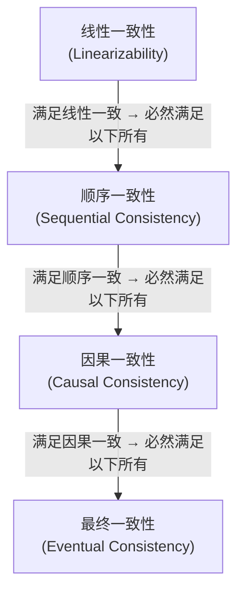

# 分布式一致性原语初探

> ℹ️ **本节定位**：承接上一篇，继续概念导览。这里讲的一致性模型谱系同样不配可运行代码，重在帮你建立"从强一致到弱一致"的直觉，为日后读分布式论文和卷八实战打底。

上一篇我们看到了单机并发和分布式系统的五大根本差异，理解了"网络不可靠、时钟不准确、局部失败不可避免"这些分布式环境下的事实。说实话，笔者第一次接触分布式一致性的时候是有被震撼到的——在单机上，一致性几乎是"免费的"（代价只是几纳秒的 lock/unlock），但到了分布式环境下，它变成了一个需要你用论文级别的协议、多轮网络通信、多数派投票才能换取的东西。这一篇我们就要面对这个核心难题——**一致性（consistency）**。

我们先建立一个直觉：当一份数据在多台机器上都有副本时，客户端从不同的副本读到的是否是同一个值？什么时候读到的是最新的值？不同副本之间的数据差多少？这些问题的答案取决于系统选择了什么样的一致性模型。一致性模型不是二选一的（要么一致要么不一致），而是一个从强到弱的谱系——理解这个谱系，是理解分布式系统的基本功，也是我们这篇的核心线索。

## 一致性模型谱系

我们现在要做的是用四个从强到弱的一致性模型来建立这个谱系。每一个模型我们都会用一个具体的场景来解释，而不是丢一个定义了事——理解"为什么需要这个模型"比记住"这个模型怎么定义"重要得多。

### 线性一致性（Linearizability）：最强的保证

我们从最强的开始。线性一致性也叫强一致性、原子一致性，它的含义是：每一个操作看起来都在某个**唯一的时间点**上原子地发生了，这个时间点介于操作的发起和完成之间，而且所有操作的时间点构成一个全序关系。说白了就是——如果把分布式系统看成一个黑盒，从外部观察者的视角看，所有操作就像发生在单台机器上一样。这跟我们在 ch03 讨论的 `memory_order_seq_cst` 有异曲同工之妙：单机上最强的内存序保证所有线程看到一致的操作顺序，线性一致性则是分布式环境下等价的保证。

用一个银行转账的场景来说明。假设你和你的室友共用一个账户，余额 1000 元。你在手机 App 上转出了 800 元，转出的瞬间你的室友在 ATM 上查询余额。在线性一致性下，你室友的查询只有两种可能的结果：要么看到 1000 元（你的转账还没生效），要么看到 200 元（你的转账已经生效）。绝不可能出现你室友看到 500 元或者 900 元这种"中间状态"。

更关键的是时间顺序的保证：如果你先完成了转账操作（拿到了"转账成功"的响应），然后你室友才发起查询，那么你室友一定能看到 200 元——不可能看到旧值。这就是线性一致性的"实时性"（real-time）保证：操作的实际时间顺序和系统呈现的顺序是一致的。

线性一致性是最强的一致性保证，但也是最贵的。要实现它，每一次写操作都需要等到多数派副本确认之后才能返回成功，每一次读操作也需要向多数派查询最新值（或者向 Leader 查询并确保 Leader 没有变）。这在延迟上意味着至少一次网络往返（通常是多轮），在可用性上意味着如果无法联系到多数派，系统必须拒绝服务。

哪些系统提供线性一致性呢？我们在上一篇提到的 ZooKeeper（对于写操作和同步读）、etcd、Consul 都提供。Google Spanner 通过上一篇提过的 TrueTime API 实现了外部一致性（比线性一致性还强），而很多关系型数据库的单机模式天然就是线性一致的。

### 顺序一致性（Sequential Consistency）：放宽时间要求

好，线性一致性是最强的，但也是最贵的。如果我们稍微放松一点要求——不要求操作的实际时间顺序和系统呈现的顺序一致，只要求所有进程看到的操作顺序是一致的——就得到了顺序一致性。具体来说，所有进程看到的操作顺序是一个全序，但这个顺序不一定要跟实际发生的物理时间一致，只要每个进程自己的操作保持程序中指定的顺序就行了。

回到银行转账的例子。假设你在手机上先转出了 800 元，然后你室友在 ATM 上转出了 500 元。在顺序一致性下，系统可以呈现"你室友先转 500，你再转 800"的顺序——这跟你操作的物理时间顺序相反。但关键是：所有观察者看到的都是同一个顺序。不会有人说"先转了 800"，另一个人说"先转了 500"。

顺序一致性跟线性一致性的区别就在于那个"实时性"的约束：线性一致性要求系统呈现的顺序必须跟实际时间一致，顺序一致性不要求。但两者都要求所有操作有一个全局一致的排列。这个区别看起来细微，但在实现上意义重大——线性一致性需要某种形式的全局时钟或者共识协议来同步时间，顺序一致性只需要保证操作的原子广播顺序就行了。

### 因果一致性（Causal Consistency）：只保因果，不保全局

如果我们再进一步放松约束，不要求所有操作的全序一致，只要求**因果相关**的操作被所有进程以相同的顺序看到，而因果无关的操作可以以不同的顺序被看到——这就是因果一致性。

什么叫做因果相关？简单说，如果操作 B 读取了操作 A 写入的值，那么 A 和 B 就有因果关系——A "导致"了 B。或者如果操作 C 发生在操作 B 之后（同一个进程内），而 B 因果依赖于 A，那么 C 也因果依赖于 A。除了这些直接和间接的依赖关系之外，两个操作就是**并发（concurrent）**的——它们之间没有因果关系。

用一个社交媒体的场景来解释。用户 Alice 发了一条帖子："今天天气真好！"（操作 A）。用户 Bob 看到了 Alice 的帖子，回复说："确实不错！"（操作 B）。操作 B 因果依赖于操作 A——因为 Bob 是看了 Alice 的帖子才回复的。在因果一致性下，任何用户都一定先看到 Alice 的帖子，然后才看到 Bob 的回复——不可能看到 Bob 的回复但看不到 Alice 的帖子，那在语义上就说不通了。

但与此同时，用户 Carol 也发了一条帖子："今天吃了火锅。"（操作 C）。操作 C 和操作 A 是并发的——它们之间没有因果关系。在因果一致性下，不同的用户可以以不同的顺序看到 A 和 C：有人先看到天气帖再看到火锅帖，有人反过来——都没问题，因为它们之间不存在"谁导致谁"的关系。

因果一致性是很多分布式数据库的实际选择，因为它的实现成本比线性一致性低得多——你不需要全局共识，只需要跟踪和传播因果关系（通常用向量时钟），就能保证语义上的正确性。Dynamo 风格的系统（Amazon Dynamo、Apache Cassandra、Riak）在某些配置下提供了带有因果会话保证的最终一致性，严格来说比"纯"最终一致性要强，但弱于严格的因果一致性。

### 最终一致性（Eventual Consistency）：最弱但最快

谱系的最底端是最终一致性，它的保证非常弱：如果不再有新的写入，最终（"最终"是一个模糊的时间点，可能是毫秒级也可能是秒级甚至分钟级）所有副本会收敛到同一个值。在收敛之前，不同的副本可能返回不同的值——你可能从一个副本读到了最新的写入，从另一个副本读到了五秒前的旧值。

这个保证听起来很不靠谱，但在很多场景下是够用的。DNS 就是最终一致性的典型例子：你更新了一条 DNS 记录，全球的 DNS 服务器可能需要几分钟甚至几小时才能全部更新——但在大多数情况下这完全可以接受。社交媒体上的点赞数、关注者列表、评论计数——这些数据延迟一两秒更新不会有灾难性后果。

最终一致性的优势在于性能和可用性：因为不需要同步等待其他副本，写入可以立刻返回成功，读取也只需要访问本地副本。在网络分区的情况下，每个副本都可以独立服务请求——可用性拉满。

### 一致性模型的层级关系

很好，现在我们把四个模型放在一起看，它们构成了一个从强到弱的层级：



层级关系意味着：满足线性一致性的系统一定也满足顺序一致性、因果一致性和最终一致性。反过来，满足最终一致性的系统不一定满足因果一致性。每往上一层，你获得更强的一致性保证，但也付出更高的延迟和可用性代价。

> ⚠️ **踩坑预警**
> 现实中很少有系统"纯粹地"只实现某一个一致性模型——这一点笔者踩过坑，早期以为某个数据库"就是"最终一致性的，结果在特定配置下它其实提供了更强的一致性保证。很多系统提供了可调的一致性级别，比如 Cassandra 支持 ONE、QUORUM、ALL 三种读写一致性级别，你可以在每次操作时选择。QUORUM 读写能保证读到最新写入的值（因为写和读的多数派一定有重叠），但并不严格保证线性一致性——真正严格的线性一致性还需要额外的机制（比如 Raft 的 ReadIndex 或者 lease read）。理解你的系统在什么配置下提供什么保证，比记住理论定义重要得多。

## Paxos/Raft 的核心思想

了解了一致性模型的谱系之后，一个自然的问题是：如果我们需要强一致性（比如线性一致性），具体该怎么实现？答案是通过**共识协议**。在分布式系统的世界里，共识协议解决的核心问题是：让一组机器就某个值达成一致——即使其中一些机器可能崩溃、网络可能分区。这跟我们在 ch03 讨论的原子操作有些类似的精神——都是为了让多个执行单元（线程或机器）就某个值的状态达成共识，只不过原子操作靠的是 CPU 的缓存一致性协议，而分布式共识靠的是多轮网络通信和投票。

先说好，我们不打算在这里给出 Paxos 或 Raft 的完整协议描述（那真是一篇论文的工作量，Lamport 的 Paxos 论文写得像希腊神话故事，Raft 论文倒是很清晰但也有三十多页），而是聚焦在核心思想上，让你理解"为什么这样设计"。

### 为什么需要多数派（Quorum）

共识协议的基石是**多数派（quorum）**。假设我们有 $N$ 台机器，一个值需要被至少 $\lfloor N/2 \rfloor + 1$ 台机器（即多数派）接受才能被认为是"已决定"的。你可能第一反应是——为什么是多数派？为什么不要求全部一致？

核心洞察是：任意两个多数派一定有重叠。如果有 5 台机器，一个多数派至少是 3 台。不管你怎么选，任意两组 3 台机器之间至少有 1 台是共同的。这个重叠意味着：如果前一个值已经被一个多数派接受了，那么任何一个新的多数派里一定至少有一台机器知道前一个值。只要协议设计得当，这台"见证者"机器就能保证新值不会覆盖已经被决定的前值。

从这个洞察出发，容忍 $f$ 台机器崩溃需要至少 $2f + 1$ 台机器——也就是说，要想容忍 1 台崩溃需要 3 台（$3 = 2 \times 1 + 1$），容忍 2 台崩溃需要 5 台（$5 = 2 \times 2 + 1$）。这就是为什么你经常看到 ZooKeeper、etcd、Consul 这些协调服务推荐 3 节点或 5 节点部署——3 节点容忍 1 节点故障，5 节点容忍 2 节点故障。

### Leader 选举：谁来发号施令

理解了多数派的原理，接下来我们看 Raft。Raft 的设计哲学用一句话概括就是"可理解性优先"——Diego Ongaro 和 John Ousterhout 在设计 Raft 的时候，明确把"容易理解"作为和"正确性"同等重要的目标，这跟 Paxos 那种"正确但没人能读懂"的风格形成了鲜明对比。Raft 把共识分解为三个子问题：Leader 选举、日志复制、安全性。我们先看 Leader 选举。

在 Raft 中，任何时候集群中最多只有一个 Leader——所有的写请求都由 Leader 处理，所有的日志都由 Leader 向 Follower 复制。这个"强 Leader"的设计比 Paxos 的"多 Proposer"模型更容易理解和实现。

Leader 选举通过**任期（term）**和**心跳（heartbeat）**来驱动。每个任期是一个单调递增的整数，每个任期最多有一个 Leader。正常情况下，Leader 定期向所有 Follower 发送心跳（AppendEntries RPC，即使没有日志要复制也发空的心跳）。如果 Follower 在一段超时时间（election timeout）内没有收到心跳，它就认为 Leader 挂了，开始新一轮选举。

选举的过程用通俗的话说就是"一群人投票选一个领导"：Follower 自增当前任期，变成 Candidate，先给自己投一票，然后向其他所有节点发送 RequestVote RPC。其他节点的投票规则是：每个任期最多投一票，先到先得（但有一个限制：Candidate 的日志必须至少跟投票者一样新）。如果一个 Candidate 收到了多数派的投票，它就变成了新的 Leader，立刻开始发送心跳来阻止其他人继续发起选举。

这个过程有一个很巧妙的随机化机制：每个节点的 election timeout 是在一个范围内随机选择的。这大大降低了多个节点同时发起选举导致"分票"的概率——因为它们超时的时间不一样，通常最先超时的那个节点会率先发起选举并赢得多数票。

### 日志复制：Leader 发话，Follower 跟着做

Leader 选出来之后，日志复制就比较直白了——整个流程的核心就是"Leader 说一句，Follower 跟一句"。客户端发送写请求给 Leader，Leader 把操作追加到自己的日志里，然后把这条日志复制给所有 Follower（通过 AppendEntries RPC）。当 Leader 确认这条日志已经被多数派（包括自己）接受后，它就**提交（commit）**这条日志并应用到状态机，然后给客户端返回成功。

关键的安全性保证是：已被提交的日志永远不会被覆盖。Raft 通过一个简单的约束来实现这一点——Leader 在发送 AppendEntries 时会携带前一条日志的索引和任期，Follower 收到后会检查自己的日志里对应位置是否匹配。如果不匹配，Follower 拒绝接受这条日志，Leader 会回退并重试，直到找到双方一致的位置然后从那里开始覆盖。

这个机制保证了：如果两条日志在任何 Follower 的同一个索引位置上都有相同的任期号，那么它们的内容一定相同（因为 Leader 在一个任期内只会在一个索引位置上创建一条日志），而且在这条日志之前的所有日志也都相同（通过递归的匹配检查）。这就是日志一致性。

用一个类比来总结 Raft 的整个流程：想象一个委员会（集群），成员之间通过信件通信（网络消息）。他们需要在一系列决定上达成一致（日志）。Raft 的做法是先选出一个主席（Leader 选举），由主席来提议所有的决定（日志复制），决定需要多数人同意才生效（多数派投票）。如果主席失联了，委员会通过投票选出新主席继续工作。这个类比虽然粗糙，但抓住了 Raft 的核心设计思想——共识的关键不在于"每个人都同意"，而在于"多数人同意就够了"，而多数派的交集保证了信息的传递。

## C++ 实践方向

理论讲了不少，现在我们来看点实际的。了解了分布式一致性的理论基础之后，我们来看看在 C++ 中实际编写分布式通信代码的方向。先说清楚——我们不会实现一个完整的分布式协议（那是一个独立项目的规模，Raft 的正确实现就能折腾好几周），而是展示如何用 gRPC + C++20 协程来搭建分布式服务间通信的基本骨架。这里面用到了我们 ch06 学的协程知识，算是把前面的积累串联起来了。

### gRPC 基础：用 Protobuf 定义服务

gRPC 使用 Protocol Buffers（protobuf）来定义服务接口和消息格式，这是我们在上一篇提到过的现代 C++ 生态中连接"并发"和"分布式"的关键基础设施。假设我们要实现一个简单的分布式键值存储服务，proto 文件大概长这样：

```protobuf
// kv_store.proto
syntax = "proto3";

package kvstore;

// 键值存储服务
service KvStoreService {
    // 获取指定 key 的值
    rpc Get(GetRequest) returns (GetResponse);

    // 设置 key-value
    rpc Put(PutRequest) returns (PutResponse);

    // 删除指定 key
    rpc Delete(DeleteRequest) returns (DeleteResponse);
}

message GetRequest {
    string key = 1;
}

message GetResponse {
    bool found = 1;
    string value = 2;
    int64 version = 3;    // 因果版本号，类似向量时钟的单调版本
}

message PutRequest {
    string key = 1;
    string value = 2;
    int64 expected_version = 3;  // 乐观并发控制：期望的当前版本
}

message PutResponse {
    bool success = 1;
    int64 new_version = 2;
}

message DeleteRequest {
    string key = 1;
}

message DeleteResponse {
    bool success = 1;
}
```

用 `protoc` 编译器生成 C++ 代码之后，你会得到一堆 `.pb.h` 和 `.pb.cc` 文件，以及一个 `.grpc.pb.h` 和 `.grpc.pb.cc`——后者包含了 gRPC 的服务端基类和客户端桩代码。别被这一堆生成的文件吓到了，你真正需要关心的只有基类和桩类。

### 服务端实现：处理 RPC 请求

接下来我们来看服务端的实现——继承生成的 `KvStoreService::Service` 基类并重写各个 RPC 方法。我们用一个简单的内存 map 做存储后端，配合 `std::shared_mutex` 做线程安全保护。如果你还记得 ch02 讨论的读写锁模式，这里就是它的直接应用。

```cpp
// kv_store_server.h
#pragma once

#include <grpcpp/grpcpp.h>
#include "kv_store.grpc.pb.h"

#include <string>
#include <unordered_map>
#include <shared_mutex>
#include <optional>

/// @brief 分布式键值存储的 gRPC 服务端实现
class KvStoreServer final : public kvstore::KvStoreService::Service {
public:
    KvStoreServer() = default;

    /// @brief 处理 Get 请求
    grpc::Status Get(grpc::ServerContext* context,
                     const kvstore::GetRequest* request,
                     kvstore::GetResponse* response) override
    {
        // 读锁：允许多个并发读
        std::shared_lock lock(mutex_);

        auto it = store_.find(request->key());
        if (it == store_.end()) {
            response->set_found(false);
            return grpc::Status::OK;
        }

        response->set_found(true);
        response->set_value(it->second.value);
        response->set_version(it->second.version);
        return grpc::Status::OK;
    }

    /// @brief 处理 Put 请求（带乐观并发控制）
    grpc::Status Put(grpc::ServerContext* context,
                     const kvstore::PutRequest* request,
                     kvstore::PutResponse* response) override
    {
        // 写锁：独占访问
        std::unique_lock lock(mutex_);

        auto it = store_.find(request->key());

        // 乐观并发控制：
        // 如果客户端发送了 expected_version，
        // 检查当前版本是否匹配
        if (request->expected_version() > 0) {
            if (it == store_.end()
                || it->second.version != request->expected_version()) {
                response->set_success(false);
                return grpc::Status::OK;
            }
        }

        int64_t new_version = (it != store_.end())
            ? it->second.version + 1
            : 1;

        store_[request->key()] = {request->value(), new_version};

        response->set_success(true);
        response->set_new_version(new_version);
        return grpc::Status::OK;
    }

    /// @brief 处理 Delete 请求
    grpc::Status Delete(grpc::ServerContext* context,
                        const kvstore::DeleteRequest* request,
                        kvstore::DeleteResponse* response) override
    {
        std::unique_lock lock(mutex_);

        auto erased = store_.erase(request->key());
        response->set_success(erased > 0);
        return grpc::Status::OK;
    }

private:
    struct StoreEntry {
        std::string value;
        int64_t version;
    };

    std::unordered_map<std::string, StoreEntry> store_;
    std::shared_mutex mutex_;    // 读写锁保护 store_
};
```

这段代码展示了几个重要的设计点。我们用了 `std::shared_mutex` 而不是 `std::mutex` 来保护存储——读操作（Get）用共享锁（`std::shared_lock`），写操作（Put/Delete）用独占锁（`std::unique_lock`）。这跟我们在 ch02 讨论的读写锁模式一致：读多写少的场景下，共享锁能显著提升并发度。另外值得注意的一点是 Put 请求里的 `expected_version` 字段——这是乐观并发控制（Optimistic Concurrency Control，OCC）的实现。客户端在读取一个值时会拿到它的版本号，修改后写回时带上这个版本号。如果服务端发现当前版本号跟客户端期望的不一致，说明有其他人已经修改了这个值，写入被拒绝——客户端需要重新读取、重新修改、重新提交。这比用分布式锁轻量得多，也避免了我们在上一篇讨论的分布式锁的各种安全问题。

启动服务端的代码也非常简洁：

```cpp
// main.cpp（服务端）
#include "kv_store_server.h"

int main()
{
    std::string server_address("0.0.0.0:50051");
    KvStoreServer service;

    grpc::ServerBuilder builder;
    builder.AddListeningPort(
        server_address, grpc::InsecureServerCredentials());
    builder.RegisterService(&service);

    std::unique_ptr<grpc::Server> server(builder.BuildAndStart());
    std::cout << "KvStore 服务端启动，监听: "
              << server_address << "\n";

    server->Wait();
    return 0;
}
```

### 异步 gRPC：用协程包装 CompletionQueue

到目前为止我们用的都是 gRPC 的**同步 API**——每一个 RPC 调用都会阻塞当前线程直到完成。这在低并发场景下没问题，但如果你在高并发场景下用同步模型（比如一个服务端需要同时处理上千个请求），线程数会暴增，上下文切换直接成为瓶颈——这跟我们 ch06 讨论的"为什么需要异步"是同一个问题。

gRPC 提供了异步 API，核心是 `CompletionQueue`（CQ）——一个事件循环，所有的异步操作完成后都会往 CQ 里投递一个完成事件，你需要一个线程来不断地从 CQ 里取出事件并处理。这个模型跟我们在 ch06 讨论的异步 I/O 非常类似：本质上都是事件驱动 + 回调。但直接用 CQ 写代码非常繁琐——你需要手动管理请求对象的生命周期、手动处理各种状态转换、手动把回调串联起来。如果用 C++20 协程来包装 CQ，就能让代码的可读性大幅提升。下面我们来看一个简化的协程化 gRPC 客户端调用示例。

```cpp
#pragma once

#include <grpcpp/grpcpp.h>
#include "kv_store.grpc.pb.h"

#include <coroutine>
#include <iostream>
#include <memory>

/// @brief 用于包装 gRPC 异步调用的协程 awaitable
/// 这是一个简化版，展示了核心思路
template<typename ResponseType>
struct GrpcAwaitable {
    grpc::ClientContext context;
    ResponseType response;
    grpc::Status status;
    std::unique_ptr<grpc::ClientAsyncResponseReader<ResponseType>> reader;

    /// @brief 协程是否需要挂起（总是挂起，等待 gRPC 完成）
    bool await_ready() const noexcept { return false; }

    /// @brief 挂起时启动异步 RPC 调用
    void await_suspend(std::coroutine_handle<> handle)
    {
        // 启动异步调用，完成后恢复协程
        reader->StartCall();

        // Finish() 会在 CQ 上投递一个完成事件
        // 我们用一个 tag 来关联协程 handle
        reader->Finish(&response, &status,
                       reinterpret_cast<void*>(handle.address()));
    }

    /// @brief 协程恢复时返回响应
    ResponseType await_resume()
    {
        if (!status.ok()) {
            throw std::runtime_error(
                "gRPC 调用失败: " + status.error_message());
        }
        return std::move(response);
    }
};

/// @brief 协程化的 gRPC 键值存储客户端
class KvStoreCoroutineClient {
public:
    explicit KvStoreCoroutineClient(std::shared_ptr<grpc::Channel> channel)
        : stub_(kvstore::KvStoreService::NewStub(channel))
        , cq_()
    {}

    /// @brief 启动 CompletionQueue 事件循环（在独立线程中运行）
    void start_event_loop()
    {
        void* tag = nullptr;
        bool ok = false;
        while (cq_.Next(&tag, &ok)) {
            // 从 tag 恢复对应的协程
            auto handle = std::coroutine_handle<>::from_address(tag);
            if (handle && !handle.done()) {
                handle.resume();
            }
        }
    }

    /// @brief 异步 Get：协程化调用
    GrpcAwaitable<kvstore::GetResponse> get(const std::string& key)
    {
        GrpcAwaitable<kvstore::GetResponse> awaitable;

        kvstore::GetRequest request;
        request.set_key(key);

        awaitable.reader = stub_->AsyncGet(
            &awaitable.context, request, &cq_);

        return awaitable;
    }

    /// @brief 异步 Put：协程化调用
    GrpcAwaitable<kvstore::PutResponse> put(
        const std::string& key,
        const std::string& value,
        int64_t expected_version = 0)
    {
        GrpcAwaitable<kvstore::PutResponse> awaitable;

        kvstore::PutRequest request;
        request.set_key(key);
        request.set_value(value);
        request.set_expected_version(expected_version);

        awaitable.reader = stub_->AsyncPut(
            &awaitable.context, request, &cq_);

        return awaitable;
    }

    grpc::CompletionQueue& completion_queue() { return cq_; }

private:
    std::unique_ptr<kvstore::KvStoreService::Stub> stub_;
    grpc::CompletionQueue cq_;
};
```

这段代码的核心在于 `GrpcAwaitable` 结构体——它是一个满足 C++20 协程 `awaitable` 约束的对象，也就是我们在 ch06 深入讨论过的那套机制。当协程 `co_await` 这个对象时，`await_suspend` 被调用，它启动 gRPC 的异步调用并把协程 handle 作为 tag 注册到 `CompletionQueue` 上。当 gRPC 的异步操作完成后，CQ 的事件循环取出这个 tag（实际上就是协程 handle），然后 `resume()` 恢复协程执行。协程恢复后在 `await_resume` 里拿到响应结果——整个流程跟我们在 ch06 手写的 awaitable 是一模一样的套路。

在应用层代码里，你可以这样使用：

```cpp
/// @brief 示例：使用协程化的 gRPC 客户端
Task<void> demo_usage(KvStoreCoroutineClient& client)
{
    try {
        // 写入一个键值对
        auto put_resp = co_await client.put("hello", "world");
        std::cout << "Put 成功，新版本: "
                  << put_resp.new_version() << "\n";

        // 读取回来
        auto get_resp = co_await client.get("hello");
        std::cout << "Get 结果: found=" << get_resp.found()
                  << ", value=" << get_resp.value()
                  << ", version=" << get_resp.version() << "\n";

        // 乐观并发控制：带版本写入
        auto occ_resp = co_await client.put(
            "hello", "updated_world", get_resp.version());
        if (occ_resp.success()) {
            std::cout << "OCC 写入成功，新版本: "
                      << occ_resp.new_version() << "\n";
        } else {
            std::cout << "OCC 写入失败：版本冲突\n";
        }
    }
    catch (const std::exception& e) {
        std::cerr << "gRPC 错误: " << e.what() << "\n";
    }
}
```

你看，应用层的代码跟写本地函数调用几乎没有区别——`co_await` 让异步的 gRPC 调用看起来像同步代码一样线性流畅，但底层实际上是完全异步的：在等待 gRPC 响应的时候，当前线程不会阻塞，而是去处理其他协程或者 CQ 事件。这就是我们在 ch06 反复强调的协程的价值——不是让代码变快，而是让异步代码变得可读、可维护。

> ⚠️ **踩坑预警**
> 上面的 `GrpcAwaitable` 是一个简化版的示例，展示了协程化 gRPC 的核心思路，别直接拿去生产环境用。在生产环境中你需要处理更多的细节：CQ 事件循环的优雅关闭、超时控制、重试逻辑、连接状态管理、线程安全的 CQ 访问等等。如果你不想自己造轮子（笔者强烈建议别自己造），可以看看 [agrpc](https://github.com/Tradias/agrpc) 这个库——它基于 Boost.Asio 的 C++20 协程支持，提供了生产级的 gRPC 异步封装。

## 总结：卷五的旅程

到这里，卷五的最后一篇文章就写完了。回顾整卷的学习路径，我们从"线程是什么"一路走到了"分布式系统怎么通信"——这确实是一段不小的旅程。

**ch00 并发基础**——我们建立了并发的基本认知：并发和并行不是一回事，Amdahl 定律和 Gustafson 定律帮助我们理解加速比的上下界，吞吐量和延迟的权衡指导架构选择，而有些场景根本不需要并发。先正确性，再性能，这是我们贯穿全卷的原则。

**ch01 线程生命周期与 RAII**——我们认识了 `std::thread` 的生命周期，理解了 `join()` 和 `detach()` 的区别，学会了用 RAII 守卫来管理线程资源，确保线程不会泄漏或者被遗忘。这是并发编程的基本功。

**ch02 同步原语**——`std::mutex`、`std::condition_variable`、`std::shared_mutex`……这些是并发编程的工具箱。我们学会了用它们来保护共享数据、协调线程间的执行顺序、实现生产者-消费者模式。我们也看到了它们的局限：锁的粒度不好控制，容易死锁，在高争用场景下性能不理想。

**ch03 原子操作与内存模型**——这是卷五最硬核的部分之一，也是笔者写起来最过瘾的部分。我们从 `std::atomic` 的基本用法出发，深入到 C++ 内存模型的六个内存序（`memory_order_relaxed`、`memory_order_consume`、`memory_order_acquire`、`memory_order_release`、`memory_order_acq_rel`、`memory_order_seq_cst`），理解了编译器和 CPU 的重排规则，掌握了 happens-before 关系的推理方法。这些知识让你在写无锁代码时知道自己在做什么。

**ch04 并发数据结构**——我们把前面学到的同步原语和原子操作应用到具体的数据结构上：线程安全队列、并发 map、环形缓冲区。我们看到了粗粒度锁、细粒度锁、读写锁、无锁等不同策略的权衡。

**ch05 任务、Future 与线程池**——我们从"裸线程"的层次提升到了"任务"的层次。`std::async`、`std::future`、`std::promise` 提供了更高层的并发抽象，而线程池让我们能够复用线程资源、控制并发度。任务的思维模式比线程的思维模式更适合大多数应用场景。

**ch06 异步与协程**——C++20 协程是并发编程范式的重大转变。我们从协程的基本机制（`co_await`、`co_return`、`co_yield`、`promise_type`、`awaitable`）出发，学会了用协程把回调式异步代码重写成线性可读的形式。协程不是银弹，但它确实让异步代码的可维护性上了一个台阶。

**ch07 Actor 与 Channel**——我们走出了"共享内存 + 锁"的模型，探索了基于消息传递的并发范式。Actor 模型和 CSP/Channel 模型用"不共享任何东西，只通过消息通信"的方式来避免数据竞争，天然适合多核和分布式场景。

**ch08 调试与性能**——并发 bug 是最难调试的 bug。我们学会了用 ThreadSanitizer 检测数据竞争，用性能分析工具定位锁争用，理解了 false sharing、锁 convoys 等性能陷阱。

**ch09 分布式桥接**——也就是这两篇文章。我们从单机并发的边界出发，看到了分布式系统的五大根本差异，理解了一致性模型的谱系，认识了 Paxos/Raft 共识协议的核心思想，最后用 gRPC + C++20 协程展示了在 C++ 中写分布式通信代码的方向。

回头看，每一步都不是孤立的。ch01 的 RAII 思维贯穿了整个卷——从线程管理到锁管理到连接管理；ch03 的内存模型知识是理解 ch09 一致性模型的基础（`memory_order_seq_cst` 和线性一致性本质上在回答同一个问题）；ch06 的协程机制是 ch09 gRPC 异步封装的基石；ch07 的 Actor 模型在分布式环境下获得了最大的价值——位置透明性让本地代码几乎不用改就能部署到多台机器上。

并发编程的学习永远不会"完成"——这是一个需要不断实践、不断踩坑、不断建立直觉的领域。但如果你跟着卷五走到了这里，你应该已经有了扎实的理论基础和足够的实战经验来面对绝大多数并发场景。剩下的，就是在真实项目中去磨练了。

### 进一步学习的方向

如果你想把卷五建立的基础继续深化，这里有一些笔者亲测推荐的方向。

**书籍推荐**：Martin Kleppmann 的《Designing Data-Intensive Applications》是分布式系统领域公认最好的入门书籍，覆盖了一致性、共识、复制、分区等核心主题——笔者强烈建议至少读前五章。Anthony Williams 的《C++ Concurrency in Action》是 C++ 并发编程的权威参考，第二版覆盖了 C++17 标准（第三版预计覆盖 C++20），是一本可以放在案头随时查阅的"词典"。如果你对无锁编程特别感兴趣，Herlihy 和 Shavit 的《The Art of Multiprocessor Programming》是经典教材——不过这本书比较偏学术，读起来有一定门槛。

**开源项目**：如果你想看真实的分布式共识协议实现，etcd 的 Raft 实现（Go 语言，约 2000 行核心代码）是最好的入门选择——注释详尽，逻辑清晰，Raft 论文中的每一个概念都能在代码里找到对应，读起来很舒服。C++ 生态中，Apache brpc 是百度开源的 C++ RPC 框架，内置了 bvar（并发变量）和 bthread（协程调度）等组件，是学习生产级 C++ 并发代码的好素材。

**实践方向**：如果你想在 C++ 中深入分布式系统开发，可以尝试用 gRPC + Raft 库（比如 `libraft`）实现一个简单的分布式键值存储——这是 MIT 6.824（分布式系统）课程的经典实验项目，工程量适中但覆盖面广，做下来之后你对共识协议的理解会完全不一样。

## 参考资源

- [Designing Data-Intensive Applications — Martin Kleppmann](https://dataintensive.net/) — 分布式系统的"圣经"，覆盖一致性、共识、复制等所有核心主题
- [C++ Concurrency in Action, 2nd Edition — Anthony Williams](https://www.manning.com/books/c-plus-plus-concurrency-in-action-second-edition) — C++ 并发编程的权威参考（第三版预计覆盖 C++20）
- [In Search of an Understandable Consensus Algorithm (Raft 论文)](https://raft.github.io/raft.pdf) — Diego Ongaro 和 John Ousterhout 的 Raft 论文，比 Paxos 论文易读 100 倍
- [The Part-Time Parliament (Paxos 论文) — Leslie Lamport](https://lamport.azurewebsites.net/pubs/lamport-paxos.pdf) — Paxos 的原始论文，以古希腊议会的故事讲述共识协议
- [Jepsen Consistency Models](https://jepsen.io/consistency/models) — 一致性模型的可视化层级图和详细解释
- [agrpc — gRPC with C++20 Coroutines](https://github.com/Tradias/agrpc) — 基于 Boost.Asio 的 gRPC 异步协程封装库
- [C++20 Coroutines for Asynchronous gRPC Services — Dennis Hezel](https://medium.com/3yourmind/c-20-coroutines-for-asynchronous-grpc-services-5b3dab1d1d61) — 如何将 gRPC 的 CompletionQueue 适配到 C++20 协程
- [MIT 6.824 Distributed Systems](https://pdos.csail.mit.edu/6.824/) — MIT 的分布式系统课程，含 Lab 实现 Raft
