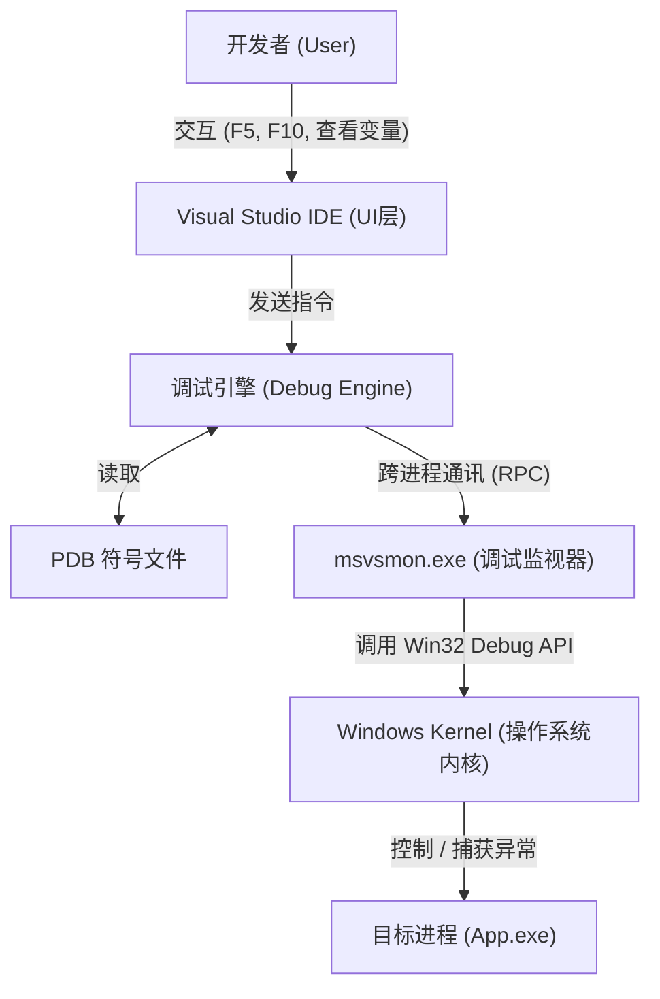

# 深入解构：MSVC 调试机制与 Visual Studio 调试器原理

笔者最近在家中做一些Windows的项目，项目比较大，这里就涉及到了MSVC的调试相关的内容了，笔者把这几天的一些收获结合MSVC的文档好好聊聊。
尽管，我们有时候得承认，Visual Studio有的时候是有点不太好用（特别是项目一大，有点折磨人了会，VS很重），但是他的调试做的OK。我想很多朋友肯定会使用调试来解决自己的项目中遇到的问题。这就是这个博客的出发点——重新审视一下调试，特别是MSVC的调试。

## 从什么是调试讲起

这里，笔者认为约定好"调试"这个基本的概念很重要。我们一般说程序出bug了，你要调试一下。这里的调试说的就是检查程序在给定的时间点的状态下的快照查看。举个例子，笔者之前做IMX6ULL Desktop的时候就出现过传感器数据非法崩溃，就是远程调试的时候发现的。

官方的说——调试是一种**对运行中程序的"上帝视角"观测与控制技术**。他尝试做到三个事情：

1. **观测（Observation）**：在不改变程序逻辑的前提下，查看内存、寄存器、变量值、线程状态和调用堆栈。
2. **控制（Control）**：接管 CPU 的执行权。包括暂停（Suspend）、单步执行（Step）、恢复运行（Resume）以及修改内存/变量值。
3. **映射（Mapping）**：将晦涩难懂的**机器码（Machine Code）**和**内存地址**，实时翻译回人类可读的**源代码（Source Code）**。

**一句话总结**：调试是利用操作系统提供的特权接口，强行介入目标进程，使其按照开发者的意愿运行，并暴露其内部状态的过程。

---

## 调试舞台上的"参与者" (The Participants)

在 Visual Studio 中按下 F5 时，并非只有一个程序在工作，而是一个复杂的**多进程协作系统**。你可以看看在调试的时候，我们这个调试系统有谁在参与。

我们作为主动的一方，就是负责点击Visual Studio IDE (The Shell)提供的GUI界面下达指令，但是我要说一句话，VS**不负责**实际的调试逻辑，它只负责**显示**，它将用户的点击操作（如 F10）转换为发送给调试引擎的命令。

比较重要的一个组件是调试引擎 (Debug Engine, DE)，它负责解析复杂的 C++ 表达式（比如 `vec[0].m_data`），负责读取 PDB 符号文件，将地址 `0x00401234` 翻译为 `main.cpp:20`（有点像gnu工具链的addr2line了）

msvsmon.exe (Remote Debugging Monitor)是执行者 / 代理人 / 隔离层，我们知道调试的时候是我们IDE进程拉起来这个调试进程，msvsmon的作用就是如果目标程序崩溃或挂起，不会导致 VS IDE 崩溃；同时`msvsmon` 负责在 IDE 和目标进程之间传递数据。它是实际调用 Windows API 去控制目标进程的那个"人"。

关于Windows内核的作用这里咱们就掠过了，无非就是提供调试相关的System API而已。

PDB 文件 (Program Database)是连接"二进制世界"与"源代码世界"的静态数据库。没有它，调试器就是"瞎子"，只能看到汇编代码。所以，调试的时候，我们必须要有PDB文件才能调试，要不然的话VS会告诉你，没有加载文档符号（比如说Release模式）

---

## MSVC 是如何进行调试的？ (The Workflow)

#### 第一阶段：建立连接 (Establishment)

在进行远程调试时，一切始于**调试器（Debugger）与宿主系统的交互**。具体而言，Visual Studio 会通过远程调试监视器（`msvsmon.exe`）发起请求，调用关键的 Win32 API —— `CreateProcess`。在调用过程中，系统会传入一个至关重要的标志位 `DEBUG_ONLY_THIS_PROCESS`（或 `DEBUG_PROCESS`）。这个标志位不仅是启动指令，更是向操作系统发出的"接管声明"，标志着目标进程从诞生之初就处于受控状态。

随后，流程进入**内核级的绑定与握手阶段**。当 Windows 内核接收到带有调试标志的创建请求时，它并不会仅仅开启一个独立的进程，而是在内核数据结构中建立起目标程序（Debuggee）与调试器进程（msvsmon）之间的父子关系或调试关联。这种深度的绑定确保了目标进程产生的所有异常、线程创建或模块加载等事件，都能通过特定的调试通道实时反馈给调试器，使调试器能够掌握目标程序的完整生命周期。

最后是**执行前的挂起与接管阶段**。为了确保开发人员不会错过任何一行代码，目标进程在初始化完成后，并不会立即跳转到 `main` 函数或用户入口点执行。相反，操作系统会在加载器（Loader）完成初步工作后，自动将目标进程的主线程置于**挂起（Suspend）状态**。此时的目标程序如同一台已经发动但踩住刹车的汽车，静静等待调试器的进一步指令。只有当调试器完成了符号加载、断点设置等准备工作并发出"继续"命令后，目标程序才会真正开始执行业务逻辑。

这一部分揭示了调试器真正"掌控"目标进程的黑盒机制。我将这些核心逻辑整理成了更加专业且富有逻辑性的文字描述：

------

#### 第二阶段：调试循环 (The Debug Loop) —— 核心调度心脏

调试器的运行本质上是一个高效且严密的**自循环监听系统**。当调试器进入工作状态时，它会维持一个常驻的 `While Loop`，其核心枢纽是 `WaitForDebugEvent` API。此时，调试器会进入一种"高效阻塞"状态，静默等待目标进程中任何风吹草动引发的信号。

一旦目标进程触发了关键事件——无论是模块加载（DLL Load）、线程创建，还是开发者最关心的断点触发——**Windows 内核会自动介入**。内核会瞬间冻结目标进程的所有线程，将现场环境打包成结构化的事件信息传递给调试器。调试器随即"苏醒"，根据事件类型执行相应的逻辑：加载符号文件（PDB）以对齐源码，或是处理 `EXCEPTION_BREAKPOINT` 异常。最后，当开发者完成查看并指令继续时，调试器调用 `ContinueDebugEvent`，请求内核恢复线程，让程序重新"活"过来。

#### 第三阶段：断点注入与指令级控制 (Control)

- **软件断点（INT 3）：** 当你在代码行左侧点下红点时，调试器实际上是在目标内存的相应地址"动了手脚"。它会将该位置的原指令首字节替换为 `0xCC`（即 `INT 3` 指令）。当 CPU 执行到此处时，会强制触发一个中断异常，交由调试器处理。
- **单步追踪（Single Stepping）：** 为了实现"逐行执行"，调试器会利用 CPU 硬件层面的**陷阱标志位（Trap Flag, TF）**。通过将标志寄存器中的 TF 置为 1，CPU 会进入单步模式：每执行完一条机器指令，就会自动产生一个 `SINGLE_STEP` 异常并挂起。调试器正是通过这种"执行一拍、停顿一拍"的节奏，实现了对代码运行细节的微观观测。

#### 第四阶段：分离与终止 (Termination)

调试任务结束时，调试器提供了两种优雅的退出方式。最常见的是**完全终止**，即调用 `TerminateProcess` 干净利落地结束目标进程的生命周期。另一种则是**分离（Detach）模式**：通过调用 `DebugActiveProcessStop`，调试器会撤销所有的内存修改（如恢复被替换的 `0xCC` 字节）并解除内核绑定。此时，目标进程将摆脱束缚，恢复至独立运行状态，在不干扰业务逻辑的前提下继续执行。

## 总结图解 (The Big Picture)

为了方便博客读者理解，你可以构思这样一张架构图：

---

## 调试的基石：构建系统与符号文件 (The Build Process & Symbols)

调试并非始于 F5，而是始于编译。所以这就是为什么要构建Debug模式进行调试，要不然没有调试符号会很麻烦的。

#### 调试的"地图"与"向导"：PDB 与编译配置

如果说二进制文件是迷宫，那么 **PDB (Program Database)** 就是这份迷宫的地图。它并不是简单的辅助文件，而是一个复杂的数据库，记录了机器码地址与源代码行号、变量名、类型定义以及栈回溯所需的 FPO 数据。

当程序在地址 `0x00401000` 崩溃时，调试器并不知道这里发生了什么。它会迅速检索 PDB 文件，通过映射表发现该地址对应的是 `main.cpp` 第 15 行。正是通过这种**符号化（Symbolication）**过程，调试器才能将原始的寄存器状态转化为开发者能理解的代码上下文。

为了确保这张地图的准确性，**编译选项**至关重要：

- **`/Zi` 或 `/ZI`**：强制生成 PDB 调试信息，其中 `/ZI` 专门为"编辑并继续"预留了额外的衬垫空间。
- **`/Od` (禁用优化)**：这是 Debug 模式的灵魂。编译器在优化（`/O2`）时会为了性能重排指令或内联函数，导致二进制流与源码行号完全错位。禁用优化确保了"所见即所得"的调试体验。

------

## 断点、评估与热补丁

#### 1. 断点实现：软件 vs 硬件

- **软件断点 (INT 3)**：当你按下 F9，调试器会执行一次"偷梁换柱"。它将断点处的指令首字节替换为 `0xCC`。当 CPU 撞上这个字节时，会触发中断并将控制权移交给操作系统，进而通知调试器。
- **硬件断点**：通过 CPU 的专用**调试寄存器 (Dr0 - Dr7)** 实现。它无需修改内存，通常用于监控变量变化（数据断点）。

#### 2. 表达式评估 (EE)：微型编译系统

当你在监视窗口输入 `ptr->member` 时，VS 内部的**表达式评估器**会立即行动。它结合 PDB 中的类型信息计算出内存偏移量，直接读取目标进程的内存地址，将其格式化为人类可读的结构。

#### 3. 编辑并继续：热补丁技术

这是一个极具挑战性的功能。当你修改代码时，VS 会在后台进行**增量编译**，生成新的二进制片段。它通过"热补丁（Hot Patching）"技术，将原函数的入口点修改为一个跳转指令（JMP），指向新生成的内存地址，从而在不重启程序的情况下实现代码更新（笔者试过，发现有的时候不是很好用可能会失败）

---

## 常见问题与排查 (Troubleshooting)

注意到，这里是一些常见的调试的时候遇到的问题，笔者总结以下放到这里：

1. **"Breakpoint will not currently be hit" (空心圆断点)**：
    - **原因**：PDB 与源代码不匹配，或者 PDB 未加载。
    - **解决**：检查"模块"窗口，看符号加载状态；确保代码未被优化掉。
2. **变量显示 "Variable is optimized away"**：
    - **原因**：Release 模式下，变量可能被存放在寄存器中复用，或者直接被常量折叠消除了。
3. **堆栈损坏 (Stack Corruption)**：
    - 调试器无法回溯堆栈。通常是因为缓冲区溢出覆盖了返回地址。
