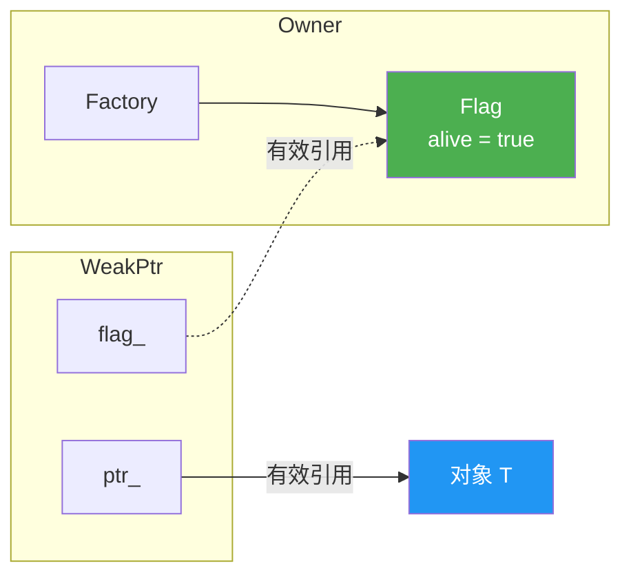
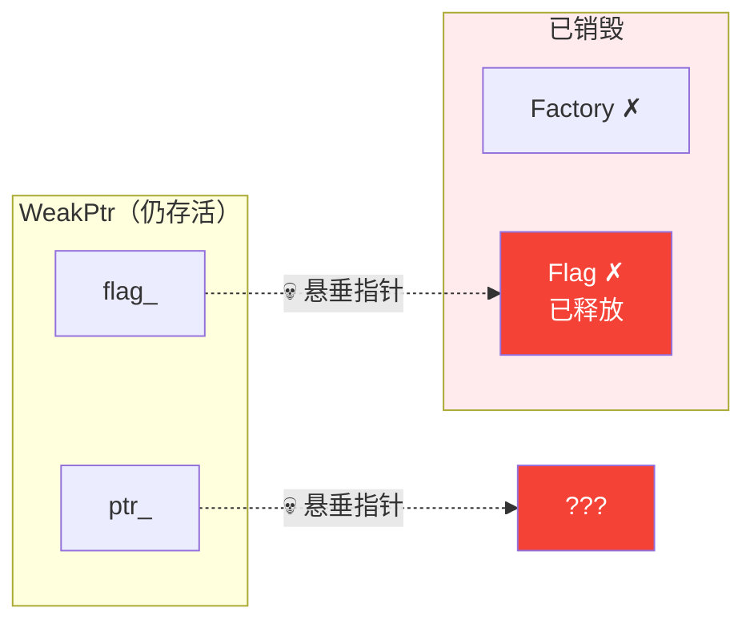

# WeakPtr 反模式：`T* + raw Flag*` 的致命陷阱

## 引言

上一篇我们讲完了借用和观察——`Borrowed<T>` 和 `ObserverPtr<T>` 解决了"这个指针到底想说什么"的问题，但它们都有一个共同的硬伤：对象销毁之后，你拿着它们毫无办法。解引用就是 UB，没有任何转圜余地。

所以很自然地，下一个需求就是"弱引用"——我要持有一个对象的引用，但我不拥有它，而且我希望在对象销毁之后能安全地检测到失效，而不是解引用一个悬垂指针。

最直觉的方案是什么？搞一个 Flag：

```cpp
struct Flag {
    bool alive = true;
};
```

`WeakPtr` 里保存一个 `T*` 和一个 `Flag*`，用的时候检查 `flag_->alive`。Owner 析构的时候把 `alive` 设成 `false`。听起来很完美——但这篇文章要讲的核心论点是：**这个方案根本不安全，它不应该叫 WeakPtr。**

## 为什么这个设计有诱惑力

我们先实现它，看看为什么它"看起来能工作"。

```cpp
// unsafe_weak_ptr.h
// ⚠️ 教学用反模式实现，不要在生产代码中使用

#pragma once

#include <iostream>

struct Flag {
    bool alive = true;
};

template <typename T>
class UnsafeWeakPtr {
public:
    UnsafeWeakPtr(T* ptr, Flag* flag) : ptr_(ptr), flag_(flag) {}

    // 检查对象是否还活着
    bool is_valid() const
    {
        return flag_ && flag_->alive;
    }

    // 获取对象指针，如果已失效则返回 nullptr
    T* get() const
    {
        if (is_valid()) {
            return ptr_;
        }
        return nullptr;
    }

    T& operator*() const { return *get(); }
    T* operator->() const { return get(); }

private:
    T* ptr_;
    Flag* flag_;
};

template <typename T>
class UnsafeWeakPtrFactory {
public:
    explicit UnsafeWeakPtrFactory(T* owner) : owner_(owner) {}

    UnsafeWeakPtr<T> get_weak_ptr()
    {
        return UnsafeWeakPtr<T>(owner_, &flag_);
    }

    void invalidate()
    {
        flag_.alive = false;
    }

    ~UnsafeWeakPtrFactory()
    {
        flag_.alive = false;
    }

private:
    T* owner_;
    Flag flag_;  // Flag 作为 Factory 的成员变量存在
};
```

看起来相当合理——`Flag` 和 `Owner` 绑定在一起，Owner 析构的时候 `flag_.alive` 被设成 `false`，外部 WeakPtr 再调用 `get()` 就会返回 `nullptr`。

在同步、单线程、WeakPtr 的生命周期严格短于 Owner 的场景下，这个实现**确实能工作**。问题在于，这些前提条件在真实工程中极其脆弱。生命周期严格短于 Owner 的场景，那要这个抽象干嘛呢，这是不太可靠的。

## 为什么它本质不安全

核心问题只有一个：**Flag 的生命周期和 Owner 绑定在一起。**

当 Owner 析构时，`UnsafeWeakPtrFactory` 作为 Owner 的成员也会析构。`Flag flag_` 作为 `UnsafeWeakPtrFactory` 的成员变量，也会随之销毁。此时，外部任何还活着的 `UnsafeWeakPtr` 手里的 `flag_` 指针——变成了悬垂指针。

所以 `UnsafeWeakPtr::is_valid()` 这个函数做了什么？它解引用了一个可能已经悬垂的 `Flag*`，去读一个已经不存在的 `bool alive`。这就是 **未定义行为**（Undefined Behavior）。

让我们画一个生命周期图来把这个过程看清：

**阶段 1：Owner 存活时** — `flag_->alive == true`，一切正常：



**阶段 2：Owner 析构后** — `flag_` 和 `ptr_` 均为悬垂指针：



`is_valid()` 检查 `flag_->alive` 的那一刻，`flag_` 指向的内存可能已经被回收、被复用、或者被覆盖。返回 `true` 还是 `false` 完全取决于那块内存现在是什么状态——这就是 UB。

## 最小 UB 复现

接下来我们写一段最小示例来实际触发这个问题。需要注意：UB 的行为是不可预测的，以下代码在某些编译器/优化级别下可能"看起来正常"，但这不意味着它是安全的。

```cpp
// unsafe_weak_ptr_ub_demo.cpp
// 编译：g++ -std=c++17 -O0 -g unsafe_weak_ptr_ub_demo.cpp
// 注意：UB 的表现因编译器、优化级别、运行环境而异
// 这里用 -O0 是为了让 UB 更容易被观察到

#include <iostream>
#include <memory>

struct Flag {
    bool alive = true;
};

template <typename T>
class UnsafeWeakPtr {
public:
    UnsafeWeakPtr(T* ptr, Flag* flag) : ptr_(ptr), flag_(flag) {}
    bool is_valid() const { return flag_ && flag_->alive; }
    T* get() const { return is_valid() ? ptr_ : nullptr; }

private:
    T* ptr_;
    Flag* flag_;
};

template <typename T>
class UnsafeWeakPtrFactory {
public:
    explicit UnsafeWeakPtrFactory(T* owner) : owner_(owner) {}
    UnsafeWeakPtr<T> get_weak_ptr()
    {
        return UnsafeWeakPtr<T>(owner_, &flag_);
    }
    ~UnsafeWeakPtrFactory() { flag_.alive = false; }

private:
    T* owner_;
    Flag flag_;
};

struct Widget {
    int value = 42;
    UnsafeWeakPtrFactory<Widget> factory{this};

    UnsafeWeakPtr<Widget> get_weak_ptr()
    {
        return factory.get_weak_ptr();
    }
};

int main()
{
    UnsafeWeakPtr<Widget> weak = [] {
        auto w = std::make_unique<Widget>();
        return w->get_weak_ptr();
        // w 在这里析构
        // Widget 析构 → factory 析构 → Flag 析构
    }();

    // 此时 weak.flag_ 指向已销毁的 Flag
    // weak.ptr_ 指向已销毁的 Widget

    // ⚠️ UB：解引用已释放的 Flag
    std::cout << "is_valid() = " << std::boolalpha << weak.is_valid() << '\n';

    // ⚠️ UB：如果 is_valid() 恰好返回 true，get() 返回悬垂指针
    if (auto* p = weak.get()) {
        std::cout << "value = " << p->value << '\n';  // UB：读取已释放的内存
    } else {
        std::cout << "Widget 已失效（但这个结果本身就是 UB 的产物）\n";
    }
}
```

在我的测试环境（GCC 16, -O0）下，这段代码的输出是：

```text
is_valid() = false
Widget 已失效（但这个结果本身就是 UB 的产物）
```

看起来 `is_valid()` 正确返回了 `false`——但这不意味着它是安全的。之所以返回 `false`，是因为 `~UnsafeWeakPtrFactory()` 先把 `alive` 设成了 `false`，然后 Widget 的内存才被释放。`is_valid()` 读到的恰好是析构函数写入的值——因为那块内存还没被分配器复用。用 AddressSanitizer 编译（`-fsanitize=address`）可以清楚地看到 `heap-use-after-free` 错误：`is_valid()` 在访问已经释放的内存。

换成不同的分配器、不同的优化级别、或者在析构和读取之间插入更多内存操作，结果可能完全不同——`is_valid()` 可能返回 `true`，`get()` 可能返回一个指向已释放内存的非空指针。UB 的行为是不可预测的，**"看起来能工作"恰恰是 UB 最危险的表现形式**。

## 为什么异步回调会彻底打破约束

有人可能会说："只要保证 WeakPtr 不比 Owner 长寿就行了。" 这个约束在同步代码里还能靠人工检查勉强维持，但在异步回调场景下几乎不可能保证。

```cpp
// 定时器回调场景
class Session {
public:
    UnsafeWeakPtr<Session> get_weak()
    {
        return factory_.get_weak_ptr();
    }

    void start_heartbeat()
    {
        auto weak = get_weak();
        // 1 秒后执行回调
        timer_.schedule(1000ms, [weak]() {
            // Session 可能已经在回调执行前被销毁了
            // weak.is_valid() 访问已销毁的 Flag → UB
            if (weak.is_valid()) {
                // ...
            }
        });
    }

private:
    UnsafeWeakPtrFactory<Session> factory_{this};
    Timer timer_;
};
```

异步回调的本质就是"把引用保存起来，以后再用"。"以后"是什么时候？对象还活着吗？你不知道。而 `UnsafeWeakPtr` 的安全前提——"WeakPtr 不比 Owner 长寿"——在异步场景下就是一个笑话。

## 那它到底应该叫什么

这个 `T* + raw Flag*` 的组合不是一无是处。在特定约束下（同步使用、WeakPtr 生命周期严格受控于 Owner），它能工作。但它不应该叫 `WeakPtr`，因为这个名字暗示了"对象销毁后可以安全检测失效"——而它做不到。

更诚实的名字是：

- **`UnsafeWeakPtr<T>`**：明确标注不安全
- **`OwnerBoundWeakPtr<T>`**：表达它和 Owner 生命周期绑定
- **`BorrowedWeakPtr<T>`**：表达它本质上还是借用

如果一定要使用它，必须在文档和命名中清楚说明约束条件。但更好的做法是——用真正的 WeakPtr。下一篇我们就来实现一个安全的版本。

## 小结

- `T* + raw Flag*` 看起来像 WeakPtr，但 `Get()` 访问 `flag_->alive` 本身就可能是 UB
- 核心问题：Flag 的生命周期绑定在 Owner 上，Owner 销毁后 Flag 也不存在了
- 在同步且 WeakPtr 严格短命于 Owner 的场景下可能"能工作"，但这不是可靠的 WeakPtr
- 异步回调会彻底打破"WeakPtr 不比 Owner 长"的约束
- 它最多应该叫 `UnsafeWeakPtr` 或 `OwnerBoundWeakPtr`
- 要安全：control block 必须独立于 Owner 的生命周期——这是下一篇的内容

## 参考资源

- [Chromium Smart Pointer Guidelines](https://www.chromium.org/developers/smart-pointer-guidelines/) — Chrome 的 WeakPtr 用独立 control block 解决了这个问题
- [C++ Core Guidelines - CP.50: Define a mutex together with the data it guards](https://isocpp.github.io/CppCoreGuidelines/CppCoreGuidelines) — 虽然讲的是 mutex，但"control block 和对象生命周期分离"的设计思路类似
- [What is undefined behavior? - StackOverflow](https://stackoverflow.com/questions/23979841/what-is-undefined-behavior)
