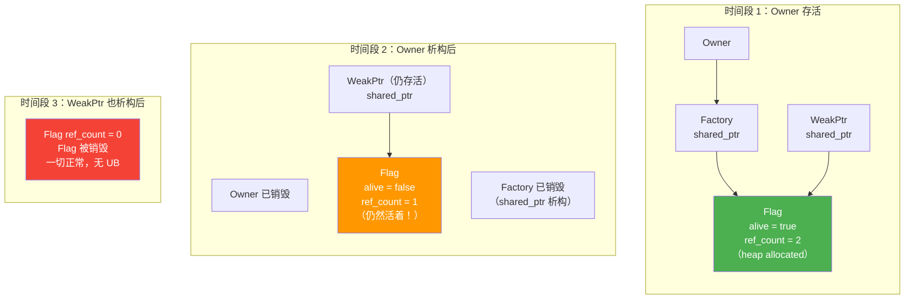
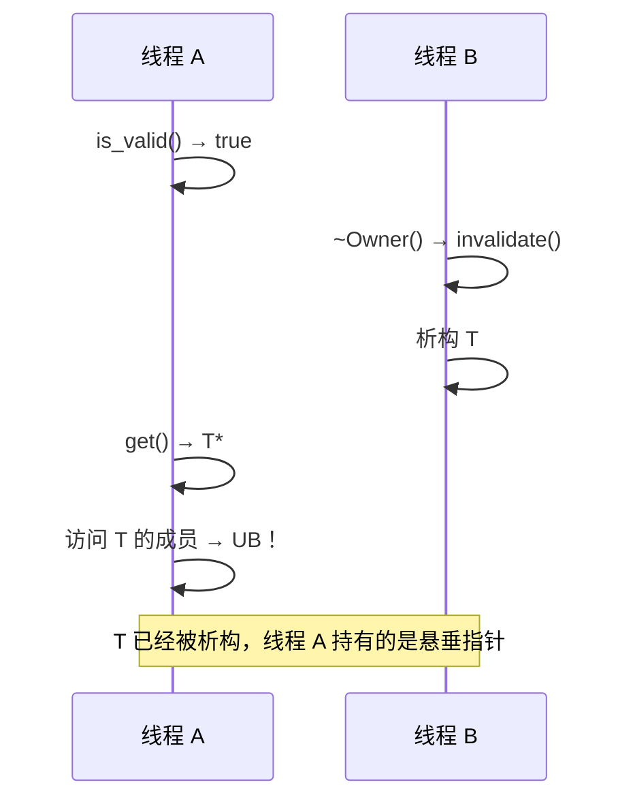

# SimpleWeakPtr：T* + shared_ptr\<Flag\> 的安全改进

## 引言

上一篇我们拆解了 `T* + raw Flag*` 的致命问题：Flag 的生命周期绑定在 Owner 上，Owner 析构后 Flag 也跟着没了，外部 WeakPtr 手里的 `flag_` 变成悬垂指针——`is_valid()` 本身就是 UB。

解法很直接：让 Flag 的生命周期独立于 Owner。怎么做？用 `std::shared_ptr<Flag>` 来持有它——Factory 和所有 WeakPtr 共享同一个 Flag 的所有权。Owner 析构时只 invalidate Flag（设 `alive = false`），但 Flag 对象本身继续活着，直到最后一个持有它的 WeakPtr 也销毁。

这样，`is_valid()` 永远不会访问已释放的内存，因为它访问的 Flag 对象一定还活着。

## 核心设计

先看实现，然后我们逐段解释为什么这样设计。

```cpp
// simple_weak_ptr.h
// 教学版 SimpleWeakPtr<T>：T* + shared_ptr<Flag>
// control block 通过 shared_ptr 管理，保证生命周期独立于 Owner

#pragma once

#include <memory>

struct Flag {
    bool alive = true;

    void invalidate() { alive = false; }
};

template <typename T>
class SimpleWeakPtr {
public:
    SimpleWeakPtr() = default;

    SimpleWeakPtr(T* ptr, std::shared_ptr<Flag> flag)
        : ptr_(ptr), flag_(std::move(flag)) {}

    // 检查对象是否还有效
    // 安全：flag_ 是 shared_ptr，只要这个 WeakPtr 还活着，Flag 就一定活着
    bool is_valid() const
    {
        return flag_ && flag_->alive;
    }

    // 获取对象指针，已失效则返回 nullptr
    T* get() const
    {
        if (is_valid()) {
            return ptr_;
        }
        return nullptr;
    }

    T& operator*() const { return *get(); }
    T* operator->() const { return get(); }
    explicit operator bool() const { return get() != nullptr; }

private:
    T* ptr_ = nullptr;
    std::shared_ptr<Flag> flag_;
};

template <typename T>
class SimpleWeakPtrFactory {
public:
    explicit SimpleWeakPtrFactory(T* owner)
        : owner_(owner), flag_(std::make_shared<Flag>()) {}

    SimpleWeakPtr<T> get_weak_ptr()
    {
        return SimpleWeakPtr<T>(owner_, flag_);
    }

    void invalidate()
    {
        if (flag_) {
            flag_->invalidate();
        }
    }

    ~SimpleWeakPtrFactory()
    {
        invalidate();
    }

private:
    T* owner_;
    std::shared_ptr<Flag> flag_;  // Factory 和 WeakPtr 共享同一个 Flag
};
```

## 为什么这样就安全了

上一篇的问题在于 `Flag*` 是裸指针——它不拥有 Flag，不能保证 Flag 还活着。现在我们换成了 `std::shared_ptr<Flag>`，情况就完全不同了。

`std::shared_ptr` 内部维护一个引用计数。当 Factory 创建 `SimpleWeakPtr` 时，它把自己的 `flag_` 拷贝给 WeakPtr，引用计数 +1。此时有两个 `shared_ptr` 指向同一个 Flag：Factory 持有一个，WeakPtr 持有一个。

当 Owner 析构时，Factory 析构函数调用 `invalidate()` 把 `flag_->alive` 设成 `false`。然后 Factory 的 `shared_ptr<Flag>` 析构，引用计数从 2 变成 1。但 Flag 对象**不会**被销毁，因为还有一个 `shared_ptr`（WeakPtr 手里的那个）在引用它。

只有当最后一个持有 Flag 的 `shared_ptr` 也析构时，Flag 才会被销毁。这意味着只要还有任何 `SimpleWeakPtr` 活着，`is_valid()` 就是在访问一个确实存在的 Flag 对象——而不是悬垂指针。

生命周期图：



## shared_ptr\<Flag\> 不等于拥有 T

这里有一个容易混淆的地方需要强调：`shared_ptr<Flag>` 只是拥有 Flag 这个控制块，**不拥有 T**。

Flag 里只有一个 `bool alive`，它不持有 T 的指针，不参与 T 的析构，也不延长 T 的生命周期。T 的生命周期完全由 Owner 自己管理（可能是栈上对象、`unique_ptr` 管理的堆对象、或者其他方式）。Flag 唯一做的事情是记录"T 还活着吗"这个状态。

这个区分很重要——如果你把 `shared_ptr<Flag>` 理解成了"shared_ptr 拥有 T"，那就和 `std::shared_ptr<T>` 混淆了。后者拥有 T，前者只拥有控制块。

## 线程安全讨论

到这里，我们解决了生命周期安全问题。但如果你在多线程场景下使用 `SimpleWeakPtr`，还有新的坑等着。

**问题一：`bool alive` 的数据竞争。** 如果一个线程在 `invalidate()` 中写 `alive = false`，另一个线程在 `is_valid()` 中读 `alive`，而且没有任何同步机制，这就是标准意义上的数据竞争——UB。

修复方案很简单，把 `bool` 换成 `std::atomic<bool>`：

```cpp
#include <atomic>

struct Flag {
    std::atomic<bool> alive{true};

    void invalidate() { alive.store(false, std::memory_order_release); }
    bool is_alive() const { return alive.load(std::memory_order_acquire); }
};
```

**问题二：即使 Flag 是 atomic 的，T 的并发访问仍然不安全。** 这是最容易被忽略的地方。假设线程 A 调用 `is_valid()` 返回 `true`，然后准备调用 `get()` 获取 T* 并访问 T 的成员。但在 `is_valid()` 和实际访问 T 之间，线程 B 可能正在析构 T。这就是经典的 TOCTOU（Time-of-check-to-time-of-use）竞态。



`atomic<bool>` 解决的是 Flag 本身的数据竞争，不是 T 的并发安全问题。这一点我们后面第五篇讨论异步回调的时候会详细展开。

## 小结

- `shared_ptr<Flag>` 让 control block 的生命周期独立于 Owner，解决了 `raw Flag*` 的悬垂问题
- `is_valid()` 现在总是安全的——只要 WeakPtr 还活着，Flag 就一定还活着
- `shared_ptr<Flag>` 只拥有控制块，不拥有 T，不延长 T 的生命周期
- 线程安全需要两步：Flag 用 `atomic<bool>` 解决数据竞争，但 T 的并发访问需要额外的同步机制
- `atomic<bool>` 解决的是"读 Flag 不会 UB"，不是"读到 alive=true 后访问 T 就安全"

这是从"不安全的弱引用"到"安全的弱引用"的关键一步。但 `shared_ptr` 引入了堆分配和原子引用计数的开销。有没有一种更轻量的方式实现同样的安全保证？有——Chrome 风格的引用计数 control block。下一篇我们来实现它。

## 参考资源

- [std::shared_ptr - cppreference](https://en.cppreference.com/w/cpp/memory/shared_ptr)
- [std::atomic - cppreference](https://en.cppreference.com/w/cpp/atomic/atomic)
- [C++ Memory Order 详解](../../../vol5-concurrency/ch03-atomic-memory-model/02-memory-ordering.md) — 本教程卷五深入讨论了 memory order
