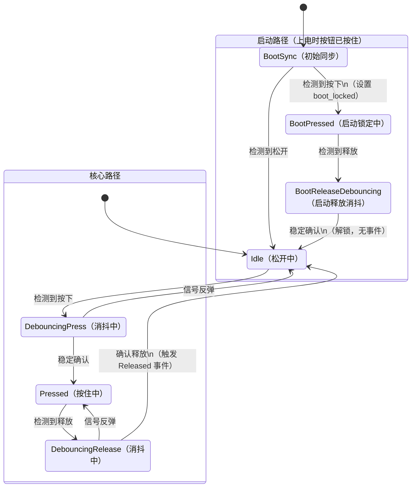

# 第25篇：7 状态消抖状态机 —— 本系列的核心

> 承接上一篇：非阻塞消抖能工作，但状态变量散落、没有事件概念、没处理启动边界。这一篇用一个 7 状态的有限状态机解决所有问题。这是 `button.hpp` 中 `poll_events()` 方法的完整解读。

---

## 为什么需要状态机

上一篇的非阻塞消抖代码，核心逻辑是这样的：

```c
if (current != last_raw) {
    last_raw = current;
    last_change_time = HAL_GetTick();
}
if ((HAL_GetTick() - last_change_time) >= debounce_ms) {
    if (last_raw != last_stable) {
        last_stable = last_raw;
        // 触发事件
    }
}
```

能工作，但有问题。这个 `if-else` 结构把"消抖等待"、"状态确认"、"事件触发"混在一起，没有清晰的边界。随着需求增加——要区分按下和释放、要处理启动时按钮已按住、要在消抖期间正确处理信号反弹——`if-else` 会越堆越乱。

状态机把这段逻辑拆成了离散的状态和明确的转换规则。每个状态只关心"我在这里，输入是什么，下一个状态去哪里"。不再是"一堆条件判断纠缠在一起"，而是"一张清晰的状态转换图"。

---

## 7 个状态

我们的状态机有 7 个状态，定义在 `button.hpp` 的私有 `enum class State` 中：

```cpp
enum class State {
    BootSync,            // 启动同步：第一次采样，确定初始状态
    Idle,                // 空闲：按钮松开，等待按下
    DebouncingPress,     // 消抖中（按下方向）：等待信号稳定
    Pressed,             // 已确认按下：按钮正在被按住
    DebouncingRelease,   // 消抖中（释放方向）：等待信号稳定
    BootPressed,         // 启动锁定：上电时按钮已被按住
    BootReleaseDebouncing, // 启动释放消抖：启动锁定后的释放消抖
};
```

先别被 7 个状态吓到。核心流程只有 4 个状态：`Idle → DebouncingPress → Pressed → DebouncingRelease → Idle`，和上一篇的非阻塞逻辑一一对应。额外的 3 个状态（`BootSync`、`BootPressed`、`BootReleaseDebouncing`）是专门处理"启动时按钮已被按住"这个边界情况的。

### 状态转换图



---

## 逐状态解读

### State::BootSync — 启动同步

```cpp
case State::BootSync:
    raw_pressed_ = sample;
    stable_pressed_ = sample;
    debounce_start_ = now_ms;
    boot_locked_ = sample;
    state_ = sample ? State::BootPressed : State::Idle;
    return;
```

这是状态机的初始状态（`state_` 的默认值是 `State::BootSync`）。它只执行一次——第一次调用 `poll_events()` 时。

它做了三件事：

1. 用第一次采样值初始化 `raw_pressed_` 和 `stable_pressed_`
2. 如果按钮已经是按下状态，设置 `boot_locked_ = true`——进入"启动锁定"
3. 根据采样结果跳转到 `BootPressed` 或 `Idle`

为什么需要这一步？因为状态机需要知道"初始状态是什么"。如果上电时按钮已经被按住，我们不能触发 `Pressed` 事件——用户并没有"按下"按钮，按钮从一开始就是按住的。

### State::Idle — 空闲

```cpp
case State::Idle:
    if (sample) {
        raw_pressed_ = true;
        debounce_start_ = now_ms;
        state_ = State::DebouncingPress;
    }
    return;
```

空闲状态意味着按钮当前是松开的。只关心一件事：有没有检测到按下信号？如果有，记录时间戳，进入消抖状态。

这个状态什么都不输出，不触发任何事件。它只是在"等"。

### State::DebouncingPress — 按下消抖

```cpp
case State::DebouncingPress:
    if (sample != raw_pressed_) {
        raw_pressed_ = sample;
        debounce_start_ = now_ms;
    }
    if (!sample) {
        state_ = State::Idle;
        return;
    }
    if ((now_ms - debounce_start_) < debounce_ms) {
        return;
    }
    stable_pressed_ = true;
    state_ = State::Pressed;
    cb(Pressed{});
    return;
```

这是消抖的核心。三个判断，对应三种情况：

**情况 1：信号反弹了。** `sample != raw_pressed_` 说明信号在抖动中跳回来了。更新 `raw_pressed_` 并重置计时器——重新开始计时。

**情况 2：信号明确回到了低电平。** `!sample` 意味着按钮又松开了——这次按下是假信号，回到 `Idle`。

**情况 3：信号持续为高，且已经稳定了 `debounce_ms`。** 确认按下！更新稳定状态，跳转到 `Pressed`，触发 `Pressed` 事件。

这三个判断的顺序很关键。先检查反弹（情况 1），再检查回到低（情况 2），最后检查超时确认（情况 3）。这个顺序确保了：

- 抖动期间每次反弹都重置计时器
- 如果信号明确回到了初始电平，立即放弃（不等超时）
- 只有持续稳定才确认

### State::Pressed — 已确认按下

```cpp
case State::Pressed:
    if (sample != raw_pressed_) {
        raw_pressed_ = sample;
        debounce_start_ = now_ms;
        state_ = State::DebouncingRelease;
    }
    return;
```

按钮被确认按下后，只关心一件事：有没有检测到释放信号？如果有，进入释放消抖状态。

注意 `Pressed` 状态不会再次触发 `Pressed` 事件——事件只在状态转换时触发一次。这保证了无论用户按住多久，`Pressed` 事件只触发一次。

### State::DebouncingRelease — 释放消抖

```cpp
case State::DebouncingRelease: {
    if (sample != raw_pressed_) {
        raw_pressed_ = sample;
        debounce_start_ = now_ms;
        if (sample) {
            state_ = State::Pressed;
        }
        return;
    }
    if (sample) {
        state_ = State::Pressed;
        return;
    }
    if ((now_ms - debounce_start_) < debounce_ms) {
        return;
    }
    stable_pressed_ = false;
    state_ = State::Idle;
    if (boot_locked_) {
        boot_locked_ = false;
        return;
    }
    cb(Released{});
    return;
}
```

和 `DebouncingPress` 结构对称，但方向相反。三个核心判断：

**情况 1：信号反弹。** 重置计时器。如果反弹回了高电平（`sample` 为 true），回到 `Pressed` 状态。

**情况 2：信号明确回到了高电平。** 回到 `Pressed`，这次释放是假信号。

**情况 3：超时确认。** 稳定值为低，确认释放。但这里多了一个检查：`boot_locked_`。

### Boot-lock 检查

```cpp
if (boot_locked_) {
    boot_locked_ = false;
    return;  // 不触发 Released 事件
}
cb(Released{});
```

如果 `boot_locked_` 为 true，说明这次"释放"是启动时按钮被按住的首次释放。在这种情况下，我们**不触发 `Released` 事件**——因为用户从未在系统运行期间"按下"过按钮。只是把 `boot_locked_` 清零，让状态机进入正常工作模式。

这是一个很容易被忽略的边界情况。如果你的代码不对 `boot_locked_` 做特殊处理，系统上电时如果按钮恰好被按住（比如按钮卡住了，或者用户一直按着），释放按钮时就会触发一个"莫名其妙的 Released 事件"——用户什么都没做，LED 却灭了。

### State::BootPressed 和 BootReleaseDebouncing

这两个状态是 `Pressed` 和 `DebouncingRelease` 的"静默版本"——逻辑完全一样，但不触发任何事件：

```cpp
case State::BootPressed:
    // 和 Pressed 一样的消抖逻辑，但释放后进入 BootReleaseDebouncing
    ...

case State::BootReleaseDebouncing:
    // 和 DebouncingRelease 一样的消抖逻辑
    // 确认释放后：
    boot_locked_ = false;
    stable_pressed_ = false;
    state_ = State::Idle;  // 静默进入 Idle，不触发 Released
    return;
```

为什么不让 `Pressed` 和 `DebouncingRelease` 同时承担启动锁的功能？因为那样需要在每个状态中都加 `if (boot_locked_)` 的判断，逻辑变得更复杂。独立出两个状态，虽然多了一对状态，但每个状态的逻辑更纯粹——要么只处理正常流程，要么只处理启动流程。

---

## 完整状态转换表

| 当前状态 | 输入 | 条件 | 下一状态 | 动作 |
|---------|------|------|---------|------|
| BootSync | 高电平 | — | Idle | 初始化，无锁定 |
| BootSync | 低电平 | — | BootPressed | 初始化，设置 boot_locked |
| Idle | 低电平 | — | Idle | 无事发生 |
| Idle | 高电平 | — | DebouncingPress | 记录时间戳 |
| DebouncingPress | 反弹 | — | DebouncingPress | 重置计时器 |
| DebouncingPress | 低电平 | — | Idle | 假信号，放弃 |
| DebouncingPress | 高电平 | 时间未到 | DebouncingPress | 继续等待 |
| DebouncingPress | 高电平 | 时间到 | **Pressed** | **触发 Pressed 事件** |
| Pressed | 高电平 | — | Pressed | 无事发生 |
| Pressed | 低电平 | — | DebouncingRelease | 记录时间戳 |
| DebouncingRelease | 反弹 | 回到高电平 | Pressed | 假信号 |
| DebouncingRelease | 高电平 | — | Pressed | 假信号 |
| DebouncingRelease | 低电平 | 时间未到 | DebouncingRelease | 继续等待 |
| DebouncingRelease | 低电平 | 时间到 + boot_locked | Idle | 清除锁定，无事件 |
| DebouncingRelease | 低电平 | 时间到 + 正常 | **Idle** | **触发 Released 事件** |

启动路径的状态转换和上面对称，只是不触发任何事件。

---

## 和上一篇非阻塞代码的对比

上一篇的 `if-else` 代码大约 15 行，完成了基本的消抖。状态机版本大约 80 行，多了启动处理和事件概念。这看起来像是过度复杂化了？

不是。15 行的代码在以下场景会出问题：

1. **区分按下和释放**：你需要两个方向的消抖——按下要消抖，释放也要消抖。`if-else` 版本只做了一次"稳定检查"，没有区分方向。
2. **消抖期间信号反弹**：抖动不是简单的"等 20ms 就稳定了"。信号可能在 5ms 时反弹一次、10ms 时再反弹一次。每次反弹都需要重置计时器。状态机明确处理了这个情况。
3. **启动边界**：上电时按钮状态不确定。状态机的 `BootSync` + `BootPressed` 路径优雅地处理了这个情况。
4. **扩展性**：如果将来要加"长按检测"或"双击检测"，在状态机里加几个状态就行。在 `if-else` 里加会让代码更难维护。

状态机的本质是用空间换时间——多写几行代码，但每个状态的职责清晰、逻辑简单、不会互相干扰。

---

## 我们回头看

这一篇是整个按钮教程的核心。我们详细解读了 `button.hpp` 中 `poll_events()` 方法的 7 状态状态机：

- **核心路径**：`Idle → DebouncingPress → Pressed → DebouncingRelease → Idle`，处理正常的按下和释放
- **启动路径**：`BootSync → BootPressed → BootReleaseDebouncing → Idle`，处理上电时按钮已按住的边界情况
- **消抖机制**：每次信号反弹都重置计时器，只有持续稳定才确认状态变化
- **boot-lock**：启动锁确保上电时按钮被按住不会触发虚假事件

理解了这个状态机，`button.hpp` 的其余部分（模板参数、Concepts 回调、`std::variant` 事件）都是在它上面的封装层。接下来几篇就是逐步把这些 C++ 特性讲清楚。
