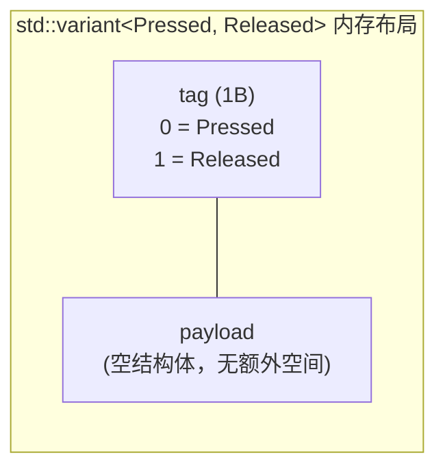

# 第27篇：`std::variant` 事件 + `std::visit` 分发 —— 类型安全的"发生了什么"

> 承接上一篇：`enum class` 搞定了类型安全的配置和状态。这一篇引入 C++17 的 `std::variant` 来表达按钮事件——"按下"和"释放"不再是两个整数，而是两个不同的类型。

---

## C 语言怎么表达事件

按钮只有两个事件：按下（Pressed）和释放（Released）。C 语言通常用 `enum` 或 `#define` 来表示：

```c
#define EVENT_PRESSED  1
#define EVENT_RELEASED 0

// 或者
enum ButtonEvent { Pressed = 1, Released = 0 };
```

然后在回调或返回值中传递这个整数：

```c
void handle_event(int event) {
    if (event == EVENT_PRESSED) {
        // 按下处理
    } else if (event == EVENT_RELEASED) {
        // 释放处理
    }
    // 如果传了一个 42 进来呢？编译器不会警告你
}
```

问题很明显：`int` 可以是任何值。你传个 `42` 进去，编译器一声不吭。即使用了 `enum`，C 语言的 `enum` 本质上也是整数，没有类型安全保证。

更深层的问题是：事件只能携带一个整数。如果将来 `Pressed` 事件需要附带时间戳，`Released` 事件需要附带持续时间，整数就不够用了。你得再加一个 `struct` 参数或者全局变量来传递额外数据。

---

## std::variant：类型安全的联合体

`std::variant` 是 C++17 引入的类型安全联合体。它可以在同一时刻持有多种类型中的一个——和 C 的 `union` 类似，但有关键区别：

1. **类型安全**：`variant` 知道自己当前持有的是哪种类型
2. **编译时检查**：访问时必须处理所有可能的类型，否则编译警告或错误
3. **支持复杂类型**：不像 `union` 不能持有带构造函数的类，`variant` 可以持有任何类型

### 我们的事件定义

```cpp
// button_event.hpp
#pragma once
#include <cstdint>
#include <variant>

namespace device {

struct Pressed {};
struct Released {};

using ButtonEvent = std::variant<Pressed, Released>;

} // namespace device
```

`Pressed` 和 `Released` 是空结构体——它们不携带任何数据，只是类型标签。`ButtonEvent` 是一个 `std::variant`，可以在同一时刻持有 `Pressed` 或 `Released` 中的一个。

为什么用空结构体而不是 `enum class`？两个原因：

**第一，扩展性。** 如果将来 `Pressed` 需要携带时间戳：

```cpp
struct Pressed { uint32_t timestamp; };
```

只需要在结构体里加字段，`variant` 的使用方式完全不变。如果用 `enum class`，携带数据就需要额外的 `struct` 包装。

**第二，类型分发。** `std::visit` 可以基于 `variant` 中实际持有的类型来做编译时分发——不同的类型走不同的代码路径。空结构体作为类型标签，让这个分发机制非常干净。

### 和 union 的对比

```cpp
// C 风格 union — 不安全
union ButtonEvent {
    int pressed;
    int released;
};
// 没有办法知道当前是 pressed 还是 released

// C++17 variant — 安全
using ButtonEvent = std::variant<Pressed, Released>;
// variant 内部记录了当前持有的类型
```

C 的 `union` 不记录"当前是哪个成员"，你需要手动维护一个 tag 变量。如果你写了 tag 表示 `pressed` 但实际读的是 `released`，结果就是未定义行为。`variant` 在内部维护了这个 tag，通过 `std::visit` 强制你正确处理每种类型。

---

## std::visit：类型安全的分发

`std::visit` 接受一个"访问者"（callable）和一个 `variant`，根据 `variant` 当前持有的类型调用访问者的对应重载。

### 泛型 lambda 方式

```cpp
std::visit(
    [](auto&& e) {
        using T = std::decay_t<decltype(e)>;
        if constexpr (std::is_same_v<T, Pressed>) {
            // 处理按下
        } else if constexpr (std::is_same_v<T, Released>) {
            // 处理释放
        }
    },
    event
);
```

这段代码做了什么？逐层拆解：

1. `std::visit(visitor, event)` — 根据 `event` 持有的类型调用 `visitor`
2. `[](auto&& e)` — 泛型 lambda，`auto&&` 是转发引用，`e` 的类型由 `variant` 中实际持有的类型推导
3. `using T = std::decay_t<decltype(e)>` — 提取 `e` 的"裸类型"（去掉引用和 const）
4. `if constexpr (std::is_same_v<T, Pressed>)` — 编译时判断 `T` 是不是 `Pressed`
5. `else if constexpr (std::is_same_v<T, Released>)` — 编译时判断 `T` 是不是 `Released`

### main.cpp 中的实际用法

```cpp
button.poll_events(
    [&](device::ButtonEvent event) {
        std::visit(
            [&](auto&& e) {
                using T = std::decay_t<decltype(e)>;
                if constexpr (std::is_same_v<T, device::Pressed>) {
                    led.on();
                } else {
                    led.off();
                }
            },
            event);
    },
    HAL_GetTick());
```

这里用了两层 lambda。外层 lambda 是 `poll_events()` 的回调参数，每次有事件发生时被调用，参数 `event` 是一个 `ButtonEvent`（即 `std::variant<Pressed, Released>`）。内层 lambda 是 `std::visit` 的访问者，负责处理具体的事件类型。

### std::decay_t 和 decltype

`decltype(e)` 返回 `e` 的声明类型。由于 `auto&&` 是转发引用，`e` 的实际类型可能是 `Pressed&&` 或 `const Pressed&` 之类的引用类型。`std::decay_t` 把引用、const、volatile 全部去掉，得到"裸类型" `Pressed` 或 `Released`。

```cpp
// 如果 variant 持有 Pressed：
decltype(e) → Pressed&& （或 const Pressed&，取决于调用方式）
std::decay_t<Pressed&&> → Pressed

// 所以 T 就是 Pressed
```

### if constexpr 的作用

`if constexpr` 是编译时条件分支。当 `T` 是 `Pressed` 时，`else` 分支的代码**不会被编译**——它根本不存在于生成的机器码中。这和运行时 `if-else` 的区别是：运行时 `if-else` 两个分支都编译，执行时才选择；`if constexpr` 只编译匹配的分支。

这意味着如果你在 `else` 分支里写了 `Released` 独有的操作（比如访问 `Released` 的某个字段），当 `T` 是 `Pressed` 时不会编译错误——因为那行代码根本不存在。

---

## 和虚函数的对比

你可能会问：为什么不用虚函数 + 继承来表达多态事件？

```cpp
// 虚函数方案
struct ButtonEvent {
    virtual ~ButtonEvent() = default;
    virtual void handle() = 0;
};
struct Pressed : ButtonEvent { void handle() override { /* ... */ } };
```

在桌面应用中这是经典做法。但在嵌入式环境中，它有几个致命问题：

1. **虚函数表（vtable）**：每个有虚函数的类都有一个 vtable，存在 Flash 中。`Pressed` 和 `Released` 各需要一个 vtable。
2. **动态分配**：多态通常需要 `new` 或 `std::make_unique`，我们在嵌入式环境禁用了异常，且尽量避免堆分配。
3. **运行时分发**：虚函数调用通过 vtable 指针间接跳转，多一次内存访问。

`std::variant` + `std::visit` 没有这些问题：

- 不需要 vtable——类型信息编码在 `variant` 自身的 tag 中
- 不需要堆分配——`variant` 直接在栈上存储值
- 分发在编译时完成——编译器看到 `if constexpr` 就直接生成对应的代码

在我们的 `-fno-exceptions -fno-rtti` 编译环境下，`std::variant` 是比虚函数更合适的选择。

---

## 零开销证明

`std::variant<Pressed, Released>` 的内存布局：



由于 `Pressed` 和 `Released` 都是空结构体（`sizeof = 1`），`variant` 只需要一个 tag 字节来标识当前持有哪个类型。加上对齐，`sizeof(ButtonEvent)` 通常是 2 字节。

`std::visit` 配合 `if constexpr`，编译器生成的代码等价于：

```c
if (event.tag == 0) {
    led_on();   // Pressed 分支
} else {
    led_off();  // Released 分支
}
```

一次比较，一次跳转。和你手写 C 代码的 `if-else` 完全一样。variant 的 tag 检查就是 `if-else` 的条件判断——编译器把它优化成最简单的机器码。

---

## 我们回头看

这一篇引入了两个 C++17 特性来构建类型安全的事件系统：

- **`std::variant<Pressed, Released>`** — 类型安全的联合体，替代 C 风格的整数事件码
- **`std::visit` + 泛型 lambda** — 编译时类型分发，保证处理了所有事件类型
- **空结构体作为类型标签** — 可扩展，将来可以加字段
- **`std::decay_t<decltype(e)>` + `std::is_same_v`** — 编译时类型判断的工具组合

和虚函数方案相比，`variant` + `visit` 不需要 vtable、不需要堆分配、不需要 RTTI——完美适配我们的嵌入式环境。

下一篇把这些东西组装成 Button 模板类。
