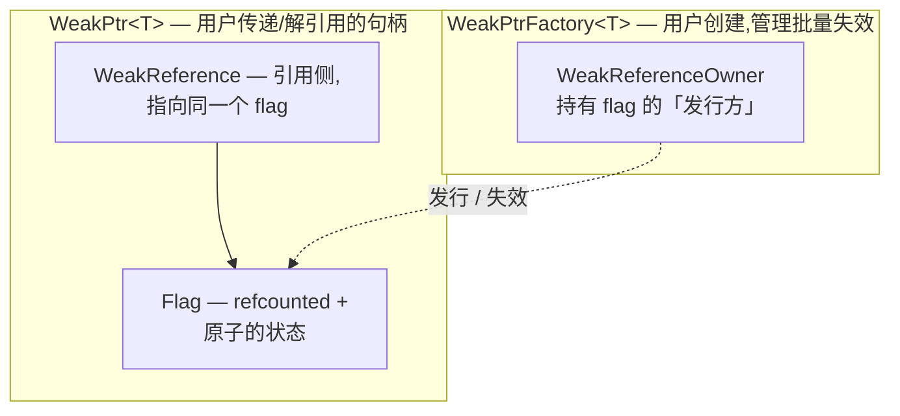

# WeakPtr 实战（一）：动机与接口设计

01-4 手搓取消令牌那会儿,笔者图省事给回调挂了个原子标志——对象活着是 0,析构前置 1,回调跑前先 if 一下。悬空问题当时糊弄过去了。可有个尾巴笔者自己心里一直没踏实:那枚标志到底归谁管?回调又怎么拿到它?

您琢磨一下这事儿有多别扭。标志是对象 A 创建的,回调跑在别处。要让回调看到标志,就得把标志的指针塞过去。塞裸指针,A 一析构标志跟着没了,回调手里的指针又悬空,绕一圈回原点。塞 `shared_ptr` 呢?那标志就永远不析构了——可这只是管标志,不是管 A 本身,问题根本没解决,只是把洞挪了个位置。

这个别扭,其实就是 C++ 弱引用那个经典老问题的具体化身。Chromium 在 `base` 里给了它一个相当硬核的回答,叫 `WeakPtr`。咱们这一篇把动机和要补的洞理清楚,顺手把目标 API 定下来。接口先于实现,代码留给后面几篇。

---

## 从一个 bug 说起

### 场景:异步任务投递

假设有个 `Controller`,往线程池投任务,任务完事回来更新自己的状态。

```cpp
class Controller {
public:
    void start_work(ThreadPool& pool) {
        // 投一个任务到线程池,完成后回调 on_work_done
        pool.post([this] { this->on_work_done(); });
    }
    void on_work_done() { /* 更新状态 */ ++work_count_; }
private:
    int work_count_ = 0;
};
```

这段代码您测十次有九次半是好的。可一旦 `Controller` 在任务还没轮到的时候被析构——用户切页面了、所在窗口关了——任务系统里那份回调还死死攥着 `this`。等任务真跑起来,`on_work_done` 解引用的就是一个已经析构的对象。段错误。

### 这是我们在 01-4 已经遇过的问题

跟当时手搓取消令牌是一码事:给 Controller 挂个标志,析构前置 1,回调执行前先看标志。思路一模一样。

可当时笔者偷了个懒,标志的生命周期是靠"回调持 `shared_ptr<Flag>`、Controller 持原始 flag"硬糊的,因为教学版只想把"检查"这一步讲清楚。这回咱们得认真了。真正的做法,是把"标志"和"指向对象的弱引用"捏成一个东西。回调拿到的不是一个孤零零的标志,而是一个 `WeakPtr<Controller>`——它既能告诉回调 Controller 死没死,又能在没死的时候直接调 Controller 的方法。

这就是 `WeakPtr` 要干的事。

---

## 三种现成解法为什么都不够

动手造轮子之前,先把现成的三条路堵死,您才理解 Chromium 为什么非要自己造。

裸指针 `this` 就是上面那段代码,对象析构后回调悬垂,UAF,没什么好说的。

`shared_ptr<Controller>` 也不行。它逼您把 Controller 改成共享所有权,本来一个 owner 清清爽爽,这下变成"理论人人可持"。更要命的是,只要回调还攥着 `shared_ptr`,Controller 就**永远不析构**——任务还在排队,Controller 就赖着不走,资源泄漏加上生命周期失控。这不是修 bug,是换了个 bug。

`std::weak_ptr<Controller>` 呢?它得先有 `shared_ptr` 才能用,绕一圈又回到上一条。而且每次访问都得 `lock()` 拿个临时 `shared_ptr`,在回调这种高频路径上既啰嗦又多一坨原子开销。它在 [前置知识（零）](./pre-00-weak-ptr-weak-reference-and-lifetime.md) 里系统讲过的抽象局限,这里咱们用代码说话就够了。

三条路,要么不安全,要么污染所有权,要么绑着非侵入式的代价。Chromium 的诉求很直白:让 Controller 保持原来的单一 owner 模型,给回调一个"不延寿、能判活、能批量失效"的弱引用。

---

## Chromium 的回答:WeakPtr 的设计哲学

Chromium 的 `WeakPtr` 不是一个孤立的小类,它是一套四层结构。咱们从底层往上看。这个分层和 [OnceCallback 实战（一）](../../01_once_callback/full/01-1-once-callback-motivation-and-api-design.md) 里讲过的 `BindState` 是同一个套路——底层做类型擦除加引用计数,顶层甩一个轻量句柄给用户。您会一个,另一个基本就白捡。

### 四层架构



最底下是 `Flag`,内部类,用户碰不到。它就是那个"对象死没死"的状态,挂了 `RefCountedThreadSafe`,被发行方和所有引用方共享,里头一个原子标志位。往上一层是 `WeakReference`,是对 `Flag` 的引用包装,持一个 `scoped_refptr<const Flag>`,它就是 WeakPtr 内部那个"弱引用"的实体。再往上是 `WeakPtr<T>`,用户操作的句柄,持一个 `WeakReference` 加一个 `T*`,大小就两个指针,标了 `TRIVIAL_ABI` 能进寄存器。最顶上 `WeakPtrFactory<T>` 挂在被观察对象身上当"铸币厂",调 `GetWeakPtr()` 铸一个新 WeakPtr,调 `InvalidateWeakPtrs()` 一次性作废所有已铸出的。

这里头有个笔者觉得相当漂亮的设计:**从同一个 factory 铸出的所有 WeakPtr 共享同一枚 Flag**。所以"对象析构时调一次 `InvalidateWeakPtrs()`,所有 WeakPtr 集体失效"几乎是白送的。这正是 `std::weak_ptr` 做不到的"一次失效一批"。

### 为什么是这个形状

回头看 01-4 那个结:标志怎么传?Chromium 的答案就是这套结构。Flag 用引用计数管自己的命——只要还有 WeakPtr 持着,Flag 就活着;而 Flag 指向的对象该析构就析构,Flag 不拦。两套生命周期彻底分开。

对象 Controller 的命由它的 owner 决定,跟 WeakPtr 没半点关系。Flag 的命由引用计数管,从第一个 WeakPtr 铸出到最后一个 WeakPtr 销毁。而"Controller 死没死"这个状态存在 Flag 里,Controller 析构前由 factory 调一次 `Invalidate` 把标志位翻过去。

这就是"不介入所有权 + 能判活"的落地。咱们在 [前置知识（零）](./pre-00-weak-ptr-weak-reference-and-lifetime.md) 里列的四条诉求,被这四层结构一条条消化掉了。

---

## 设计目标 API

接下来把目标 API 定下来。这是工程师的工作方式——先想清楚"我要什么",再回头讨论每个决策。命名沿用项目的 `tamcpp::chrome` 命名空间,snake_case 风格,跟 OnceCallback 系列保持一致。

### 弱指针:WeakPtr\<T\>

```cpp
#include "weak_ptr/weak_ptr.hpp"
using namespace tamcpp::chrome;

// 从 factory 铸出来(见下面)
WeakPtr<Controller> wp = factory.get_weak_ptr();

// 判活 + 解引用
if (wp) {
    wp->on_work_done();      // operator-> :对象活着时正常调用
}

// 失效后
wp->on_work_done();          // operator-> :对象死了 → CHECK 失败,程序中止
wp.get();                    // get()      :对象死了 → 返回 nullptr,不崩

// 重置
wp.reset();                  // 主动松手,之后 wp == nullptr
```

### 工厂:WeakPtrFactory\<T\>

```cpp
class Controller {
public:
    void start_work(ThreadPool& pool);
    void on_work_done();
    // 对外暴露铸币接口(factory 本身保持 private)
    WeakPtr<Controller> get_weak() { return weak_factory_.get_weak_ptr(); }
    ~Controller() = default;
private:
    int work_count_ = 0;
    // 关键:factory 是最后一个成员,且保持 private(02-3 讲为什么)
    WeakPtrFactory<Controller> weak_factory_{this};
};

// 在别处铸币(通过 public 接口,不直接碰 private 的 factory)
WeakPtr<Controller> wp = controller.get_weak();
```

> 主动失效(`invalidate_weak_ptrs()`)和查询(`has_weak_ptrs()`)是 factory 自己的方法,通常也通过 Controller 的 public 方法转发——对象自己决定什么时候作废所有观察者,而不是让外部直接戳 `weak_factory_`。不然外部代码一个手滑调了失效,所有观察者集体瞎掉。02-3 会展开这套封装。

### 与回调集成(预告 02-5)

这一步才是整个系列的"眼"。Chromium 里真正的写法不是 `if (wp) wp->...`,而是把 WeakPtr 直接绑进回调,让回调在对象死后**自动**变 no-op:

```cpp
// 这条任务在 controller 死后会自动静默丢弃,不会悬空解引用
pool.post(bind_once(&Controller::on_work_done, controller.weak_factory_.get_weak_ptr()));
```

到这儿,01-4 那个手搓的取消令牌才真正接进了成体系的回调系统。02-5 咱们把这里的机制拆到汇编级。

---

## 接口设计决策分析

API 定下来了,可每个签名里都藏着决策。咱们把"为什么"逐条说清楚,这一节的每个结论都能在 Chromium 源码里对上一条注释或一行实现,后面实战篇会逐个兑现。

### 为什么 get() 返回裸指针,而 operator*/operator-> 用 CHECK

`WeakPtr` 故意把"检查"和"不检查"两种解引用分得很开。

`get()` 返回 `T*`,对象活着给真地址,死了给 `nullptr`,**不崩**,判断权交给您。`operator*` 和 `operator->` 就凶了,对象死了直接 `CHECK` 失败中止程序,release 构建也崩,不是只 debug 崩的 DCHECK。

为什么这么狠?因为解引用一个失效的 WeakPtr 是个**确定的逻辑错误**。您明明可以先 `if (wp)` 或者 `get()` 判活,没判就硬解引用,那只能说明代码写错了。这种 bug 在 release 里也得让它立刻爆,而不是带着悬垂指针继续跑出一堆诡异现象。Chromium 的源码注释直接把这条写成了契约(`weak_ptr.h:240-252`)。

至于 `get()`,它是给"我自己会判活"留的逃生口,返回裸指针不替您做检查。那些要把判活后的指针喂给不接受 WeakPtr 的旧代码的场景,就靠它。

### 为什么不提供 operator== 和 operator<=>

您可能觉得奇怪,智能指针一般都能比地址,WeakPtr 怎么连 `==` 都不给?Chromium 在源码里专门写了一段注释解释(`weak_ptr.h:196-201`):

> WeakPtr 故意不实现 `operator==` 和 `operator<=>`,因为弱引用的比较本质上不稳定。

两层原因。要是比较考虑有效性,两个 WeakPtr 此刻相等,下一秒一个失效一个没失效,结果随时在变,根本没法拿来排序或做 key。那要是比较只看底层指针值呢?更糟,对象析构后那块地址可能被另一个新对象复用,两个完全不相关的 WeakPtr 因为地址撞车就"相等"了,这是更阴的 bug。

所以 WeakPtr 只允许跟 `nullptr` 比,也就是 `if (wp)` 这种判活。其它比较一概不给,从类型层面堵死误用。

### 为什么 WeakPtrFactory 是组合,而不是继承

Chromium 里其实有两种获得 WeakPtr 的方式。

主流的是组合:对象把 `WeakPtrFactory<T> weak_factory_{this}` 当成员,可控、灵活,还能给非类类型用,比如 `WeakPtrFactory<bool>`。历史上还有一种继承式,Chromium 当年提供过 `SupportsWeakPtr<T>`,让 T 继承它就能自动获得 `GetWeakPtr()`。这种写法**已从 Chromium 移除**,因为它鼓励了不安全的用法,当前 `//base` 只保留组合式。笔者提这一嘴,是怕您读老代码的时候犯迷糊,新代码千万别用。

咱们这个系列只实现组合式,因为它是 Chromium 推荐的主流写法,也是"最后成员"那条著名惯用法的载体,02-3 展开。继承式说白了是它的语法糖,理解了组合式自然就会。

### 为什么 factory 必须是最后一个成员

这条 02-3 会用析构逆序仔细论证,这里先记结论:`WeakPtrFactory<T> weak_factory_{this}` 必须声明在所有成员的最后。原因在 C++ 的成员析构是按声明逆序来的——factory 放最后,它最先析构,于是在其它成员开始析构之前,所有 WeakPtr 就已经作废了。反过来,要是 factory 放前面,某个成员析构之后 WeakPtr 还有效,别人一解引用就是个半销毁对象。这条惯用法是 WeakPtr 用对用错的分水岭,咱们到 02-3 专门讲。

---

## 我们的实现与 Chromium 的取舍

跟 OnceCallback 系列一样,咱们的教学版会保留核心机制——Flag、WeakReference、WeakPtr、WeakPtrFactory 这四层,但做一些简化。先预告一下取舍,02-6 用实测对比收尾。

| 维度 | Chromium 实现 | 我们的教学版 |
|---|---|---|
| Flag 的引用计数 | `RefCountedThreadSafe`(原子,跨序列) | 同(这是核心,不能省) |
| 原子标志 | `base::AtomicFlag`(release/acquire 封装) | 直接用 `std::atomic` 配 memory_order |
| 序列检查 | `SEQUENCE_CHECKER`(release 下 no-op) | 简化为可选的 debug 断言 |
| `SafeRef` | 完整(非空、悬空即崩) | 不实现(留作扩展) |
| `BindOnce` 集成 | 完整的 `InvokeHelper<true>` 分派 | 简化的 trampoline + 与 01 的 OnceCallback 对接 |
| `TRIVIAL_ABI` | 标注 | 标注(clang) |

咱们拿 `std::atomic` 加显式 memory_order 替掉 Chromium 的 `base::AtomicFlag`,是因为前者是标准库,人人能编译。但有一点得讲清楚:两者在 release/acquire 语义上是等价的,pre-02 专门讲。

---

## 环境搭建

WeakPtr 比 OnceCallback 的工具链要求低一些。它用 C++20 的 concepts 和 requires(转换构造、const 重载),但用不着 C++23 的 `move_only_function` 或 deducing this。

### 编译器要求

GCC 11+ 或 Clang 12+ 即可,编译加 `-std=c++20`。咱们会在需要 `TRIVIAL_ABI` 的地方用 `[[clang::trivial_abi]]`——这是 **Clang 专属属性,GCC 与 MSVC 都不支持**(实测 GCC 16 仍把它当作被忽略的 scoped 属性,不会报错但也无寄存器传递效果)。咱们的 `TAMCPP_TRIVIAL_ABI` 宏在非 Clang 编译器上展开为空,代码照常编译、行为正确,只是不享受 trivial_abi 的 ABI 优化。

### 验证代码

```cpp
#include <atomic>
#include <concepts>

// 验证 concepts 可用
template <typename U, typename T>
    requires std::convertible_to<U*, T*>
constexpr bool check_convertible() { return true; }

// 验证 atomic + memory_order 可用(各 order 值是 implementation-defined,
// 标准只保证它们互不相同;这里只断言 distinct,跨编译器都成立)
static_assert(std::memory_order::acquire != std::memory_order::release);

int main() { return 0; }
```

这段能过,环境就齐了。配套的工程脚手架沿用 `code/volumn_codes/vol9/full_tutorial_codes/chrome_design/` 目录,咱们在 02-2 开始往里加 `12_`~`18_` 这一批示例。

---

## 参考资源

- [Chromium `base/memory/weak_ptr.h` 源码与设计注释](https://source.chromium.org/chromium/chromium/src/+/main:base/memory/weak_ptr.h)
- [Chromium `base/memory/weak_ptr.cc` 实现](https://source.chromium.org/chromium/chromium/src/+/main:base/memory/weak_ptr.cc)
- [OnceCallback 实战（四）：取消令牌设计](../../01_once_callback/full/01-4-once-callback-cancellation-token.md)
- [WeakPtr 前置知识（零）：弱引用与生命周期难题](./pre-00-weak-ptr-weak-reference-and-lifetime.md)
