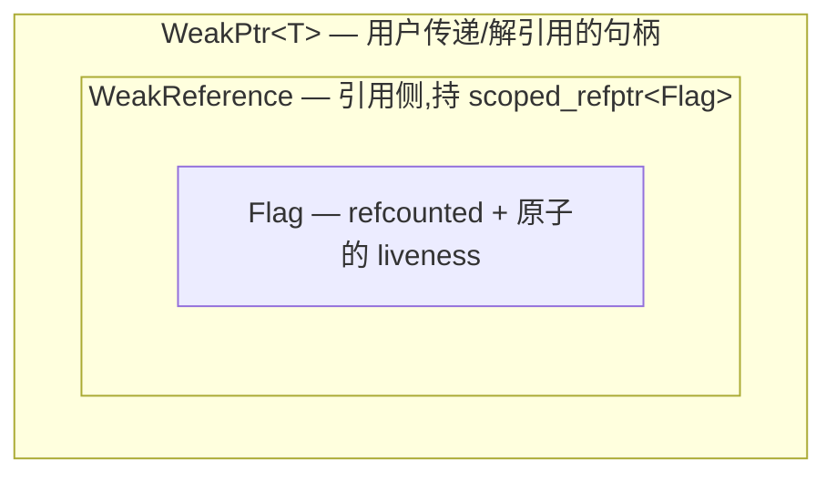

# WeakPtr 实战（二）：核心骨架与控制块

## 三层结构回顾

WeakPtr 是一套三层结构:`Flag`(控制块)、`WeakReference`(引用侧)、`WeakPtr<T>`(用户句柄)。前面七篇前置知识把零件都备齐了——侵入式引用计数、acquire/release、CHECK/DCHECK,这一篇咱们就把这些零件焊到一起,看看它们怎么咬合成真实代码。从底往上写,先实现最底层、也是最吃重的 `Flag`。它就是 [前置知识（零）](./pre-00-weak-ptr-weak-reference-and-lifetime.md) 里那个"对象死没死"状态的载体,也是 [01-4 取消令牌](../../01_once_callback/full/01-4-once-callback-cancellation-token.md) 那个手搓 flag 的工业级正身。

照着 [02-1](./02-1-weak-ptr-motivation-and-api-design.md) 那张图往下填代码,先把图再摆一遍:



三层各自的职责不复杂。`Flag` 管"对象死没死"这个状态,一个原子标志位加一份引用计数;`WeakReference` 是对 Flag 的轻量引用,说白了就是 `scoped_refptr<const Flag>` 的一层包装;`WeakPtr<T>` 在 `WeakReference` 之外再补一个 `T*`,凑成用户手里那把句柄。

---

## 第一层:Flag —— refcounted 的原子状态

设计 `Flag` 之前,咱们先把它的处境捋一遍。factory 侧要持它,每个 WeakPtr 侧也要持它,一票人共享——这就注定它得带引用计数。它手里捏的那个状态就一个布尔位,"失效没失效",而这个位偏偏要被不同序列读写,所以非原子不可。再加上它被引用计数管着,最后一个放手的那条序列随时可能负责 delete 它,这又逼着计数本身得跨线程安全。

三条压一块儿,正好是 [前置知识（一）](./pre-01-weak-ptr-intrusive-refcount-and-scoped-refptr.md) 的 `RefCountedThreadSafe` 撞上 [前置知识（二）](./pre-02-weak-ptr-atomic-and-memory-order.md) 的 acquire/release。咱们复用 pre-01 那个最小 `RefCounted`,给它补上 `RefCountedThreadSafe` 的原子计数语义,再往顶上搭 Flag。

```cpp
// Platform: host | C++ Standard: C++17
#pragma once
#include <atomic>
#include <cassert>
#include <cstddef>

namespace tamcpp::chrome::internal {

// 跨序列安全的侵入式引用计数基类(简化版 RefCountedThreadSafe)
class RefCountedThreadSafe {
public:
    void add_ref() const noexcept {
        ref_count_.fetch_add(1, std::memory_order_relaxed);
    }
    bool release() const noexcept {
        if (ref_count_.fetch_sub(1, std::memory_order_acq_rel) == 1) {
            return true;    // 调用方负责 delete this
        }
        return false;
    }
    bool has_one_ref() const noexcept {
        return ref_count_.load(std::memory_order_acquire) == 1;
    }
protected:
    RefCountedThreadSafe() = default;
    ~RefCountedThreadSafe() = default;
private:
    mutable std::atomic<int> ref_count_{0};
};

// 对应 Chromium 的 base::AtomicFlag:一次性、release/acquire 的布尔标志
class AtomicFlag {
public:
    void Set() noexcept {
        flag_.store(1, std::memory_order_release);
    }
    bool IsSet() const noexcept {
        return flag_.load(std::memory_order_acquire) != 0;
    }
private:
    std::atomic<uint_fast8_t> flag_{0};
};

}  // namespace tamcpp::chrome::internal
```

这两个零件齐了,`Flag` 就很薄了:

```cpp
// Platform: host | C++ Standard: C++17
namespace tamcpp::chrome::internal {

class Flag : public RefCountedThreadSafe {
public:
    Flag() = default;

    // 失效:release-store 把"对象进入失效态"这条消息连同之前的写一起发布
    void Invalidate() noexcept {
        // 教学版省略序列检查;Chromium 在此 DCHECK(seq || HasOneRef())
        invalidated_.Set();
    }

    // 判活(同序列契约):acquire-load
    bool IsValid() const noexcept {
        return !invalidated_.IsSet();
    }

    // 判活(跨序列 hint):同样是 acquire-load,但调用方自行承担正面结果不可信
    bool MaybeValid() const noexcept {
        return !invalidated_.IsSet();
    }

private:
    template <typename> friend class scoped_refptr;   // 允许计数归零时 delete
    ~Flag() = default;                   // private:外部不能直接 delete
    AtomicFlag invalidated_;
};

}  // namespace tamcpp::chrome::internal
```

这段代码有几处得单独点一下。`Flag` 继承 `RefCountedThreadSafe`,原子引用计数是白来的;析构函数刻意写成 `private`,把 delete 的口子收紧到 `release` 路径和友元手里——这正是 [前置知识（一）](./pre-01-weak-ptr-intrusive-refcount-and-scoped-refptr.md) 末尾那招"堵住外部直接 delete",免得有人手贱。

`Invalidate` 配 `IsValid`,一个 release-store 一个 acquire-load,这对搭档咱们在 [前置知识（二）](./pre-02-weak-ptr-atomic-and-memory-order.md) 里推过它的 happens-before:只要读到"失效",在那之前对象的所有写都跑不掉。教学版把序列检查掐了(Chromium 在 `Invalidate` 里挂 `DCHECK(seq.CalledOnValidSequence() || HasOneRef())`、`IsValid` 里挂 `DCHECK_CALLED_ON_VALID_SEQUENCE`),留给 02-4 讲 lazy 绑定时再补;但 acquire/release 这层核心语义,这里一个字都没打折扣。

---

## 第二层:WeakReference —— 对 Flag 的引用包装

往上一层是 `WeakReference`。说白了它就是 `scoped_refptr<const Flag>` 套了层壳,做的事不多:捏着一份指向 Flag 的引用计数句柄,把 `IsValid`/`MaybeValid`/`Reset` 三个动作原样转发过去。

```cpp
// Platform: host | C++ Standard: C++17
namespace tamcpp::chrome::internal {

// 简化版 scoped_refptr(见 pre-01 完整版)
template <typename T>
class scoped_refptr {
public:
    scoped_refptr() noexcept = default;
    explicit scoped_refptr(T* p) noexcept : ptr_(p) { if (ptr_) ptr_->add_ref(); }
    scoped_refptr(const scoped_refptr& o) noexcept : ptr_(o.ptr_) { if (ptr_) ptr_->add_ref(); }
    scoped_refptr(scoped_refptr&& o) noexcept : ptr_(o.ptr_) { o.ptr_ = nullptr; }
    ~scoped_refptr() { if (ptr_ && ptr_->release()) delete ptr_; }
    scoped_refptr& operator=(scoped_refptr r) noexcept { T* t = ptr_; ptr_ = r.ptr_; r.ptr_ = t; return *this; }
    T* get() const noexcept { return ptr_; }
    explicit operator bool() const noexcept { return ptr_ != nullptr; }
private:
    T* ptr_ = nullptr;
};

class WeakReference {
public:
    WeakReference() = default;
    explicit WeakReference(const scoped_refptr<Flag>& flag) : flag_(flag) {}

    bool IsValid() const noexcept { return flag_ && flag_->IsValid(); }
    bool MaybeValid() const noexcept { return flag_ && flag_->MaybeValid(); }
    void Reset() noexcept { flag_ = nullptr; }

private:
    scoped_refptr<Flag> flag_;
};

}  // namespace tamcpp::chrome::internal
```

`flag_` 捏的是一份引用计数句柄,多个 WeakReference 共享同一枚 Flag 不用担心打架。Flag 一旦构造出来,它的身份(也就是 `flag_` 到底指哪枚)就再也不动了;唯一会变的是 `AtomicFlag invalidated_` 那一位,而 `Set()` / `IsSet()` 本身就是线程安全的原子操作,跨序列读写压根不用额外加锁。(真身 Chromium 在 `weak_ptr.h:153` 这里用的是 `scoped_refptr<const Flag>`,想从类型层面就把"Flag 身份不可变"喊出来;咱们教学版省了这层 const,配套的 `weak_ptr.hpp` 跟正文保持一致。)

`Reset()` 把 `flag_` 置空,`IsValid()` 和 `MaybeValid()` 立刻都翻成 false,等于主动松手。

---

## 第三层:WeakPtr\<T\> —— 用户句柄

到了顶层 `WeakPtr<T>`,它在 `WeakReference` 基础上再补一个 `T*`。这根指针的语义有点反直觉:对象活着它指向对象,对象一析构,它允许悬垂——明晃晃地挂着,但不许碰。[前置知识（五）](./pre-05-weak-ptr-template-friend-and-uintptr-t.md) 解释过这里为什么刻意不用 `raw_ptr`,允许悬垂本身就是设计的一部分,守门的事交给 `WeakReference`。

```cpp
// Platform: host | C++ Standard: C++20
#include <concepts>

namespace tamcpp::chrome {

template <typename T> class WeakPtrFactory;   // 前向声明

template <typename T>
class [[clang::trivial_abi]] WeakPtr {
public:
    WeakPtr() = default;
    WeakPtr(std::nullptr_t) noexcept {}    // NOLINT(google-explicit-constructor)

    // 向上转型转换构造(见 pre-04)
    template <typename U>
        requires(std::convertible_to<U*, T*>)
    WeakPtr(const WeakPtr<U>& other) noexcept
        : ref_(other.ref_), ptr_(other.ptr_) {}

    template <typename U>
        requires(std::convertible_to<U*, T*>)
    WeakPtr(WeakPtr<U>&& other) noexcept
        : ref_(std::move(other.ref_)), ptr_(other.ptr_) {}

    // 判活 + 解引用的两种姿态
    T* get() const noexcept { return ref_.IsValid() ? ptr_ : nullptr; }

    T& operator*() const { assert(ref_.IsValid()); return *ptr_; }   // 教学版用 assert;Chromium 用 CHECK
    T* operator->() const { assert(ref_.IsValid()); return ptr_; }

    explicit operator bool() const noexcept { return get() != nullptr; }

    void reset() noexcept {
        ref_.Reset();
        ptr_ = nullptr;
    }

    bool maybe_valid() const noexcept { return ref_.MaybeValid(); }
    bool was_invalidated() const noexcept { return ptr_ && !ref_.IsValid(); }

private:
    template <typename U> friend class WeakPtr;
    friend class WeakPtrFactory<T>;

    // 只有 factory 能调:铸币时用
    WeakPtr(internal::WeakReference&& ref, T* ptr) noexcept
        : ref_(std::move(ref)), ptr_(ptr) {
        assert(ptr);
    }

    internal::WeakReference ref_;
    T* ptr_ = nullptr;     // RAW_PTR_EXCLUSION:允许悬垂,deref 前由 ref_ 守门
};

}  // namespace tamcpp::chrome
```

这段代码每一处都不是随手写的,都能对回前面某篇前置知识。咱们挨个捋。

类顶上那个 `[[clang::trivial_abi]]` 来自 pre-06,作用是让这个明明有非平凡析构的类型按平凡类型那样走寄存器传参。安全前提 pre-06 论证过:`ptr_` 是裸指针本来就平凡,`ref_` 里的 `scoped_refptr` 平凡还能重定位,两边都满足,标了才不翻车。

转换构造上挂的 `requires`(pre-04 的产物)把关转型方向:`WeakPtr<Derived>` 能往 `WeakPtr<Base>` 转,反向和无关类型在编译期就挡掉。紧跟着那个 `template <typename U> friend class WeakPtr`(pre-05)不是装饰,转换构造要读 `other.ref_` / `other.ptr_`,没这条友元声明根本够不着。

`operator*` 和 `operator->` 教学版用的是 `assert`,debug 抓一下;Chromium 真身是 `CHECK`,release 也照崩不误。失效了还硬上解引用,这是铁定的逻辑错误,生产环境必须当场爆出来;咱们到 02-6 会拿一个宏切 release 行为,先记着。

最后那对私有构造加 `friend WeakPtrFactory<T>`,是给 factory 留的铸币口。factory 通过它能直接往 `ref_` 和 `ptr_` 里写值,外部谁都摸不到——保证了"只有 factory 能造 WeakPtr"这条契约。

### get() 的守门链

最关键的一行是 `get()`:

```cpp
T* get() const noexcept { return ref_.IsValid() ? ptr_ : nullptr; }
```

把它展开,整条守门链是:

```text
get() → ref_.IsValid() → (flag_ && flag_->IsValid()) → !invalidated_.IsSet()
                                                          ↑ acquire-load
```

一次 `get()` 调用,底下其实就一次原子 acquire-load。读到"未失效",返回 `ptr_`,调用方拿去放心 deref;读到"已失效",老老实实交回 `nullptr`。WeakPtr 全部安全性都拴在这道门上,所有解引用都得、也只能经过 `get()`。`operator*` / `operator->` 看上去直接对 `ptr_` 动手,其实进去之前都先 `CHECK` 了 `ref_.IsValid()`,等价于确认过 `get()` 不会返回空。

---

## 串起来:一个最小的可用例子

factory 还没写(那是下一篇的活),但咱们可以手工拼一个 Flag + WeakReference,先验证三层能跑通。下面这段是讲解用伪代码,它直接调 `WeakPtr` 的私有构造——正常情况只有 `WeakPtrFactory` 通过友元才够得着;真实可编译的版本在配套的 `code/.../chrome_design/16_weak_ptr_skeleton.cpp`,那里走的是 factory 铸币的正路。

```cpp
// Platform: host | C++ Standard: C++20
#include <iostream>

struct Foo { int x = 42; };

int main() {
    using namespace tamcpp::chrome;
    using namespace tamcpp::chrome::internal;

    Foo foo;

    // 手工拼一个 Flag + WeakReference(模拟 factory 铸币,02-3 会封装)
    auto* flag = new Flag();
    scoped_refptr<Flag> flag_ref(flag);                 // ref_count = 1
    WeakReference ref(flag_ref);                        // ref_count = 2
    WeakPtr<Foo> wp(std::move(ref), &foo);              // 持 ref + &foo

    std::cout << (wp ? "alive" : "dead") << '\n';       // alive
    std::cout << wp->x << '\n';                         // 42

    flag->Invalidate();                                 // 模拟对象析构前的作废
    std::cout << (wp ? "alive" : "dead") << '\n';       // dead
    std::cout << wp.get() << '\n';                      // 0(nullptr)

    return 0;
}
```

跑一下,终端会吐出 `alive` / `42` / `dead` / `0`。`Invalidate` 一调,`wp` 的 `operator bool`(背后走 `get()`)翻成 false,`get()` 老实交回 `nullptr`。[02-1](./02-1-weak-ptr-motivation-and-api-design.md) 当时许下的那条承诺——对象死了,回调拿到的是 nullptr 而不是悬垂指针——到这儿在代码里兑现了。

不过咱们这会儿的 Flag 还是手工拼的。谁来铸币、谁在对象析构那一刻负责喊 `Invalidate`?这就轮到 `WeakPtrFactory` 出场了。实现 factory,外加那条出了名的"最后成员"惯用法,下一篇咱们接着拆。

## 参考资源

- [Chromium `base/memory/weak_ptr.h`](https://source.chromium.org/chromium/chromium/src/+/main:base/memory/weak_ptr.h)
- [Chromium `base/memory/weak_ptr.cc`](https://source.chromium.org/chromium/chromium/src/+/main:base/memory/weak_ptr.cc)
- [WeakPtr 前置知识（一）：侵入式引用计数与 scoped_refptr](./pre-01-weak-ptr-intrusive-refcount-and-scoped-refptr.md)
- [WeakPtr 前置知识（二）：std::atomic 与 memory_order](./pre-02-weak-ptr-atomic-and-memory-order.md)
