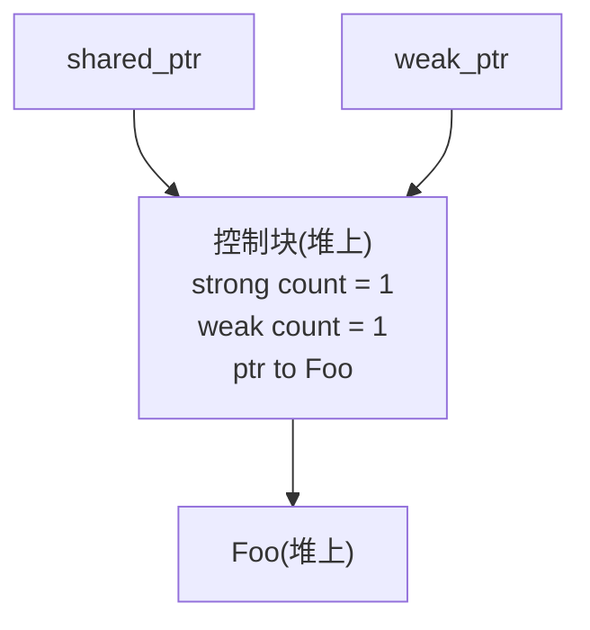

# WeakPtr 前置知识（零）：弱引用与生命周期难题

[OnceCallback 实战（四）：取消令牌设计](../../01_once_callback/full/01-4-once-callback-cancellation-token.md) 里咱们手搓过一枚原子标志,对象活着时它是 0,析构前置成 1,回调跑前先瞄一眼,置位就乖乖 no-op。悬空问题是没了,可笔者后来越想越不对劲:这枚标志到底归谁管?它自己活多久?回调又怎么稳稳当当地拿到它?当时一笔带过的尾巴,正是 C++ 里最磨人的一类问题——生命周期与所有权。

一个对象 A 想引用对象 B,但不想延长 B 的寿命,还想随时知道 B 是不是还活着。这一篇咱们就把这件事掰开:标准库的 `std::weak_ptr` 是怎么应付的,它在异步回调里为什么不够用,以及 Chromium 凭什么另起炉灶搞了一套 `WeakPtr`。

---

## 生命周期:所有权光谱的两端

先把视角拉到最高。C++ 里"A 引用 B"这件事,在所有权光谱上有两个极端,中间空着一大片——咱们要找的,就是中间某个能落脚的位置。

### 强引用:引用即续命

`std::shared_ptr<T>` 是强引用的典型。它表达的是共享所有权:只要还有一个 `shared_ptr` 指着 B,B 就不能死;最后一个离开时,B 才被析构。

```cpp
auto sp = std::make_shared<Foo>();  // 引用计数 = 1
{
    std::shared_ptr<Foo> sp2 = sp;  // 引用计数 = 2
}   // sp2 离开,引用计数回到 1,Foo 没死
// sp 还在,Foo 还活着
```

规则是安全,可代价也实打实:谁拿到 `shared_ptr`,谁就插手了 B 的寿命。设想 A 是个定时器,B 是业务对象,A 持有 B 的引用好到期时调它的方法。A 拿的是 `shared_ptr<B>` 会怎样?只要定时器还挂着,B 就永远析构不掉,哪怕业务语义早就该让 B 走了。A 本意只是"借来用用",结果变成了"共同拥有"。所有权图被搅浑,后面谁来推理生命周期都得皱眉头。

### 裸指针:不拥有,但对方没了也没感觉

另一头是裸指针 `T*`。它彻底不介入所有权,B 死活跟 A 无关,想用就用。轻是真轻,险也是真险:

```cpp
Foo* p = obj;
obj = nullptr;       // 别处把对象析构了
p->do_something();   // 悬垂指针,未定义行为,大概率段错误
```

注意,裸指针的问题不在"不延长寿命",这正是咱们想要的;问题在于它压根没法表达"还想确认对方活着没"。指针就是个地址,地址不会因为对象销毁而变空。`p` 还是那个 `p`,指向的那块内存可能早被别的对象占了,您一访问就是 use-after-free。

### 咱们真正想要的是什么

两个极端往桌上一摆,想要的就清楚了,光谱中间某处:

> 不拥有,所以不延长寿命;但手里这张条子能查出来,对方走没走。

这就是弱引用(weak reference):只观察存活状态,不参与所有权计数。标准库给了 `std::weak_ptr`,可它背着不小的包袱;Chromium 在 `//base` 里另写了一套 `WeakPtr`。这个系列要做的事,就是把这两套都拆开看明白,最后咱们自己手撸一个教学版。

---

## std::weak_ptr:标准库的弱引用

`std::weak_ptr` 是 C++11 进的标准库。它有个硬规矩:只能从 `shared_ptr` 构造而来,您没法凭空造一个 `weak_ptr` 指向栈对象或者 `new` 出来的裸对象。

规矩是从它的机制里长出来的。`shared_ptr` 内部不止一个裸指针,它还指向一块叫控制块(control block)的堆内存,里头存着引用计数。`weak_ptr` 共用同一块控制块,但走的是单独一档计数,叫弱引用计数。



关键就在这:`weak_ptr` 不增加 strong count,所以它不插手 Foo 何时析构;可它增加 weak count,这就让控制块自己赖着活着。弱引用由此捡到一个独门本事:对象析构之后,它还能查"对象是不是已经没了"。

### 三个核心操作

```cpp
auto sp = std::make_shared<Foo>();
std::weak_ptr<Foo> wp = sp;   // 从 shared_ptr 构造,不增加 strong count

wp.use_count();   // 看 strong count 还剩几个
wp.expired();     // 等价于 use_count() == 0,对象是否已析构
auto locked = wp.lock();  // 尝试升级回 shared_ptr
```

`expired()` 告诉您对象死了没;`lock()` 把弱引用往强引用上凑,对象还活着就给您一个有效的 `shared_ptr`,已经死了就给您一个空的。

### 为什么必须用 lock(),而不是 expired() + 构造

新手最自然的写法是这样的,也是最容易翻车的:

```cpp
std::weak_ptr<Foo> wp = sp;
// ... 别处可能把 sp 释放了 ...

if (!wp.expired()) {
    // 这里 wp 还没过期?
    sp->do_something();   // 错!sp 可能已经在 expired() 之后、这一行之前被释放
}
```

`expired()` 返回 `false` 那一刻,对象确实活着;可从您拿到 `false` 到真正解引用之间,另一条线程可能把最后一个 `shared_ptr` 放了,触发析构。这就是教科书级的 TOCTOU(time-of-check-to-time-of-use)竞态,检查的那一刻跟使用的那一刻,中间开着窗。

正解是 `lock()`:它把"判活"和"升级成强引用"塞进一个原子操作里,要么给您一个保证对象存活的 `shared_ptr`,要么给空指针,中间没有缝:

```cpp
if (auto locked = wp.lock()) {
    locked->do_something();   // 此时 locked 持有 strong count,对象保证活着
}
```

这一步是 `weak_ptr` 安全使用的命脉,得吃透:`lock()` 把判活和延寿塞进同一个原子操作。Chromium 的 `WeakPtr` 走的是另一条路:它压根不延寿,只判活,所以不指望 `lock()` 那套"判活+延寿原子化"来堵 TOCTOU,而是甩出序列契约——deref 和 invalidate 必须落在同一个序列上,序列内任务串行,窗口从根上没了。这套契约咱们留到 02-4(序列亲和性)展开,这里先种个印象。

---

## make_shared 与控制块:一个反直觉的内存细节

讲到这儿有个细节值得停下来掰扯,因为它直接牵出咱们对"侵入式 vs 非侵入式引用计数"的理解,这正是下一篇的核心动机,这里先把种子埋下。

`std::shared_ptr` 的控制块是非侵入式的:一块独立的堆内存,跟对象分开住。所以一句 `std::shared_ptr<Foo>(new Foo)` 背后其实是两次堆分配,一次给 Foo,一次给控制块。

```cpp
std::shared_ptr<Foo> sp1(new Foo);   // 两次堆分配:Foo + 控制块
auto sp2 = std::make_shared<Foo>();   // 一次堆分配:Foo 和控制块打包在一起
```

`std::make_shared` 把对象和控制块塞进同一块堆内存,一次分配搞定,这也是它比 `shared_ptr(new)` 快的主要缘故。可这个优化拖出来一个反直觉的副作用:只要还有一个 `weak_ptr` 指着,整块内存(连对象占的那块)都不归还,哪怕对象早析构完了。

```cpp
std::weak_ptr<Foo> wp;
{
    auto sp = std::make_shared<Foo>();   // 一次分配:控制块 + Foo
    wp = sp;
}   // sp 离开,Foo 析构,但控制块因为 wp 还在而保留
// 此时 Foo 的析构已经跑完,但它占的内存还挂在那里,因为控制块和它打包在一起
auto sp2 = wp.lock();   // 返回空 shared_ptr——对象确实没了
// 但 make_shared 那块内存要等 wp 也销毁才真正归还
```

为什么会这样?控制块得活到所有 `weak_ptr` 都散了为止(否则 `weak_ptr` 没法安全地查 `expired()`),而 `make_shared` 偏偏把控制块和对象捆成一家。对象析构不等于内存归还,`weak_ptr` 长寿的场景下,就这么拖着一块"死透了却占着"的内存。

这不是 `weak_ptr` 的 bug,是非侵入式控制块加上 `make_shared` 合并分配两件事叠一块儿的结果。但它确实是一笔代价,Chromium 的 `WeakPtr` 用侵入式引用计数绕开了它,下一篇咱们展开。

---

## std::weak_ptr 在异步/回调场景的四个局限

视角收回来,落到这个系列真正上心的场景:异步回调与任务投递。`std::weak_ptr` 是通用的、正确的设计,这一条不用洗;可塞进"任务投递 + 不介入所有权 + 序列化执行"这套体系里,它顶您四个地方,而每个地方都是 Chromium 另起炉灶的由头。

### 局限一:必须配 shared_ptr,强制介入所有权

这条最要命。`weak_ptr` 只能从 `shared_ptr` 来,意思就是您想用弱引用,先把对象改成 `shared_ptr` 管理再说。可很多对象的天然所有权压根不是共享的,它就属于某个 owner,owner 走了它就该走,用不着引用计数那一摊。

硬给本不该共享的对象套上 `shared_ptr`,所有权图立刻扭曲:本来清清楚楚的"单一 owner",变成理论上人人都能拿一份。后来维护的人一瞅 `shared_ptr` 就得警惕,这是真共享,还是只为凑个 `weak_ptr` 而硬贴上去的?这份迟疑的成本,看不见但实实在在。

### 局限二:控制块非侵入式,带来分配开销

上一节已经交代过:`shared_ptr` 要么两次分配,要么 `make_shared` 一次分配但绑死内存。对一个高频创建的弱引用对象(回调的目标就常是这类),这笔开销谈不上友好。Chromium 走的是侵入式路线,引用计数直接做成对象成员,一次分配完事,下一篇细讲。

### 局限三:不能"一次失效一批"

设想对象被十几个回调或定时器引用,各攥着一个 `weak_ptr`。对象析构时,这十几个 `weak_ptr` 理应集体过期,可 `weak_ptr` 没有"主动批量失效"这一手,它们能过期,无非是因为对象最后一个 `shared_ptr` 散了。换句话说,失效是引用计数驱动的副作用,不是您能显式叫停的动作。

单纯的生命周期管理里这没毛病。可一旦您想表达"对象还活着,但它进入了不该再被回调的状态",`weak_ptr` 立刻没词了。Chromium 里这种诉求稀松平常,`WeakPtr` 行(`InvalidateWeakPtrs()`,咱们到 02-3 讲)。

### 局限四:没有序列亲和性

`std::weak_ptr` 的线程模型是"原子操作本身安全,解引用要不要同步您自己看着办"。放通用代码里这是合理的默认。可丢进 Chromium 这种"任务跑在序列上、绝大多数对象只认一个序列"的工程体系,这种自由度反而成坑:它不会提醒您"这对象只该在某个序列上 deref",您迟早忘了哪次解引用该上锁。

Chromium 要的是反过来:弱引用可以在序列之间流转,但解引用和失效必须落在绑定的序列上,犯规的至少在 debug 构建下被揪出来。这正是 `WeakPtr` 的 `SEQUENCE_CHECKER` 干的活,02-4 展开。

---

## Chromium 的取舍:它想要什么样的弱引用

四个局限摆一块儿,Chromium 的诉求就清楚得不能再清楚了:

| `std::weak_ptr` 的局限 | Chromium `WeakPtr` 想要的 |
|---|---|
| 必须配 `shared_ptr` | **不介入所有权**——对象该怎么管还怎么管,WeakPtr 只是观察者 |
| 控制块非侵入式 | **侵入式引用计数**——计数是对象成员,一次分配 |
| 不能一次失效一批 | **共享 flag**——一个 factory invalidate,所有 WeakPtr 集体失效 |
| 没有序列亲和 | **序列绑定**——deref/失效必须在绑定序列,debug 下 DCHECK |

这张表就是后面六篇实战的路线图。咱们要做的,无非把这四件事一行行落到代码里:一个 `RefCountedThreadSafe` 的 flag(侵入式 + 跨序列安全)、一对 release/acquire 的原子操作(序列间的安全可见性)、一个 `WeakPtrFactory` 担起批量失效、一组 `SEQUENCE_CHECKER` 宏守住院列契约。

可在这之前,几块前置知识得先补齐:侵入式引用计数到底怎么回事(`scoped_refptr` / `RefCountedThreadSafe`,下一篇)、原子操作与 memory order(pre-02)、序列与线程亲和(pre-03)、还有 WeakPtr 用到的 concepts 与 `TRIVIAL_ABI`(pre-04~06)。这一篇讲的是那个"为什么",把诉求吃透了,后面每一步实现您都会知道它在补哪个洞。

## 参考资源

- [cppreference: std::weak_ptr](https://en.cppreference.com/w/cpp/memory/weak_ptr)
- [cppreference: std::shared_ptr 与控制块](https://en.cppreference.com/w/cpp/memory/shared_ptr)
- [cppreference: std::make_shared](https://en.cppreference.com/w/cpp/memory/shared_ptr/make_shared)
- [Chromium `base/memory/weak_ptr.h` 设计注释](https://source.chromium.org/chromium/chromium/src/+/main:base/memory/weak_ptr.h)
