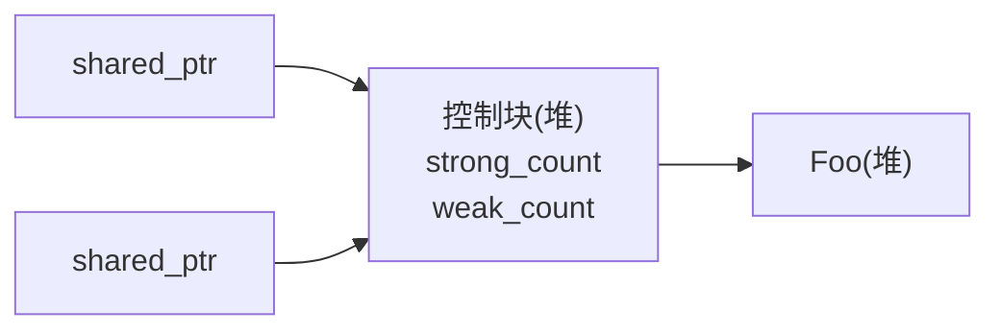
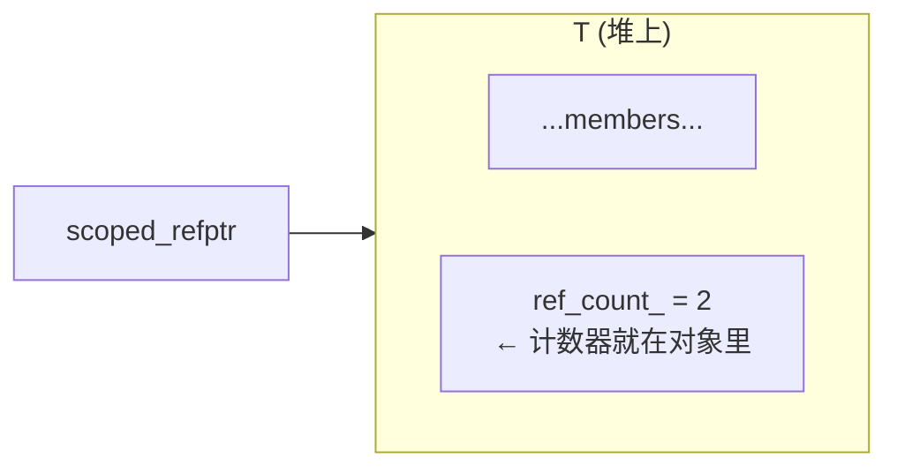

# WeakPtr 前置知识（一）：侵入式引用计数与 scoped_refptr

上一篇咱们埋了个伏笔:Chromium 的 `WeakPtr` 把"对象死没死"这个状态存在一枚叫 `Flag` 的小对象里,而这枚 Flag 会被对象的 owner、还有所有持有 WeakPtr 的回调共享,它们很可能跑在不同的序列上。一个被多方共享、又得能安全释放的小对象,这正是引用计数的活儿。

可 Chromium 偏偏没用 `std::shared_ptr`。它自己搓了一套侵入式引用计数,外壳叫 `scoped_refptr`,基类是 `RefCountedThreadSafe`。笔者第一次翻到这儿挺纳闷的:标准库现成的东西不用,重新发明轮子图啥?这一篇咱们就把这个纳闷拆掉。三件事讲透:`std::shared_ptr` 的非侵入式控制块跟侵入式计数到底差在哪、`scoped_refptr` 这个外壳长什么样,还有 WeakPtr 的 Flag 为什么非得用跨序列安全的版本。

---

## 引用计数:让多个所有者共享一个对象

先把智能指针的语法放一边,只看本质。引用计数要解决的问题就一个——对象被好几个持有者共享,怎么保证最后一个持有者离开时才析构它?机制简单到只有两步:拿到一份新引用,计数器加一;放弃一份引用,计数器减一,要是减到零,说明我是最后一个走的人,顺手把灯关了——也就是析构对象。

这套机制本身跟"计数器存哪儿"没关系。可恰恰是"存哪儿"这件事,把 `std::shared_ptr` 和 Chromium 的 `scoped_refptr` 劈成了两条路——一条叫非侵入式,一条叫侵入式。

---

## 非侵入式:std::shared_ptr 的做法

`std::shared_ptr` 把计数器放在对象外面——单独开一块堆内存,叫控制块。智能指针内部存两个指针:一个指向对象,一个指向控制块。



这么干最直接的好处是:对象本身压根不知道自己被引用计数了。您拿任何类型 `T`,往 `shared_ptr<T>` 里一塞,`T` 不用改一行代码。这是非侵入式最大的优点——通用,啥都能装。

代价出在分配上。您写 `std::shared_ptr<Foo>(new Foo)`,底下实际发生两次堆分配:一次给 Foo,一次给控制块。`std::make_shared<Foo>()` 把这两块合成一次,省了一刀,但咱们在 [前置知识（零）](./pre-00-weak-ptr-weak-reference-and-lifetime.md) 里聊过它的副作用——挂个长寿的 `weak_ptr`,整块对象内存就跟着赖着不释放。

还有个更隐蔽的代价:控制块是运行期才挂上去的,所以您手上只有一个 `T*` 的时候,没法回头去找它的引用计数。这听着无伤大雅,可真到"我现在是不是唯一持有者"这种判断面前,它就逼您绕路了。

---

## 侵入式:计数器是对象的成员

侵入式引用计数反着来——让计数器直接变成对象的一部分。最常见的做法是让 `T` 继承一个自带计数器的基类:



这么一来,优缺点跟非侵入式正好掉了个个儿。好处是一次分配——对象和计数器一体,一次 `new` 全搞定,没有多余的控制块。更值钱的是,任何拿到 `T*` 的代码都能顺藤摸瓜查到计数,因为计数本来就是成员;`shared_ptr` 拿一个裸指针是无能为力的。代价当然就是"侵入"本身——`T` 必须继承基类,改一行代码,不是随便什么类型都能塞进来。

### 对比表

| 维度 | 非侵入式(`shared_ptr`) | 侵入式(`scoped_refptr`) |
|---|---|---|
| 计数器位置 | 独立控制块(堆) | 对象自身成员 |
| 堆分配次数 | 2 次(或 `make_shared` 1 次,但捆死内存) | **1 次** |
| 对象是否需改造 | 不需要 | 需继承基类 |
| `T*` 能否查计数 | 不能 | 能(`HasOneRef()` 等) |
| 弱引用 | 内建 `weak_ptr` | 需另造(WeakPtr 就是干这个的) |

Chromium 选侵入式,根子上是为了压开销和统一约定。`//base` 里头海量小对象都要走引用计数,每处省一次分配、省一个指针间接,放在浏览器这种规模下是真金白银。而且统一一套侵入式约定,让"从裸指针直接查计数"这种操作变得可行——而这正是 `WeakPtr::Flag::Invalidate` 里那个跨线程析构豁免要用的本事。

---

## 手写一个最小的侵入式引用计数

光说原理不够过瘾,咱们自己手搓一个,顺手把 Chromium 的设计决策一步步逼出来。先把计数基类写出来:

```cpp
// Platform: host | C++ Standard: C++17
#include <atomic>
#include <cstddef>

// 原子版侵入式引用计数基类(对应 Chromium 的 RefCountedThreadSafe,
// 不是非原子的 RefCounted——后者用于单序列对象,这里要跨序列所以用原子)
class RefCountedThreadSafe {
public:
    void add_ref() const noexcept {
        ref_count_.fetch_add(1, std::memory_order_relaxed);
    }

    bool release() const noexcept {
        // release 语义:析构前的写对后续看到 count==0 的线程可见
        if (ref_count_.fetch_sub(1, std::memory_order_acq_rel) == 1) {
            return true;   // 调用方负责 delete this
        }
        return false;
    }

    bool has_one_ref() const noexcept {
        return ref_count_.load(std::memory_order_acquire) == 1;
    }

protected:
    RefCountedThreadSafe() = default;
    ~RefCountedThreadSafe() = default;

private:
    mutable std::atomic<int> ref_count_{0};
};
```

几个要点得点一下。计数器是 `mutable` 的——`add_ref` / `release` 逻辑上不改对象的可观察状态,得让它们在 `const` 对象上也能调。`release` 用 `acq_rel` 有讲究:acquire 一侧让它跟其它线程的 `add_ref` / `release` 正确同步(建立 happens-before,不是说"读到最新值"——那得 `seq_cst`),release 一侧在减到 0 时,把这个对象身上的所有写都发布给接管 `delete` 的那个线程。

接着让目标类型继承它:

```cpp
class Flag : public RefCountedThreadSafe {
public:
    Flag() = default;
    // ... 业务接口 ...
};
```

到这儿 `Flag` 就自带计数器了。可光有计数器还不行——咱们还得配一个智能指针,在拷贝、移动、析构的时候自动去调 `add_ref` / `release`。这玩意儿就是 `scoped_refptr`。

---

## scoped_refptr:侵入式引用计数的智能指针外壳

`scoped_refptr<T>` 干的活儿跟 `std::shared_ptr<T>` 是一个模子——拷贝增计数,析构减计数,减到零删对象。区别在于它不养独立的控制块,而是直接去调 `T` 继承来的 `add_ref` / `release`。一个最小实现长这样:

```cpp
// Platform: host | C++ Standard: C++17
template <typename T>
class scoped_refptr {
public:
    scoped_refptr() noexcept = default;

    explicit scoped_refptr(T* p) noexcept : ptr_(p) {
        if (ptr_) ptr_->add_ref();
    }

    // 拷贝:+1
    scoped_refptr(const scoped_refptr& other) noexcept : ptr_(other.ptr_) {
        if (ptr_) ptr_->add_ref();
    }

    // 移动:不增不减,把对面清空
    scoped_refptr(scoped_refptr&& other) noexcept : ptr_(other.ptr_) {
        other.ptr_ = nullptr;
    }

    ~scoped_refptr() { release(); }

    scoped_refptr& operator=(scoped_refptr r) noexcept {  // copy-and-swap
        swap(r);
        return *this;
    }

    void swap(scoped_refptr& other) noexcept {
        T* tmp = ptr_; ptr_ = other.ptr_; other.ptr_ = tmp;
    }

    T* get() const noexcept { return ptr_; }
    T& operator*() const noexcept { return *ptr_; }
    T* operator->() const noexcept { return ptr_; }
    explicit operator bool() const noexcept { return ptr_ != nullptr; }

private:
    void release() noexcept {
        if (ptr_ && ptr_->release()) {
            delete ptr_;   // 最后一个引用,析构
            ptr_ = nullptr;
        }
    }

    T* ptr_ = nullptr;
};
```

`operator=` 这里有个讲究,用的是 copy-and-swap——传值参数 `r` 本身就完成了一次拷贝、增了计数,函数体里跟 `this` 一交换,`r` 析构时把 `this` 原来那份旧引用释放掉。这一手把自赋值和异常安全一锅端了。Chromium 的 `scoped_refptr` 大致就是这个形状,细节更多(inter-type 转换、`raw_ptr` 集成那类),但核心骨架跟咱这个一致。

用法跟 `shared_ptr` 几乎没差:

```cpp
auto p = scoped_refptr<Flag>(new Flag);   // ref_count = 1
{
    auto p2 = p;                           // ref_count = 2
}                                          // p2 析构,ref_count = 1
// p 还在,Flag 活着
```

可内存上它就分了一次——`Flag` 对象本身,计数器嵌在里头。

---

## RefCounted vs RefCountedThreadSafe

Chromium 其实备着两个版本的引用计数基类,差别就在"要不要原子操作"。

一个是 `RefCounted<T>`,非原子版本。计数走的是普通整数加减,所以只能在一个序列上用。它内部挂了个 `SequenceChecker`,debug 构建下专门抓"跨序列增减"这种违规。要是引用计数一直是 1、从来不拷贝,对象倒是可以搬到另一个序列上去;可一旦 `add_ref` / `release` 被并发调用,那就是实打实的数据竞争。好处是开销最小。

另一个是 `RefCountedThreadSafe<T>`,原子版本。计数用原子指令(`acq_rel` 的 `fetch_add` / `fetch_sub`),多个序列、多个线程并发增减都安全。代价当然比非原子版大——一次原子操作跟一次普通加减不是一回事——可对跨序列共享的对象,这是刚需。

取舍逻辑其实很简单:能单序列就单序列,把原子开销省下来;非得跨序列才上原子版。Chromium 不会无脑全用 `ThreadSafe`,浏览器里头绝大多数对象本来就是单序列的,原子操作堆在热路径上,累积成本不容小觑。

### HasOneRef():从裸指针查计数的特权

侵入式有一样非侵入式干不了的本事——您手上只有对象的 `T*`,就能直接查"我现在是不是唯一引用者":

```cpp
bool has_one_ref() const noexcept {
    return ref_count_.load(std::memory_order_acquire) == 1;
}
```

`shared_ptr` 没法这么干,因为它得先有个 `shared_ptr` 才够得着控制块;光给您一个 `T*`,控制块在哪儿都不知道。可侵入式的计数器就长在对象身上,一个 `T*` 就够了。

这个能力在 WeakPtr 里被用得很巧——咱们到 [02-2 实战篇] 会看到,`Flag::Invalidate` 里有这么一行:

```cpp
DCHECK(sequence_checker_.CalledOnValidSequence() || HasOneRef());
```

翻译过来就是:Invalidate 必须在绑定的序列上调用;可要是 `HasOneRef()`——也就是这枚 Flag 已经没任何 WeakPtr 持着了——那它打哪个序列析构都无所谓,放行。这个跨线程析构的口子,只有"侵入式 + 能从 `this` 查计数"两样凑齐了才写得出来。这是侵入式引用计数在 WeakPtr 里最具体、也最值钱的一次兑现。

---

## 一个必须堵的坑:别让用户直接 new/delete

侵入式引用计数有一条铁的不变量——对象只能由 `release()` 在计数归零那一刻 `delete`,绝不能被外部直接 `delete`。您想想,用户拿到一个 `scoped_refptr`,转头又去 `delete p.get()`,计数器还在别的 `scoped_refptr` 里头被引用着呢,对象却已经被销毁了,这下立刻悬垂。

`std::shared_ptr` 不用操这个心,因为它通过控制块把对象攥在手里。可侵入式不行,它得靠对象自己配合:把析构函数藏成 `private` 或 `protected`,只留出引用计数的 `release` 路径来访问。Chromium 的 `RefCountedThreadSafe` 走的就是这套——通过一个 `friend` 受保护的 `Destroy()` 真正去执行 `delete this`,外部代码碰不到析构函数,误删从源头就被堵死了。

```cpp
// 教学版:非模板基类(对应上方 line 123 的 RefCountedThreadSafe)
// 真实 Chromium 是模板形态 RefCountedThreadSafe<Flag>,见下方说明
class Flag : public RefCountedThreadSafe {
public:
    Flag() = default;

private:
    template <typename> friend class scoped_refptr;   // 教学版:scoped_refptr 负责 delete
    ~Flag() = default;          // private:外部没法直接 delete
    // ...
};
```

咱们手搓教学版时守的是同一原则——private 析构加受控释放路径——可有一个细节得说清楚:真实 Chromium 的 `release()` 里头,会调一个被 `RefCountedThreadSafe<T>` 友元的 `Destroy()` 静态方法来 `delete this`;而咱这个简化版,把 `delete ptr_` 直接写在了 `scoped_refptr<T>::~scoped_refptr()` 里。所以教学版里 Flag 的友元是 `scoped_refptr`,不是 `RefCountedThreadSafe`——配套代码 `12_intrusive_refcount.cpp` 跟 `weak_ptr.hpp` 就是照这个写的,能直接编译。这套做法跟 RAII 是一对孪生兄弟:资源获取即初始化,释放只准走唯一那条受控的路。

---

两种形态的引用计数,到这儿算是拆透了。非侵入式的 `std::shared_ptr` 把计数放进独立控制块,通用,代价是多一次分配;侵入式的 `scoped_refptr` 把计数器嵌进对象,一次分配,顺带把"从 `T*` 直接查计数"这个本事送给了您,代价是对象必须继承基类。Chromium 为了压开销、统一约定,`//base` 里全面押注侵入式。两个基类 `RefCounted`(非原子、单序列)和 `RefCountedThreadSafe`(原子、跨序列)的取舍,说到底是能省则省。

对 WeakPtr 来说,Flag 会被好几个序列上的 WeakPtr 共享,所以非得用 `RefCountedThreadSafe` 不可;而 `HasOneRef()` 那个"从 `this` 查计数"的本事,正是 `Flag::Invalidate` 能写出跨线程析构豁免的前提。下一块零件是原子操作和 memory order——咱们要把 `RefCountedThreadSafe` 里那个 `acq_rel` 真正弄明白。

## 参考资源

- [Chromium `base/memory/ref_counted.h`](https://source.chromium.org/chromium/chromium/src/+/main:base/memory/ref_counted.h)
- [Chromium `base/memory/scoped_refptr.h`](https://source.chromium.org/chromium/chromium/src/+/main:base/memory/scoped_refptr.h)
- [cppreference: std::shared_ptr](https://en.cppreference.com/w/cpp/memory/shared_ptr)
- [cppreference: std::atomic 与 memory_order](https://en.cppreference.com/w/cpp/atomic/memory_order)
