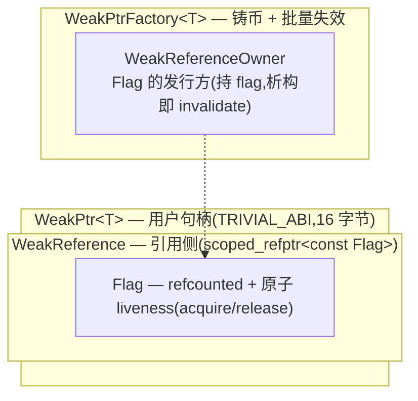

# weak_ptr 设计指南（一）：动机、接口与控制块设计

> hands-on 轨,默认您已熟 acquire/release、concepts、侵入式引用计数;不熟的话先过一遍 [full/ 前置知识](../full/pre-00-weak-ptr-weak-reference-and-lifetime.md)。

上次手搓 OnceCallback 的取消令牌,笔者图省事甩了个原子标志上去——对象析构置位,回调跑前 if 一下,悬空确实没了。但这玩意儿有个笔者一开始没在意的尾巴:那个标志到底归谁管?回调又怎么拿到它?笔者自己当时也没想清楚。Chromium 在 `//base` 里把这事儿做透了,答案就是 `WeakPtr`。咱们这一篇先拆动机、接口和控制块架构;实现和测试留给后两篇,不碰代码细节,只把“为什么这么设计”想明白。

## 问题:`std::weak_ptr` 在异步回调的四个局限

`std::weak_ptr` 本身是通用的、正确的设计,这一点没得洗。但您要把它塞进"任务投递 + 不介入所有权 + 序列化执行"这套体系里,它会顶您四个地方:

第一,它绑死了 `shared_ptr`。您想拿弱引用,就得先把对象改成 `shared_ptr` 管理——本来一个 owner 干干净净,这下所有权模型被您亲手扭曲了。

第二,它的控制块是非侵入式的。两条路:要么两次堆分配,要么 `make_shared` 把对象和控制块合并到一块内存。后者看似省事,可一旦挂个长寿的 `weak_ptr`,整块对象内存就跟着赖着不释放了,这在嵌入式或长生命周期进程里很扎眼。

第三个更隐蔽,笔者也是真正想“批量作废”才撞上的:`std::weak_ptr` 没有"一次失效一批"。它的失效是引用计数驱动的副作用——最后一个 `shared_ptr` 没了,弱引用就自然失效。可您想表达"对象还活着,但它进入了一个不该再被回调的状态"呢?没有这种 API,您得自己拿外层标志绕一圈。

第四,它没有序列亲和。原子操作本身是安全的,可"解引用要不要同步"这事儿它不管,丢给您自己拍。在"任务跑在序列上"的体系里,这种自由度反而是个坑——您迟早会忘掉某次解引用该不该加锁。

## Chromium WeakPtr 的设计哲学

上面这四条,WeakPtr 一条条给您怼回去了。取舍笔者列在下表,您看一眼就能对上号:

| 局限 | WeakPtr 的目标 |
|---|---|
| 必须配 shared_ptr | **不介入所有权**——观察者而非所有者 |
| 非侵入式控制块 | **侵入式引用计数**——Flag 用 `RefCountedThreadSafe`,一次分配 |
| 不能批量失效 | **共享 Flag**——一个 factory invalidate,所有 WeakPtr 集体失效 |
| 没有序列亲和 | **序列绑定**——deref/失效要在绑定序列,debug 下 DCHECK 抓 |

笔者觉得最抽象的一步在这里:Chromium 干脆把"对象死没死"这件事从对象身上剥出来,单独做成一个被引用计数的小对象——它管这玩意儿叫 Flag。factory 和所有 WeakPtr 共享同一枚 Flag。这么一拆,"一次 invalidate、所有观察者集体失效"几乎是白送的——您只要让 Flag 翻个面,所有持有它的 WeakPtr 下次判活全都是 false。更妙的是,对象什么时候析构,跟 WeakPtr 再没关系了:对象照常被它的 owner 删,Flag 自己被引用计数管着,两件事彻底解耦。

## 接口设计

对外能看到的 API 就这么点,笔者第一次读完还挺意外的——这么强大的机制,门面这么朴素:

```cpp
// 弱指针句柄:不延寿,能判活
template <typename T> class [[clang::trivial_abi]] WeakPtr {
public:
    WeakPtr() = default;
    WeakPtr(std::nullptr_t);

    template <typename U> requires(std::convertible_to<U*, T*>)   // 向上转型
    WeakPtr(const WeakPtr<U>&);

    T* get() const;                 // 失效返回 nullptr,不崩
    T& operator*() const;           // 失效 → CHECK/assert
    T* operator->() const;
    explicit operator bool() const;
    void reset();

    bool maybe_valid() const;       // 跨序列 hint:负面可信/正面不可信
    bool was_invalidated() const;   // 区分"被作废"与"主动 reset"
};

// 铸币厂:挂被观察对象上,批量失效
template <typename T> class WeakPtrFactory {
public:
    explicit WeakPtrFactory(T* ptr);
    WeakPtr<T> get_weak_ptr();                  // 非 const 重载 requires(!is_const_v<T>)
    WeakPtr<const T> get_weak_ptr() const;
    void invalidate_weak_ptrs();                // 失效 + 铸新 Flag
    void invalidate_weak_ptrs_and_doom();       // 失效 + 不再铸(更高效)
    bool has_weak_ptrs() const;
};
```

几个签名上的小取舍,笔者这里顺手讲一下(详细的去看 [full/02-1](../full/02-1-weak-ptr-motivation-and-api-design.md))。`operator*` 和 `operator->` 用 `CHECK` 而不是 `DCHECK`——失效之后还去解引用,这是确定的 bug,release 也得崩给您看;`get()` 则老实返回裸指针,当作逃生口。还有一处笔者刚开始没想通的:为什么不给 `operator==` 和 `<=>`?后来才反应过来——弱引用的比较本来就飘忽不定,两个 WeakPtr 此刻相等、下一刻一个失效一个没失效,这种语义您比了也没意义。另外 `WeakPtrFactory` 走组合不走继承,而且它必须是最后一个成员(析构顺序的事,后面会讲)。

## 内部机制:控制块的两层架构

这套机制看着复杂,其实可以叠成四层。咱们会发现它跟 OnceCallback 的 `BindState` 是同一个模子出来的——底层做类型擦除 + 引用计数,顶层甩一个轻量句柄出去。会一个,另一个基本白送:



真正干活的就一个东西:Flag。它是 `RefCountedThreadSafe`(要跨序列共享),里头就一个 `AtomicFlag invalidated_` 当 liveness 位。`Invalidate` 做 release-store,`IsValid` 做 acquire-load——这一对配好了 happens-before,意思是"只要读到失效,那就一定看得到对象进入失效态之前的所有写",全程不用加锁。Flag 还顺手挂了个 `SEQUENCE_CHECKER`,是 lazy 绑定的,release 编译下吃 0 字节、纯 no-op,debug 下才真正起作用。

还有一点要分清:Flag 的引用计数只管它自己——只要还有 WeakPtr 持有,它就在;被指的对象该析构就析构,Flag 不拦。咱们前面说的“解耦”,就落在这。

## 关键设计决策

| 决策 | 选择 | 理由 |
|---|---|---|
| deref 失效的断言等级 | `CHECK`(release 也崩) | UAF 前身,必须立即爆 |
| 序列违规的断言等级 | `DCHECK`(仅 debug) | 契约违规非立即内存安全,debug 抓即可 |
| `ptr_` 用裸指针 + `RAW_PTR_EXCLUSION` | 允许悬垂 | deref 前由 `IsValid` 守门;raw_ptr 隔离区会拖内存 |
| 存指针用 `uintptr_t`(在 factory 基类) | 非模板基类下沉 | 压模板膨胀(每 T 只生成薄派生层) |
| `WeakPtrFactory` 组合 vs 继承 | 组合 | 灵活、可对任意类型、不污染继承链 |
| `[[clang::trivial_abi]]` | 标注 | `ptr_` 裸平凡 + scoped_refptr 平凡可重locate;进寄存器传参 |

架构和签名到这儿算是讲清楚了。但讲清楚是一回事,真要把它一行行撸出来,咱们会撞上不少纸面看不出来的坑——`trivial_abi` 怎么才能不破坏 invariant、`WeakPtrFactory` 为什么非得排最后一个成员、`uintptr_t` 那一手模板瘦身到底省在哪。下一篇咱们就把这些承诺落到代码里。

## 参考资源

- [Chromium `base/memory/weak_ptr.h`](https://source.chromium.org/chromium/chromium/src/+/main:base/memory/weak_ptr.h)
- [weak_ptr 设计指南（二）：逐步实现](./02-weak-ptr-implementation.md)
- [WeakPtr 前置知识（零）：弱引用与生命周期难题](../full/pre-00-weak-ptr-weak-reference-and-lifetime.md)
- [OnceCallback 设计指南（一）：动机与接口设计](../../01_once_callback/hands_on/01-once-callback-design.md)
